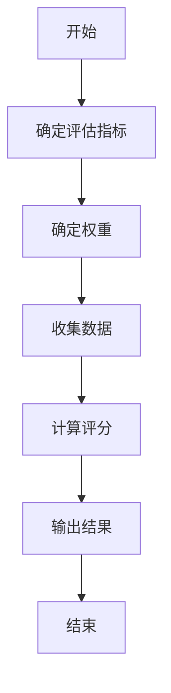
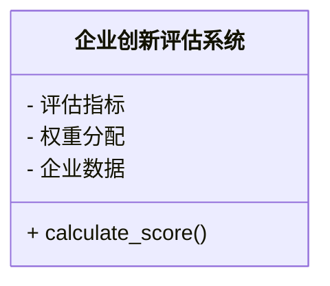
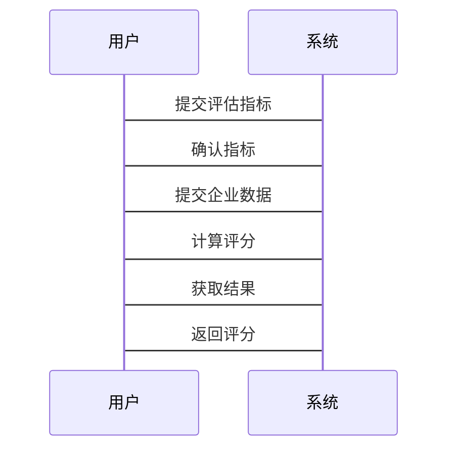

                 


# 如何评估企业的创新能力

## 关键词：企业创新、创新能力、评估模型、算法原理、系统设计、项目实战、最佳实践

## 摘要：  
企业创新能力是企业在市场中保持竞争优势的关键因素。本文从企业创新的基本概念出发，系统地分析了创新能力的构成要素、评估方法和数学模型，结合实际案例，详细阐述了如何通过层次分析法（AHP）和指数加权法等算法对企业创新能力进行评估。同时，本文还提供了基于Python的实现代码，帮助读者更好地理解和应用这些方法。最后，本文总结了评估企业创新能力的最佳实践和注意事项，为企业管理者提供了实用的指导。

---

# 第1章: 企业创新的基本概念与问题背景

## 1.1 企业创新的基本定义

### 1.1.1 创新在企业管理中的意义  
创新是企业在技术和管理上的突破，是企业适应市场变化的关键能力。通过创新，企业可以降低成本、提高效率、优化产品和服务，从而在竞争中占据优势。

### 1.1.2 企业创新的核心要素  
企业创新的核心要素包括：  
1. **技术创新**：技术的改进和新产品开发。  
2. **管理创新**：管理方法和流程的优化。  
3. **商业模式创新**：商业模式的重构和创新。  

### 1.1.3 创新与企业竞争力的关系  
创新是企业竞争力的核心驱动力。通过创新，企业可以提高产品附加值、增强客户满意度，从而在市场中获得更大的份额。

---

## 1.2 企业创新评估的必要性

### 1.2.1 创新评估的目的  
创新评估的目的是帮助企业识别创新潜力、优化资源配置、制定科学的创新战略。

### 1.2.2 创新评估对企业发展的价值  
通过创新评估，企业可以发现自身的创新优势和不足，从而有针对性地进行改进，提升整体竞争力。

### 1.2.3 创新评估的边界与外延  
创新评估的边界包括企业的内部资源、外部环境和市场反馈。外延则涉及技术创新、管理创新和商业模式创新等多个方面。

---

## 1.3 企业创新评估的核心问题

### 1.3.1 创新能力的定义与维度  
创新能力是指企业在技术和管理上的创新能力和实现能力。其维度包括技术创新能力、管理创新能力、市场响应能力和组织学习能力。

### 1.3.2 企业创新评估的关键指标  
关键指标包括：  
1. 技术创新投入比例。  
2. 研发团队规模和能力。  
3. 新产品开发周期和成功率。  
4. 市场反馈和客户满意度。  

### 1.3.3 创新评估的主体与客体  
创新评估的主体是企业内部的管理者和技术人员，客体是企业的创新能力和绩效。

---

## 1.4 本章小结  
本章从企业创新的基本概念出发，分析了创新在企业管理中的意义、核心要素以及创新评估的必要性和价值。同时，明确了创新评估的核心问题和关键指标，为后续的分析奠定了基础。

---

# 第2章: 企业创新评估的核心概念与联系

## 2.1 创新能力的构成要素

### 2.1.1 技术创新  
技术创新是企业创新能力的核心部分，包括新技术的研发和现有技术的改进。

### 2.1.2 管理创新  
管理创新涉及企业内部流程、组织结构和管理方法的优化。

### 2.1.3 商业模式创新  
商业模式创新是指企业通过改变收入来源、客户关系和价值主张来实现创新。

---

## 2.2 创新能力与企业绩效的关系

### 2.2.1 创新能力对企业利润的影响  
创新能力的强弱直接影响企业的利润水平。创新能力越强，企业的市场竞争力越强，利润水平越高。

### 2.2.2 创新能力与企业市场竞争力的关联  
创新能力强的企业能够更快地适应市场变化，推出符合市场需求的产品和服务。

### 2.2.3 创新能力与企业可持续发展的关系  
创新能力是企业可持续发展的核心动力，能够帮助企业应对市场变化和竞争压力。

---

## 2.3 创新能力评估模型的构建

### 2.3.1 创新能力评估模型的构成  
创新能力评估模型包括评估指标、权重分配和评分计算。

### 2.3.2 模型的输入与输出  
输入包括企业创新相关的数据和指标，输出是企业的创新能力评分。

### 2.3.3 模型的适用范围与限制  
适用于各种类型的企业，但需要根据具体情况进行调整。

---

## 2.4 本章小结  
本章详细分析了企业创新能力的构成要素及其与企业绩效的关系，构建了创新能力评估模型，为后续的算法设计和系统实现奠定了基础。

---

# 第3章: 企业创新评估的算法原理与数学模型

## 3.1 创新能力评估的核心算法

### 3.1.1 层次分析法（AHP）

层次分析法（AHP）是一种常用的决策分析方法，适用于多指标评估问题。其步骤如下：

1. 确定评估指标和层次结构。  
2. 构建比较判断矩阵。  
3. 计算各指标的权重。  
4. 计算各企业的创新能力评分。  

### 3.1.2 指数加权法  
指数加权法是一种简单易行的评估方法，适用于指标权重已知的情况。

### 3.1.3 综合评估模型  
综合评估模型结合了多种评估方法，适用于复杂的企业创新能力评估。

---

## 3.2 创新能力评估的数学模型

### 3.2.1 创新能力综合评分公式  
$$ \text{创新能力评分} = \sum_{i=1}^{n} w_i \cdot x_i $$
其中，\( w_i \) 为第 \( i \) 个指标的权重，\( x_i \) 为第 \( i \) 个指标的评分。

---

## 3.3 创新能力评估的流程图  



---

## 3.4 算法实现的Python代码示例  

```python
import numpy as np

def calculate_innovation_score(criteria_weights, enterprise_scores):
    return np.dot(criteria_weights, enterprise_scores)

# 示例权重和评分
criteria_weights = np.array([0.3, 0.4, 0.3])
enterprise_scores = np.array([0.8, 0.6, 0.7])
score = calculate_innovation_score(criteria_weights, enterprise_scores)
print("创新能力评分:", score)
```

---

## 3.5 本章小结  
本章详细介绍了企业创新能力评估的核心算法和数学模型，并通过Python代码示例展示了算法的实现过程，为后续的系统设计和项目实战提供了理论基础。

---

# 第4章: 企业创新评估的系统分析与架构设计

## 4.1 系统功能设计

### 4.1.1 领域模型  


### 4.1.2 系统架构设计  


### 4.1.3 系统接口设计  
系统接口包括数据输入接口、评估计算接口和结果输出接口。

---

## 4.2 系统交互设计

### 4.2.1 交互流程图  


---

## 4.3 本章小结  
本章从系统设计的角度，分析了企业创新评估系统的功能模块、架构设计和交互流程，为后续的项目实现提供了指导。

---

# 第5章: 企业创新评估的项目实战

## 5.1 项目背景与目标

### 5.1.1 项目背景  
某科技公司希望评估其创新能力，优化创新战略。

### 5.1.2 项目目标  
通过创新能力评估模型，帮助企业识别创新优势和不足。

---

## 5.2 项目实施步骤

### 5.2.1 确定评估指标  
根据企业实际情况，确定技术创新、管理创新和商业模式创新三个指标。

### 5.2.2 收集企业数据  
收集企业的研发投入、团队规模和市场反馈等数据。

### 5.2.3 计算创新能力评分  
使用层次分析法计算各指标的权重，结合企业数据计算创新能力评分。

---

## 5.3 项目总结

### 5.3.1 项目成果  
通过评估，帮助企业发现创新能力的强项和弱项。

### 5.3.2 经验总结  
评估模型的准确性和可操作性对企业实际应用至关重要。

---

## 5.4 本章小结  
本章通过实际案例，展示了企业创新评估模型的应用过程和结果，为读者提供了参考。

---

# 第6章: 企业创新评估的最佳实践与注意事项

## 6.1 评估过程中的注意事项

### 6.1.1 数据质量的重要性  
确保数据的准确性和完整性。

### 6.1.2 指标选择的合理性  
指标应与企业的实际情况和目标一致。

### 6.1.3 评估模型的适用性  
根据企业的特点选择合适的评估模型。

---

## 6.2 创新能力提升的建议

### 6.2.1 加强技术研发投入  
通过技术研发提升企业的技术创新能力。

### 6.2.2 优化管理模式  
通过管理创新提高企业的运营效率。

### 6.2.3 探索新型商业模式  
通过商业模式创新增强企业的市场竞争力。

---

## 6.3 本章小结  
本章总结了企业创新评估的最佳实践和注意事项，为企业管理者提供了实用的指导。

---

# 结语  
企业创新能力是企业在市场中保持竞争优势的关键。通过科学的评估方法和系统的分析设计，企业可以更好地识别自身的创新能力，优化资源配置，制定科学的创新战略。希望本文的内容能够为企业管理者和技术人员提供有价值的参考。

---

# 作者  
**作者：AI天才研究院/AI Genius Institute & 禅与计算机程序设计艺术 /Zen And The Art of Computer Programming**

