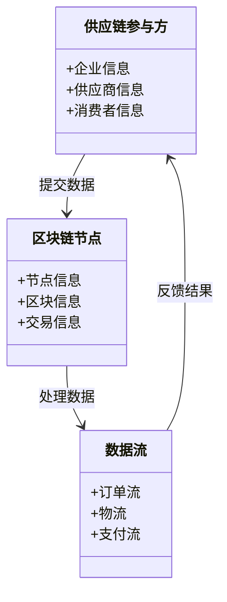
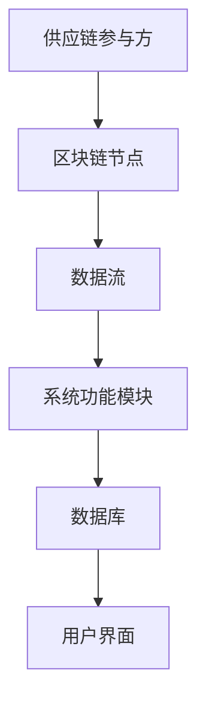
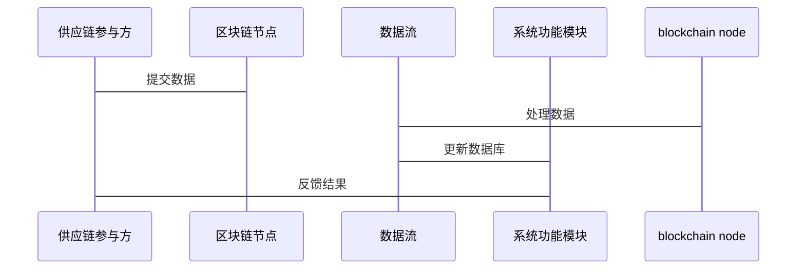

                 

# 第3章: 区块链供应链应用的系统分析

## 3.1 问题场景介绍

在传统的供应链管理中，存在着诸多痛点，尤其是在信息传递和数据安全性方面。例如：

- **信息孤岛问题**：供应链中的各个参与方（供应商、制造商、分销商、零售商、消费者）各自维护着独立的信息系统，信息难以共享，导致效率低下。
- **数据篡改与不透明问题**：由于缺乏统一的记录系统，数据容易被篡改，且缺乏透明性，导致信任缺失。
- **信任缺失与效率低下问题**：各参与方之间缺乏信任，导致需要通过中间机构进行协调，增加了时间和成本。

区块链技术通过去中心化、不可篡改和透明性等特点，可以有效解决这些问题。

## 3.2 项目介绍

### 3.2.1 项目目标与范围

- **项目目标**：构建一个基于区块链的供应链管理系统，实现供应链各参与方的信息共享、数据不可篡改、交易透明可追溯。
- **项目范围**：覆盖从原材料采购到最终产品交付的全供应链流程，包括供应商、制造商、分销商、零售商和消费者。

### 3.2.2 项目需求分析

- **功能需求**：
  - 实现供应链各环节的信息记录与共享。
  - 确保数据不可篡改和可追溯。
  - 提供透明的交易记录和产品溯源功能。
- **非功能需求**：
  - 系统性能要求：支持高并发交易，确保区块链网络的吞吐量和响应时间。
  - 安全性要求：确保区块链网络的安全性，防止攻击和数据泄露。

### 3.2.3 项目实施计划

- **阶段一：需求分析与设计**
  - 确定项目目标和范围。
  - 进行系统设计，包括系统架构、功能模块设计。
- **阶段二：开发与实现**
  - 实现区块链底层平台（如以太坊、Hyperledger Fabric）。
  - 开发供应链管理功能模块，包括信息记录、交易确认、产品溯源。
- **阶段三：测试与优化**
  - 进行功能测试、性能测试和安全测试。
  - 根据测试结果优化系统架构和功能。
- **阶段四：部署与上线**
  - 部署系统，进行用户培训和系统维护。

## 3.3 系统功能设计

### 3.3.1 领域模型设计（Mermaid类图）

以下是供应链管理系统的核心领域模型设计：

### 3.3.2 系统架构设计（Mermaid架构图）

以下是系统架构设计：

### 3.3.3 系统接口设计

系统接口设计如下：

- **API接口**：
  - 提交数据接口：`POST /submitData`
  - 查询数据接口：`GET /queryData?id=xxx`
  - 验证数据接口：`POST /verifyData`

- **数据格式**：
  - 使用JSON格式进行数据传递。
  - 数据包含：订单号、供应商信息、产品信息、物流信息等。

### 3.3.4 系统交互设计（Mermaid序列图）

以下是系统交互设计：

## 3.4 本章小结

本章通过对区块链供应链应用的系统分析，介绍了问题场景、项目需求和系统功能设计。通过类图和架构图的展示，明确了系统的组成和各部分之间的关系。后续章节将基于此进行系统架构设计和项目实战。

