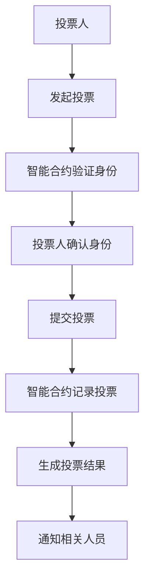
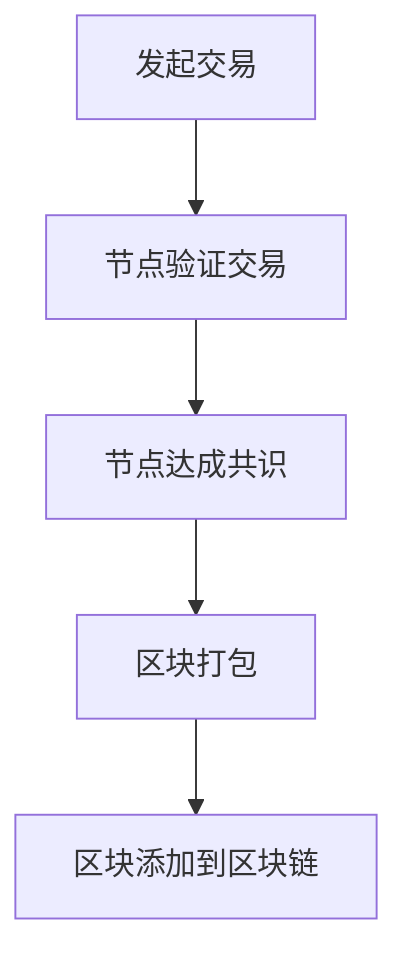
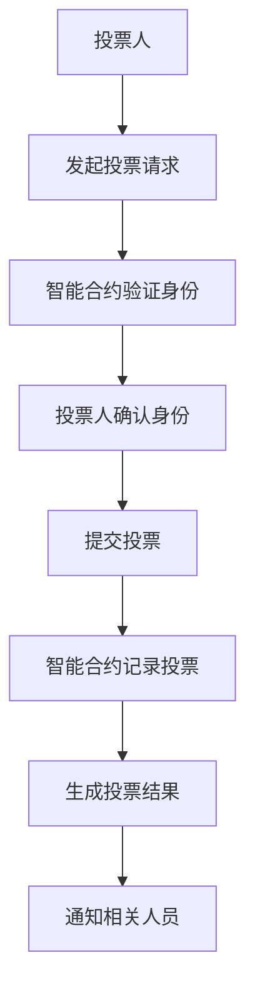
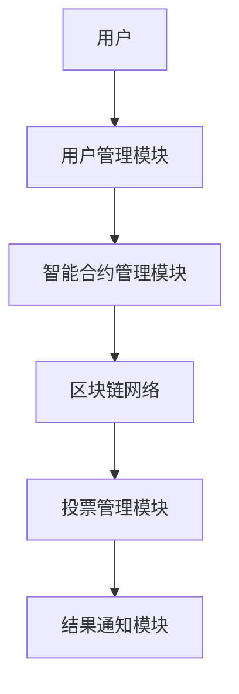
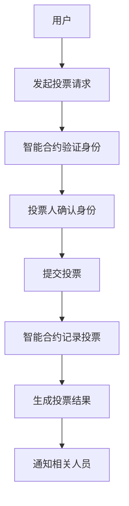

                 


# 如何评估企业的区块链投票系统应用

> 关键词：区块链投票系统、智能合约、共识机制、去中心化、安全性评估、系统设计

> 摘要：本文详细探讨了如何评估企业在区块链投票系统中的应用，从核心概念、算法原理、系统架构到项目实战，全面解析了区块链投票系统的实现与优化，为企业在区块链投票系统的设计与实施提供深入的技术指导。

---

# 第一部分：区块链投票系统概述

## 第1章：区块链与投票系统概述

### 1.1 区块链技术的基本概念

#### 1.1.1 区块链的定义与特点
区块链是一种去中心化的分布式账本技术，具有以下特点：
- **去中心化**：数据不依赖于单个中心节点，而是分布在网络的各个节点上。
- **不可篡改**：通过加密算法和共识机制，确保数据的安全性和不可修改性。
- **透明性**：所有交易记录在区块链上公开透明，每个节点都可以查看。
- **去信任化**：通过技术手段减少对中间机构的信任依赖。

#### 1.1.2 区块链的核心技术原理
区块链的核心技术包括：
- **区块结构**：每个区块包含交易数据、时间戳、哈希值等信息。
- **共识机制**：如工作量证明（PoW）和权益证明（PoS），用于验证交易的有效性。
- **智能合约**：在区块链上自动执行的代码，用于管理资产和自动化流程。

#### 1.1.3 区块链在企业中的应用领域
区块链在企业中的应用领域广泛，包括：
- **供应链管理**：追踪产品来源和流转过程。
- **金融支付**：实现快速、安全的跨境支付。
- **版权保护**：保护数字内容的版权归属。
- **投票系统**：确保投票的透明性和安全性。

### 1.2 投票系统的基本概念

#### 1.2.1 投票系统的定义与类型
投票系统是指通过一定规则收集和统计选票的系统，常见类型包括：
- **电子投票系统**：基于计算机或网络的投票方式。
- **区块链投票系统**：利用区块链技术实现投票过程的透明化和安全性。

#### 1.2.2 传统投票系统的优缺点
- **优点**：操作简单，成本低。
- **缺点**：可能存在数据篡改、隐私泄露等问题。

#### 1.2.3 区块链投票系统的独特优势
- **安全性**：区块链技术确保投票数据不可篡改。
- **透明性**：所有投票记录公开透明，任何人都可以查看。
- **去中心化**：避免单点故障，减少数据被篡改的风险。

### 1.3 区块链投票系统的结合与重要性

#### 1.3.1 区块链技术如何提升投票系统的安全性与透明度
通过区块链技术，投票系统可以实现：
- **数据不可篡改**：每个投票记录都被加密并存储在区块链上。
- **身份验证**：通过智能合约实现投票人的身份验证，防止重复投票。
- **实时统计**：投票结果实时生成，减少人工统计的误差。

#### 1.3.2 区块链投票系统在企业中的应用场景
- **股东大会投票**：确保股东投票的透明性和安全性。
- **内部决策投票**：企业内部决策过程的透明化和高效化。
- **供应链治理**：通过区块链投票系统实现供应链参与方的共同决策。

#### 1.3.3 区块链投票系统的社会价值与经济意义
- **社会价值**：提高投票系统的信任度，增强社会公正性。
- **经济意义**：降低投票成本，提高决策效率，为企业创造更大的经济效益。

---

## 第2章：区块链投票系统的核心概念与技术

### 2.1 区块链投票系统的核心概念

#### 2.1.1 智能合约的定义与作用
智能合约是区块链上的自动执行代码，用于管理投票流程中的关键操作，如投票发起、身份验证和结果统计。

#### 2.1.2 区块链投票系统的去中心化特点
去中心化意味着投票系统不依赖于单一机构，而是通过分布在网络中的节点共同维护数据的完整性和一致性。

#### 2.1.3 区块链投票系统的不可篡改性
通过区块链的特性，确保每个投票记录都被加密存储，无法被篡改或删除。

### 2.2 区块链投票系统的技术架构

#### 2.2.1 区块链的共识机制
共识机制是区块链的核心技术之一，常见的共识机制包括：
- **工作量证明（PoW）**：通过计算哈希值来验证交易的有效性。
- **权益证明（PoS）**：根据节点持有的代币数量分配验证权。

#### 2.2.2 区块链的节点分布与权限管理
区块链节点分布广泛，每个节点都有一定的权限，确保数据的安全性和一致性。

#### 2.2.3 区块链的存储结构与数据完整性
区块链的存储结构包括区块头和区块体，每个区块头包含哈希值、时间戳和默克尔根等信息，确保数据的完整性和不可篡改性。

### 2.3 区块链投票系统的实体关系与流程

#### 2.3.1 实体关系图
区块链投票系统的主要实体包括：
- **投票人**：参与投票的用户。
- **投票提案**：需要投票的提案或议题。
- **智能合约**：管理投票流程的自动执行代码。
- **区块链网络**：存储投票数据和交易记录的分布式账本。

#### 2.3.2 投票流程
投票流程包括以下步骤：
1. **身份验证**：投票人通过智能合约进行身份验证。
2. **提案提交**：投票人提交需要投票的提案。
3. **投票过程**：投票人对提案进行投票，系统记录投票数据。
4. **结果生成**：智能合约根据投票结果生成最终结果。
5. **结果通知**：系统将投票结果通知给相关方。

---

## 第3章：区块链投票系统的算法原理

### 3.1 投票流程的算法实现

#### 3.1.1 投票流程的mermaid流程图


#### 3.1.2 算法步骤解释
1. **身份验证**：投票人通过智能合约进行身份验证，确保投票人身份合法。
2. **投票提交**：投票人提交投票数据，系统记录投票内容。
3. **结果生成**：智能合约根据投票数据生成最终结果。
4. **结果通知**：系统将投票结果通知给相关方，如提案发起人或相关利益方。

### 3.2 共识机制的实现

#### 3.2.1 共识机制的mermaid流程图


#### 3.2.2 共识机制的数学模型
共识机制的核心在于通过数学模型确保交易的有效性和一致性。常见的共识机制包括：
- **工作量证明（PoW）**：通过计算哈希值来验证交易的有效性。
- **权益证明（PoS）**：根据节点持有的代币数量分配验证权。

### 3.3 智能合约的实现

#### 3.3.1 智能合约的mermaid流程图


#### 3.3.2 智能合约的代码实现
以下是一个简单的智能合约代码示例（Solidity语言）：
```solidity
// SPDX-License-Identifier: MIT
pragma solidity ^0.8.0;

contract VotingSystem {
    struct Voter {
        bool isRegistered;
        uint votes;
    }

    mapping(address => Voter) public voters;

    function register Voter(address voterAddress) public {
        voters[voterAddress].isRegistered = true;
        voters[voterAddress].votes = 0;
    }

    function castVote(address voterAddress) public {
        require(voters[voterAddress].isRegistered, "Voter is not registered");
        voters[voterAddress].votes++;
    }

    function getVotes(address voterAddress) public view returns (uint) {
        return voters[voterAddress].votes;
    }
}
```

#### 3.3.3 数学模型与公式
智能合约的执行过程可以通过数学模型和公式来描述。例如，投票结果的计算可以表示为：
$$
\text{result} = \sum_{i=1}^{n} v_i
$$
其中，$v_i$ 表示每个投票人的投票结果，$n$ 表示投票人总数。

---

## 第4章：区块链投票系统的系统分析与架构设计

### 4.1 系统需求分析

#### 4.1.1 功能需求
- **身份验证**：确保投票人身份合法。
- **投票提交**：支持投票人提交投票数据。
- **结果生成**：智能合约根据投票数据生成最终结果。
- **结果通知**：将投票结果通知给相关方。

#### 4.1.2 性能需求
- **响应时间**：投票提交和结果生成的响应时间需在合理范围内。
- **吞吐量**：系统应支持高并发的投票请求。

### 4.2 系统架构设计

#### 4.2.1 系统模块划分
- **用户管理模块**：负责用户注册、身份验证和权限管理。
- **投票管理模块**：负责投票的发起、提交和结果统计。
- **智能合约管理模块**：负责智能合约的部署和执行。

#### 4.2.2 系统架构图


#### 4.2.3 数据模型与数据库设计
数据库设计包括以下表结构：
- **用户表**：存储用户基本信息和身份验证信息。
- **投票记录表**：存储每条投票记录，包括投票人地址、投票时间等。
- **提案表**：存储需要投票的提案信息，包括提案内容、发起人等。

### 4.3 接口设计与交互流程

#### 4.3.1 RESTful API设计
- **注册接口**：`POST /api/register`
- **投票接口**：`POST /api/vote`
- **查询结果接口**：`GET /api/results`

#### 4.3.2 交互流程图


---

## 第5章：区块链投票系统的项目实战

### 5.1 环境搭建

#### 5.1.1 安装区块链平台
- 安装以太坊节点（如Geth）或使用云服务（如AWS Blockchain）。
- 配置区块链网络，包括节点数量、共识机制等。

#### 5.1.2 安装数据库
- 选择合适的数据库（如MySQL或PostgreSQL）。
- 创建用户表、投票记录表和提案表。

### 5.2 系统核心实现

#### 5.2.1 智能合约实现
- 使用Solidity编写智能合约，实现投票系统的逻辑。
- 部署智能合约到区块链网络。

#### 5.2.2 后端接口实现
- 使用Node.js或Python编写后端接口，实现与智能合约的交互。
- 处理用户的投票请求，调用智能合约进行投票记录。

#### 5.2.3 前端页面实现
- 使用React或Vue.js编写前端页面，实现投票人的注册、登录和投票功能。
- 展示投票结果，提供实时更新的投票数据。

### 5.3 案例分析与详细讲解

#### 5.3.1 案例背景
假设某企业需要进行股东大会投票，采用区块链投票系统实现投票的透明性和安全性。

#### 5.3.2 案例实现
- **用户注册**：股东大会参与者通过智能合约进行身份验证和注册。
- **投票发起**：提案发起人部署智能合约，发起投票请求。
- **投票过程**：股东大会参与者通过前端页面提交投票。
- **结果生成**：智能合约根据投票数据生成最终结果，并通过区块链网络进行广播。
- **结果通知**：系统将投票结果通知给股东大会相关人员。

---

## 第6章：区块链投票系统的最佳实践与小结

### 6.1 最佳实践

#### 6.1.1 测试与调试
- **单元测试**：对智能合约和后端接口进行单元测试，确保功能正常。
- **集成测试**：对整个投票系统进行集成测试，确保各模块协同工作。

#### 6.1.2 安全性优化
- **权限管理**：严格控制智能合约的权限，避免被恶意攻击。
- **加密技术**：使用加密算法保护投票数据的安全性。

#### 6.1.3 性能优化
- **并行处理**：优化系统架构，支持高并发的投票请求。
- **链下存储**：将部分数据存储在链下，减轻区块链网络的负担。

### 6.2 小结

区块链投票系统通过区块链技术实现了投票过程的透明化和安全性，解决了传统投票系统中的诸多问题。本文详细探讨了区块链投票系统的实现与优化，为企业在区块链投票系统的设计与实施提供了深入的技术指导。

---

## 第7章：注意事项与拓展阅读

### 7.1 注意事项
- **法律合规性**：确保区块链投票系统的运行符合相关法律法规。
- **数据隐私**：保护投票人的隐私信息，避免数据泄露。
- **系统维护**：定期维护和更新系统，确保其安全性和稳定性。

### 7.2 拓展阅读
- **区块链技术书籍**：《区块链：通向数字世界的门票》
- **智能合约开发指南**：《Solidity智能合约开发实战》
- **分布式系统设计**：《分布式系统：原理与设计》

---

## 作者

作者：AI天才研究院/AI Genius Institute & 禅与计算机程序设计艺术/Zen And The Art of Computer Programming

---

以上是完整的目录大纲，涵盖了从背景介绍到系统设计、项目实战和最佳实践的各个方面，确保内容全面且详细。

