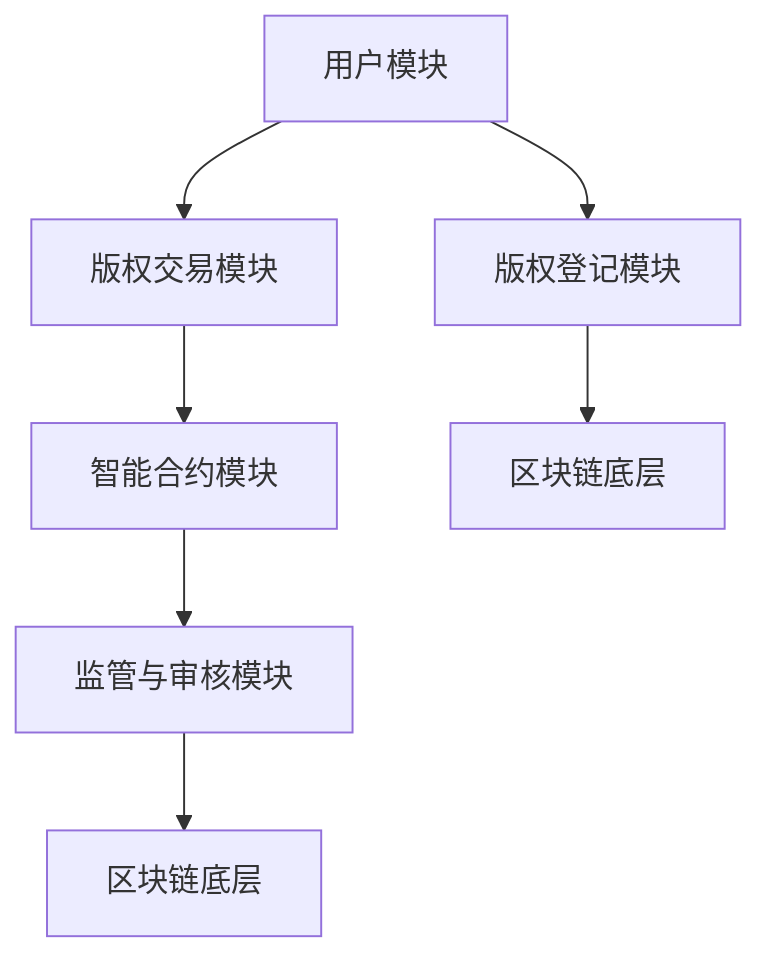
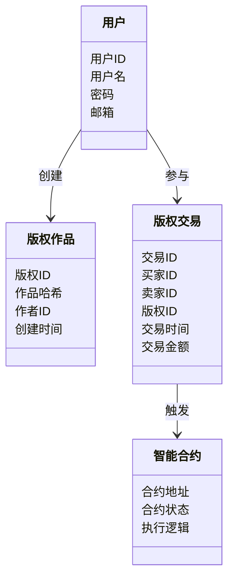
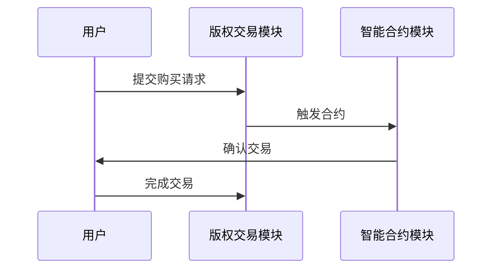
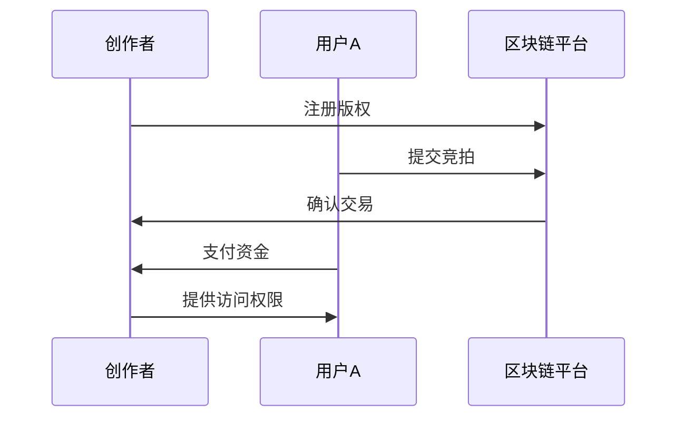

                 


---

# 如何评估企业的区块链数字版权交易平台

> 关键词：区块链，数字版权，交易平台，评估指标，系统架构

> 摘要：本文详细介绍了如何评估企业的区块链数字版权交易平台，从核心概念、技术原理、系统架构到实际项目实战，层层深入，为企业提供全面的评估方法和实践指南。

---

# 第五章: 区块链数字版权交易平台的系统架构

## 5.1 系统架构设计概述

### 5.1.1 系统架构的核心模块划分

区块链数字版权交易平台的系统架构可以分为以下几个核心模块：

1. **用户模块**：负责用户注册、登录、个人信息管理等。
2. **版权登记模块**：用于数字作品的版权登记，生成唯一的哈希值并存储在区块链上。
3. **版权交易模块**：实现数字版权的上架、 bidding、拍卖等功能。
4. **智能合约模块**：自动执行交易、支付和版权转移。
5. **区块链底层**：基于某种区块链技术（如以太坊、IPFS）构建的分布式账本。
6. **监管与审核模块**：对版权内容进行审核，确保合法性。

### 5.1.2 系统架构的 Mermaid 架构图

以下是一个简化的 Mermaid 架构图，展示了系统的模块划分和交互流程：



### 5.1.3 系统架构的优缺点对比

| **特性** | **优点** | **缺点** |
|----------|----------|----------|
| 去中心化 | 高安全性 | 复杂性较高 |
| 可扩展性 | 较好 | 受限于区块链性能 |
| 开发难度 | 中等 | 学习曲线较高 |

## 5.2 系统功能设计

### 5.2.1 系统功能的领域模型 Mermaid 类图

以下是一个领域模型类图，展示了系统中的主要实体及其关系：



## 5.3 系统接口设计

### 5.3.1 系统接口的交互流程

以下是用户进行版权交易的交互流程：

1. **用户登录**：用户通过用户名和密码登录系统。
2. **选择作品**：用户浏览可交易的数字版权作品。
3. **发起交易**：用户选择作品并提交购买请求。
4. **智能合约执行**：系统触发智能合约，完成交易资金划转和版权转移。
5. **交易完成**：用户获得作品访问权限，卖家收到交易资金。

### 5.3.2 系统接口的 Mermaid 序列图

以下是一个交易流程的 Mermaid 序列图：



---

# 第六章: 区块链数字版权交易平台的项目实战

## 6.1 环境搭建

### 6.1.1 开发环境配置

1. **安装区块链平台**：选择以太坊、IPFS 或其他合适的区块链平台。
2. **安装开发工具**：配置IDE（如IntelliJ IDEA）和相关插件（如Solidity）。
3. **安装依赖库**：安装Node.js、Python等开发工具。

## 6.2 核心代码实现

### 6.2.1 智能合约实现

以下是一个简单的版权交易智能合约示例：

```solidity
// SPDX-License-Identifier: MIT
pragma solidity ^0.8.0;

contract CopyrightTrade {
    struct Copyright {
        address owner;
        uint256 timestamp;
        bytes32 hash;
    }

    event CopyrightTraded(
        address indexed seller,
        address indexed buyer,
        uint256 copyrightId,
        uint256 amount
    );

    mapping(uint256 => Copyright) public copyrights;

    function registerCopyright(bytes32 hash) public {
        uint256 id = uint256(keccak256(abi.encodePacked(msg.sender)));
        copyrights[id] = Copyright(msg.sender, block.timestamp, hash);
    }

    function tradeCopyright(uint256 copyrightId, address buyer) public payable {
        Copyright memory cp = copyrights[copyrightId];
        require(cp.owner == msg.sender, "Not the owner");
        require(msg.value > 0, "Must pay at least 1 wei");

        cp.owner = buyer;
        emit CopyrightTraded(msg.sender, buyer, copyrightId, msg.value);
    }
}
```

### 6.2.2 交易模块实现

以下是一个交易模块的Python代码示例：

```python
from web3 import Web3, HTTPProvider

# 初始化Web3实例
web3 = Web3(HTTPProvider('http://localhost:8545'))

# 智能合约地址和ABI
contract_address = '0xYourContractAddress'
contract_abi = [...]  # 替换为实际ABI

# 初始化合约实例
contract = web3.eth.contract(address=contract_address, abi=contract_abi)

# 用户发起交易
def initiate_trade(copyright_id, buyer_address):
    tx_hash = contract.functions.tradeCopyright(copyright_id, buyer_address).transact()
    receipt = web3.eth.waitForTransactionReceipt(tx_hash)
    return receipt

# 示例调用
initiate_trade(1, '0xBuyerAddress')
```

### 6.2.3 代码解读与分析

- **智能合约**：定义了版权的注册和交易功能，确保版权转移的透明性和不可篡改性。
- **交易模块**：通过调用智能合约的方法，完成交易的发起和确认，确保交易的可追溯性和安全性。

## 6.3 实际案例分析

### 6.3.1 案例背景

某数字内容创作者希望在区块链平台上出售其原创电子书的版权。

### 6.3.2 实施步骤

1. **版权登记**：创作者将电子书的哈希值写入区块链，生成唯一标识。
2. **平台上线**：将电子书上架到交易平台，设置起拍价和拍卖时间。
3. **用户竞拍**：潜在买家参与竞拍，系统自动执行智能合约完成交易。
4. **版权转移**：买家获得电子书的访问权限，创作者收到交易资金。

### 6.3.3 交易流程的 Mermaid 序列图



---

# 第七章: 区块链数字版权交易平台的最佳实践

## 7.1 项目开发注意事项

1. **安全性**：确保智能合约代码经过严格审计，防止漏洞利用。
2. **性能优化**：优化区块链上的交易效率，减少Gas费用。
3. **用户体验**：设计直观的界面，简化操作流程。

## 7.2 评估指标与注意事项

| **评估指标** | **建议值** | **注意事项** |
|--------------|------------|--------------|
| 交易速度     | <10秒/交易 | 优化区块链性能 |
| 用户体验     | 高          | 简化操作流程 |
| 安全性       | 高          | 定期安全审计 |

## 7.3 项目小结

通过本章的分析，读者可以更好地理解如何开发和评估一个区块链数字版权交易平台。关键点在于确保系统的安全性和高效性，同时提供良好的用户体验。

---

# 结语

评估企业的区块链数字版权交易平台需要从核心概念、技术原理、系统架构和实际项目等多个方面进行全面考量。通过本文的详细讲解，读者可以掌握从理论到实践的完整流程，为实际应用提供有力指导。

---

作者：AI天才研究院/AI Genius Institute & 禅与计算机程序设计艺术 /Zen And The Art of Computer Programming

