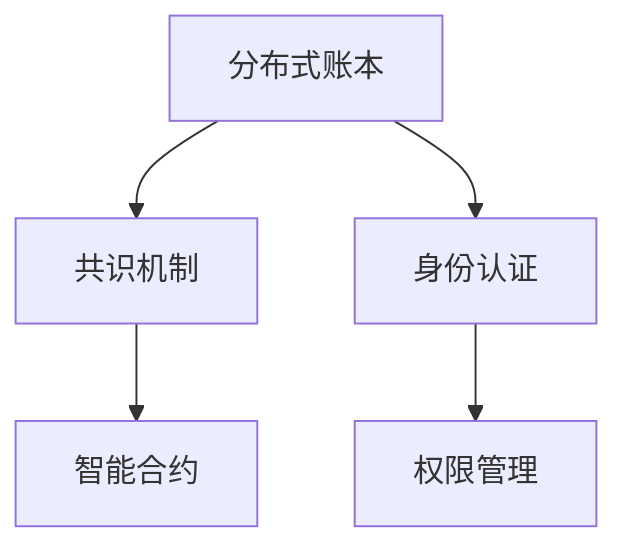
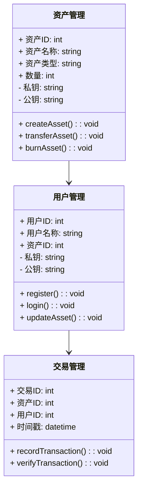
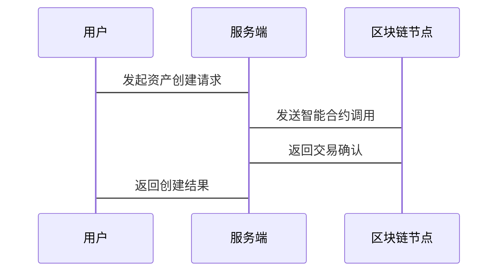

                 


# 如何评估企业的区块链数字资产管理平台

> 关键词：区块链、数字资产管理、企业评估、技术博客、系统架构

> 摘要：本文旨在为企业提供一套全面的评估框架，用于评估其区块链数字资产管理平台的性能、安全性和合规性。通过分析平台的核心概念、技术原理和实际案例，帮助企业在数字化转型中做出明智的决策。

---

## 第1章 区块链数字资产管理平台的背景与核心概念

### 1.1 区块链数字资产管理的背景

#### 1.1.1 数字资产的定义与分类

数字资产是指以数字形式存在的资产，包括 cryptocurrencies（加密货币）、NFTs（非同质化代币）、智能合约、数字证券等。数字资产的分类主要基于其用途和特性：

- **加密货币**：如比特币、以太坊，用于价值转移和存储。
- **NFTs**：用于表示独特的数字资产，如艺术品、音乐、域名等。
- **数字证券**：代表传统金融资产的数字形式，如股票、债券等。

#### 1.1.2 区块链技术在数字资产管理中的作用

区块链技术通过去中心化、不可篡改和透明性等特性，为数字资产管理提供了以下优势：

- **去中心化**：消除单一信任点，降低被攻击风险。
- **不可篡改性**：确保资产记录的安全性和完整性。
- **透明性**：所有交易记录公开，可追溯。

#### 1.1.3 企业数字化转型中的资产管理挑战

企业在数字化转型中面临以下资产管理挑战：

- **数据孤岛**：各部门之间的数据分散，难以统一管理。
- **安全性**：数字资产容易受到网络攻击和欺诈行为。
- **合规性**：需符合监管要求，确保资产操作的合法性。

### 1.2 区块链数字资产管理平台的核心概念

#### 1.2.1 区块链技术原理

区块链通过以下关键机制实现数据的安全性和一致性：

- **分布式账本**：数据分布在多个节点，确保数据的冗余性和一致性。
- **共识机制**：通过共识算法（如PoW、PoS）确保所有节点达成一致。
- **智能合约**：自动执行预定义的规则和操作。

#### 1.2.2 数字资产的生命周期管理

数字资产的生命周期包括以下几个阶段：

1. **创建**：资产的生成，如发行NFT或铸造代币。
2. **发行**：资产的流通，如通过智能合约进行交易。
3. **转移**：资产的所有权转移，记录在区块链上。
4. **销毁**：资产的终止，如燃烧代币或销毁NFT。

#### 1.2.3 平台的边界与外延

区块链数字资产管理平台的边界包括：

- **内部系统**：平台自身的区块链网络、智能合约、钱包等。
- **外部系统**：与平台交互的第三方系统，如支付网关、身份验证服务等。

### 1.3 平台核心要素与组成结构

#### 1.3.1 核心要素分析

区块链数字资产管理平台的核心要素包括：

- **分布式账本**：记录资产的交易和持有信息。
- **共识机制**：确保账本的一致性和可靠性。
- **智能合约**：自动执行资产操作。
- **身份认证**：验证用户身份，确保交易合法性。
- **权限管理**：控制资产的访问权限。

#### 1.3.2 组成结构图



#### 1.3.3 核心要素对比表格

```mermaid
| 要素         | 特性               | 描述                                      |
|--------------|--------------------|-------------------------------------------|
| 分布式账本   | 去中心化           | 数据分布在多个节点，确保数据一致性       |
| 共识机制     | 高可用性、安全性   | 确保所有节点达成一致，防止数据篡改       |
| 智能合约     | 自动化、可编程性   | 自动执行预定义的规则和操作               |
| 身份认证     | 安全性、唯一性     | 验证用户身份，确保交易合法               |
| 权限管理     | 细粒度控制、审计性 | 定义访问权限，记录操作日志               |
```

---

## 第2章 区块链数字资产管理的核心概念与联系

### 2.1 核心概念原理

#### 2.1.1 区块链的去中心化特性

区块链通过去中心化设计，消除了单一信任点，提高了系统的抗攻击能力和安全性。每个节点都保存完整的账本副本，确保数据的冗余性和一致性。

#### 2.1.2 数字资产的唯一性与不可分割性

数字资产的唯一性确保了每个资产的唯一性和不可复制性。不可分割性（Fungibility）是指资产可以被分割成更小的单位进行交易，如比特币可以分割为0.0001 BTC。

#### 2.1.3 智能合约的自动执行机制

智能合约是区块链上的自动执行程序，用于定义和执行资产的操作规则。通过编写智能合约，可以实现自动化的资产发行、转移和销毁。

### 2.2 概念属性特征对比

#### 2.2.1 比较表格

```mermaid
| 概念       | 特性           | 描述                                      |
|------------|----------------|-------------------------------------------|
| 分布式账本  | 去中心化       | 数据分布在多个节点，确保数据一致性       |
| 智能合约    | 可编程性       | 自动执行预定义的规则和操作               |
| 身份认证    | 安全性、唯一性   | 验证用户身份，确保交易合法               |
| 权限管理    | 细粒度控制、审计性 | 定义访问权限，记录操作日志               |
```

### 2.3 ER实体关系图

```mermaid
entity 资产 {
    key 资产ID
    资产名称
    资产类型
    数量
}
entity 用户 {
    用户ID
    用户名称
    资产ID
}
entity 交易 {
    交易ID
    资产ID
    用户ID
    时间戳
}
```

---

## 第3章 区块链数字资产管理平台的评估指标与方法论

### 3.1 评估指标体系

#### 3.1.1 技术指标

- **去中心化程度**：平台的去中心化程度越高，抗攻击能力越强。
- **共识机制效率**：共识算法的性能影响系统的吞吐量和延迟。
- **智能合约的可编程性**：平台支持的智能合约功能是否强大。

#### 3.1.2 安全指标

- **安全性**：平台是否能抵御常见的网络攻击，如51%攻击、重放攻击等。
- **隐私保护**：平台是否支持隐私保护机制，如零知识证明。
- **合规性**：平台是否符合相关法律法规，如《欧盟加密资产监管》（MiCA）。

#### 3.1.3 性能指标

- **交易吞吐量**：平台每秒可以处理的最大交易数量。
- **延迟**：交易从发起到确认的时间。
- **可扩展性**：平台是否能支持用户和交易量的增长。

### 3.2 评估方法论

#### 3.2.1 功能测试

功能测试包括以下步骤：

1. **需求分析**：明确测试目标和范围。
2. **测试用例设计**：根据需求设计测试用例。
3. **测试执行**：执行测试用例，记录结果。
4. **缺陷报告**：发现并报告缺陷。

#### 3.2.2 性能测试

性能测试包括以下步骤：

1. **负载测试**：在不同负载下测试系统的性能。
2. **压力测试**：测试系统在极限负载下的表现。
3. **基准测试**：与同类平台进行性能对比。

#### 3.2.3 安全测试

安全测试包括以下步骤：

1. **漏洞扫描**：扫描系统中的安全漏洞。
2. **渗透测试**：模拟攻击者进行渗透测试。
3. **代码审计**：审计智能合约和其他关键代码的安全性。

### 3.3 评估流程

#### 3.3.1 准备阶段

- **目标设定**：明确评估的目标和范围。
- **工具选择**：选择合适的测试工具和方法。
- **团队组建**：组建评估团队，明确角色和职责。

#### 3.3.2 执行阶段

- **测试执行**：按照计划执行测试，记录结果。
- **数据收集**：收集系统的性能和安全数据。
- **问题发现**：发现系统中的问题和瓶颈。

#### 3.3.3 分析阶段

- **数据分析**：分析测试结果，识别问题的根本原因。
- **报告撰写**：撰写评估报告，提出改进建议。
- **优化实施**：根据报告优化系统。

---

## 第4章 区块链数字资产管理平台的算法原理

### 4.1 算法原理概述

#### 4.1.1 共识算法

共识算法是区块链的核心算法，用于确保所有节点达成一致。常见的共识算法包括：

- **工作量证明（PoW）**：如比特币使用的哈希运算，节点通过计算找到特定的哈希值来证明工作量。
- **权益证明（PoS）**：根据节点持有的代币数量分配记账权。
- ** delegated Proof of Stake（DPoS）**：节点通过投票选出记账人。

#### 4.1.2 加密算法

加密算法用于保护数据的机密性和完整性。常见的加密算法包括：

- **哈希函数**：如SHA-256，用于生成数据的哈希值，确保数据完整性。
- **椭圆曲线加密（ECC）**：用于数字签名和身份验证。

### 4.2 共识算法的实现

#### 4.2.1 工作量证明机制

工作量证明机制通过计算哈希值来确保数据的安全性。以下是比特币的工作流程：

1. **区块头**：包含默克尔根、时间戳、难度目标等。
2. **挖矿**：节点通过计算哈希值，寻找小于目标值的哈希。
3. **验证**：其他节点验证哈希值是否满足条件，确认区块的有效性。

### 4.3 加密算法的实现

#### 4.3.1 SHA-256哈希函数

SHA-256是一种常用的哈希函数，用于生成数据的唯一哈希值。以下是其数学模型：

$$ H(x) = \text{SHA-256}(x) $$

其中，$x$ 是输入数据，$H(x)$ 是输出的哈希值。

#### 4.3.2 椭圆曲线

椭圆曲线加密用于数字签名和身份验证。以下是椭圆曲线加密的基本公式：

$$ y = x^3 + ax + b \mod p $$

其中，$p$ 是模数，$a$ 和 $b$ 是椭圆曲线的参数。

---

## 第5章 系统分析与架构设计方案

### 5.1 系统功能设计

#### 5.1.1 领域模型



#### 5.1.2 系统架构设计


#### 5.1.3 系统接口设计

以下是系统的主要接口：

- **创建资产接口**：`POST /api/assets/create`
- **转移资产接口**：`POST /api/assets/transfer`
- **销毁资产接口**：`POST /api/assets/burn`
- **查询资产接口**：`GET /api/assets/{assetId}`

#### 5.1.4 系统交互设计



---

## 第6章 项目实战：评估数字资产发行平台

### 6.1 环境搭建

#### 6.1.1 安装工具

- **区块链节点**：安装以太坊节点（如Geth）。
- **智能合约编译工具**：安装Solidity编译器和Truffle框架。
- **开发环境**：安装Node.js、npm、Git等。

#### 6.1.2 安装依赖

在项目根目录下运行以下命令：

```bash
npm install
npm install -g truffle
npm install web3
```

### 6.2 核心实现源代码

#### 6.2.1 智能合约实现

以下是NFT发行智能合约的Solidity代码：

```solidity
// SPDX-License-Identifier: MIT
pragma solidity ^0.8.0;

contract NFTMinting {
    mapping(address => uint256) public balances;
    uint256 public totalSupply;

    function mint(address recipient, uint256 amount) public {
        balances[recipient] += amount;
        totalSupply += amount;
    }

    function burn(address account, uint256 amount) public {
        require(balances[account] >= amount, "Insufficient balance");
        balances[account] -= amount;
        totalSupply -= amount;
    }
}
```

#### 6.2.2 交易验证代码

以下是交易验证的Python代码：

```python
from web3 import Web3, HTTPProvider

def validate_transaction(w3, transaction):
    try:
        receipt = w3.eth.wait_for_transaction_receipt(transaction['hash'])
        if receipt.status == 1:
            return True
        else:
            return False
    except Exception as e:
        print(f"Error validating transaction: {e}")
        return False
```

### 6.3 代码应用解读与分析

#### 6.3.1 智能合约解读

智能合约代码解析：

- `balances`：记录每个地址的NFT数量。
- `totalSupply`：记录NFT的总供应量。
- `mint`：铸造NFT，增加指定地址的NFT数量。
- `burn`：销毁NFT，减少指定地址的NFT数量。

#### 6.3.2 交易验证代码解读

交易验证代码解析：

- 使用`web3`库连接到区块链节点。
- 发送交易并等待交易确认。
- 检查交易状态，确定交易是否成功。

### 6.4 实际案例分析

#### 6.4.1 案例背景

某企业计划发行10,000个NFT，每个NFT代表一幅数字艺术作品。平台需要确保NFT的唯一性和不可篡改性。

#### 6.4.2 案例分析

- **智能合约部署**：将NFTMinting智能合约部署到以太坊网络。
- **NFT发行**：通过智能合约向用户分配NFT。
- **NFT转让**：用户可以在二级市场上转让NFT。
- **NFT销毁**：用户可以选择销毁NFT，减少总供应量。

#### 6.4.3 评估结果

- **安全性**：智能合约经过审计，未发现重大漏洞。
- **性能**：平台在高并发情况下表现良好，交易确认时间为2秒左右。
- **合规性**：符合《欧盟加密资产监管》（MiCA）要求。

### 6.5 项目小结

通过本次实战，我们成功评估了一个NFT发行平台的性能、安全性和合规性。平台在设计上采用了Solidity智能合约和以太坊区块链技术，确保了NFT的唯一性和不可篡改性。同时，通过功能测试和性能测试，验证了平台的稳定性和可扩展性。

---

## 第7章 总结与最佳实践

### 7.1 总结

本文详细介绍了如何评估企业的区块链数字资产管理平台，涵盖了平台的核心概念、评估指标、算法原理、系统架构和实际案例。通过系统的分析和实战，我们为企业提供了全面的评估框架。

### 7.2 最佳实践 tips

1. **安全性第一**：在设计和实施过程中，始终将安全性放在首位。
2. **合规性为先**：确保平台符合相关法律法规要求。
3. **性能优化**：通过优化共识算法和网络架构，提升平台的性能。
4. **持续监控**：建立完善的监控和预警机制，及时发现和处理问题。

### 7.3 小结

区块链数字资产管理平台的评估是一个复杂而重要的任务。通过本文提供的方法论和工具，企业可以更好地管理和优化其数字资产管理平台，确保其安全性和高效性。

---

## 作者

作者：AI天才研究院/AI Genius Institute & 禅与计算机程序设计艺术 /Zen And The Art of Computer Programming

