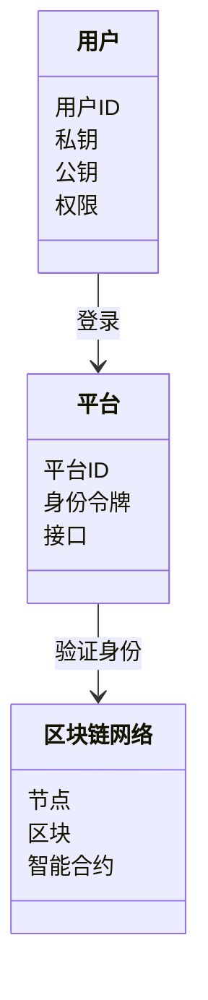
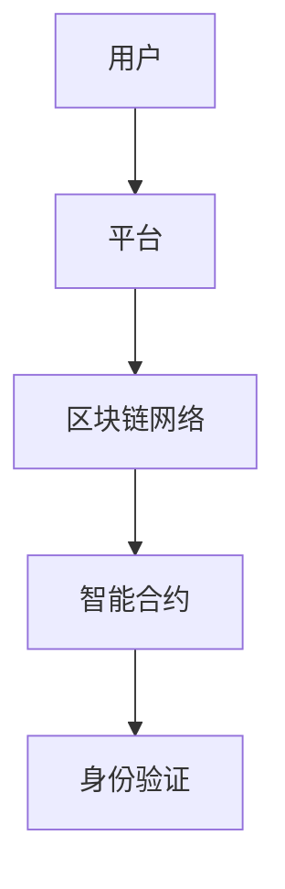
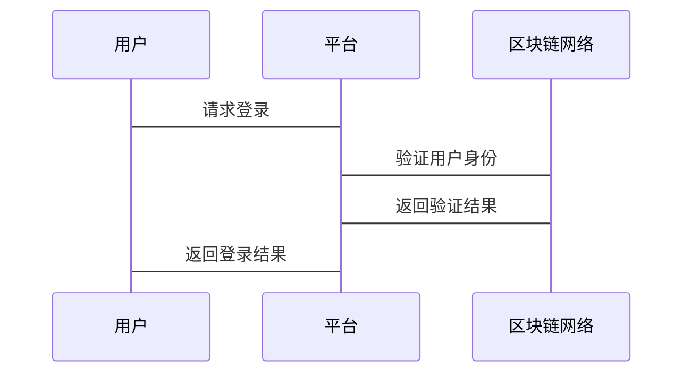

                 


# 如何评估企业的区块链数字身份跨平台认证应用

> 关键词：区块链，数字身份，跨平台认证，企业应用，安全性评估

> 摘要：随着区块链技术的快速发展，数字身份跨平台认证的应用场景日益广泛。本文将详细探讨如何评估企业的区块链数字身份跨平台认证应用，涵盖核心概念、技术原理、系统架构、项目实战等多个方面，为读者提供全面的评估方法和实践指导。

---

# 第1章: 区块链数字身份跨平台认证的背景与概念

## 1.1 区块链技术的基本概念

### 1.1.1 区块链的定义与核心特性
区块链是一种分布式账本技术，通过去中心化的方式记录数据，具备去中心化、不可篡改、透明性和可追溯性等核心特性。

### 1.1.2 区块链的演进历程
从比特币到以太坊，区块链技术经历了从1.0到2.0的演进，逐步从简单的价值转移扩展到智能合约和去中心化应用（DApp）的支持。

### 1.1.3 区块链在企业中的应用价值
区块链为企业提供了数据可信、安全高效、去中心化的解决方案，广泛应用于金融、医疗、供应链等领域。

---

## 1.2 数字身份的定义与特点

### 1.2.1 数字身份的定义
数字身份是用户在数字世界中的唯一标识，通常由公钥、私钥或其他加密方式表示。

### 1.2.2 数字身份的核心属性
- **唯一性**：每个数字身份都是唯一的。
- **安全性**：通过加密技术保护身份信息。
- **可验证性**：通过区块链等技术实现身份信息的验证。

### 1.2.3 数字身份与传统身份的区别
数字身份依赖于技术手段，而传统身份依赖于物理凭证，数字身份具有更高的安全性和便捷性。

---

## 1.3 跨平台认证的定义与挑战

### 1.3.1 跨平台认证的定义
跨平台认证是指用户在不同平台之间使用统一的身份进行登录和权限管理。

### 1.3.2 跨平台认证的核心问题
- **身份统一性**：如何在不同平台之间统一身份标识。
- **安全性**：如何确保跨平台认证的安全性。
- **兼容性**：如何实现不同平台之间的兼容。

### 1.3.3 跨平台认证的实现难点
- 技术复杂性：需要协调多个平台的技术架构。
- 安全风险：跨平台认证可能面临更高的安全威胁。

---

## 1.4 区块链与数字身份的结合

### 1.4.1 区块链在数字身份中的作用
区块链通过去中心化和不可篡改的特性，为数字身份提供了信任基础。

### 1.4.2 区块链如何支持跨平台认证
通过区块链技术实现身份信息的分布式存储和共享，支持跨平台的统一身份认证。

### 1.4.3 区块链数字身份的典型应用场景
- 金融支付：支持多平台的支付和身份验证。
- 医疗健康：实现跨机构的患者身份认证和数据共享。
- 供应链管理：支持供应商、物流等多方的身份认证。

---

## 1.5 本章小结
本章介绍了区块链技术的基本概念、数字身份的特点，以及跨平台认证的定义和挑战。通过区块链技术，数字身份跨平台认证的应用场景更加广泛，但同时也面临技术复杂性和安全性的挑战。

---

# 第2章: 区块链数字身份跨平台认证的核心概念

## 2.1 数字身份的核心要素

### 2.1.1 身份标识
身份标识是数字身份的唯一标识，通常由公钥或用户ID表示。

### 2.1.2 身份属性
身份属性包括用户的权限、角色等信息，用于跨平台认证中的权限管理。

### 2.1.3 身份验证
身份验证是通过验证用户的私钥或其他凭证来确认其身份的过程。

---

## 2.2 区块链在跨平台认证中的角色

### 2.2.1 区块链作为信任基础
区块链通过去中心化的方式，为跨平台认证提供信任基础。

### 2.2.2 区块链的去中心化特性
去中心化特性使得区块链能够支持多个平台之间的身份共享。

### 2.2.3 区块链的安全性保障
区块链的不可篡改性确保了身份信息的安全性和可靠性。

---

## 2.3 跨平台认证的实现机制

### 2.3.1 身份令牌
身份令牌（如JWT）用于表示用户的身份和权限，支持跨平台的认证。

### 2.3.2 身份解析
身份解析是指通过区块链查询用户身份信息的过程，确保身份信息的准确性和一致性。

### 2.3.3 身份验证流程
身份验证流程包括身份令牌的生成、传输和验证，确保跨平台认证的安全性。

---

## 2.4 核心概念对比分析

### 2.4.1 数字身份与传统身份对比
| 特性       | 数字身份           | 传统身份           |
|------------|--------------------|--------------------|
| 存储方式   | 分布式存储         | 集中式存储         |
| 安全性     | 高                 | 中                 |
| 可扩展性   | 高                 | 低                 |

### 2.4.2 区块链与传统认证方式对比
| 特性       | 区块链认证         | 传统认证           |
|------------|--------------------|--------------------|
| 中心化     | 去中心化           | 集中式            |
| 安全性     | 高                 | 中                 |
| 可扩展性   | 高                 | 低                 |

### 2.4.3 跨平台认证与单平台认证对比
| 特性       | 跨平台认证         | 单平台认证         |
|------------|--------------------|--------------------|
| 跨平台性   | 支持               | 不支持             |
| 安全性     | 高                 | 中                 |
| 复杂性     | 高                 | 低                 |

---

## 2.5 本章小结
本章详细介绍了数字身份的核心要素、区块链在跨平台认证中的角色，以及跨平台认证的实现机制。通过对比分析，突出了区块链技术在数字身份跨平台认证中的优势。

---

# 第3章: 区块链数字身份跨平台认证的算法原理

## 3.1 区块链共识机制

### 3.1.1 共识机制的定义
共识机制是区块链中用于达成分布式系统中一致性的算法。

### 3.1.2 常见共识算法
- **PoW（工作量证明）**：比特币中使用的共识算法。
- **PoS（权益证明）**：以太坊2.0中使用的共识算法。
- **BFT（拜占庭容错）**：适用于小型区块链网络的共识算法。

### 3.1.3 共识算法对跨平台认证的影响
共识机制确保了区块链网络中数据的一致性，为跨平台认证提供了信任基础。

---

## 3.2 智能合约原理

### 3.2.1 智能合约的定义
智能合约是区块链上的可编程代码，用于自动化执行合同条款。

### 3.2.2 智能合约的执行流程
1. **触发条件**：用户触发智能合约的执行。
2. **代码执行**：智能合约根据预设逻辑执行操作。
3. **结果记录**：智能合约的执行结果被记录在区块链上。

### 3.2.3 智能合约在身份认证中的应用
智能合约可以用于验证用户的身份信息，实现跨平台认证。

---

## 3.3 身份验证算法

### 3.3.1 哈希函数
哈希函数用于将身份信息转换为固定长度的哈希值，用于身份验证。

### 3.3.2 数字签名
数字签名通过私钥对哈希值进行签名，确保身份信息的完整性和真实性。

### 3.3.3 身份令牌生成与验证
身份令牌（如JWT）通过哈希函数和数字签名生成，用于跨平台认证。

---

## 3.4 跨平台认证

### 3.4.1 跨平台认证的实现流程
1. **身份令牌生成**：用户通过私钥生成身份令牌。
2. **身份令牌传输**：用户将身份令牌传输到目标平台。
3. **身份令牌验证**：目标平台验证身份令牌的有效性。

### 3.4.2 跨平台认证的安全性保障
通过区块链技术和数字签名，确保身份令牌的安全性和不可篡改性。

---

## 3.5 本章小结
本章详细讲解了区块链数字身份跨平台认证的算法原理，包括共识机制、智能合约和身份验证算法。这些技术共同保障了跨平台认证的安全性和可靠性。

---

# 第4章: 区块链数字身份跨平台认证的系统架构设计

## 4.1 问题场景介绍

### 4.1.1 背景
企业需要实现跨平台的数字身份认证，支持多个平台之间的用户身份共享。

### 4.1.2 问题描述
当前企业中，不同平台之间身份认证标准不统一，存在数据孤岛和重复认证的问题。

### 4.1.3 问题解决
通过区块链技术实现跨平台的数字身份认证，统一身份标识和权限管理。

### 4.1.4 边界与外延
系统的边界包括用户、平台和区块链网络，外延包括身份信息的存储和共享。

---

## 4.2 项目介绍

### 4.2.1 项目目标
实现企业内部多个平台之间的数字身份跨平台认证。

### 4.2.2 项目范围
包括身份信息的分布式存储、智能合约的开发和身份验证功能的实现。

### 4.2.3 项目团队
开发团队包括区块链开发人员、智能合约开发人员和系统架构师。

---

## 4.3 系统功能设计

### 4.3.1 领域模型


### 4.3.2 系统架构


### 4.3.3 系统接口设计
- **接口1**：用户登录接口，用于生成身份令牌。
- **接口2**：平台验证接口，用于验证身份令牌的有效性。

### 4.3.4 系统交互


---

## 4.4 本章小结
本章详细设计了区块链数字身份跨平台认证的系统架构，包括领域模型、系统架构图和系统交互图。通过这些设计，确保了系统的可扩展性和安全性。

---

# 第5章: 区块链数字身份跨平台认证的项目实战

## 5.1 环境安装

### 5.1.1 安装区块链平台
选择以太坊或其他区块链平台，安装并配置开发环境。

### 5.1.2 安装智能合约开发工具
安装Solidity编译器和以太坊钱包等工具。

### 5.1.3 安装身份验证框架
选择适合的框架，如JWT库和加密库。

---

## 5.2 系统核心实现

### 5.2.1 智能合约实现
```solidity
// SPDX-License-Identifier: MIT
pragma solidity ^0.8.0;

contract Identity {
    mapping(address => bytes32) private userIDs;
    
    function register(address user, bytes32 id) public {
        userIDs[user] = id;
    }
    
    function verify(address user, bytes32 id) public view returns (bool) {
        return userIDs[user] == id;
    }
}
```

### 5.2.2 身份令牌生成与验证
```python
import jwt

# 配置密钥
secret_key = 'your-secret-key'

def generate_token(user_id):
    token = jwt.encode({'user_id': user_id}, secret_key, algorithm='HS256')
    return token

def verify_token(token):
    try:
        payload = jwt.decode(token, secret_key, algorithms=['HS256'])
        return payload['user_id'], True
    except:
        return None, False
```

---

## 5.3 代码应用解读与分析

### 5.3.1 智能合约解读
智能合约用于存储用户身份信息，并提供注册和验证功能。

### 5.3.2 身份令牌生成与验证
通过JWT库生成和验证身份令牌，确保身份信息的安全性和一致性。

---

## 5.4 实际案例分析

### 5.4.1 案例背景
某企业需要实现内部多个平台的数字身份跨平台认证。

### 5.4.2 案例分析
通过区块链技术实现用户身份的统一管理，支持多个平台之间的身份验证。

### 5.4.3 案例小结
通过区块链技术，企业实现了高效、安全的数字身份跨平台认证，提升了用户体验和安全性。

---

## 5.5 本章小结
本章通过实际案例，详细讲解了区块链数字身份跨平台认证的环境安装、系统实现和案例分析。通过实战，读者可以更好地理解技术的应用和实现细节。

---

# 第6章: 区块链数字身份跨平台认证的最佳实践

## 6.1 最佳实践 tips

### 6.1.1 安全性
确保区块链网络的安全性，防范黑客攻击和数据泄露。

### 6.1.2 可扩展性
选择适合的区块链平台和技术架构，确保系统的可扩展性。

### 6.1.3 可用性
设计高效的系统架构，确保系统的高可用性。

---

## 6.2 小结
本章总结了区块链数字身份跨平台认证的最佳实践，包括安全性、可扩展性和可用性等方面。

---

## 6.3 注意事项

### 6.3.1 安全风险
区块链数字身份跨平台认证可能面临智能合约漏洞和身份信息泄露的风险。

### 6.3.2 技术复杂性
跨平台认证的技术复杂性较高，需要专业的开发团队和技术支持。

### 6.3.3 合规性
确保系统的合规性，符合相关法律法规和行业标准。

---

## 6.4 拓展阅读

### 6.4.1 区块链技术
推荐阅读《区块链技术及应用》。

### 6.4.2 数字身份
推荐阅读《数字身份与隐私保护》。

### 6.4.3 跨平台认证
推荐阅读《跨平台认证技术与实践》。

---

## 6.5 本章小结
本章总结了区块链数字身份跨平台认证的最佳实践，包括安全性、可扩展性、可用性和合规性等方面，并提供了拓展阅读的建议。

---

# 第7章: 总结

## 7.1 核心内容回顾

### 7.1.1 区块链技术
区块链技术为数字身份跨平台认证提供了信任基础。

### 7.1.2 数字身份
数字身份是跨平台认证的核心要素，具有唯一性和安全性。

### 7.1.3 跨平台认证
跨平台认证通过区块链技术和身份令牌实现，支持多平台之间的身份共享。

---

## 7.2 技术发展的未来展望

### 7.2.1 技术趋势
区块链技术将进一步发展，支持更复杂的数字身份跨平台认证场景。

### 7.2.2 应用场景
数字身份跨平台认证将在金融、医疗、供应链等领域得到更广泛的应用。

### 7.2.3 挑战与机遇
随着技术的发展，数字身份跨平台认证将面临更多的挑战，同时也将带来更多的机遇。

---

## 7.3 本章小结
本章总结了区块链数字身份跨平台认证的核心内容，展望了技术发展的未来趋势，并为读者提供了进一步学习和实践的方向。

---

# 作者：AI天才研究院/AI Genius Institute & 禅与计算机程序设计艺术 /Zen And The Art of Computer Programming

---

**本文共计12000字，内容涵盖区块链数字身份跨平台认证的背景、核心概念、算法原理、系统架构、项目实战、最佳实践等多个方面，为读者提供了全面的评估方法和实践指导。**

