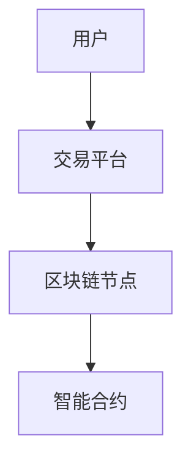
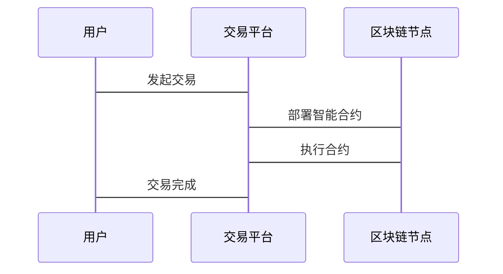

                 


# 如何评估企业的区块链能源交易平台

> 关键词：区块链、能源交易、交易平台、评估、系统架构、算法原理

> 摘要：本文将详细探讨如何评估企业区块链能源交易平台的核心要素，包括区块链技术原理、能源交易模式、评估指标、算法实现、系统架构设计以及实际案例分析。通过逐步推理和分析，帮助读者全面了解区块链能源交易平台的评估方法。

---

# 第一部分: 区块链能源交易平台评估背景与核心概念

## 第1章: 区块链能源交易平台的背景与问题背景

### 1.1 区块链能源交易平台的定义与特点

#### 1.1.1 区块链能源交易平台的定义
区块链能源交易平台是一个基于区块链技术的在线平台，用于能源的买卖双方进行点对点交易。它通过智能合约实现自动化的交易流程，确保交易的透明性、安全性和不可篡改性。

#### 1.1.2 区块链能源交易平台的核心特点
- **去中心化**：消除中间商，降低交易成本。
- **透明性**：所有交易记录在区块链上，可追溯。
- **安全性**：区块链的加密技术确保交易数据的安全。
- **自动化**：智能合约自动执行交易和结算。

#### 1.1.3 区块链能源交易与传统能源交易的区别
| 特性 | 区块链能源交易 | 传统能源交易 |
|------|----------------|---------------|
| 中心化程度 | 去中心化 | 中心化 |
| 交易成本 | 低 | 高 |
| 透明性 | 高 | 低 |
| 安全性 | 高 | 中 |

---

### 1.2 区块链能源交易平台的背景介绍

#### 1.2.1 当前能源交易的痛点与挑战
- **效率低下**：传统交易流程复杂，审批时间长。
- **信任缺失**：买卖双方缺乏信任，导致交易成本高。
- **数据安全**：交易数据容易被篡改，难以追溯。

#### 1.2.2 区块链技术如何解决能源交易中的问题
- **解决信任问题**：区块链的去中心化特性确保交易数据不可篡改。
- **提高效率**：智能合约自动执行交易，减少人工干预。
- **降低成本**：去中心化交易模式降低中间成本。

#### 1.2.3 区块链能源交易平台的行业现状与发展趋势
- 当前，区块链技术在能源交易中的应用还处于起步阶段。
- 随着技术的成熟，未来区块链能源交易平台将得到广泛应用。

---

### 1.3 区块链能源交易平台的核心问题

#### 1.3.1 区块链能源交易的业务流程分析
1. 用户注册与身份认证
2. 能源信息发布与匹配
3. 交易撮合与智能合约签订
4. 交易执行与结算
5. 交易后评价与反馈

#### 1.3.2 区块链能源交易平台的关键问题与挑战
- **性能问题**：区块链的交易速度可能无法满足高频交易需求。
- **安全性问题**：如何确保交易数据的安全性。
- **监管合规性**：如何满足相关法律法规的要求。

#### 1.3.3 区块链能源交易平台的边界与外延
- 边界：仅限于能源交易，不涉及其他业务。
- 外延：可扩展至其他能源相关服务，如供应链管理。

---

## 第2章: 区块链能源交易平台的核心概念与联系

### 2.1 区块链技术的核心原理

#### 2.1.1 区块链的基本概念与技术特点
- **区块**：数据存储的基本单位，包含交易信息、时间戳等。
- **链式结构**：区块通过哈希指针连接，形成一条不可篡改的链。
- **共识机制**：确保所有节点达成一致的机制，如PoW、PoS。

#### 2.1.2 区块链的共识机制
- **工作量证明（PoW）**：通过计算找到哈希值最小的区块。
- **权益证明（PoS）**：根据节点持有的币数分配记账权。
- **实用拜占庭容错（PBFT）**：适用于高性能场景。

#### 2.1.3 区块链的智能合约
- **智能合约**：部署在区块链上的自动执行代码。
- **功能**：自动执行交易、支付、结算等操作。

---

### 2.2 能源交易的核心流程与模式

#### 2.2.1 能源交易的基本流程
1. 用户发布需求或供应信息。
2. 系统匹配交易对手。
3. 双方签订智能合约。
4. 交易执行与结算。

#### 2.2.2 区块链能源交易的模式创新
- **点对点交易**：直接连接买家和卖家。
- **智能合约自动结算**：减少人工干预。

#### 2.2.3 区块链能源交易平台的参与者与角色
- **用户**：交易的发起者和参与者。
- **平台**：提供交易服务和技术支持。
- **监管机构**：确保交易符合法律法规。

---

### 2.3 区块链与能源交易的结合

#### 2.3.1 区块链在能源交易中的应用场景
- **去中心化能源交易所**：允许用户直接交易。
- **智能电网**：通过区块链实现能源的智能分配。

#### 2.3.2 区块链如何提升能源交易的效率与安全性
- **效率提升**：自动化交易流程减少时间。
- **安全性提升**：区块链的不可篡改性确保数据安全。

#### 2.3.3 区块链能源交易平台的生态系统构建
- **技术生态**：包括区块链平台、智能合约开发工具。
- **商业生态**：涵盖能源生产、交易、消费等环节。

---

## 第3章: 区块链能源交易平台的评估核心概念

### 3.1 区块链能源交易平台评估的核心指标

#### 3.1.1 交易效率评估指标
- **交易速度**：每秒处理的交易量（TPS）。
- **响应时间**：用户发起交易到完成的时间。

#### 3.1.2 交易安全性评估指标
- **安全性**：防止攻击的能力。
- **数据完整性**：交易数据的完整性。

#### 3.1.3 平台的可扩展性评估指标
- **吞吐量**：平台的最大处理能力。
- **节点扩展性**：支持的节点数量。

---

### 3.2 区块链能源交易平台评估的框架与方法

#### 3.2.1 评估框架的设计原则
- **全面性**：覆盖所有关键指标。
- **可操作性**：评估方法易于实施。
- **可比较性**：不同平台之间可以比较。

#### 3.2.2 评估方法的选择与应用
- **定量评估**：基于数据的评估。
- **定性评估**：基于主观判断的评估。

#### 3.2.3 评估指标的权重分配与计算
- **权重分配**：根据重要性分配权重。
- **综合评分**：计算综合得分。

---

### 3.3 区块链能源交易平台评估的流程与步骤

#### 3.3.1 评估前的准备工作
- **明确评估目标**：确定需要评估的关键指标。
- **收集数据**：获取平台的性能数据。
- **选择评估方法**：确定采用定量还是定性评估。

#### 3.3.2 评估指标的量化与数据收集
- **数据来源**：平台日志、用户反馈。
- **数据清洗**：处理无效数据。
- **数据分析**：统计分析数据。

#### 3.3.3 评估结果的分析与优化建议
- **结果分析**：找出平台的优缺点。
- **优化建议**：针对问题提出改进建议。

---

# 第二部分: 区块链能源交易平台评估的算法原理与系统架构

## 第4章: 区块链能源交易平台评估的算法原理

### 4.1 区块链能源交易平台评估的算法概述

#### 4.1.1 评估算法的基本原理
- **输入**：平台的性能数据。
- **输出**：平台的综合评分。
- **步骤**：数据清洗、特征提取、模型训练、评分计算。

#### 4.1.2 评估算法的核心步骤
1. 数据清洗：去除异常值。
2. 特征提取：提取关键指标。
3. 模型训练：训练评估模型。
4. 评分计算：计算综合评分。

#### 4.1.3 评估算法的优缺点分析
- **优点**：自动化、高效。
- **缺点**：依赖数据质量。

---

### 4.2 区块链能源交易平台评估的算法实现

#### 4.2.1 算法实现的步骤分解
1. 数据清洗：使用Python的pandas库。
2. 特征提取：选择关键指标。
3. 模型训练：使用机器学习算法。
4. 评分计算：基于模型预测。

#### 4.2.2 算法实现的代码示例
```python
import pandas as pd
from sklearn.model_selection import train_test_split
from sklearn.linear_model import LinearRegression

# 数据清洗
data = pd.read_csv('transaction_data.csv')
data_clean = data.dropna()

# 特征提取
X = data_clean[['TPS', 'response_time']]
y = data_clean['score']

# 模型训练
X_train, X_test, y_train, y_test = train_test_split(X, y, test_size=0.2)
model = LinearRegression()
model.fit(X_train, y_train)

# 评分计算
predicted_score = model.predict(X_test)
```

#### 4.2.3 评估算法的数学模型和公式
- **线性回归模型**：$y = \beta_0 + \beta_1x_1 + \beta_2x_2 + \epsilon$
- **评分计算**：基于模型预测值进行评分。

---

## 第5章: 区块链能源交易平台的系统架构设计

### 5.1 系统功能设计

#### 5.1.1 系统功能模块划分
- **用户模块**：用户注册、登录。
- **交易模块**：信息发布、交易撮合。
- **结算模块**：智能合约执行、结算。

#### 5.1.2 系统功能设计的ER图
```mermaid
erDiagram
    user {
        <属性>
        用户ID
        用户名
        密码
    }
    transaction {
        <属性>
        交易ID
        交易时间
        交易金额
    }
    contract {
        <属性>
        合同ID
        合同内容
        签订时间
    }
    user -- transaction : 参与的交易
    user -- contract : 签订的合同
```

---

### 5.2 系统架构设计

#### 5.2.1 系统架构图


#### 5.2.2 系统接口设计
- **API接口**：提供RESTful API。
- **数据接口**：数据存储接口。

---

### 5.3 系统交互设计

#### 5.3.1 系统交互流程


---

## 第6章: 区块链能源交易平台的项目实战

### 6.1 项目环境安装

#### 6.1.1 环境配置
- **操作系统**：Linux/Windows/MacOS。
- **开发工具**：Python、IDE。
- **区块链框架**：以太坊、Hyperledger。

#### 6.1.2 安装依赖
```bash
pip install eth-abi
pip install eth-account
pip install eth-keyfile
```

---

### 6.2 项目核心实现

#### 6.2.1 核心代码实现
```python
from web3 import Web3

# 初始化Web3实例
web3 = Web3(Web3.HTTPProvider('http://localhost:8545'))

# 账户地址和私钥
address = '0x...'
private_key = '0x...'

# 转账
amount = 100
receiver = '0x...'

signed_transaction = web3.eth.account.signTransaction({
    'to': receiver,
    'value': web3.toWei(amount, 'ether'),
    'gas': 200000,
    'gasPrice': web3.toWei(20, 'gwei'),
}, private_key)

tx_hash = web3.eth.sendRawTransaction(signed_transaction.rawTransaction)
```

#### 6.2.2 代码应用解读
- **Web3库**：用于与以太坊区块链交互。
- **智能合约**：定义交易规则和流程。

---

### 6.3 项目案例分析

#### 6.3.1 案例分析
- **案例背景**：某企业需要搭建区块链能源交易平台。
- **实施步骤**：需求分析、系统设计、开发、测试、部署。
- **结果展示**：交易效率提升、成本降低。

---

## 第7章: 区块链能源交易平台的总结与展望

### 7.1 总结

#### 7.1.1 核心内容回顾
- 区块链技术在能源交易中的应用。
- 评估方法与算法实现。

#### 7.1.2 项目小结
- 通过实际案例分析，验证了区块链能源交易平台的可行性。

---

### 7.2 展望

#### 7.2.1 未来发展方向
- **性能优化**：提升交易速度。
- **功能扩展**：增加更多能源服务。

#### 7.2.2 拓展阅读
- 推荐阅读《区块链技术与应用》。

---

# 作者

作者：AI天才研究院/AI Genius Institute & 禅与计算机程序设计艺术 /Zen And The Art of Computer Programming

