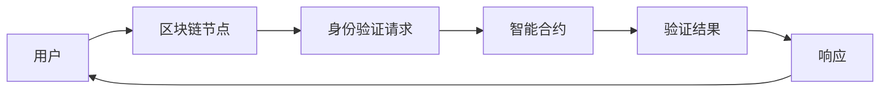

                 


# 如何评估企业的区块链身份验证应用

> 关键词：区块链身份验证，安全性评估，智能合约，椭圆曲线加密，身份认证系统，分布式系统

> 摘要：本文详细探讨了如何评估企业区块链身份验证应用的关键因素，包括技术评估、安全性评估、用户体验评估、算法原理、系统架构设计以及项目实战等内容。通过分析区块链身份验证的核心概念和实际应用，为读者提供全面的评估方法和实践指南。

---

## 第一部分: 区块链身份验证应用概述

### 第1章: 区块链与身份验证概述

#### 1.1 区块链技术基础
- 1.1.1 区块链的基本概念
  - 区块链的定义与特点
  - 区块链的核心特性：去中心化、不可篡改、透明性
- 1.1.2 区块链的核心特性
  - 去中心化：如何实现无信任环境下的信任建立
  - 不可篡改性：区块链数据的安全性和完整性
  - 可追溯性：数据追踪和审计的便利性
- 1.1.3 区块链在身份验证中的应用潜力
  - 提供安全、高效的身份验证解决方案
  - 解决传统身份验证中的痛点：数据泄露、中心化机构的依赖

#### 1.2 身份验证的基本概念
- 1.2.1 身份验证的定义与目的
  - 身份验证：确认用户身份的过程
  - 目的：确保系统安全，防止未授权访问
- 1.2.2 常见的身份验证方式
  - 基于密码的身份验证
  - 基于令牌的身份验证
  - 多因素身份验证（MFA）
- 1.2.3 身份验证的安全挑战
  - 密码泄露问题
  - 单点登录系统的安全性风险
  - 中心化机构的单点故障问题

#### 1.3 区块链与身份验证的结合
- 1.3.1 区块链在身份验证中的优势
  - 去中心化：避免单点故障和数据泄露风险
  - 不可篡改性：确保身份信息的安全和完整性
  - 可扩展性：支持大规模用户和复杂的身份验证需求
- 1.3.2 区块链身份验证的基本原理
  - 用户身份信息存储在区块链上
  - 使用智能合约进行身份验证和授权
  - 结合加密技术确保数据安全
- 1.3.3 区块链身份验证的应用场景
  - 企业内部员工身份验证
  - 第三方服务的身份验证
  - 区块链供应链中的身份验证

---

### 第2章: 区块链身份验证的核心概念与联系

#### 2.1 区块链身份验证的核心概念
- 2.1.1 区块链身份验证的定义
  - 区块链身份验证：基于区块链技术的去中心化身份验证方法
  - 特点：用户控制身份信息，无需依赖中心化机构
- 2.1.2 区块链身份验证的关键属性
  - 去中心化：用户自主控制身份信息
  - 安全性：通过加密技术和区块链特性保护数据
  - 可扩展性：支持大规模用户和复杂场景
- 2.1.3 区块链身份验证的实现要素
  - 加密算法：确保数据安全
  - 智能合约：自动化身份验证和授权逻辑
  - 区块链网络：存储和管理身份信息的基础设施

#### 2.2 区块链身份验证的核心原理
- 2.2.1 加密算法在身份验证中的应用
  - 椭圆曲线加密（Elliptic Curve Cryptography）
  - 哈希函数（如SHA-256）用于数据完整性验证
  - 数字签名：确保信息的真实性和完整性
- 2.2.2 区块链的去中心化特性
  - 分布式账本：存储身份信息和交易记录
  - 节点共识机制：确保数据一致性
  - 区块链不可篡改性：防止数据被篡改
- 2.2.3 智能合约在身份验证中的作用
  - 自动化执行身份验证逻辑
  - 通过智能合约实现权限管理
  - 支持复杂的身份验证流程和规则

#### 2.3 区块链身份验证的实体关系图


---

## 第二部分: 区块链身份验证的评估方法

### 第3章: 区块链身份验证的评估方法

#### 3.1 技术评估
- 3.1.1 区块链网络的安全性评估
  - 网络安全性：防止攻击和篡改
  - 节点分布：确保节点的多样性和抗攻击性
- 3.1.2 智能合约的漏洞分析
  - 合约代码审计：查找潜在漏洞
  - 测试环境中的漏洞测试
  - 使用工具进行静态分析和动态分析
- 3.1.3 区块链的性能评估
  - 交易处理速度：支持大规模用户需求
  - 网络延迟：影响用户体验
  - 网络带宽：数据传输的效率和成本

#### 3.2 安全性评估
- 3.2.1 身份验证的安全性指标
  - 攻击阻力：系统在面对各种攻击时的表现
  - 数据保护：防止数据泄露和未授权访问
  - 身份验证的健壮性：应对各种异常情况的能力
- 3.2.2 攻击向量分析
  - 常见攻击方式：如拒绝服务攻击、钓鱼攻击等
  - 攻击对系统的影响：数据泄露、服务中断等
  - 防御策略：如何防范这些攻击
- 3.2.3 安全测试方法
  - 黑盒测试：模拟攻击者进行测试
  - 白盒测试：分析代码和系统结构
  - 符号执行：探索所有可能的执行路径

#### 3.3 用户体验评估
- 3.3.1 用户交互流程优化
  - 简化身份验证步骤：提升用户体验
  - 提供多因素身份验证：增强安全性的同时提升便利性
  - 用户反馈机制：及时解决用户问题
- 3.3.2 身份验证的便捷性评估
  - 登录速度：用户等待时间
  - 识别错误率：用户输入错误的频率
  - 设备兼容性：支持多种设备和浏览器
- 3.3.3 用户隐私保护评估
  - 数据最小化：仅收集必要的信息
  - 用户控制：用户可管理自己的数据
  - 数据加密：保护用户隐私

---

### 第4章: 区块链身份验证的算法原理

#### 4.1 加密算法原理
- 4.1.1 椭圆曲线加密原理
  - 椭圆曲线加密的基本概念
  - 公钥和私钥的生成过程
  - 数字签名的生成与验证
- 4.1.2 SHA-256哈希函数
  - 哈希函数的定义和作用
  - SHA-256的实现过程
  - 哈希值在身份验证中的应用
- 4.1.3 数字签名机制
  - 数字签名的生成过程
  - 数字签名的验证过程
  - 数字签名在区块链中的应用

#### 4.2 智能合约算法
- 4.2.1 智能合约执行流程
  - 合约部署：将智能合约部署到区块链上
  - 合约调用：用户发起调用请求
  - 合约执行：智能合约自动执行逻辑
- 4.2.2 智能合约的编译与部署
  - 合约代码编写：使用Solidity等编程语言
  - 合约编译：将Solidity代码编译为字节码
  - 合约部署：将字节码部署到区块链网络
- 4.2.3 智能合约的调用与验证
  - 合约调用流程：发起调用、支付gas费用、等待确认
  - 合约执行结果：返回响应结果
  - 合约验证：确保合约执行符合预期

#### 4.3 区块链共识机制
- 4.3.1 工作量证明机制（PoW）
  - 工作量证明的基本概念
  - PoW在比特币中的应用
  - 优缺点：安全性高但效率低
- 4.3.2 权益证明机制（PoS）
  - 权益证明的基本概念
  - PoS在以太坊中的应用
  - 优缺点：效率高但存在潜在的安全风险
- 4.3.3 拜占庭容错机制（BFT）
  - 拜占庭容错的基本概念
  - BFT在分布式系统中的应用
  - 优缺点：适用于小规模网络

---

### 第5章: 区块链身份验证的系统架构设计

#### 5.1 系统功能设计
- 5.1.1 用户身份注册与登录
  - 用户注册流程：提交身份信息，生成公私钥对
  - 用户登录流程：使用私钥进行签名，发送到区块链节点进行验证
- 5.1.2 身份信息管理
  - 用户信息存储：在区块链上存储用户基本信息和公钥
  - 权限管理：通过智能合约实现细粒度权限控制
  - 信息更新：用户可更新密码、密钥等信息
- 5.1.3 身份验证请求处理
  - 验证请求发起：用户发送验证请求到区块链节点
  - 智能合约调用：区块链节点调用智能合约进行验证
  - 验证结果返回：返回验证结果给用户或服务提供者

#### 5.2 系统架构设计
- 5.2.1 项目背景介绍
  - 项目目标：构建一个安全、高效的区块链身份验证系统
  - 项目范围：支持企业内部员工和第三方服务的身份验证
  - 项目约束：确保系统的可扩展性和可维护性
- 5.2.2 系统功能设计
  - 用户管理模块：注册、登录、信息管理
  - 身份验证模块：发起验证请求、智能合约调用、结果返回
  - 权限管理模块：细粒度权限控制、日志记录
- 5.2.3 系统架构设计
  ```mermaid
  graph LR
  A[用户] --> B[区块链节点]
  B --> C[智能合约]
  C --> D[身份验证请求]
  D --> E[验证结果]
  E --> F[返回结果]
  ```
  - 区块链节点：负责处理用户的验证请求，调用智能合约
  - 智能合约：部署在区块链上，负责处理身份验证逻辑
  - 用户端：发起验证请求，接收验证结果

#### 5.3 系统接口设计
- 5.3.1 接口定义
  - 注册接口：用户提交身份信息，生成公私钥对
  - 登录接口：用户提交私钥进行签名，区块链节点验证
  - 验证请求接口：用户发起验证请求，区块链节点处理
- 5.3.2 接口实现
  - 使用RESTful API设计接口
  - 接口文档：详细描述接口功能、输入输出参数、错误处理
  - 接口测试：使用Postman等工具进行测试

#### 5.4 系统交互设计
- 5.4.1 系统交互流程
  ```mermaid
  graph LR
  A[用户] --> B[发起验证请求]
  B --> C[区块链节点]
  C --> D[调用智能合约]
  D --> E[智能合约执行]
  E --> F[返回验证结果]
  F --> A
  ```
- 5.4.2 交互设计细节
  - 用户发起验证请求：通过API或用户界面发起请求
  - 区块链节点处理请求：验证用户身份信息，调用智能合约
  - 智能合约执行：自动执行验证逻辑，返回结果
  - 返回验证结果：用户或服务提供者接收结果

---

## 第三部分: 区块链身份验证的项目实战

### 第6章: 项目实战

#### 6.1 环境安装
- 6.1.1 安装区块链平台
  - 安装以太坊节点：Geth或Parity
  - 配置区块链网络：私有链或测试网
- 6.1.2 安装智能合约开发工具
  - 安装Solidity编译器：通过Node.js安装
  - 安装以太坊钱包：如MetaMask或Geth
- 6.1.3 安装其他开发工具
  - 安装Truffle框架：用于智能合约开发和部署
  - 安装Web3.js库：用于前端与区块链的交互

#### 6.2 系统核心实现源代码
- 6.2.1 智能合约代码实现
  ```solidity
  // SPDX-License-Identifier: MIT
  pragma solidity ^0.8.0;
  
  contract IdentityVerification {
      struct User {
          address payable id;
          bytes32 publicKey;
          mapping(bytes32 => bool) permissions;
      }
      
      function register(bytes32 publicKey) public {
          User storage user = users[msg.sender];
          user.publicKey = publicKey;
          user.permissions[bytes32(uint256(0))] = true;
      }
      
      function verify(bytes32 publicKey) public view returns (bool) {
          User storage user = users[msg.sender];
          return user.publicKey == publicKey;
      }
  }
  ```
- 6.2.2 区块链节点配置
  ```bash
  # 初始化区块链节点
  mkdir -p /data/chain
  cd /data/chain
  geth --datadir /data/chain --networkid 1234 --ipc DISABLED --ws ENABLED --wsaddr 0.0.0.0 --wsport 8546 --wsapi eth,net,web3,debug
  ```
- 6.2.3 前端代码实现
  ```javascript
  const Web3 = require('web3');
  const web3 = new Web3(new Web3.providers.WebsocketProvider('ws://localhost:8546'));
  
  async function register(publicKey) {
      const contract = new web3.eth.Contract(ABI, contractAddress);
      const tx = contract.methods.register(publicKey).send();
      return tx;
  }
  
  async function verify(publicKey) {
      const contract = new web3.eth.Contract(ABI, contractAddress);
      const result = await contract.methods.verify(publicKey).call();
      return result;
  }
  ```

#### 6.3 代码应用解读与分析
- 6.3.1 智能合约代码解读
  - 结构体User：存储用户地址、公钥和权限
  - 注册函数：用户提交公钥进行注册
  - 验证函数：根据公钥验证用户身份
- 6.3.2 前端代码解读
  - Web3.js库：用于与区块链节点交互
  - 注册函数：发送交易到智能合约
  - 验证函数：调用智能合约进行验证并返回结果

#### 6.4 实际案例分析
- 6.4.1 案例背景
  - 一家企业需要实现员工身份验证系统
  - 使用区块链技术确保员工信息的安全性和完整性
- 6.4.2 系统实现
  - 用户注册：员工提交身份信息和公钥
  - 身份验证：员工登录时使用私钥进行签名
  - 权限管理：根据智能合约设置不同的访问权限
- 6.4.3 系统测试
  - 功能测试：验证注册、登录、权限管理等功能
  - 安全性测试：测试系统在面对攻击时的表现
  - 性能测试：测试系统在高并发情况下的表现

#### 6.5 项目小结
- 6.5.1 项目总结
  - 成功实现了基于区块链的身份验证系统
  - 系统具有去中心化、安全性高、可扩展性强的特点
  - 提供了良好的用户体验和高效的安全性保障
- 6.5.2 经验与教训
  - 智能合约开发需要特别谨慎，避免漏洞
  - 区块链网络的选择和配置对系统性能有重要影响
  - 用户教育和培训是成功实施的重要部分

---

## 第四部分: 最佳实践、小结、注意事项和拓展阅读

### 第7章: 最佳实践

#### 7.1 最佳实践总结
- 选择合适的区块链平台：根据项目需求选择公有链或私有链
- 确保智能合约的安全性：进行充分的测试和审计
- 提供良好的用户体验：简化身份验证流程，支持多因素身份验证
- 定期更新和维护系统：应对新的安全威胁和技术发展

#### 7.2 小结
- 区块链身份验证应用的核心在于区块链技术和智能合约的结合
- 通过合理的系统设计和安全性评估，可以构建一个高效、安全的身份验证系统
- 本文详细探讨了评估企业区块链身份验证应用的关键因素，为读者提供了全面的评估方法和实践指南

#### 7.3 注意事项
- 确保系统的合规性：符合相关法律法规和行业标准
- 避免过度复杂化系统：保持系统的简洁性和可维护性
- 加强用户教育：提高用户的安全意识和使用技能
- 定期进行安全审计：及时发现和修复潜在的安全漏洞

#### 7.4 拓展阅读
- 推荐书籍：
  - 《区块链：分布式应用设计与实现》
  - 《智能合约开发指南》
- 推荐博客和资源：
  - Ethereum官方文档
  - Solidity语言教程
  - 区块链身份验证的最新研究和实践

---

## 作者：AI天才研究院/AI Genius Institute & 禅与计算机程序设计艺术 /Zen And The Art of Computer Programming

