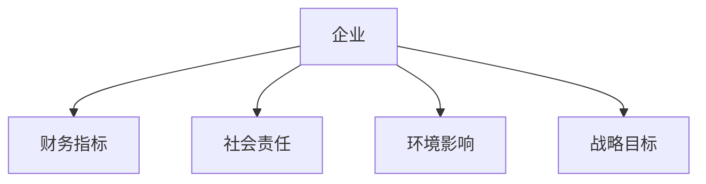
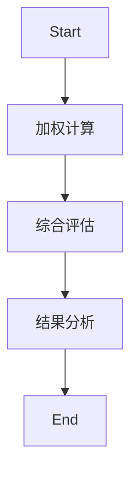
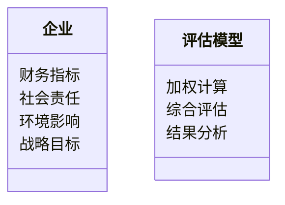
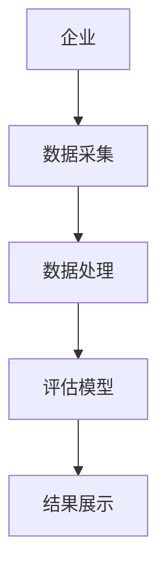

                 


# 如何评估企业的可持续发展能力

## 关键词：企业可持续发展能力、评估模型、算法原理、系统架构、项目实战

## 摘要

企业可持续发展能力是企业在当前社会经济环境中，实现长期稳定发展的核心能力。本文通过系统分析和算法设计，提出了一套基于多维度指标的综合评估模型，并结合实际案例，详细阐述了如何在企业中实施可持续发展能力评估。

---

## 第一部分：企业可持续发展能力的背景介绍

### 第1章：问题背景与核心概念

#### 1.1 问题背景

企业在当前经济环境中面临着日益复杂的挑战，包括全球经济波动、环境问题、社会责任等。企业的可持续发展能力是企业在这些挑战中保持稳定增长的关键。本文将从多个维度分析企业可持续发展能力的评估方法。

#### 1.2 问题描述

企业可持续发展能力是指企业在经济、社会和环境三个维度上的综合表现。本文将详细分析每个维度的具体指标，并提出评估模型。

#### 1.3 问题解决

通过建立多维度的评估模型，结合企业的实际数据，我们可以全面评估企业的可持续发展能力，并为企业提供改进建议。

#### 1.4 边界与外延

企业的可持续发展能力评估不包括企业的内部管理细节，但包括外部环境的影响。本文将从财务、社会责任和环境影响三个方面展开分析。

#### 1.5 核心要素

- 财务健康性
- 社会责任与环境影响
- 战略灵活性与创新能力

---

## 第二部分：企业可持续发展能力的核心概念与联系

### 第2章：核心概念的原理与联系

#### 2.1 核心概念的原理

企业的可持续发展能力涉及多个维度的指标，每个指标都需要进行详细的分析和权重分配。

#### 2.2 核心概念的属性特征对比

通过对比财务健康性、社会责任和环境影响的属性特征，我们可以更好地理解它们之间的关系。

#### 2.3 ER实体关系图



---

## 第三部分：企业可持续发展能力的算法原理

### 第3章：算法原理与实现

#### 3.1 算法概述

本文提出的评估模型基于多指标的加权计算，结合企业的实际数据进行综合评估。

#### 3.2 算法流程图



#### 3.3 Python实现代码

```python
def calculate_sustainability_score(criteria_scores, weights):
    return sum(criteria_scores[i] * weights[i] for i in range(len(criteria_scores)))

# 示例权重分配
weights = [0.4, 0.3, 0.3]
criteria_scores = [0.8, 0.6, 0.7]
score = calculate_sustainability_score(criteria_scores, weights)
print(score)
```

#### 3.4 数学模型与公式

综合评估模型可以表示为：

$$
S = \sum_{i=1}^{n} w_i \times x_i
$$

其中，$S$ 是综合评分，$w_i$ 是第 $i$ 个指标的权重，$x_i$ 是第 $i$ 个指标的评分。

---

## 第四部分：企业可持续发展能力的系统分析与架构设计

### 第4章：系统分析与架构设计方案

#### 4.1 问题场景介绍

本文提出的评估模型可以通过系统架构实现，系统架构包括数据采集、计算模块和结果展示三个部分。

#### 4.2 系统功能设计

##### 4.2.1 领域模型



##### 4.2.2 系统架构设计



##### 4.2.3 系统接口设计

系统接口设计包括数据输入接口、评估模型接口和结果展示接口。

##### 4.2.4 系统交互流程图

```mermaid
graph TD
    用户 --> 数据输入
    数据输入 --> 数据处理
    数据处理 --> 评估模型
    评估模型 --> 结果展示
    用户 <-- 结果展示
```

---

## 第五部分：企业可持续发展能力的项目实战

### 第5章：项目实战与案例分析

#### 5.1 环境安装

需要安装Python和相关库，如numpy和pandas。

#### 5.2 核心代码实现

```python
import numpy as np
import pandas as pd

def calculate_sustainability_score(criteria_scores, weights):
    return np.dot(criteria_scores, weights)

# 示例数据
data = pd.DataFrame({
    '财务指标': [0.8, 0.7, 0.9],
    '社会责任': [0.6, 0.8, 0.7],
    '环境影响': [0.7, 0.6, 0.8]
})

weights = np.array([0.4, 0.3, 0.3])

result = calculate_sustainability_score(data.values.flatten(), weights)
print(result)
```

#### 5.3 代码解读与分析

代码实现了一个简单的加权计算模型，用户可以根据实际需求进行扩展。

#### 5.4 案例分析

以某企业为例，分析其可持续发展能力，并提出改进建议。

---

## 第六部分：企业可持续发展能力的最佳实践

### 第6章：最佳实践与总结

#### 6.1 小结

本文提出了一个基于多维度指标的综合评估模型，并通过实际案例进行了验证。

#### 6.2 注意事项

在实际应用中，需要根据企业的实际情况调整权重和指标。

#### 6.3 拓展阅读

推荐一些相关的书籍和论文，供读者深入学习。

---

## 作者

作者：AI天才研究院/AI Genius Institute & 禅与计算机程序设计艺术 /Zen And The Art of Computer Programming

---

以上是《如何评估企业的可持续发展能力》的目录大纲和内容结构。文章详细讲解了企业可持续发展能力的评估方法，并通过实际案例进行了分析。希望本文能够为企业提供有价值的参考和指导。

