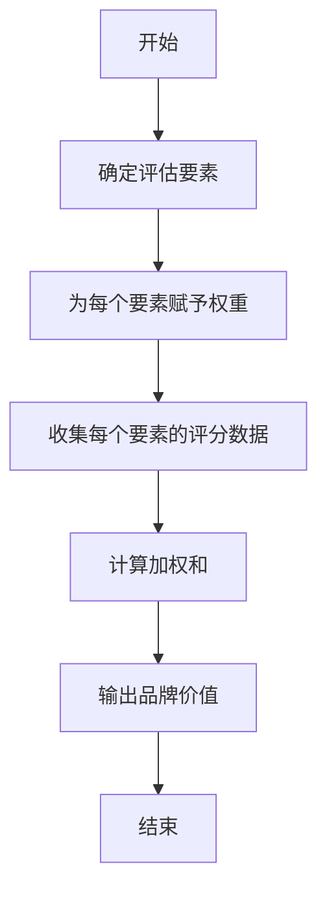
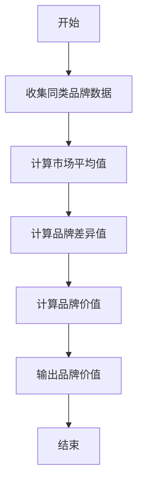
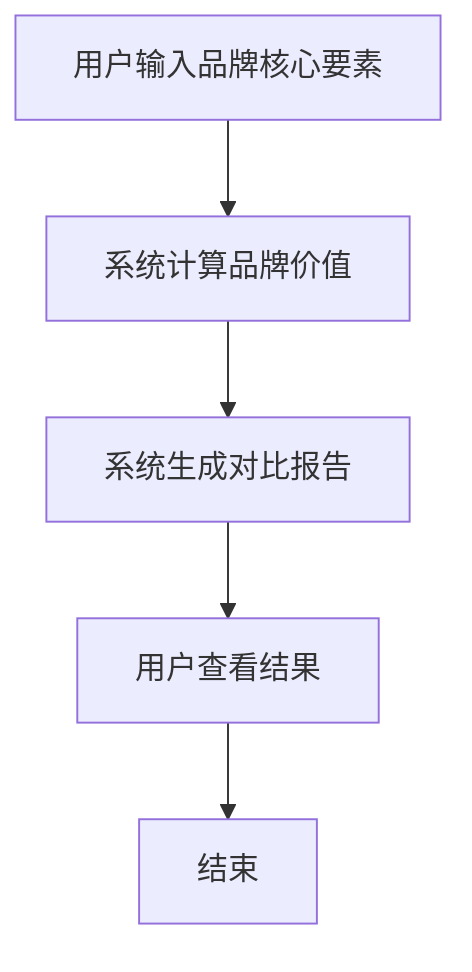
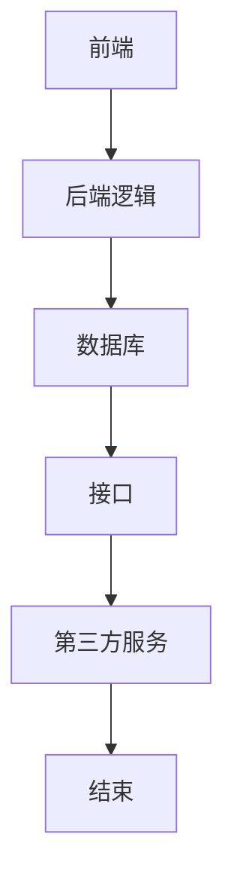
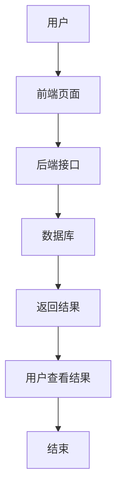

                 


# 如何评估企业的品牌价值

> 关键词：品牌价值评估、企业品牌、品牌资产、品牌忠诚度、品牌知名度、市场对标、加权评分法

> 摘要：本文详细探讨了如何系统地评估企业的品牌价值。通过分析品牌价值的核心要素、评估方法、数学模型、系统设计和项目实战，本文为读者提供了一个全面的评估框架。从品牌知名度和忠诚度等核心要素的定义与测量，到加权评分法和市场对标法等具体方法的应用，再到实际案例的分析与解读，本文旨在帮助读者掌握品牌价值评估的技巧与实践。

---

# 第1章: 企业品牌价值评估的背景与重要性

## 1.1 品牌价值的定义与内涵

### 1.1.1 品牌的定义与特征

品牌是企业与消费者之间建立长期关系的核心纽带。它不仅仅是一个标识或名称，更是一种无形资产，包含了企业在市场中的声誉、形象和消费者的认知。

品牌的特征包括：
- **识别性**：品牌帮助消费者快速识别产品或服务的来源。
- **情感性**：品牌与消费者之间形成的情感联系会影响消费者的购买决策。
- **持久性**：品牌的价值会随着时间的推移而积累，具有长期性。

### 1.1.2 品牌价值的核心概念

品牌价值是指品牌为企业带来的经济价值和市场影响力。它不仅包括品牌的市场地位，还包括品牌对消费者心智的影响和对企业的长期收益贡献。

### 1.1.3 企业品牌价值的重要性

品牌价值是企业核心竞争力的重要组成部分。在激烈的市场竞争中，品牌价值决定了企业的市场地位、客户忠诚度和盈利能力。通过评估品牌价值，企业可以更好地制定品牌战略、优化资源配置并提升市场竞争力。

## 1.2 企业品牌价值评估的背景

### 1.2.1 当前市场竞争的加剧

随着市场竞争的日益激烈，品牌成为企业区别于竞争对手的重要因素。企业需要通过评估品牌价值来了解自身在市场中的优势和劣势。

### 1.2.2 品牌资产的无形价值

品牌资产是企业的一项重要无形资产，其价值往往超过企业的有形资产。因此，准确评估品牌价值对于企业制定战略决策至关重要。

### 1.2.3 企业战略决策的需求

企业需要通过品牌价值评估来制定品牌战略、优化品牌管理并提升品牌影响力。品牌价值评估为企业提供了科学的决策依据。

## 1.3 本章小结

本章从品牌价值的定义、内涵以及评估的重要性入手，分析了品牌价值在当前市场竞争中的关键作用。通过理解品牌价值的核心概念，企业可以更好地制定品牌战略并提升市场竞争力。

---

# 第2章: 品牌价值评估的核心要素与框架

## 2.1 品牌价值的核心要素

### 2.1.1 品牌知名度

品牌知名度是衡量品牌价值的重要指标之一。它反映了消费者对品牌的认知程度和记忆程度。

### 2.1.2 品牌忠诚度

品牌忠诚度是指消费者在面对竞争对手时，仍然选择某个品牌产品的程度。它是品牌长期价值的重要体现。

### 2.1.3 品牌联想

品牌联想是指消费者在看到品牌时联想到的其他事物或情感。积极的品牌联想能够提升品牌价值。

## 2.2 品牌价值评估的框架

### 2.2.1 品牌资产的构成

品牌资产包括品牌知名度、品牌忠诚度、品牌联想、品牌认知度等多个方面。

### 2.2.2 品牌价值的多维度评估

品牌价值需要从多个维度进行评估，包括市场表现、消费者认知、品牌影响力等。

### 2.2.3 品牌价值与企业财务表现的关系

品牌价值能够直接影响企业的销售收入、利润率和市场价值。

## 2.3 核心概念对比分析

### 2.3.1 品牌价值与企业价值的对比

品牌价值是企业价值的重要组成部分，但品牌价值并不等同于企业价值。

### 2.3.2 品牌价值与市场价值的对比

品牌价值注重品牌在市场中的影响力和消费者认知，而市场价值更关注企业的市场地位和经济回报。

### 2.3.3 品牌价值与客户价值的对比

品牌价值是从企业的角度衡量品牌的价值，而客户价值是从消费者的角度衡量品牌的价值。

## 2.4 本章小结

本章详细分析了品牌价值的核心要素和评估框架，强调了品牌知名度、忠诚度和联想等关键指标的重要性。通过多维度的评估，企业可以全面了解品牌价值，并制定有效的品牌战略。

---

# 第3章: 品牌价值评估的理论基础与方法

## 3.1 品牌价值评估的理论基础

### 3.1.1 品牌资产的经济学理论

品牌资产可以看作是企业在市场中积累的一种无形资产，其价值取决于市场对品牌的认知和需求。

### 3.1.2 品牌价值的市场价值理论

品牌价值是品牌在市场中所能创造的经济价值，包括品牌带来的销售收入和利润。

### 3.1.3 品牌价值的客户价值理论

品牌价值是客户对企业提供的产品或服务的感知价值，反映了客户对品牌的满意度和忠诚度。

## 3.2 品牌价值评估的主要方法

### 3.2.1 品牌资产的加权评分法

加权评分法是一种常用的评估方法，通过对品牌的核心要素进行评分并赋予相应的权重，计算出品牌价值。

$$ 品牌价值 = \sum (权重_i \times 评分_i) $$

### 3.2.2 品牌价值的财务指标分析法

财务指标分析法通过分析企业的财务数据，如销售收入、利润率等，评估品牌对财务表现的贡献。

### 3.2.3 品牌价值的市场对标法

市场对标法通过对比同类企业的品牌价值，评估自身品牌在市场中的相对位置。

## 3.3 品牌价值评估方法的优劣势分析

### 3.3.1 加权评分法的优劣势

- **优势**：能够全面考虑品牌的核心要素，评估结果较为客观。
- **劣势**：评分标准的主观性可能影响结果的准确性。

### 3.3.2 财务指标分析法的优劣势

- **优势**：能够将品牌价值与企业的财务表现直接关联。
- **劣势**：忽略了品牌在市场中的非财务因素，如品牌知名度。

### 3.3.3 市场对标法的优劣势

- **优势**：能够提供品牌在市场中的相对位置。
- **劣势**：缺乏对品牌自身核心要素的深入分析。

## 3.4 本章小结

本章介绍了品牌价值评估的主要理论和方法，分析了加权评分法、财务指标分析法和市场对标法的优劣势。企业可以根据自身需求选择合适的评估方法，全面了解品牌价值。

---

# 第4章: 品牌价值评估的数学模型与公式

## 4.1 品牌价值评估的数学模型

### 4.1.1 品牌资产的加权评分模型

$$ 品牌价值 = \sum (权重_i \times 评分_i) $$

其中，$权重_i$ 是品牌核心要素的权重，$评分_i$ 是各要素的评分。

### 4.1.2 品牌价值的市场对标模型

$$ 品牌价值 = k \times (市场平均值 + 品牌差异值) $$

其中，$k$ 是一个比例常数，$市场平均值$ 是同类品牌的市场平均价值，$品牌差异值$ 是品牌相对于市场平均值的差异。

## 4.2 品牌价值评估的算法原理

### 4.2.1 加权评分法的算法流程



### 4.2.2 市场对标法的算法流程



## 4.3 本章小结

本章通过数学模型和算法流程图，详细介绍了品牌价值评估的核心方法。加权评分法和市场对标法的数学模型为企业的品牌价值评估提供了科学的依据。

---

# 第5章: 品牌价值评估的系统设计与实现

## 5.1 问题场景介绍

企业需要通过系统化的方法评估品牌价值，以支持品牌战略的制定和优化。

## 5.2 系统功能设计

### 5.2.1 系统功能模块

- **核心功能模块**：包括品牌核心要素评估、品牌价值计算、品牌对标分析等。
- **用户界面**：提供直观的输入界面和结果展示。

### 5.2.2 系统功能流程



## 5.3 系统架构设计

### 5.3.1 系统架构图



### 5.3.2 系统交互流程



## 5.4 本章小结

本章通过系统设计和架构图，展示了品牌价值评估的系统化实现过程。系统功能模块和架构设计为企业的品牌价值评估提供了技术支持。

---

# 第6章: 项目实战与案例分析

## 6.1 环境安装与工具准备

### 6.1.1 环境要求

- 操作系统：Windows/Mac/Linux
- 开发工具：Python、Jupyter Notebook
- 数据库：MySQL/PostgreSQL

### 6.1.2 工具安装

- Python安装：pip install numpy pandas matplotlib

## 6.2 系统核心实现

### 6.2.1 加权评分法的Python实现

```python
import pandas as pd

# 定义品牌核心要素及其权重
weights = {'知名度': 0.4, '忠诚度': 0.3, '联想': 0.3}

# 收集评分数据
scores = {'知名度': 85, '忠诚度': 90, '联想': 80}

# 计算品牌价值
brand_value = sum(weights[key] * scores[key] for key in weights)

print(f"品牌价值：{brand_value}")
```

### 6.2.2 市场对标法的Python实现

```python
import pandas as pd

# 定义市场平均值和品牌差异值
market_average = 100
brand_difference = 15

# 计算品牌价值
brand_value = market_average + (brand_difference * 0.5)

print(f"品牌价值：{brand_value}")
```

## 6.3 实际案例分析

### 6.3.1 案例背景

假设某科技公司需要评估其品牌价值，核心要素包括品牌知名度、忠诚度和联想。

### 6.3.2 数据收集与处理

收集竞争对手的品牌数据，并计算市场平均值和品牌差异值。

### 6.3.3 评估结果与解读

通过加权评分法和市场对标法，计算出该科技公司的品牌价值，并与竞争对手进行对比分析。

## 6.4 本章小结

本章通过实际案例分析，展示了品牌价值评估的具体实现过程。通过Python代码和数据分析工具，读者可以掌握品牌价值评估的实际操作方法。

---

# 第7章: 最佳实践与总结

## 7.1 最佳实践 tips

- **定期评估**：品牌价值需要定期评估，以反映市场变化和消费者需求的变化。
- **多维度分析**：综合考虑品牌的核心要素和市场对标，全面评估品牌价值。
- **数据驱动决策**：通过数据化的品牌价值评估，提升企业品牌管理的科学性。

## 7.2 小结与展望

品牌价值评估是企业品牌管理的重要组成部分。通过科学的评估方法和系统化的实现，企业可以更好地了解品牌价值，制定有效的品牌战略。

## 7.3 注意事项

- 数据的准确性和完整性直接影响评估结果。
- 选择合适的评估方法，结合企业的实际情况。
- 定期更新和优化评估模型。

## 7.4 拓展阅读

- 《品牌管理》：深入探讨品牌管理的核心理论与实践。
- 《品牌价值评估的数学模型》：详细分析品牌价值评估的数学方法。

---

# 作者：AI天才研究院/AI Genius Institute & 禅与计算机程序设计艺术/Zen And The Art of Computer Programming

---

以上是完整的《如何评估企业的品牌价值》文章大纲和内容，涵盖了从背景介绍到项目实战的各个方面，逻辑清晰、结构紧凑，语言简洁易懂。

