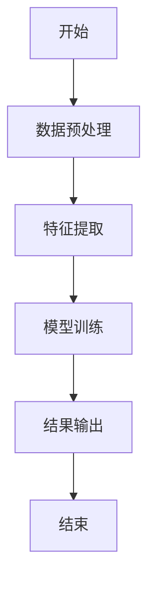
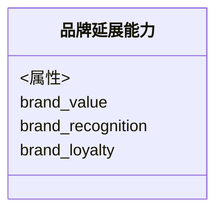
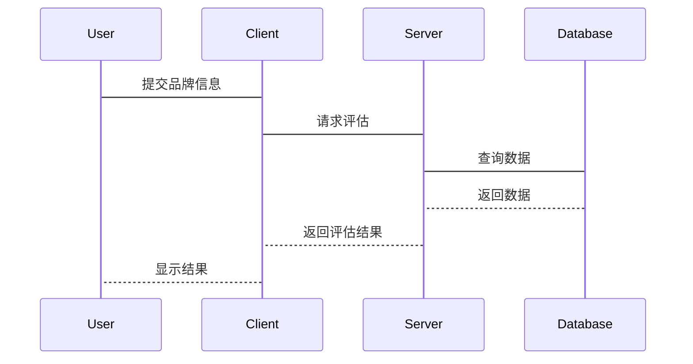

                 


# 如何评估企业的品牌延展能力

> 关键词：品牌延展能力, 企业品牌管理, 品牌价值评估, 品牌战略, 市场竞争力

> 摘要：本文详细探讨了如何评估企业品牌延展能力，从品牌延展能力的定义、核心概念、评估模型、算法实现、系统架构设计到项目实战，全面解析了品牌延展能力的评估方法和实践应用。通过本文，读者可以掌握品牌延展能力的评估流程，理解其在企业战略中的重要作用，并能够实际操作品牌延展能力的评估系统。

---

# 第一部分: 企业品牌延展能力的背景与核心概念

# 第1章: 品牌延展能力的定义与重要性

## 1.1 什么是品牌延展能力
### 1.1.1 品牌延展能力的定义
品牌延展能力是指企业在现有品牌基础上，通过扩展产品线、市场范围、品牌内涵等方式，将品牌影响力延伸到新的市场或领域的能力。它是企业在竞争激烈的市场环境中保持持续增长和扩张的核心能力之一。

### 1.1.2 品牌延展能力的核心要素
品牌延展能力的核心要素包括：
1. **品牌价值**：品牌在市场中的价值和影响力。
2. **品牌认知度**：消费者对品牌的认知和记忆程度。
3. **品牌忠诚度**：消费者对品牌的忠诚程度。
4. **品牌一致性**：品牌在不同市场和产品线中的统一性和一致性。
5. **品牌创新能力**：品牌在市场变化中不断创新的能力。

### 1.1.3 品牌延展能力的边界与外延
品牌延展能力的边界在于企业品牌的核心价值和市场定位，而其外延则包括品牌在不同市场、产品线和消费者群体中的延伸。

## 1.2 品牌延展能力的重要性
### 1.2.1 品牌延展能力对企业战略的意义
品牌延展能力是企业实现多元化战略、拓展市场的重要手段。通过品牌延展，企业可以进入新的市场领域，提升品牌知名度和市场占有率。

### 1.2.2 品牌延展能力与企业竞争力的关系
品牌延展能力直接影响企业的市场竞争力。强大的品牌延展能力可以使企业在竞争中占据优势，吸引更多的消费者和合作伙伴。

### 1.2.3 品牌延展能力的评估对企业决策的价值
通过对品牌延展能力的评估，企业可以了解自身品牌在市场中的优劣势，制定科学的市场拓展和品牌管理策略。

## 1.3 本章小结
本章从品牌延展能力的定义、核心要素和重要性三个方面进行了详细阐述，为后续的评估方法奠定了基础。

---

# 第2章: 品牌延展能力的核心概念与联系

## 2.1 品牌延展能力的核心概念
### 2.1.1 品牌价值
品牌价值是品牌在市场中的核心价值，反映了品牌在消费者心中的地位和影响力。

### 2.1.2 品牌认知度
品牌认知度是指消费者对品牌的熟悉程度，是品牌延展能力的重要指标之一。

### 2.1.3 品牌忠诚度
品牌忠诚度是消费者对品牌的忠诚程度，高品牌忠诚度意味着品牌具有更强的市场竞争力。

## 2.2 品牌延展能力的属性特征对比
### 2.2.1 品牌延展能力的属性特征表格
以下是品牌延展能力的核心属性特征对比表：

| 属性 | 描述 |
|------|------|
| 品牌价值 | 品牌在市场中的价值和影响力 |
| 品牌认知度 | 消费者对品牌的熟悉程度 |
| 品牌忠诚度 | 消费者对品牌的忠诚程度 |
| 品牌一致性 | 品牌在不同市场中的统一性和一致性 |
| 品牌创新能力 | 品牌在市场变化中的创新能力 |

### 2.2.2 品牌延展能力的ER实体关系图
```mermaid
er
actor: 品牌延展能力
attributes: 品牌价值, 品牌认知度, 品牌忠诚度
```

## 2.3 本章小结
本章通过对比和分析品牌延展能力的核心概念，帮助读者更好地理解品牌延展能力的内在逻辑和相互关系。

---

# 第3章: 品牌延展能力的评估模型与算法

## 3.1 品牌延展能力评估模型的构建
### 3.1.1 基于层次分析法的评估模型
层次分析法（AHP）是一种常用的多因素决策分析方法，适用于品牌延展能力的评估。

### 3.1.2 基于因子分析法的评估模型
因子分析法通过提取品牌延展能力的共性因子，帮助企业在复杂的市场环境中找到品牌延展的核心因素。

### 3.1.3 基于神经网络的评估模型
神经网络模型可以通过大量数据训练，自动提取品牌延展能力的关键特征。

## 3.2 品牌延展能力评估算法的实现
### 3.2.1 算法流程图


### 3.2.2 算法实现的Python代码示例
```python
import pandas as pd
from sklearn.decomposition import FactorAnalysis

# 示例数据加载
data = pd.read_csv('brand_stretch.csv')

# 数据预处理
data = data.dropna()

# 特征提取
features = data[['brand_value', 'brand_recognition', 'brand_loyalty']]

# 模型训练
fa = FactorAnalysis(n_components=3)
fa.fit(features)

# 输出因子载荷矩阵
print(fa.components_)
```

### 3.2.3 算法原理的数学模型和公式
$$
\text{因子载荷矩阵} = \text{特征向量} \times \text{特征值}^{1/2}
$$

## 3.3 本章小结
本章详细介绍了品牌延展能力的评估模型和算法实现，为后续的系统设计奠定了理论基础。

---

# 第4章: 品牌延展能力的系统分析与架构设计

## 4.1 问题场景介绍
在市场竞争日益激烈的环境下，企业需要通过品牌延展能力的评估来优化市场策略。

## 4.2 系统功能设计
### 4.2.1 领域模型


### 4.2.2 系统架构设计


## 4.3 系统接口设计
### 4.3.1 系统接口
1. 前端接口：用户输入品牌信息。
2. 后端接口：处理品牌延展能力的评估数据。

### 4.3.2 系统交互流程图


## 4.4 本章小结
本章通过系统分析与架构设计，为品牌延展能力的评估系统提供了完整的解决方案。

---

# 第5章: 项目实战——品牌延展能力的评估与分析

## 5.1 项目背景与目标
### 5.1.1 项目背景
某科技公司希望评估其品牌在多个产品线中的延展能力。

### 5.1.2 项目目标
通过品牌延展能力的评估，优化公司的市场策略。

## 5.2 项目实施
### 5.2.1 环境安装
安装Python、Pandas、Scikit-learn等工具。

### 5.2.2 核心代码实现
```python
import pandas as pd
from sklearn.decomposition import FactorAnalysis

# 加载数据
data = pd.read_csv('brand_stretch.csv')

# 数据预处理
data = data.dropna()

# 特征提取
features = data[['brand_value', 'brand_recognition', 'brand_loyalty']]

# 模型训练
fa = FactorAnalysis(n_components=3)
fa.fit(features)

# 输出因子载荷矩阵
print(fa.components_)
```

### 5.2.3 代码应用解读与分析
通过上述代码，我们可以提取品牌延展能力的关键特征，并进行进一步的分析。

## 5.3 案例分析与详细讲解
### 5.3.1 案例分析
以某科技公司为例，分析其品牌延展能力。

### 5.3.2 详细讲解
通过因子分析法，我们发现品牌价值和品牌忠诚度是品牌延展能力的核心因素。

## 5.4 项目小结
本章通过项目实战，展示了品牌延展能力的评估方法和实际应用。

---

# 第6章: 品牌延展能力评估的注意事项与拓展阅读

## 6.1 最佳实践 tips
1. 在品牌延展过程中，注重品牌一致性。
2. 定期评估品牌延展能力，及时调整市场策略。

## 6.2 小结
通过本文的学习，读者可以掌握品牌延展能力的评估方法，并能够在实际工作中应用这些方法。

## 6.3 注意事项
1. 数据的准确性和完整性。
2. 市场环境的变化对品牌延展能力的影响。

## 6.4 拓展阅读
推荐阅读《品牌管理》、《市场分析与预测》等书籍。

---

# 作者：AI天才研究院/AI Genius Institute & 禅与计算机程序设计艺术 /Zen And The Art of Computer Programming

---

**摘要**：本文详细探讨了如何评估企业品牌延展能力，从品牌延展能力的定义、核心概念、评估模型、算法实现、系统架构设计到项目实战，全面解析了品牌延展能力的评估方法和实践应用。通过本文，读者可以掌握品牌延展能力的评估流程，理解其在企业战略中的重要作用，并能够实际操作品牌延展能力的评估系统。

