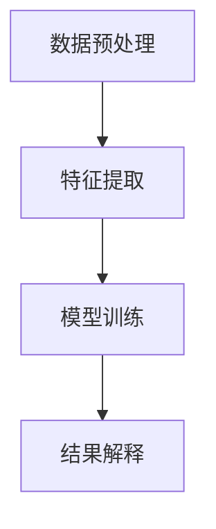
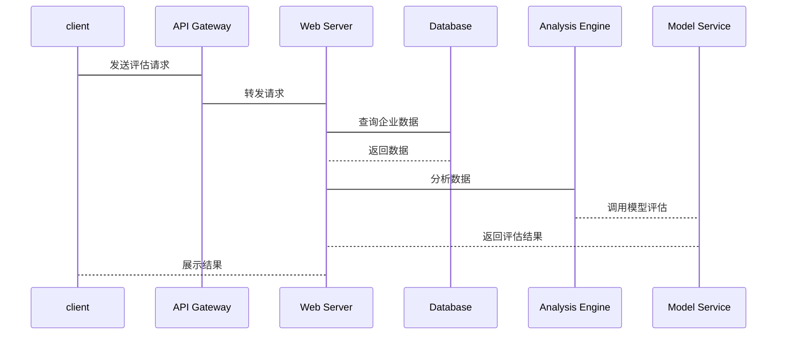

                 


# 如何评估企业的商业模式可持续性

## 关键词：
企业商业模式、可持续性、商业模式可持续性、企业战略、风险管理、价值创造、系统架构

## 摘要：
本文旨在详细探讨如何系统性地评估企业的商业模式可持续性。通过分析商业模式的核心要素、可持续性评估的关键维度，以及结合实际案例和数学模型，本文将为企业提供一套科学的评估方法。文章从理论基础到实际应用，结合算法原理和系统架构设计，全面解析商业模式可持续性的评估过程，为企业制定可持续发展战略提供有力支持。

---

# 第一部分：企业商业模式可持续性评估的背景与概述

## 第1章：企业商业模式可持续性评估的背景与意义

### 1.1 什么是商业模式可持续性
#### 1.1.1 商业模式的基本定义
商业模式是企业实现价值创造和传递的系统性方法，包括企业如何获取资源、创造价值以及与客户互动的方式。可持续性则是指商业模式在长期时间内能够持续创造价值并适应环境变化的能力。

#### 1.1.2 可持续性的概念与内涵
可持续性强调在满足当前需求的同时，不损害未来世代满足其需求的能力。在商业模式中，可持续性不仅关注经济收益，还包括环境和社会的影响。

#### 1.1.3 商业模式可持续性的定义与特征
商业模式的可持续性是指企业能够在经济、环境和社会三个维度上实现平衡发展，具备适应市场变化和资源约束的能力。

### 1.2 企业商业模式可持续性评估的重要性
#### 1.2.1 可持续性评估对企业战略的意义
评估商业模式的可持续性有助于企业识别潜在风险，优化资源配置，增强抗压能力。

#### 1.2.2 企业利益相关者的需求与期望
利益相关者包括股东、客户、员工和社会公众，他们对企业的可持续性有不同需求和期望。

#### 1.2.3 全球化背景下的可持续性挑战
全球化背景下，企业面临更多的环境和社会压力，可持续性评估成为企业竞争力的重要组成部分。

### 1.3 可持续性评估的核心要素
#### 1.3.1 价值创造与传递
企业需要通过创新和优化价值链来实现可持续的价值创造。

#### 1.3.2 资源分配与利用效率
合理配置和高效利用资源是商业模式可持续性的关键。

#### 1.3.3 风险管理与应对策略
识别和应对潜在风险是确保商业模式可持续性的必要条件。

### 1.4 本章小结
商业模式的可持续性是企业在复杂环境中长期发展的核心能力。通过评估商业模式的可持续性，企业可以更好地应对挑战，实现长期价值创造。

---

# 第二部分：商业模式可持续性评估的核心概念与理论基础

## 第2章：商业模式的构成要素与可持续性分析

### 2.1 商业模式的构成要素
#### 2.1.1 价值主张
价值主张是企业向客户提供的核心价值，包括产品或服务的独特优势。

#### 2.1.2 客户关系
客户关系管理是企业与客户互动的方式，影响客户忠诚度和满意度。

#### 2.1.3 资源与能力
企业的资源和能力决定了其在市场中的竞争力和持续创新能力。

#### 2.1.4 关键业务流程
高效的业务流程是实现价值创造和传递的关键。

### 2.2 可持续性评估的关键维度
#### 2.2.1 财务可持续性
财务健康是商业模式可持续性的基础，包括盈利能力、现金流和资产负债情况。

#### 2.2.2 环境可持续性
环境影响是评估商业模式可持续性的重要维度，包括碳排放、资源消耗和环保合规性。

#### 2.2.3 社会可持续性
社会影响包括员工权益、社会责任和社区影响力，是企业可持续性的重要组成部分。

### 2.3 商业模式可持续性评估的理论框架
#### 2.3.1 综合分析框架
综合分析框架将经济、环境和社会三个维度综合考虑，进行全面评估。

#### 2.3.2 系统动力学模型
系统动力学模型通过分析系统的动态关系，预测商业模式的长期发展趋势。

#### 2.3.3 价值链分析方法
价值链分析方法通过优化价值链中的各个环节，提升商业模式的可持续性。

---

# 第三部分：商业模式可持续性评估的算法原理与数学模型

## 第3章：商业模式可持续性评估的算法原理

### 3.1 算法概述
#### 3.1.1 数据预处理与特征提取
数据预处理包括清洗和归一化，特征提取则选择关键指标。

#### 3.1.2 模型训练与优化
采用机器学习算法，如支持向量机和随机森林，进行模型训练和优化。

#### 3.1.3 结果解释与可视化
通过可视化工具展示评估结果，帮助理解商业模式的可持续性。

### 3.2 基于机器学习的评估模型
#### 3.2.1 线性回归模型
线性回归用于预测企业的财务健康状况，评估其可持续性。

#### 3.2.2 支持向量机模型
支持向量机适用于分类问题，可用于评估企业的社会影响。

#### 3.2.3 随机森林模型
随机森林通过集成学习，提高评估的准确性和稳定性。

### 3.3 算法流程图


### 3.4 数学模型与公式
#### 3.4.1 线性回归模型
$$ y = \beta_0 + \beta_1 x_1 + \beta_2 x_2 + \ldots + \beta_n x_n + \epsilon $$

#### 3.4.2 支持向量机模型
$$ y = \text{sign}(\sum_{i=1}^{n} \alpha_i y_i K(x, x_i) + b) $$

---

# 第四部分：系统分析与架构设计

## 第4章：系统分析与架构设计

### 4.1 问题场景介绍
企业需要构建一个在线评估系统，实时分析商业模式的可持续性。

### 4.2 系统功能设计
系统功能包括数据录入、模型评估、结果展示和优化建议。

### 4.3 系统架构设计


### 4.4 系统接口设计
系统接口包括数据接口和API接口，支持JSON格式的数据传输。

### 4.5 系统交互设计


---

# 第五部分：项目实战

## 第5章：项目实战与案例分析

### 5.1 项目环境安装
安装Python、Scikit-learn、Flask框架和MongoDB数据库。

### 5.2 核心实现源代码
```python
from sklearn.linear_model import LinearRegression
from sklearn.ensemble import RandomForestClassifier
import pandas as pd

# 数据预处理
data = pd.read_csv('business_data.csv')
data = data.dropna()
data = (data - data.mean()) / data.std()

# 模型训练
model_reg = LinearRegression()
model_reg.fit(data[['revenue', 'profit']], data['sustainability_score'])

model_cls = RandomForestClassifier()
model_cls.fit(data[['revenue', 'profit', 'emissions']], data['status'])
```

### 5.3 代码应用解读与分析
代码实现包括数据预处理、模型训练和结果预测，展示了如何应用机器学习算法进行可持续性评估。

### 5.4 案例分析
以某互联网企业为例，分析其商业模式的可持续性，并提出优化建议。

### 5.5 项目小结
通过实战项目，验证了算法的有效性和系统的可行性。

---

## 第六部分：最佳实践与总结

## 第6章：最佳实践与总结

### 6.1 最佳实践 tips
- 定期更新模型和数据，保持评估的准确性。
- 结合行业特点，优化评估指标和权重。

### 6.2 小结
商业模式的可持续性评估是企业在复杂环境中长期发展的核心能力。通过科学的评估方法和系统架构设计，企业可以更好地应对挑战，实现长期价值创造。

### 6.3 注意事项
- 数据质量和完整性直接影响评估结果，需谨慎处理。
- 模型的选择和调优需要结合实际业务需求。

### 6.4 拓展阅读
推荐阅读《可持续发展商业模式》和《系统动力学在企业管理中的应用》。

---

# 作者：AI天才研究院 & 禅与计算机程序设计艺术

---

以上是《如何评估企业的商业模式可持续性》的完整目录和文章内容。通过理论与实践相结合，详细分析了商业模式可持续性评估的核心概念、算法原理和系统架构设计，为企业提供了一套科学的评估方法。

