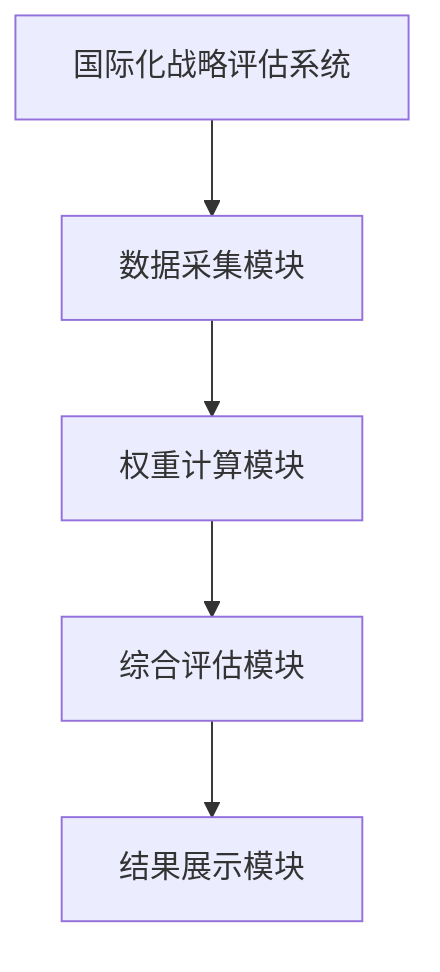

                 


# 如何评估企业的国际化战略价值

## 关键词：企业国际化、战略价值、层次分析法、系统架构、案例分析

## 摘要：本文详细探讨了如何评估企业的国际化战略价值，通过背景介绍、核心概念、算法原理、系统架构、项目实战和总结等部分，系统地分析了国际化战略对企业的重要性，介绍了层次分析法（AHP）的应用，并通过具体案例展示了如何在实际中应用这些方法。文章旨在帮助企业更好地理解和评估国际化战略的价值。

---

## 第1章：企业国际化战略的背景与重要性

### 1.1 什么是国际化战略
国际化战略是指企业将业务扩展到全球市场，利用国际资源、技术和市场机会，实现更大规模和更高利润的战略。国际化战略的核心要素包括市场扩展、资源整合、风险管理等。

### 1.2 为什么企业需要国际化战略
- 市场扩展：拓展新的市场，降低市场依赖风险。
- 资源整合：利用全球资源优化配置，降低成本。
- 技术创新：通过国际合作获取先进技术，提升竞争力。

### 1.3 国际化战略的影响因素
- 市场需求：不同国家的消费者行为和偏好差异。
- 政治经济环境：国际贸易政策、税率、汇率波动等。
- 文化差异：不同国家的商业习惯和文化背景。

---

## 第2章：国际化战略价值的核心概念

### 2.1 国际化战略价值的定义
国际化战略价值是指企业在国际市场上的表现和收益，包括市场份额、利润率、品牌影响力等。

### 2.2 评估维度
- 市场扩展能力：企业在新市场的增长率和市场份额。
- 资源整合能力：利用全球资源的能力。
- 风险管理能力：应对国际市场的不确定性和风险的能力。

### 2.3 评估方法
- 定性评估：通过专家意见和案例分析进行评估。
- 定量评估：通过财务指标、市场份额等数据进行评估。
- 综合评估：结合定性和定量方法，进行全面分析。

---

## 第3章：层次分析法（AHP）在国际化战略评估中的应用

### 3.1 层次分析法的基本原理
层次分析法是一种结构化的决策分析方法，适用于多因素决策问题。它通过构建层次结构，计算各因素的权重，最终得出决策结果。

### 3.2 国际化战略评估的层次结构
- 目标层：评估国际化战略价值。
- 准则层：市场扩展能力、资源整合能力、风险管理能力。
- 方案层：不同国际化战略的选择。

### 3.3 AHP的步骤
1. 构建层次结构。
2. 确定各层次的权重。
3. 计算综合得分。

---

## 第4章：数学模型与算法实现

### 4.1 数学模型
- 层次分析法的权重计算公式：
  $$ A = \frac{a_{ij}}{\sum_{j=1}^{n} a_{ij}} $$
- 综合评分公式：
  $$ S_i = \sum_{j=1}^{n} w_j \cdot A_{ij} $$

### 4.2 Python代码实现
```python
import numpy as np

# 示例数据：国际化战略评估的指标权重
criteria = ['市场扩展', '资源整合', '风险管理']
weights = [0.4, 0.3, 0.3]

# 计算综合得分
def calculate_score(strategy, weights):
    score = sum(strategy[i] * weights[i] for i in range(len(strategy)))
    return score

# 示例策略
strategy1 = [0.8, 0.6, 0.5]
score1 = calculate_score(strategy1, weights)
print(f"综合得分：{score1}")
```

---

## 第5章：系统架构与设计

### 5.1 系统功能模块
- 数据采集模块：收集国际市场数据。
- 权重计算模块：计算各指标的权重。
- 综合评估模块：计算国际化战略的综合得分。

### 5.2 系统架构图


---

## 第6章：项目实战与案例分析

### 6.1 环境配置
- 安装必要的Python库：`numpy`, `pandas`, `scipy`.

### 6.2 数据准备
收集目标市场的相关数据，包括市场份额、利润率等。

### 6.3 实施步骤
1. 数据预处理：清洗和标准化数据。
2. 权重计算：使用层次分析法计算各指标的权重。
3. 模型实现：计算各战略的综合得分。
4. 结果分析：根据得分选择最优战略。

### 6.4 案例分析
某公司考虑进入新兴市场，通过层次分析法评估不同战略的综合得分，选择最优方案。

---

## 第7章：总结与最佳实践

### 7.1 最佳实践
- 确保数据的准确性和完整性。
- 合理设置指标权重，避免主观偏差。
- 定期更新模型，适应市场变化。

### 7.2 小结
本文详细介绍了如何评估企业的国际化战略价值，通过层次分析法和系统架构设计，提供了实用的评估方法和工具。

### 7.3 注意事项
- 在实际应用中，需结合企业实际情况调整模型。
- 数据收集和处理需谨慎，避免偏差。

### 7.4 拓展阅读
建议进一步学习层次分析法的高级应用和多目标决策方法。

---

## 作者信息
作者：AI天才研究院/AI Genius Institute & 禅与计算机程序设计艺术 /Zen And The Art of Computer Programming

