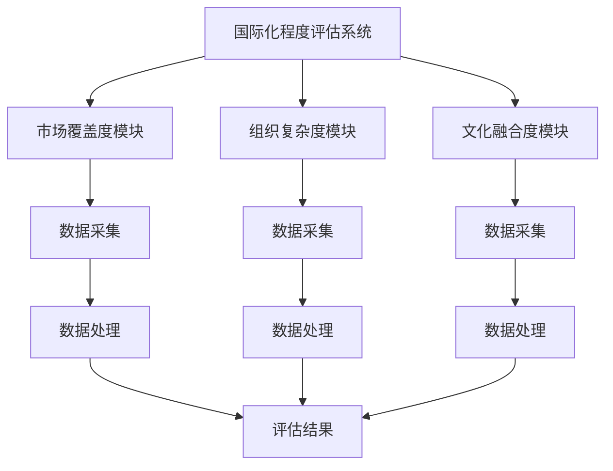
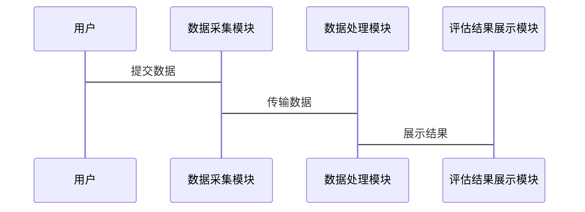

                 


# 如何评估企业的国际化程度价值

> 关键词：企业国际化程度，价值评估，层次分析法，系统架构设计，项目实战

> 摘要：本文旨在系统地探讨如何评估企业的国际化程度价值。通过背景介绍、核心概念、评估方法论、系统架构设计和项目实战等多维度分析，结合实际案例，为读者提供一套完整的评估框架和实践指南。

---

## 第1章：引言

### 1.1 为什么企业国际化程度评估重要
- 在全球化背景下，企业的国际化程度直接影响其市场竞争力和盈利能力。
- 通过评估国际化程度，企业可以制定更精准的战略规划，优化资源配置。

### 1.2 本书的目的与目标
- 本书旨在为企业提供一套科学的国际化程度评估方法论。
- 通过理论与实践结合，帮助企业在实际操作中提升国际化水平。

---

## 第2章：国际化程度评估的核心概念

### 2.1 问题背景与描述
- 随着全球经济一体化，企业的国际化程度成为衡量竞争力的重要指标。
- 企业国际化程度涉及多个维度，包括市场覆盖、组织结构、文化融合等。

### 2.2 问题解决方法
- 通过构建评估模型，量化企业国际化程度。
- 结合定性与定量分析，确保评估结果的科学性和可操作性。

### 2.3 边界与外延
- 企业国际化程度的评估范围：市场、组织、文化、技术等。
- 边界：避免将局部问题放大化，确保评估的准确性。

### 2.4 概念结构与核心要素
- 核心要素：市场覆盖度、组织架构复杂度、文化融合度。
- 概念结构：通过层次分析法（AHP）构建评估模型。

---

## 第3章：核心概念与联系

### 3.1 国际化程度的定义与属性
- 国际化程度的定义：企业在多国市场的布局、组织架构的全球化程度、文化融合能力。
- 核心属性：市场覆盖度、组织复杂度、文化融合度。

### 3.2 核心要素对比表
| 要素 | 描述 | 权重 |
|------|------|------|
| 市场覆盖度 | 全球市场布局 | 0.4 |
| 组织复杂度 | 全球组织架构 | 0.3 |
| 文化融合度 | 跨文化管理能力 | 0.3 |

### 3.3 ER实体关系图
```mermaid
entity 国际化程度评估 {
  市场覆盖度
  组织复杂度
  文化融合度
}
```

---

## 第4章：概念联系与系统分析

### 4.1 概念间关系分析
- 市场覆盖度与组织复杂度：市场扩张需要组织架构的支持。
- 组织复杂度与文化融合度：全球化组织需要高效的跨文化管理。

### 4.2 系统分析与架构设计


---

## 第5章：评估方法论

### 5.1 层次分析法（AHP）介绍
- AHP是一种用于多准则决策分析的方法。
- 通过构建层次结构，计算各准则的权重，进行综合评估。

### 5.2 数学模型与公式
- 层次分析法步骤：
  1. 构建层次结构。
  2. 确定各准则权重。
  3. 计算评估结果。

- 数学公式：
  $$ AHP权重 = \frac{a_{ij}}{\sum_{j} a_{ij}} $$

### 5.3 案例分析与步骤
- 案例：某跨国企业国际化程度评估。
- 步骤：
  1. 收集数据。
  2. 构建层次结构。
  3. 计算权重。
  4. 得出结果。

---

## 第6章：系统架构设计

### 6.1 系统功能设计
- 系统功能模块：数据采集、数据处理、评估结果展示。
- 用户角色：管理员、评估人员。

### 6.2 系统架构图


### 6.3 接口设计与交互
- API接口：RESTful API。
- 交互流程图：


---

## 第7章：项目实战

### 7.1 环境安装与准备
- 工具：Python、Mermaid、Jupyter Notebook。
- 环境：虚拟环境配置。

### 7.2 核心代码实现
```python
import numpy as np

def calculate_weights(matrix):
    return np.array(matrix) / np.sum(matrix, axis=0)

# 示例数据矩阵
matrix = [
    [1, 3, 2],
    [2, 1, 4],
    [3, 2, 1]
]

weights = calculate_weights(matrix)
print(weights)
```

### 7.3 案例分析与解读
- 案例：某科技公司国际化程度评估。
- 分析：市场覆盖度高，但文化融合度待提升。

---

## 第8章：结论与未来方向

### 8.1 全书总结
- 国际化程度评估的重要性。
- 层次分析法的应用价值。

### 8.2 未来研究方向
- 更多评估指标的引入。
- 数字化工具的优化。

### 8.3 最佳实践建议
- 定期评估，持续优化。
- 结合企业实际情况，灵活调整评估模型。

---

## 作者：AI天才研究院/AI Genius Institute & 禅与计算机程序设计艺术 /Zen And The Art of Computer Programming

