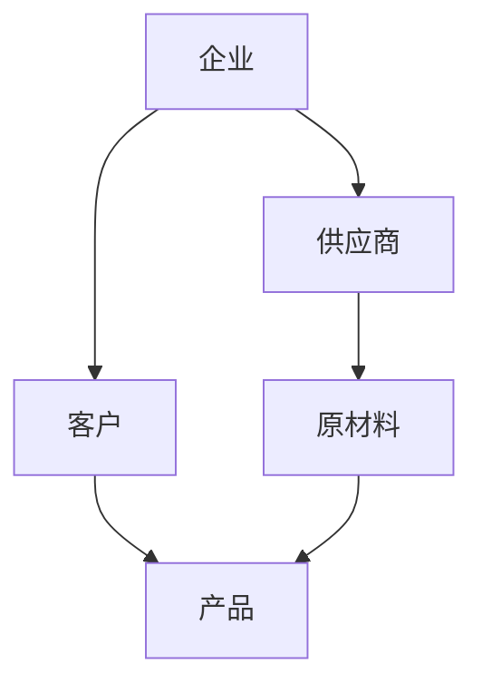
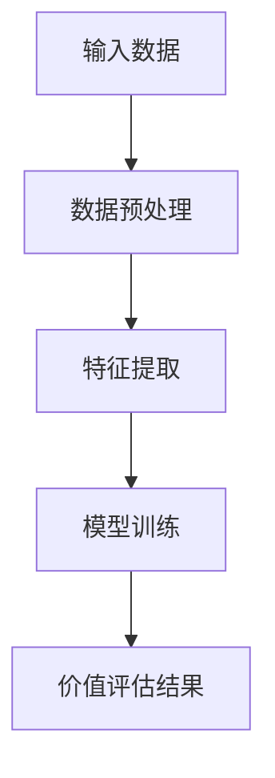
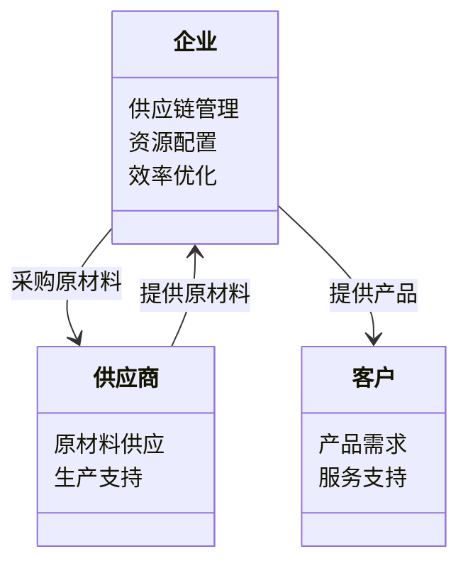
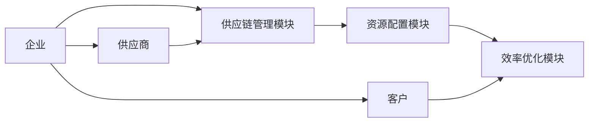
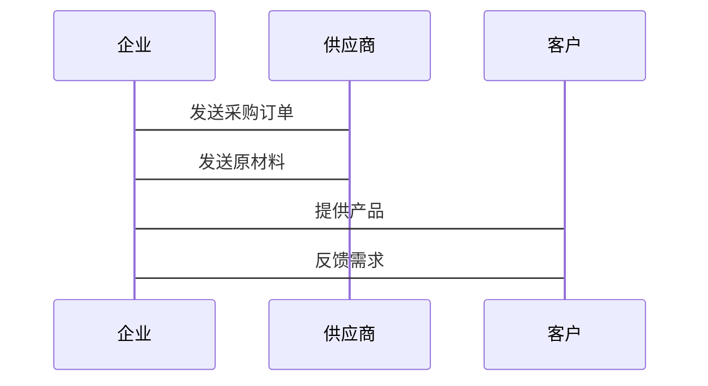

                 


# 如何评估企业的垂直整合价值

> 关键词：企业整合、垂直整合、供应链管理、价值评估、系统架构、数学模型

> 摘要：本文将详细探讨如何评估企业的垂直整合价值，从概念、算法、系统架构到实际案例，全面解析垂直整合的价值评估方法。

---

# 第一部分: 企业垂直整合的背景与概念

## 第1章: 什么是垂直整合

### 1.1 垂直整合的定义与核心概念

- **1.1.1 垂直整合的定义**  
  垂直整合是指企业通过整合供应链上下游资源，从原材料采购到产品生产、销售的全过程进行垂直化管理，以提高效率和控制力。

- **1.1.2 垂直整合的核心要素**  
  - **资源控制**：企业对关键资源的掌控能力。  
  - **协同效应**：供应链各环节的协同工作。  
  - **成本优化**：通过整合降低整体成本。  

- **1.1.3 垂直整合的边界与外延**  
  - **内部整合**：企业内部资源整合。  
  - **外部整合**：与外部供应商或客户的整合。  
  - **混合整合**：内部与外部整合的结合。

### 1.2 垂直整合的重要性和作用

- **1.2.1 垂直整合对企业战略的意义**  
  - 提升企业核心竞争力。  
  - 降低外部依赖风险。  

- **1.2.2 垂直整合对运营效率的提升**  
  - 缩短生产周期。  
  - 提高供应链灵活性。  

- **1.2.3 垂直整合对供应链控制的影响**  
  - 确保原材料供应稳定性。  
  - 提高产品质量控制能力。  

### 1.3 垂直整合的类型与分类

- **1.3.1 内部垂直整合**  
  - 企业内部不同部门的整合。  

- **1.3.2 外部垂直整合**  
  - 与外部供应商或客户的深度合作。  

- **1.3.3 混合型垂直整合**  
  - 内部与外部整合的结合。  

### 1.4 垂直整合与其他整合方式的区别

- **1.4.1 横向整合**  
  - 同一行业内的并购整合。  

- **1.4.2 纵向整合**  
  - 供应链上下游的整合。  

- **1.4.3 混合整合**  
  - 多种整合方式的结合。  

---

## 第2章: 垂直整合的核心概念与联系

### 2.1 垂直整合的核心原理

- **2.1.1 垂直整合的系统性特征**  
  - 整合后的系统具有高度的协同性和整体性。  

- **2.1.2 垂直整合的协同效应**  
  - 供应链各环节的协同工作带来效率提升。  

- **2.1.3 垂直整合的资源优化配置**  
  - 资源的最优分配和利用。  

### 2.2 垂直整合的核心概念属性对比

- **2.2.1 内部整合 vs 外部整合**  
  - 内部整合：企业内部资源的整合。  
  - 外部整合：与外部供应商或客户的整合。  

- **2.2.2 前向整合 vs 后向整合**  
  - 前向整合：向下游延伸。  
  - 后向整合：向上游延伸。  

- **2.2.3 完全整合 vs 部分整合**  
  - 完全整合：完全掌控供应链。  
  - 部分整合：部分掌控供应链。  

### 2.3 垂直整合的ER实体关系图



---

## 第3章: 企业垂直整合的评估模型

### 3.1 垂直整合价值评估的基本原理

- **3.1.1 价值评估的定义**  
  - 通过数学模型对垂直整合的价值进行量化评估。  

- **3.1.2 价值评估的核心指标**  
  - 效率提升。  
  - 成本降低。  
  - 风险控制。  

- **3.1.3 价值评估的数学模型**  
  - 基于加权平均的模型。  

### 3.2 垂直整合价值评估的算法原理



### 3.3 垂直整合价值评估的数学公式

- **3.3.1 价值评估的加权平均公式**  
  $$ V = \sum_{i=1}^{n} w_i x_i $$
  其中，$V$ 是垂直整合价值，$w_i$ 是权重，$x_i$ 是特征值。  

- **3.3.2 价值评估的回归分析公式**  
  $$ y = \beta_0 + \beta_1 x_1 + \beta_2 x_2 + \dots + \beta_k x_k + \epsilon $$  

---

## 第4章: 垂直整合的系统分析与架构设计

### 4.1 问题场景介绍

- **4.1.1 项目背景**  
  - 企业希望通过垂直整合优化供应链。  

- **4.1.2 项目目标**  
  - 提高供应链效率。  
  - 降低运营成本。  

### 4.2 系统功能设计



### 4.3 系统架构设计



### 4.4 系统接口设计

- **接口1：企业与供应商的数据交互**  
  - 企业向供应商发送采购订单。  
  - 供应商向企业发送原材料。  

- **接口2：企业与客户的数据交互**  
  - 企业向客户发送产品。  
  - 客户向企业反馈需求。  

### 4.5 系统交互流程图



---

## 第5章: 项目实战

### 5.1 环境安装

- **Python环境**  
  - 安装Python 3.x。  
  - 安装相关库：numpy、pandas、scikit-learn。  

### 5.2 核心实现源代码

```python
import numpy as np
import pandas as pd
from sklearn.linear_model import LinearRegression

# 示例数据
data = {
    '原材料成本': [10, 15, 20, 25],
    '生产成本': [5, 7, 9, 11],
    '总成本': [15, 22, 29, 36]
}
df = pd.DataFrame(data)

# 垂直整合价值评估模型
model = LinearRegression()
model.fit(df[['原材料成本', '生产成本']], df['总成本'])

# 预测价值
X_new = np.array([[12, 6]]).reshape(-1, 2)
predicted_cost = model.predict(X_new)
print(f"预测总成本为：{predicted_cost[0]:.2f}")
```

### 5.3 代码解读与分析

- **代码功能**  
  - 使用线性回归模型对垂直整合的价值进行预测。  
  - 输入原材料成本和生产成本，输出预测的总成本。  

- **代码实现步骤**  
  1. 导入所需的库。  
  2. 创建数据集。  
  3. 训练模型。  
  4. 预测价值。  

### 5.4 实际案例分析

- **案例背景**  
  某制造企业希望通过垂直整合优化供应链，降低总成本。  

- **案例分析**  
  使用上述模型预测不同原材料成本和生产成本下的总成本，评估垂直整合的价值。  

---

## 第6章: 最佳实践、小结、注意事项和拓展阅读

### 6.1 最佳实践

- **数据质量**  
  - 确保数据的准确性和完整性。  

- **模型选择**  
  - 根据实际情况选择合适的模型。  

### 6.2 小结

- 本文详细探讨了如何评估企业的垂直整合价值，从概念、算法、系统架构到实际案例，全面解析了垂直整合的价值评估方法。  

### 6.3 注意事项

- **数据隐私**  
  - 注意保护企业的数据隐私。  

- **模型局限性**  
  - 模型的预测结果仅供参考。  

### 6.4 拓展阅读

- **相关书籍**  
  - 《供应链管理：原理与应用》  
  - 《企业整合策略》  

---

作者：AI天才研究院/AI Genius Institute & 禅与计算机程序设计艺术 /Zen And The Art of Computer Programming

