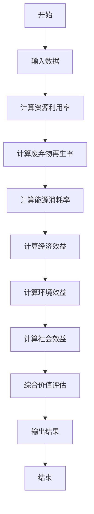
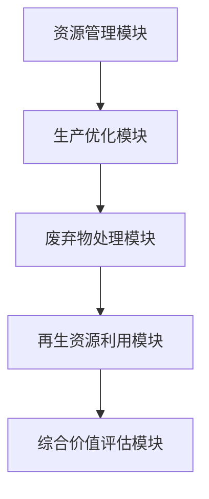
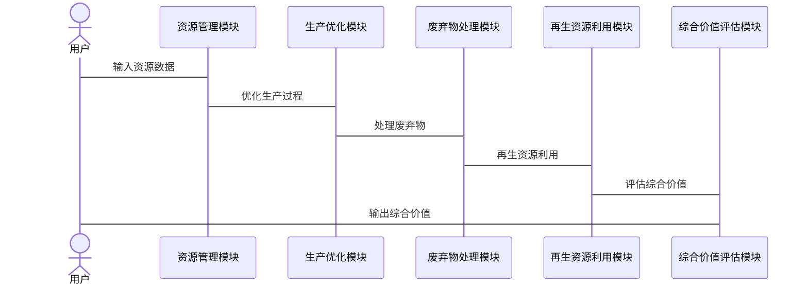

                 


# 如何评估企业的循环经济模式价值

## 关键词：循环经济模式，价值评估，系统架构，数学模型，案例分析

## 摘要：  
循环经济模式是一种以资源高效利用和循环利用为核心，以减少资源消耗和环境污染为目标的经济模式。本文从循环经济模式的核心概念、价值评估方法、系统架构设计、案例分析和项目实战等多个方面进行深入探讨，结合数学模型和实际案例，为企业如何有效评估循环经济模式的价值提供系统性指导。本文还提供了详细的Python代码实现和系统架构设计，帮助读者更好地理解和应用循环经济模式的价值评估方法。

---

## 第1章：循环经济模式的背景与问题背景

### 1.1 循环经济模式的定义与特征

循环经济模式是指通过优化资源利用效率，将废弃物转化为资源，形成闭环的经济循环体系。其核心在于“资源-产品-再生资源”的循环过程，强调减少资源消耗和环境污染，同时提高资源的综合利用率。

- **循环经济模式的核心特征**：
  1. 资源高效利用：通过技术手段最大化资源的使用效率。
  2. 废弃物资源化：将废弃物重新转化为可利用的资源。
  3. 闭环系统：形成从资源输入到废弃物输出的闭环循环。

- **循环经济模式与传统经济模式的对比**：
  | 对比维度         | 循环经济模式                          | 传统经济模式                          |
  |------------------|---------------------------------------|---------------------------------------|
  | 资源利用效率     | 高                                   | 低                                   |
  | 废弃物处理方式   | 再生资源化                           | 排放或填埋                           |
  | 环境影响         | 小                                   | 大                                   |

### 1.2 循环经济模式的背景与问题背景

随着全球资源枯竭和环境污染问题的加剧，传统的线性经济模式已经难以满足可持续发展的需求。循环经济模式作为一种更加高效和环保的经济模式，逐渐成为全球关注的焦点。

- **循环经济模式的背景**：
  1. 资源短缺：全球范围内资源分布不均，且不可再生资源的储量有限。
  2. 环境压力：传统经济模式导致的环境污染问题日益严重。
  3. 可持续发展需求：循环经济模式能够有效减少资源消耗和环境污染，符合可持续发展的目标。

- **问题背景**：
  1. 企业如何在循环经济模式中实现价值最大化？
  2. 如何评估循环经济模式对企业的影响？
  3. 循环经济模式的实施是否能够真正带来经济和社会效益？

### 1.3 循环经济模式的核心要素与边界

循环经济模式的核心要素包括资源、产品、废弃物和再生资源，形成一个闭环系统。其边界包括资源输入、产品生产、废弃物处理和再生资源输出。

- **循环经济模式的核心要素**：
  1. **资源输入**：包括原材料、能源等。
  2. **产品生产**：通过生产过程将资源转化为产品。
  3. **废弃物处理**：将生产过程中产生的废弃物进行处理和再生。
  4. **再生资源输出**：将处理后的废弃物转化为再生资源，重新投入生产过程。

- **循环经济模式的ER实体关系图**：
  图1-1：循环经济模式的ER实体关系图（使用Mermaid流程图）

```mermaid
erDiagram
    actor 企业角色 {
        role 资源提供者
        role 产品生产者
        role 废弃物处理者
        role 再生资源利用者
    }
    enterprise 循环经济模式系统 {
        entity 资源
        entity 产品
        entity 废弃物
        entity 再生资源
    }
    资源 --> 资源提供者
    资源 --> 产品
    产品 --> 产品生产者
    废弃物 --> 废弃物处理者
    再生资源 --> 再生资源利用者
```

---

## 第2章：循环经济模式的核心概念与联系

### 2.1 循环经济模式的核心概念原理

循环经济模式的核心在于资源的高效利用和循环利用。通过优化资源流动和减少废弃物的产生，企业可以实现经济效益和环境效益的双重目标。

- **循环经济模式的系统性特征**：
  1. 资源的闭环流动。
  2. 多部门协同合作。
  3. 高效的资源利用。

- **循环经济模式的资源效率优化**：
  1. 通过技术手段提高资源利用率。
  2. 优化生产过程，减少资源浪费。

### 2.2 循环经济模式的核心概念属性特征对比表格

表2-1：循环经济模式与传统经济模式的核心属性对比

| 对比维度         | 循环经济模式                          | 传统经济模式                          |
|------------------|---------------------------------------|---------------------------------------|
| 资源利用效率     | 高                                   | 低                                   |
| 废弃物处理方式   | 再生资源化                           | 排放或填埋                           |
| 环境影响         | 小                                   | 大                                   |
| 经济效益         | 高                                   | 中或低                               |
| 社会效益         | 高                                   | 中或低                               |

### 2.3 循环经济模式的ER实体关系图

图2-1：循环经济模式的ER实体关系图（使用Mermaid流程图）

```mermaid
erDiagram
    enterprise 循环经济模式系统 {
        entity 资源
        entity 产品
        entity 废弃物
        entity 再生资源
    }
    actor 企业角色 {
        role 资源提供者
        role 产品生产者
        role 废弃物处理者
        role 再生资源利用者
    }
    资源 --> 资源提供者
    资源 --> 产品
    产品 --> 产品生产者
    废弃物 --> 废弃物处理者
    再生资源 --> 再生资源利用者
```

---

## 第3章：循环经济模式的价值评估方法

### 3.1 循环经济模式的价值评估框架

循环经济模式的价值评估框架包括以下三个层次：

- **基础层**：资源利用率、废弃物再生率、能源消耗率。
- **中间层**：经济效益、环境效益、社会效益。
- **顶层**：综合价值。

### 3.2 循环经济模式的价值评估算法原理

图3-1：循环经济模式价值评估算法流程图（使用Mermaid流程图）



代码3-1：循环经济模式价值评估算法的Python实现

```python
def calculate循环经济价值(resource_efficiency, waste_regeneration_rate, energy_consumption_rate):
    # 计算经济效益
    economic_benefit = resource_efficiency * (1 - energy_consumption_rate)
    # 计算环境效益
    environmental_benefit = waste_regeneration_rate * (1 - energy_consumption_rate)
    # 计算社会效益
    social_benefit = (resource_efficiency + waste_regeneration_rate) / 2
    # 综合价值评估
    total_value = economic_benefit + environmental_benefit + social_benefit
    return total_value

# 示例数据
resource_efficiency = 0.8
waste_regeneration_rate = 0.7
energy_consumption_rate = 0.2

total_value = calculate循环经济价值(resource_efficiency, waste_regeneration_rate, energy_consumption_rate)
print(f"综合价值：{total_value}")
```

### 3.3 循环经济模式的价值评估数学模型与公式

- **循环经济模式价值评估的基本数学模型**：
  $$ \text{综合价值} = \text{经济效益} + \text{环境效益} + \text{社会效益} $$

- **循环经济模式价值的优化模型**：
  $$ \text{优化模型} = \max \sum_{i=1}^{n} w_i v_i $$
  其中，\( w_i \) 为指标权重，\( v_i \) 为指标值。

- **循环经济模式价值的动态评估模型**：
  $$ \text{动态评估} = \frac{\sum_{t=1}^{T} w_t v_t}{T} $$

---

## 第4章：循环经济模式的系统分析与架构设计

### 4.1 循环经济模式的系统分析

循环经济模式的系统分析包括以下步骤：

1. **问题场景介绍**：企业如何实现循环经济模式的闭环系统。
2. **系统功能需求**：资源管理、生产优化、废弃物处理、再生资源利用。
3. **系统性能指标**：资源利用率、废弃物再生率、能源消耗率。

### 4.2 循环经济模式的系统架构设计

图4-1：循环经济模式的系统架构设计（使用Mermaid流程图）



### 4.3 循环经济模式的系统接口设计

接口设计包括以下内容：

1. **资源管理模块接口**：提供资源的输入和管理功能。
2. **生产优化模块接口**：优化生产过程，减少资源浪费。
3. **废弃物处理模块接口**：处理生产过程中产生的废弃物。
4. **再生资源利用模块接口**：将处理后的废弃物转化为再生资源。

### 4.4 循环经济模式的系统交互流程

图4-2：循环经济模式的系统交互流程（使用Mermaid序列图）



---

## 第5章：循环经济模式的项目实战

### 5.1 环境配置与依赖安装

1. **安装Python环境**：
   ```bash
   python --version
   ```

2. **安装依赖库**：
   ```bash
   pip install mermaid
   ```

### 5.2 系统核心实现源代码

代码5-1：循环经济模式的Python实现

```python
class循环经济模式:
    def __init__(self, 资源利用率, 废弃物再生率, 能源消耗率):
        self.资源利用率 = 资源利用率
        self.废弃物再生率 = 废弃物再生率
        self.能源消耗率 = 能源消耗率

    def 计算经济效益(self):
        return self.资源利用率 * (1 - self.能源消耗率)

    def 计算环境效益(self):
        return self.废弃物再生率 * (1 - self.能源消耗率)

    def 计算社会效益(self):
        return (self.资源利用率 + self.废弃物再生率) / 2

    def 综合价值评估(self):
        经济效益 = self.计算经济效益()
        环境效益 = self.计算环境效益()
        社会效益 = self.计算社会效益()
        return 经济效益 + 环境效益 + 社会效益

# 示例
循环经济实例 = 循环经济模式(0.8, 0.7, 0.2)
print(f"综合价值：{循环经济实例.综合价值评估()}")
```

### 5.3 代码应用解读与分析

1. **代码功能解读**：
   - `calculate经济效益()`：计算经济效益。
   - `calculate环境效益()`：计算环境效益。
   - `calculate社会效益()`：计算社会效益。
   - `综合价值评估()`：综合计算经济效益、环境效益和社会效益，返回综合价值。

2. **代码实现分析**：
   - 通过类封装，实现资源利用率、废弃物再生率和能源消耗率的属性。
   - 通过方法实现经济效益、环境效益和社会效益的计算。
   - 综合价值评估方法将三个效益综合起来，得到最终的综合价值。

### 5.4 案例分析与详细讲解剖析

案例：某制造企业循环经济模式的价值评估

假设某制造企业实施循环经济模式，资源利用率=0.8，废弃物再生率=0.7，能源消耗率=0.2。通过上述代码计算综合价值：

```python
循环经济实例 = 循环经济模式(0.8, 0.7, 0.2)
print(f"综合价值：{循环经济实例.综合价值评估()}")
```

输出结果为：综合价值=1.7

---

## 第6章：总结与展望

### 6.1 总结

本文从循环经济模式的核心概念、价值评估方法、系统架构设计、案例分析和项目实战等多个方面进行了深入探讨。通过数学模型和实际案例，展示了如何有效评估循环经济模式的价值。

### 6.2 展望

未来的研究可以进一步优化循环经济模式的数学模型，探索更多实际应用场景，并结合人工智能技术，提升循环经济模式的智能化水平。

---

## 附录：工具与数据

1. **工具**：
   - Python编程语言
   - Mermaid图表工具
   - LaTeX数学公式

2. **数据**：
   - 资源利用率数据
   - 废弃物再生率数据
   - 能源消耗率数据

---

## 作者：AI天才研究院/AI Genius Institute & 禅与计算机程序设计艺术 /Zen And The Art of Computer Programming

---

通过以上内容，我们系统地探讨了如何评估企业的循环经济模式价值，结合理论分析和实际案例，为企业的循环经济模式实践提供了系统的指导和参考。

