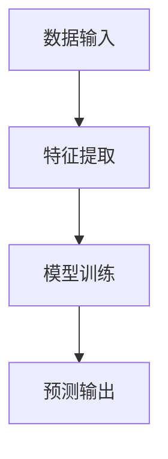
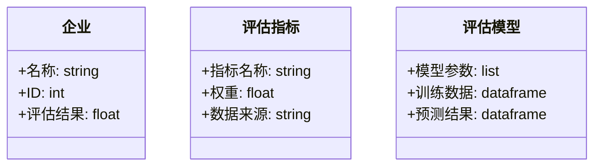

                 


# 如何评估企业的敏捷管理能力价值

## 关键词：敏捷管理，企业能力评估，管理价值，敏捷转型，组织优化

## 摘要：  
本文深入探讨了如何评估企业的敏捷管理能力价值，从敏捷管理的背景、核心概念、评估模型、算法原理到系统架构设计和项目实战，全面解析了企业在敏捷管理转型中的关键步骤和方法。文章通过详细的理论分析和实际案例，帮助企业理解敏捷管理能力的重要性，并提供切实可行的评估框架和工具，助力企业在快速变化的商业环境中提升竞争力。

---

# 第1章: 敏捷管理能力评估的背景与价值

## 1.1 敏捷管理的起源与发展

### 1.1.1 敏捷管理的定义与核心理念  
敏捷管理是一种以快速响应变化、注重个体互动和客户合作为核心理念的管理方法。其核心在于通过迭代和增量的方式，快速交付价值，并在过程中不断优化和调整。敏捷管理起源于软件开发领域，但其理念和方法已扩展到企业管理和组织优化的多个领域。

### 1.1.2 敏捷管理与传统管理的区别  
与传统管理相比，敏捷管理更加注重灵活性和适应性，强调快速迭代和持续交付。传统管理通常采用严格的计划和流程，而敏捷管理则更注重团队协作、自我组织和持续改进。敏捷管理的核心在于“以人为本”，注重员工的创造力和主动性。

### 1.1.3 敏捷管理在企业中的应用现状  
随着市场竞争的加剧和客户需求的变化，越来越多的企业开始采用敏捷管理方法。敏捷管理不仅在软件开发领域得到了广泛应用，还在企业战略制定、项目管理、团队协作等方面展现出其独特的优势。然而，企业在实施敏捷管理的过程中，也面临着文化冲突、流程优化和工具选择等挑战。

## 1.2 企业敏捷管理能力的评估价值

### 1.2.1 企业敏捷管理能力的定义  
企业敏捷管理能力是指企业在快速变化的环境中，能够灵活调整战略、流程和组织结构，以实现高效交付和持续创新的能力。这种能力不仅体现在技术层面，还涉及组织文化和团队协作等多个方面。

### 1.2.2 评估敏捷管理能力的意义  
评估企业敏捷管理能力有助于帮助企业识别自身的优劣势，发现改进空间，并为管理者提供数据支持，以便做出更科学的决策。此外，评估结果还可以作为企业竞争力的重要指标，帮助企业在市场中获得更大的竞争优势。

### 1.2.3 敏捷管理能力与企业绩效的关系  
研究表明，具备较强敏捷管理能力的企业通常表现出更高的绩效水平。这主要体现在更快的市场反应速度、更高的客户满意度和更强的创新能力等方面。敏捷管理能力越强，企业的抗风险能力和适应性也越强。

## 1.3 敏捷管理能力评估的边界与外延

### 1.3.1 评估范围的界定  
敏捷管理能力的评估范围通常包括组织结构、文化、流程、工具等多个方面。具体来说，评估范围可以包括团队协作效率、流程灵活性、技术工具支持、员工参与度等。

### 1.3.2 与相关概念的区分  
敏捷管理能力与企业其他管理能力（如战略管理、财务管理等）既有区别又有联系。敏捷管理更注重快速响应和持续改进，而其他管理能力则更关注长期规划和资源配置。

### 1.3.3 评估框架的构建  
构建敏捷管理能力评估框架需要从多个维度出发，包括目标、指标、方法和工具等。常见的评估框架包括敏捷成熟度模型和敏捷能力指数模型。

## 1.4 敏捷管理能力的核心要素

### 1.4.1 敏捷组织结构  
敏捷组织结构通常采用扁平化管理模式，强调跨部门协作和自组织团队。这种结构能够快速响应变化，减少层级之间的沟通障碍。

### 1.4.2 敏捷文化  
敏捷文化强调透明沟通、持续学习和员工参与。在敏捷文化中，员工被视为企业的重要资产，鼓励他们主动提出改进建议。

### 1.4.3 敏捷流程与工具  
敏捷流程强调迭代开发和持续交付，常用工具包括敏捷项目管理平台、代码版本控制系统和自动化测试工具等。

## 1.5 本章小结  
本章从敏捷管理的起源与发展入手，详细介绍了敏捷管理的核心理念和与传统管理的区别。同时，分析了敏捷管理能力的评估价值及其与企业绩效的关系，并提出了构建评估框架的方法。

---

# 第2章: 敏捷管理能力的核心概念与联系

## 2.1 敏捷管理的核心概念

### 2.1.1 敏捷价值观  
敏捷价值观包括个体互动、客户合作、响应变化和交付价值等核心理念。这些价值观强调以人为本，注重团队协作和持续改进。

### 2.1.2 敏捷原则  
敏捷原则包括用户至上、迭代开发、持续交付和持续学习等。这些原则为企业在快速变化的环境中提供了指导方向。

### 2.1.3 敏捷方法论  
敏捷方法论包括Scrum、Agile、Kanban等具体方法。这些方法论为企业提供了实现敏捷管理的具体步骤和工具支持。

## 2.2 敏捷管理能力的关键属性

### 2.2.1 反应速度  
反应速度是敏捷管理能力的重要指标，指企业在面对外部变化时能够快速调整策略和流程的能力。

### 2.2.2 知识共享  
知识共享是指团队成员之间能够高效传递和利用知识，从而提高整体工作效率和创新能力。

### 2.2.3 灵活性与适应性  
灵活性与适应性是指企业在面对变化时能够快速调整和优化的能力，是敏捷管理的核心特征之一。

## 2.3 敏捷管理能力的特征对比

### 2.3.1 表格对比：敏捷与传统管理的特征对比  
以下表格对比了敏捷管理与传统管理的核心特征：

| 特征维度      | 敏捷管理                  | 传统管理                  |
|----------------|--------------------------|--------------------------|
| 管理方式      | 迭代式、自组织            | 金字塔式、层级化          |
| 响应速度      | 快速、灵活                | 较慢、固定                |
| 重点         | 交付价值、持续改进        | 完成计划、严格控制        |

### 2.3.2 图表展示：敏捷管理能力的特征关系图  
以下Mermaid图展示了敏捷管理能力的特征关系：


## 2.4 实体关系图：敏捷管理能力的ER架构

```mermaid
er
actor: 企业
actor --> role: 管理者
actor --> process: 敏捷流程
actor --> tool: 敏捷工具
role --> process
role --> tool
process --> tool
```

## 2.5 本章小结  
本章从敏捷管理的核心概念出发，详细分析了敏捷价值观、原则和方法论，并通过表格和图表展示了敏捷管理能力的特征及其关系。

---

# 第3章: 敏捷管理能力评估的算法原理

## 3.1 评估模型的构建

### 3.1.1 数据收集与预处理  
数据收集是评估模型构建的基础。常见的数据来源包括企业绩效数据、团队协作数据和客户满意度数据等。数据预处理包括数据清洗、特征提取和数据标准化等步骤。

### 3.1.2 模型训练与验证  
模型训练是通过机器学习算法对数据进行训练，得到能够反映企业敏捷管理能力的模型。验证过程包括交叉验证和模型调优，以确保模型的准确性和稳定性。

### 3.1.3 模型评估与优化  
模型评估是通过测试数据对模型进行评估，分析其性能指标（如准确率、召回率等）。模型优化包括参数调整和算法改进，以提高模型的预测能力。

## 3.2 基于机器学习的评估算法

### 3.2.1 算法原理  
以下Mermaid图展示了基于机器学习的评估算法的流程：



### 3.2.2 算法实现  
以下Python代码展示了基于机器学习的评估算法实现：

```python
import pandas as pd
from sklearn.model_selection import train_test_split
from sklearn.linear_model import LinearRegression

# 数据加载
data = pd.read_csv('agile_assessment.csv')

# 数据预处理
X = data.drop('score', axis=1)
y = data['score']

# 数据分割
X_train, X_test, y_train, y_test = train_test_split(X, y, test_size=0.2, random_state=42)

# 模型训练
model = LinearRegression()
model.fit(X_train, y_train)

# 模型预测
y_pred = model.predict(X_test)

# 模型评估
score = model.score(X_test, y_test)
print(f'模型得分: {score}')
```

### 3.2.3 算法优化  
算法优化是通过调整模型参数和选择合适的算法来提高预测精度。例如，可以尝试使用随机森林或支持向量机等其他算法，以获得更好的预测效果。

## 3.3 评估模型的数学模型和公式

### 3.3.1 线性回归模型  
线性回归模型是一种常用的预测模型，其数学表达式为：

$$ y = \beta_0 + \beta_1x_1 + \beta_2x_2 + \ldots + \beta_nx_n + \epsilon $$

其中，$y$ 是目标变量，$x_i$ 是自变量，$\beta_i$ 是回归系数，$\epsilon$ 是误差项。

### 3.3.2 评估指标  
评估指标包括均方误差（MSE）、平均绝对误差（MAE）和R平方值（R²）等。例如，均方误差的公式为：

$$ MSE = \frac{1}{n}\sum_{i=1}^{n}(y_i - \hat{y}_i)^2 $$

其中，$y_i$ 是实际值，$\hat{y}_i$ 是预测值。

## 3.4 本章小结  
本章从算法原理出发，详细介绍了基于机器学习的评估模型构建方法，并通过Python代码和数学公式展示了模型的实现和优化过程。

---

# 第4章: 系统分析与架构设计方案

## 4.1 系统分析

### 4.1.1 问题场景介绍  
企业敏捷管理能力评估系统需要解决的问题包括数据收集、模型构建和结果展示等。系统需要能够处理大量数据，并提供直观的评估结果。

### 4.1.2 项目介绍  
本项目旨在开发一个企业敏捷管理能力评估系统，通过数据收集、分析和可视化，帮助企业识别自身敏捷管理能力的优劣势。

## 4.2 系统功能设计

### 4.2.1 领域模型设计  
以下Mermaid图展示了领域模型设计：



### 4.2.2 系统架构设计  
以下Mermaid图展示了系统架构设计：

```mermaid
container 敏捷管理能力评估系统 {
    component 数据采集模块
    component 数据处理模块
    component 模型训练模块
    component 结果展示模块
}
```

### 4.2.3 系统接口设计  
系统接口设计包括数据接口、模型接口和用户接口。数据接口负责数据的输入和输出，模型接口负责模型的训练和预测，用户接口负责结果的展示和交互。

### 4.2.4 系统交互设计  
以下Mermaid图展示了系统交互设计：

```mermaid
sequenceDiagram
用户 --> 数据采集模块: 提交数据
数据采集模块 --> 数据处理模块: 处理数据
数据处理模块 --> 模型训练模块: 训练模型
模型训练模块 --> 结果展示模块: 展示结果
用户 <-- 结果展示模块: 获取评估结果
```

## 4.3 本章小结  
本章从系统分析出发，详细介绍了系统功能设计、架构设计和交互设计，为后续的系统实现提供了理论基础。

---

# 第5章: 项目实战

## 5.1 环境安装

### 5.1.1 安装Python和相关库  
安装Python和以下库：

```
pip install pandas numpy scikit-learn matplotlib
```

### 5.1.2 安装敏捷管理评估系统  
安装系统依赖项并配置环境变量。

## 5.2 核心代码实现

### 5.2.1 数据采集模块  
以下代码展示了数据采集模块的实现：

```python
import pandas as pd

def collect_data():
    # 数据采集逻辑
    data = pd.read_csv('agile_assessment.csv')
    return data
```

### 5.2.2 数据处理模块  
以下代码展示了数据处理模块的实现：

```python
def preprocess(data):
    # 数据清洗和特征提取逻辑
    data = data.dropna()
    data = pd.get_dummies(data)
    return data
```

### 5.2.3 模型训练模块  
以下代码展示了模型训练模块的实现：

```python
from sklearn.linear_model import LinearRegression

def train_model(data, labels):
    model = LinearRegression()
    model.fit(data, labels)
    return model
```

### 5.2.4 结果展示模块  
以下代码展示了结果展示模块的实现：

```python
import matplotlib.pyplot as plt

def visualize_results(results):
    plt.plot(results)
    plt.xlabel('时间')
    plt.ylabel('评估结果')
    plt.show()
```

## 5.3 案例分析

### 5.3.1 数据分析  
以下代码展示了数据分析的实现：

```python
import pandas as pd

data = collect_data()
processed_data = preprocess(data)
print(processed_data.head())
```

### 5.3.2 模型训练与评估  
以下代码展示了模型训练与评估的实现：

```python
model = train_model(processed_data, data['score'])
score = model.score(processed_data, data['score'])
print(f'模型得分: {score}')
```

### 5.3.3 结果展示  
以下代码展示了结果展示的实现：

```python
results = model.predict(processed_data)
visualize_results(results)
```

## 5.4 项目总结  
本章通过实际案例展示了敏捷管理能力评估系统的实现过程，包括数据采集、数据处理、模型训练和结果展示等步骤。

---

# 第6章: 最佳实践与小结

## 6.1 最佳实践

### 6.1.1 敏捷管理能力评估的关键点  
敏捷管理能力评估需要关注团队协作、流程优化和工具支持等多个方面。企业在评估过程中应注重数据的准确性和模型的适用性。

### 6.1.2 小结  
敏捷管理能力评估是一个复杂但重要的过程，需要企业在实践中不断优化和调整。通过科学的评估方法和工具，企业可以更好地识别自身的优势和劣势，从而制定更有效的管理策略。

## 6.2 注意事项  
企业在实施敏捷管理能力评估时，应注意数据质量和模型选择。同时，应结合企业的实际情况，灵活调整评估方法和工具。

## 6.3 拓展阅读  
推荐阅读以下书籍和文献：

- 《敏捷开发实战》
- 《企业架构设计》
- 《机器学习实战》

## 6.4 本章小结  
本章总结了敏捷管理能力评估的关键点和注意事项，并提出了进一步阅读的建议。

---

# 作者：AI天才研究院/AI Genius Institute & 禅与计算机程序设计艺术 /Zen And The Art of Computer Programming

