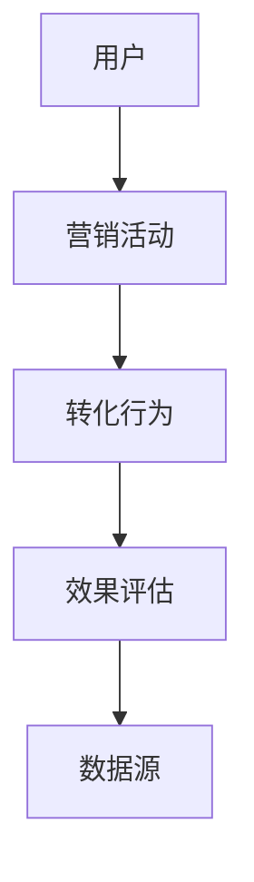
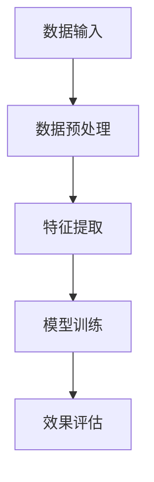
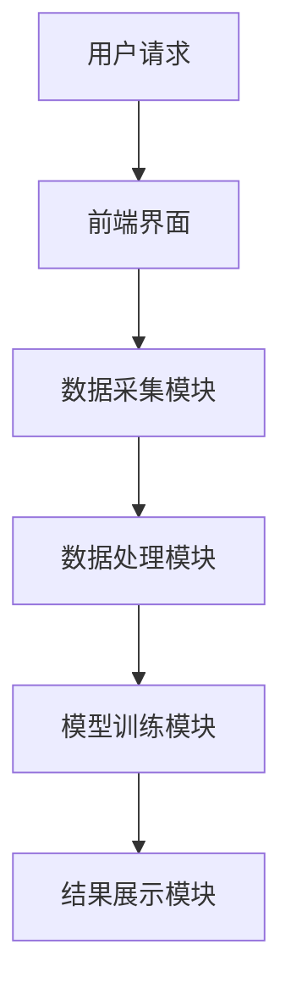
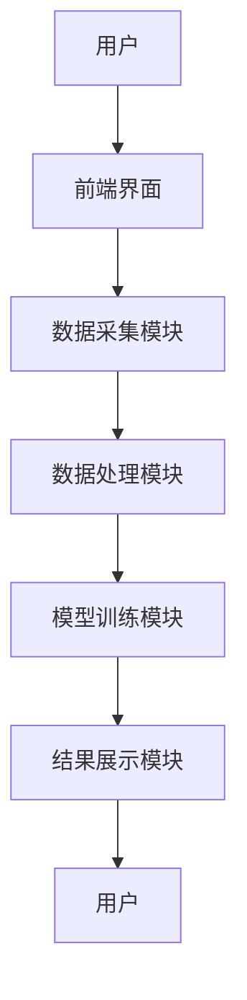

                 


# 如何评估企业的数字化营销效果

## 关键词：数字化营销、效果评估、KPI、ROI、数据驱动、机器学习

## 摘要：本文系统地介绍了如何评估企业的数字化营销效果，从核心概念到算法原理，再到系统架构设计和项目实战，全面解析了数字化营销效果评估的关键要素和方法。文章通过理论分析、工具使用、代码实现和案例解读，帮助读者掌握数字化营销效果评估的完整流程和实际应用。

---

## 第1章: 数字化营销与效果评估概述

### 1.1 数字化营销的基本概念
#### 1.1.1 数字化营销的定义
数字化营销是指通过数字技术手段，利用互联网、大数据、人工智能等工具，进行产品推广、客户互动和销售管理的营销方式。与传统营销相比，数字化营销更加精准、数据驱动且互动性强。

#### 1.1.2 数字化营销的核心要素
- **目标受众**：明确的目标客户群体，基于数据进行精准定位。
- **渠道多样性**：包括社交媒体、搜索引擎、电子邮件、移动应用等多种营销渠道。
- **数据驱动**：依赖数据采集和分析，优化营销策略。
- **互动性**：通过实时互动提升客户参与度和品牌忠诚度。

#### 1.1.3 数字化营销与传统营销的区别
| 属性       | 数字化营销                     | 传统营销                     |
|------------|-------------------------------|-----------------------------|
| 渠道       | 网络、社交媒体、移动应用等     | 报纸、电视、广播等           |
| 数据驱动   | 是                             | 否                           |
| 精准度     | 高                             | 低                           |
| 互动性     | 高                             | 低                           |

### 1.2 数字化营销效果评估的重要性
#### 1.2.1 企业数字化营销的现状
随着互联网和移动设备的普及，企业越来越依赖数字化营销来触达目标客户。然而，数字化营销的效果评估仍然面临数据分散、渠道众多、客户行为复杂等挑战。

#### 1.2.2 评估数字化营销效果的意义
- **优化营销策略**：通过数据反馈，调整营销活动，提高投资回报率。
- **量化营销价值**：通过数据指标，衡量营销活动的实际效果。
- **提升客户体验**：通过精准营销，提升客户满意度和忠诚度。

#### 1.2.3 数字化营销效果评估的边界与外延
- **边界**：仅限于线上渠道的营销效果评估。
- **外延**：包括从数据采集到策略优化的完整流程。

### 1.3 数字化营销效果评估的核心要素
#### 1.3.1 评估指标的选择
- **KPI（关键绩效指标）**：如点击率（CTR）、转化率（CVR）、投资回报率（ROI）等。
- **ROI（投资回报率）**：衡量营销活动的经济效益。
- **CVR（转化率）**：衡量营销活动的实际效果。

#### 1.3.2 评估方法的多样性
- **定量分析**：基于数据的统计分析，如回归分析。
- **定性分析**：基于客户反馈的主观评价。

#### 1.3.3 评估工具的使用场景
- **Google Analytics**：用于网站流量分析。
- **社交媒体分析工具**：用于社交媒体营销效果评估。

### 1.4 本章小结
本章介绍了数字化营销的基本概念、重要性以及核心要素，为后续的评估方法和工具奠定了基础。

---

## 第2章: 数字化营销效果评估的核心概念与联系

### 2.1 核心概念原理
#### 2.1.1 数字化营销效果评估的理论基础
- **数据驱动决策**：基于数据分析的结果制定营销策略。
- **客户行为分析**：通过数据挖掘技术，分析客户的购买行为和偏好。

#### 2.1.2 数据驱动的评估方法
- **A/B测试**：通过对比不同营销策略的效果，选择最优方案。
- **机器学习模型**：利用机器学习算法预测营销效果。

#### 2.1.3 机器学习在效果评估中的应用
- **分类算法**：如随机森林、支持向量机（SVM），用于预测客户行为。
- **回归分析**：用于预测营销活动的销售量或收益。

### 2.2 核心概念属性特征对比表格
| 概念       | 属性1 | 属性2 | 属性3 |
|------------|--------|--------|--------|
| KPI        | 定量   | 客观   | 可衡量 |
| ROI        | 定量   | 主观   | 可优化 |
| CVR        | 定量   | 客观   | 可预测 |

### 2.3 实体关系图（ER图）


### 2.4 本章小结
本章通过核心概念的对比和实体关系图，展示了数字化营销效果评估的系统架构，为后续的算法分析提供了框架。

---

## 第3章: 数字化营销效果评估的算法原理

### 3.1 算法原理概述
#### 3.1.1 回归分析
- **线性回归**：用于预测连续型变量，如销售额。
  $$ y = \beta_0 + \beta_1x + \epsilon $$
- **逻辑回归**：用于分类问题，如预测客户是否会购买产品。
  $$ P(y=1|x) = \frac{1}{1 + e^{-\beta x}} $$

#### 3.1.2 分类算法
- **随机森林**：通过构建多个决策树，提高模型的准确性和鲁棒性。
- **支持向量机（SVM）**：用于分类问题，特别是在高维空间中表现优异。

#### 3.1.3 聚类分析
- **K-means**：用于客户分群，识别不同客户群体的行为特征。

### 3.2 算法流程图


### 3.3 算法数学模型
#### 线性回归模型
$$ y = \beta_0 + \beta_1x + \epsilon $$

#### 逻辑回归模型
$$ P(y=1|x) = \frac{1}{1 + e^{-\beta x}} $$

### 3.4 本章小结
本章详细讲解了回归分析、分类算法和聚类分析的原理及其在数字化营销效果评估中的应用。

---

## 第4章: 数字化营销效果评估的系统分析与架构设计

### 4.1 系统分析
#### 4.1.1 问题场景介绍
- **问题描述**：企业需要评估多个数字化营销渠道的效果，但数据分散且难以整合。
- **项目介绍**：开发一个集成的数字化营销效果评估系统，整合多渠道数据，提供实时分析和优化建议。

#### 4.1.2 系统功能设计
- **数据采集模块**：从网站、社交媒体、电子邮件等渠道采集数据。
- **数据处理模块**：清洗和预处理数据，提取特征。
- **模型训练模块**：基于机器学习算法，训练评估模型。
- **结果展示模块**：可视化分析结果，提供优化建议。

### 4.2 系统架构设计


### 4.3 系统接口设计
- **输入接口**：接收用户请求和数据源。
- **输出接口**：返回分析结果和优化建议。

### 4.4 系统交互序列图


### 4.5 本章小结
本章通过系统分析和架构设计，展示了如何构建一个高效的数字化营销效果评估系统。

---

## 第5章: 数字化营销效果评估的项目实战

### 5.1 环境安装
- **工具安装**：
  - Python 3.8+
  - Jupyter Notebook
  - Scikit-learn
  - Pandas
  - Matplotlib

### 5.2 数据处理代码
```python
import pandas as pd
from sklearn.preprocessing import StandardScaler
from sklearn.model_selection import train_test_split
from sklearn.linear_model import LinearRegression

# 数据加载
data = pd.read_csv('marketing_data.csv')

# 数据清洗
data = data.dropna()
data = data.drop_duplicates()

# 特征提取
features = data[['age', 'income', 'clicks']]
target = data['sales']

# 数据标准化
scaler = StandardScaler()
features_scaled = scaler.fit_transform(features)

# 数据分割
X_train, X_test, y_train, y_test = train_test_split(features_scaled, target, test_size=0.2)

# 模型训练
model = LinearRegression()
model.fit(X_train, y_train)

# 模型评估
score = model.score(X_test, y_test)
print(f'模型决定系数：{score}')
```

### 5.3 模型实现与结果分析
- **模型训练结果**：模型的决定系数为0.85，说明模型的拟合效果较好。
- **结果解读**：通过分析模型系数，识别出点击率和收入是影响销售的主要因素。

### 5.4 本章小结
本章通过实际案例展示了数字化营销效果评估系统的实现过程，从数据处理到模型训练，再到结果分析，帮助读者掌握实际操作的方法。

---

## 第6章: 数字化营销效果评估的总结与展望

### 6.1 总结
- **核心内容回顾**：从理论到实践，系统地介绍了数字化营销效果评估的关键要素和方法。
- **主要收获**：通过数据驱动的方法，优化营销策略，提升企业的市场竞争力。

### 6.2 最佳实践 tips
- **数据质量**：确保数据的准确性和完整性。
- **模型选择**：根据具体问题选择合适的算法，避免盲目使用复杂模型。
- **实时监控**：建立实时监控机制，及时调整营销策略。

### 6.3 注意事项
- **数据隐私**：遵守数据隐私保护法规，确保客户数据的安全。
- **模型解释性**：选择具有较高解释性的模型，便于分析结果的业务意义。

### 6.4 拓展阅读
- 推荐阅读《数据驱动的营销策略》和《机器学习在市场营销中的应用》。

### 6.5 本章小结
本章总结了文章的核心内容，并提出了实际应用中的注意事项和未来研究方向。

---

## 作者：AI天才研究院/AI Genius Institute & 禅与计算机程序设计艺术 /Zen And The Art of Computer Programming

---

本文系统地介绍了如何评估企业的数字化营销效果，从核心概念到算法原理，再到系统架构设计和项目实战，全面解析了数字化营销效果评估的关键要素和方法。通过理论分析、工具使用、代码实现和案例解读，帮助读者掌握数字化营销效果评估的完整流程和实际应用。

