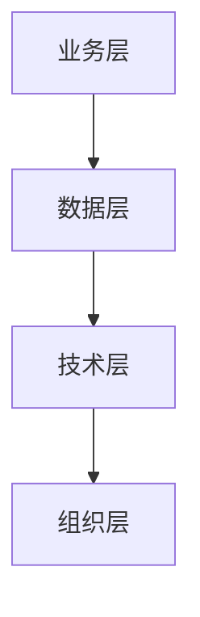
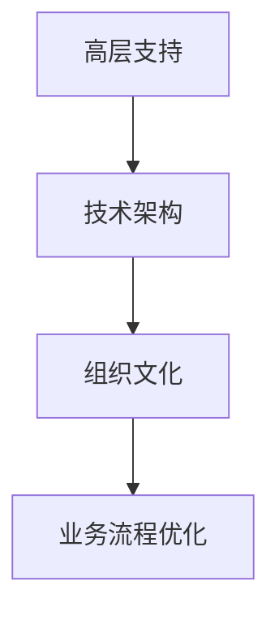
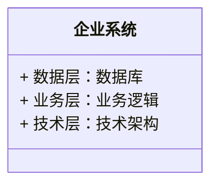
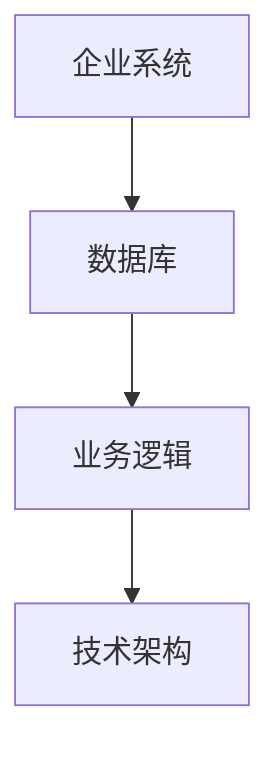
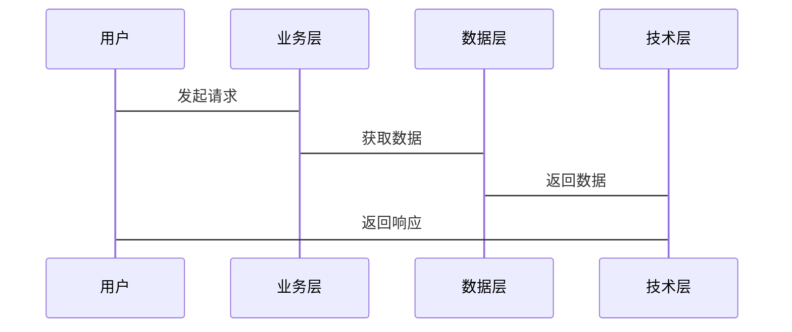

                 


# 如何评估企业的数字化转型

## 关键词：企业数字化转型、评估方法论、系统架构设计、项目实战、最佳实践

## 摘要：  
企业数字化转型是当前全球范围内企业面临的重要课题。随着信息技术的快速发展，企业需要通过数字化转型来提升竞争力、优化业务流程、提高客户体验，并实现可持续发展。本文将从背景与核心概念、评估方法论、系统分析与架构设计、项目实战、最佳实践等多个维度，详细探讨如何科学、系统地评估企业的数字化转型，为企业提供实用的指导和参考。

---

## 第1章: 企业数字化转型的背景与核心概念

### 1.1 数字化转型的背景  
随着信息技术的飞速发展，企业面临着前所未有的数字化转型压力。  

#### 1.1.1 信息技术发展的历史演变  
从工业革命到数字时代，信息技术的演变推动了社会的进步。  
- **第一阶段**：计算机技术的诞生（20世纪50年代-70年代）。  
- **第二阶段**：互联网的普及（20世纪90年代）。  
- **第三阶段**：大数据、人工智能和云计算的兴起（21世纪初至今）。  

#### 1.1.2 企业数字化转型的必要性  
企业数字化转型不仅是技术发展的结果，更是生存与发展的必然要求。  
- 提高效率：通过自动化减少人工干预，降低运营成本。  
- 创新业务模式：数字化转型为企业创造新的收入来源。  
- 提升客户体验：通过数据驱动的个性化服务满足客户需求。  

#### 1.1.3 数字化转型的核心驱动力  
- **技术驱动**：大数据、人工智能、物联网等技术的快速发展。  
- **业务驱动**：市场竞争压力迫使企业进行数字化创新。  
- **组织驱动**：企业内部对高效协作和灵活响应的需求。  

### 1.2 数字化转型的定义与内涵  

#### 1.2.1 数字化转型的定义  
数字化转型是指企业利用数字技术改变其业务模式、流程、文化、组织结构，以及与客户和利益相关者的互动方式。  

#### 1.2.2 数字化转型的核心要素  
- **数据**：数据是数字化转型的核心资源。  
- **技术**：包括云计算、大数据、人工智能等技术的支撑。  
- **组织文化**：企业文化和组织结构需要适应数字化要求。  

#### 1.2.3 数字化转型与信息化的区别与联系  
- **信息化**：侧重于将业务流程电子化，提高效率。  
- **数字化转型**：更注重数据的深度应用和业务模式的创新。  

### 1.3 数字化转型的框架与目标  

#### 1.3.1 数字化转型的框架体系  
数字化转型可以分为以下几个方面：  
1. **业务层面**：重新设计业务流程，优化资源配置。  
2. **技术层面**：构建支持数字化转型的技术架构。  
3. **组织层面**：调整组织结构，培养数字化人才。  

#### 1.3.2 数字化转型的主要目标  
- **提升效率**：通过自动化减少冗余流程。  
- **创新业务模式**：通过数据驱动创造新的价值。  
- **增强客户体验**：提供个性化服务，提高客户满意度。  

#### 1.3.3 数字化转型的关键成功因素  
- **领导层支持**：高层管理者对数字化转型的重视。  
- **技术架构**：构建灵活且可扩展的技术架构。  
- **人才培养**：培养具备数字化能力的员工队伍。  

### 1.4 数字化转型的成熟度模型  

#### 1.4.1 数字化转型成熟度的五个阶段  
1. **初始阶段**：企业刚开始接触数字化技术，仅在部分领域应用。  
2. **基础阶段**：企业开始在核心业务流程中应用数字化技术。  
3. **中级阶段**：企业实现数据的共享和部分智能化应用。  
4. **高级阶段**：企业实现全面数字化，业务流程高度自动化。  
5. **领先阶段**：企业通过数据驱动创新，成为行业标杆。  

#### 1.4.2 企业数字化成熟度评估方法  
- **自评估问卷**：通过问卷调查评估企业在各个阶段的表现。  
- **对标分析**：将企业与行业标杆进行对比。  

#### 1.4.3 不同阶段的特征与挑战  
- **初始阶段**：缺乏数字化意识，技术应用水平低。  
- **基础阶段**：技术应用局部化，缺乏系统性。  
- **中级阶段**：数据孤岛现象依然存在，智能化水平有限。  

---

## 第2章: 数字化转型的核心概念与联系  

### 2.1 数字化转型的核心概念  

#### 2.1.1 数据驱动的业务模式  
- 数据是企业决策的核心依据。  
- 通过数据分析优化业务流程。  

#### 2.1.2 数字技术的深度融合  
- 云计算、大数据、人工智能等技术的协同应用。  
- 技术与业务的深度融合是数字化转型的关键。  

#### 2.1.3 业务流程的重构与优化  
- 通过数字化技术重新设计业务流程。  
- 优化流程以提高效率和客户满意度。  

### 2.2 数字化转型的关键成功因素  

#### 2.2.1 企业文化与组织结构  
- 企业文化需要支持创新和数字化转型。  
- 组织结构需要灵活适应数字化需求。  

#### 2.2.2 人才与技能要求  
- 培养具备数字化能力的人才。  
- 提供持续的培训和学习机会。  

#### 2.2.3 技术架构与基础设施  
- 构建支持数字化转型的技术架构。  
- 确保基础设施的稳定性和安全性。  

### 2.3 数字化转型的系统性分析  

#### 2.3.1 业务、技术和组织的三重维度  
- **业务维度**：业务流程的优化与创新。  
- **技术维度**：技术架构的设计与实施。  
- **组织维度**：组织文化的塑造与调整。  

#### 2.3.2 数字化转型的系统架构图  



#### 2.3.3 关键成功因素的因果关系图  



### 2.4 本章小结  

---

## 第3章: 企业数字化转型的评估方法论  

### 3.1 数字化转型评估的框架  

#### 3.1.1 评估框架的构建  
- 从业务、技术、组织三个维度构建评估框架。  

#### 3.1.2 评估维度的选择  
- **业务维度**：评估业务流程的优化程度。  
- **技术维度**：评估技术架构的成熟度。  
- **组织维度**：评估组织文化的适应性。  

#### 3.1.3 评估指标的设计  
- 设计量化和非量化指标相结合的评估体系。  

### 3.2 数字化转型评估的指标体系  

#### 3.2.1 业务维度的评估指标  
- 业务流程自动化率  
- 客户满意度  
- 业务创新成果  

#### 3.2.2 技术维度的评估指标  
- 技术架构的灵活性  
- 系统的可扩展性  
- 数据的完整性  

#### 3.2.3 组织维度的评估指标  
- 员工数字化意识  
- 组织结构的灵活性  
- 人才储备情况  

### 3.3 数字化转型评估的实施步骤  

#### 3.3.1 准备阶段  
- 明确评估目标  
- 收集相关数据  

#### 3.3.2 实施阶段  
- 选择评估方法  
- 进行数据采集和分析  

#### 3.3.3 优化阶段  
- 根据评估结果制定改进措施  
- 实施优化并持续监控  

### 3.4 数字化转型评估的工具与方法  

#### 3.4.1 自评估问卷  
- 设计问卷，收集企业数字化转型的现状。  

#### 3.4.2 数据分析工具  
- 使用Excel或数据分析软件进行数据建模和分析。  

#### 3.4.3 专家访谈法  
- 通过访谈了解企业的实际情况。  

### 3.5 本章小结  

---

## 第4章: 企业数字化转型的系统分析与架构设计  

### 4.1 企业数字化转型的系统分析  

#### 4.1.1 问题场景的识别与分析  
- 识别企业在数字化转型中的关键问题。  
- 分析问题的根源和影响。  

#### 4.1.2 项目介绍  
- 简要介绍数字化转型项目的背景和目标。  

#### 4.1.3 系统功能设计  



#### 4.1.4 系统架构设计  



### 4.2 企业数字化转型的架构设计  

#### 4.2.1 系统架构图  


#### 4.2.2 系统接口设计  
- 设计系统的接口，确保各个模块之间的通信顺畅。  

#### 4.2.3 系统交互设计  



### 4.3 本章小结  

---

## 第5章: 数字化转型项目的实战  

### 5.1 项目环境安装  

#### 5.1.1 环境需求  
- 操作系统：Windows 10 或更高版本，或 Linux 系统。  
- 开发工具：Visual Studio、IntelliJ IDEA 等。  
- 数据库：MySQL、PostgreSQL 等。  

#### 5.1.2 安装步骤  
1. 安装操作系统。  
2. 安装开发工具。  
3. 安装数据库。  

### 5.2 系统核心实现  

#### 5.2.1 核心代码实现  
```python
def assess_digital_transformation(business_process, technology_architecture, organization Culture):
    # 业务流程评估
    business_score = calculate_business_score(business_process)
    # 技术架构评估
    tech_score = calculate_tech_score(technology_architecture)
    # 组织文化评估
    culture_score = calculate_culture_score(organization_Culture)
    # 综合评分
    total_score = (business_score + tech_score + culture_score) / 3
    return total_score

def calculate_business_score(process):
    # 计算业务流程评分
    pass

def calculate_tech_score(architecture):
    # 计算技术架构评分
    pass

def calculate_culture_score(culture):
    # 计算组织文化评分
    pass
```

#### 5.2.2 代码应用解读与分析  
- 以上代码示例展示了如何评估企业的业务流程、技术架构和组织文化。  
- 通过函数调用，可以计算出企业的综合数字化转型评分。  

### 5.3 实际案例分析  

#### 5.3.1 案例介绍  
- 某制造企业通过数字化转型实现了生产流程的自动化。  

#### 5.3.2 案例分析  
- 业务流程优化：从手动操作到自动化。  
- 技术架构升级：引入了物联网和大数据技术。  
- 组织文化调整：培养了员工的数字化意识。  

### 5.4 项目小结  

---

## 第6章: 数字化转型的最佳实践  

### 6.1 关键成功因素总结  

#### 6.1.1 高层支持的重要性  
- 高层领导的重视是数字化转型成功的关键。  

#### 6.1.2 技术架构的选择  
- 选择适合企业需求的技术架构，确保系统的灵活性和可扩展性。  

#### 6.1.3 人才培养与组织文化  
- 培养数字化人才，塑造支持创新的企业文化。  

### 6.2 小结与注意事项  

#### 6.2.1 小结  
- 数字化转型是一个系统工程，需要企业从多个维度进行全面考虑。  

#### 6.2.2 注意事项  
- 在实施过程中，企业需要注重数据安全和隐私保护。  
- 数字化转型需要长期投入，不能急于求成。  

### 6.3 未来展望  

#### 6.3.1 数字化转型的趋势  
- 人工智能和大数据技术将进一步深度融合。  
- 企业将更加注重数据驱动的创新。  

### 6.4 拓展阅读  

#### 6.4.1 推荐书籍  
- 《数字化转型：技术与管理的双轮驱动》  
- 《企业架构与数字化转型》  

#### 6.4.2 推荐工具  
- 数据分析工具：Python、R、Tableau  
- 项目管理工具：Jira、Trello  

---

## 附录  

### 附录A: 数字化转型术语表  
- **数字化转型**：指企业利用数字技术改变其业务模式、流程、文化、组织结构等。  
- **数据驱动**：以数据为基础，通过分析数据进行决策。  

### 附录B: 数字化转型工具清单  
- 数据分析工具：Python、R、Tableau  
- 项目管理工具：Jira、Trello  

---

## 作者：AI天才研究院 & 禅与计算机程序设计艺术

