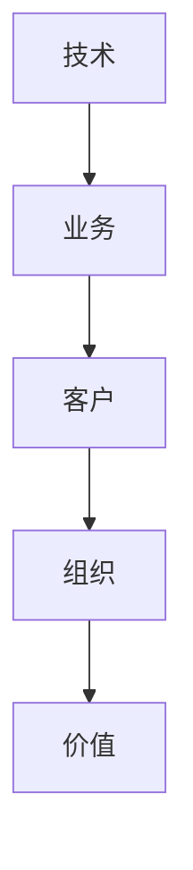
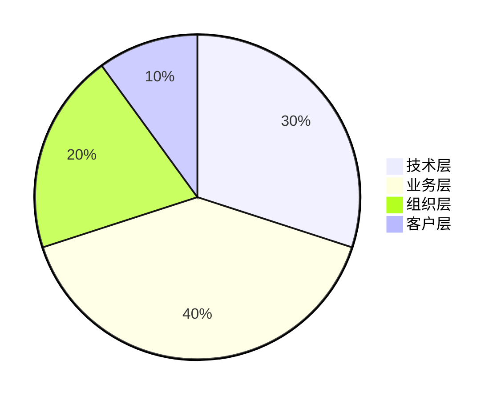

                 


# 如何评估企业的数字化转型价值

> 关键词：企业数字化转型、数字化转型价值、评估方法、KPI、成熟度模型、技术架构、业务模式

> 摘要：本文详细探讨了如何评估企业的数字化转型价值。通过分析数字化转型的核心概念、评估方法论、数学模型与工具、实施策略以及案例分析，为读者提供了一套系统化的评估框架。文章结合理论与实践，从战略、技术、业务模式等多维度出发，帮助企业全面理解数字化转型的潜在价值，并通过实际案例和工具应用，为企业的数字化转型提供了可操作的指导。

---

# 第一部分：企业数字化转型的背景与核心概念

## 第1章：数字化转型的背景与问题背景

### 1.1 数字化转型的定义与概念

#### 1.1.1 数字化转型的定义
数字化转型（Digital Transformation）是指利用数字技术（如大数据、人工智能、云计算、物联网等）对企业的产品、流程、文化、组织结构等进行重新设计，以创造新的价值。它不仅仅是技术的升级，更是一场涉及企业战略、业务模式、组织文化等全方位的变革。

#### 1.1.2 数字化转型的核心概念
- **数字技术**：包括大数据、人工智能、区块链、云计算、物联网等。
- **业务价值**：通过技术手段提升企业的效率、竞争力和客户体验。
- **组织文化**：数字化转型需要企业内部文化的转变，从传统模式向更灵活、创新的模式转变。

#### 1.1.3 数字化转型的背景与趋势
随着信息技术的飞速发展，企业面临的市场竞争日益激烈。数字化转型已成为企业生存和发展的必然选择。根据麦肯锡的报告，成功进行数字化转型的企业，其营收增长率是传统企业的4.5倍。

---

### 1.2 问题背景与问题描述

#### 1.2.1 传统企业面临的挑战
- **效率低下**：传统企业的流程复杂，信息孤岛严重，资源浪费。
- **客户体验差**：传统企业难以快速响应客户需求，客户体验不佳。
- **创新能力不足**：传统企业难以快速适应市场变化，创新动力不足。

#### 1.2.2 数字化转型的核心问题
- 如何选择适合企业的数字化转型路径？
- 如何评估数字化转型的价值？
- 如何克服转型过程中的阻力？

#### 1.2.3 企业数字化转型的边界与外延
数字化转型的边界包括企业的内部流程、外部合作伙伴、客户和供应商。外延则涉及整个产业链的数字化生态。

---

### 1.3 数字化转型的核心要素与结构

#### 1.3.1 数字化转型的领域模型
数字化转型涉及以下几个核心领域：
1. **技术**：包括数字技术的选择和应用。
2. **业务**：包括业务模式的创新和优化。
3. **组织**：包括组织结构和文化的调整。
4. **客户**：包括客户体验的提升和客户关系的管理。

#### 1.3.2 核心要素与关系图


#### 1.3.3 数字化转型的系统架构图


---

## 第2章：数字化转型的核心概念与联系

### 2.1 核心概念的原理

#### 2.1.1 数字化转型的驱动因素
- **技术驱动**：数字技术的快速发展为企业提供了新的工具和方法。
- **需求驱动**：客户对个性化、智能化服务的需求日益增加。
- **竞争驱动**：行业竞争的加剧迫使企业进行数字化转型。

#### 2.1.2 数字化转型的关键技术
- 大数据：数据的采集、存储、分析和应用。
- 人工智能：通过AI技术优化企业的决策和运营。
- 云计算：提供弹性计算资源和按需服务。
- 物联网：实现设备、系统和数据的互联。

#### 2.1.3 数字化转型的业务模式
- 传统模式：基于产品或服务的销售。
- 数字模式：基于数据、平台和生态的创新。

---

### 2.2 核心概念的属性特征对比

#### 2.2.1 传统企业与数字化企业的对比
| 特性 | 传统企业 | 数字化企业 |
|------|----------|------------|
| 技术 | 离散化、本地化 | 云端化、智能化 |
| 业务 | 线性流程 | 循环迭代 |
| 组织 | 垂直结构 | 网络化、扁平化 |
| 客户 | 单向关系 | 互动、个性化 |

#### 2.2.2 数字化转型的阶段划分
1. **初始阶段**：局部数字化。
2. **中级阶段**：业务流程优化。
3. **高级阶段**：全面数字化生态。

#### 2.2.3 数字化转型的成熟度模型
```mermaid
stage
    阶段1：初始
    阶段2：局部
    阶段3：全面
    阶段4：成熟
```

---

## 第3章：数字化转型的评估方法论

### 3.1 评估方法概述

#### 3.1.1 数字化转型的评估框架
- **战略层**：评估企业的数字化战略是否清晰。
- **技术层**：评估技术选型和实施的效果。
- **业务层**：评估业务模式和客户体验的改善。
- **组织层**：评估组织文化和团队能力的适应性。

#### 3.1.2 评估方法的分类
1. **定性评估**：通过访谈、问卷等方式收集非定量数据。
2. **定量评估**：通过数据指标（如KPI）进行量化评估。
3. **混合评估**：结合定性和定量方法的综合评估。

#### 3.1.3 评估方法的选择
根据企业的实际情况选择合适的评估方法，包括企业规模、行业特点和转型目标。

---

### 3.2 数字化转型的战略评估

#### 3.2.1 企业战略与数字化转型的关系
企业战略是数字化转型的指导方针，数字化转型是实现企业战略的重要手段。

#### 3.2.2 数字化转型的战略目标设定
- **短期目标**：提升效率、降低成本。
- **长期目标**：打造数字化生态、实现业务创新。

#### 3.2.3 数字化转型的战略实施路径
1. **制定战略计划**：明确目标、路径和资源。
2. **建立项目团队**：组建跨部门的数字化转型团队。
3. **选择合作伙伴**：与技术服务商和咨询公司合作。

---

### 3.3 数字化转型的技术评估

#### 3.3.1 技术选型评估
- 选择适合企业需求的技术（如云服务、AI平台）。
- 评估技术的可扩展性和可持续性。

#### 3.3.2 技术实施评估
- 评估技术实施的效果（如系统性能、数据安全）。
- 通过KPI（如响应时间、错误率）进行量化评估。

---

### 3.4 数字化转型的业务评估

#### 3.4.1 业务模式评估
- 评估现有业务模式的数字化潜力。
- 通过客户满意度和市场反馈进行评估。

#### 3.4.2 业务价值评估
- 通过ROI（投资回报率）计算数字化转型的经济价值。
- 通过NPS（净推荐值）评估客户体验的改善。

---

## 第4章：数字化转型的数学模型与评估指标

### 4.1 数学模型

#### 4.1.1 数字化转型价值评估模型
$$ \text{数字化转型价值} = \alpha \times \text{技术创新} + \beta \times \text{业务价值} + \gamma \times \text{组织能力} $$

其中，$\alpha$、$\beta$、$\gamma$为权重系数，取值范围为$0 \leq \alpha, \beta, \gamma \leq 1$，且$\alpha + \beta + \gamma = 1$。

---

### 4.2 评估指标

#### 4.2.1 技术指标
- 系统响应时间（秒）
- 系统可用性（%）
- 数据处理能力（TPS）

#### 4.2.2 业务指标
- 营收增长率（%）
- 成本降低比例（%）
- 客户满意度（NPS）

---

## 第5章：数字化转型的评估工具与框架

### 5.1 评估工具

#### 5.1.1 成熟度模型


#### 5.1.2 KPI框架
- **技术KPI**：系统性能、数据安全。
- **业务KPI**：营收增长、客户留存率。
- **组织KPI**：员工满意度、团队效率。

---

## 第6章：数字化转型的实施策略与最佳实践

### 6.1 实施策略

#### 6.1.1 数字化转型的战略制定
- 明确目标：短期目标和长期目标。
- 制定计划：分阶段实施，确保可执行性。

#### 6.1.2 数字化转型的组织变革
- 建立跨部门协作机制。
- 培训员工，提升数字化能力。

---

## 第7章：案例分析

### 7.1 成功案例

#### 7.1.1 某零售企业的数字化转型
- **背景**：传统零售模式面临市场竞争加剧。
- **转型措施**：引入大数据分析、AI推荐系统、云计算。
- **成果**：销售额增长20%，客户满意度提升30%。

---

## 第8章：小结与展望

### 8.1 小结
本文从背景、核心概念、评估方法论、数学模型与工具、实施策略等多个方面，全面探讨了企业数字化转型的评估价值。通过理论与实践的结合，为企业的数字化转型提供了系统的指导和参考。

### 8.2 展望
未来，随着技术的不断进步和企业需求的多样化，数字化转型的评估方法和工具也将不断创新。企业需要持续关注行业趋势，灵活调整转型策略，以实现可持续发展。

---

作者：AI天才研究院/AI Genius Institute & 禅与计算机程序设计艺术 /Zen And The Art of Computer Programming

