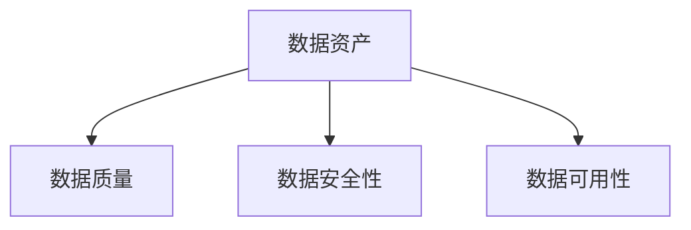
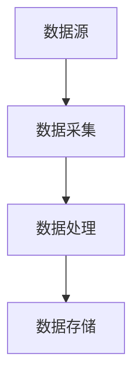
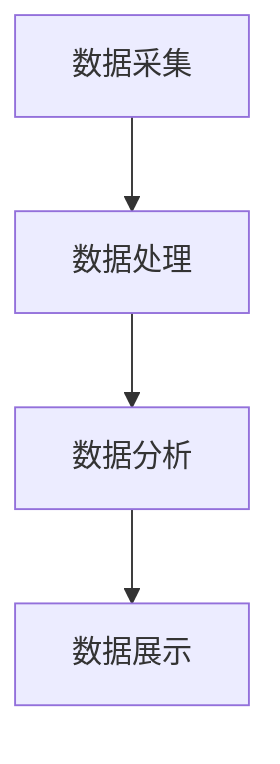
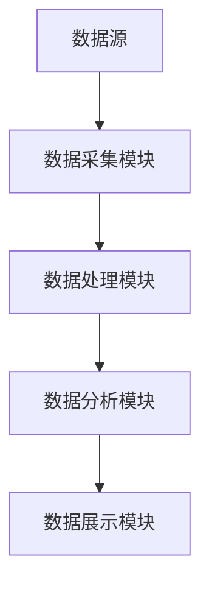
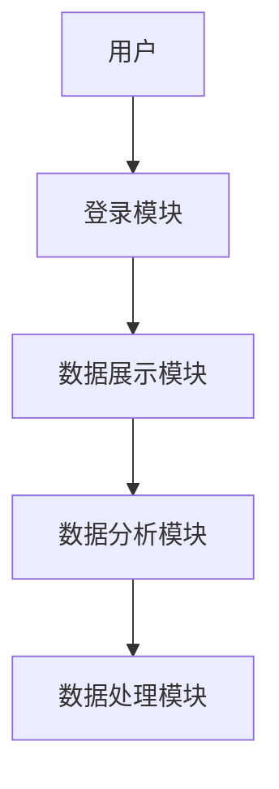

                 


# 如何评估企业的数据变现能力

> 关键词：数据变现能力, 数据资产, 数据质量, 数据安全, 数据治理, 数据驱动, 商业模式

> 摘要： 本文深入探讨了如何评估企业的数据变现能力。从数据资产的价值、数据质量的评估、数据技术能力的提升，到数据商业模式的设计与优化，本文系统地分析了数据变现能力的关键要素。通过对比分析、算法原理、系统架构设计和实际案例的详细讲解，本文为读者提供了一套全面的数据变现能力评估方法论。

---

# 第1章：数据变现能力评估的背景与意义

## 1.1 数据资产的崛起与价值

### 1.1.1 数据资产的定义与特征

数据资产是指企业在日常运营中收集、存储和处理的所有数据，这些数据可以通过分析和利用为企业创造价值。数据资产具有以下特征：

- **可测量性**：数据资产的价值可以通过量化指标进行评估。
- **可扩展性**：数据资产可以通过共享和复用为企业创造更多的价值。
- **动态性**：数据资产的价值会随着市场环境和技术的进步而变化。



### 1.1.2 数据资产在企业中的地位

数据资产是企业的一项重要无形资产，它不仅能够支持企业的日常运营，还可以通过数据变现为企业创造额外的收入来源。数据资产在企业中的地位主要体现在以下几个方面：

- **支持决策**：数据资产为企业提供精准的市场洞察和决策支持。
- **驱动创新**：数据资产是企业产品和服务创新的重要源泉。
- **提升效率**：数据资产可以帮助企业优化流程，提高运营效率。

### 1.1.3 数据驱动的商业模式

数据驱动的商业模式是指企业通过收集、分析和利用数据来实现商业价值的过程。常见的数据驱动商业模式包括：

- **数据销售**：将收集到的数据出售给第三方。
- **数据产品**：基于数据开发出具有商业价值的产品，如数据分析报告、数据可视化工具等。
- **数据服务**：为企业提供数据相关的服务，如数据清洗、数据建模等。

## 1.2 数据变现的现状与趋势

### 1.2.1 全球数据经济的发展现状

近年来，全球数据经济呈现出快速发展的态势。随着大数据技术的成熟和人工智能的广泛应用，企业对数据的依赖程度不断提高。数据经济的快速发展为企业提供了更多的数据变现机会。

### 1.2.2 数据变现的主要模式

目前，数据变现的主要模式包括：

- **数据销售**：将数据直接出售给有需求的企业或个人。
- **数据广告**：利用数据进行精准营销，通过广告投放实现收益。
- **数据服务**：为企业提供数据相关的服务，如数据清洗、数据分析等。

### 1.2.3 数据技术的演进与挑战

随着数据技术的不断演进，数据的收集、存储和分析能力得到了显著提升。然而，数据技术的发展也带来了新的挑战，如数据隐私保护、数据安全等问题。

## 1.3 数据变现能力评估的重要性

### 1.3.1 企业数据价值的衡量标准

数据价值的衡量标准主要包括数据的质量、数据的完整性和数据的可用性。企业需要通过数据质量评估来确保数据的准确性、一致性和完整性。

### 1.3.2 数据变现能力对企业的战略意义

数据变现能力是企业核心竞争力的重要组成部分。通过提升数据变现能力，企业可以实现业务模式的创新，提高市场竞争力。

### 1.3.3 数据治理与合规性的影响

数据治理和合规性是数据变现能力评估的重要因素。企业需要确保数据的合法性和合规性，避免因数据滥用或隐私泄露而面临法律风险。

## 1.4 本章小结

本章主要介绍了数据资产的定义、特征及其在企业中的地位，分析了数据驱动的商业模式，并探讨了数据变现的现状与趋势。通过这些内容，我们可以更好地理解数据变现能力评估的重要性和必要性。

---

# 第2章：数据变现能力评估的核心要素

## 2.1 数据资产的质量评估

### 2.1.1 数据的完整性

数据完整性是指数据的全面性和准确性。企业需要通过数据清洗和数据补全技术来确保数据的完整性。

```python
# 示例代码：数据清洗
import pandas as pd
data = pd.read_csv('data.csv')
# 删除重复数据
data.drop_duplicates(inplace=True)
# 处理缺失值
data.dropna(inplace=True)
```

### 2.1.2 数据的准确性

数据准确性是指数据的正确性和真实性。企业可以通过数据验证和数据校验技术来确保数据的准确性。

```python
# 示例代码：数据验证
import pandas as pd
data = pd.read_csv('data.csv')
# 验证数据类型
print(data.dtypes)
# 验证数据分布
print(data.describe())
```

### 2.1.3 数据的及时性

数据及时性是指数据的更新频率和时效性。企业需要通过实时数据采集和流数据处理技术来确保数据的及时性。

```python
# 示例代码：实时数据处理
import kafka
from kafka import KafkaConsumer
consumer = KafkaConsumer('data_topic')
for message in consumer:
    print(message.value)
```

## 2.2 数据技术能力的评估

### 2.2.1 数据采集与处理技术

数据采集与处理技术是数据变现能力评估的重要组成部分。企业需要通过高效的数据采集和处理技术来确保数据的可用性和可操作性。



### 2.2.2 数据分析与挖掘技术

数据分析与挖掘技术是数据变现能力评估的核心技术。企业需要通过先进的数据分析和挖掘技术来提取数据中的价值。

```python
# 示例代码：数据分析
import pandas as pd
data = pd.read_csv('data.csv')
# 数据可视化
import matplotlib.pyplot as plt
data.plot(kind='scatter', x='x', y='y')
plt.show()
```

### 2.2.3 数据安全与隐私保护

数据安全与隐私保护是数据变现能力评估的重要保障。企业需要通过严格的数据安全措施来确保数据的机密性和完整性。

## 2.3 数据商业模式的评估

### 2.3.1 数据变现的主要模式

数据变现的主要模式包括数据销售、数据广告和数据服务。企业需要根据自身特点选择适合的模式。

### 2.3.2 数据产品的设计与实现

数据产品的设计与实现是数据变现能力评估的重要环节。企业需要通过数据产品的开发来实现数据的价值。

### 2.3.3 数据服务的定价策略

数据服务的定价策略是数据变现能力评估的重要因素。企业需要根据市场供需和成本因素制定合理的定价策略。

## 2.4 核心要素的综合分析

### 2.4.1 数据资产、技术和商业模式的协同关系

数据资产、技术和商业模式三者之间存在协同关系。企业需要通过数据资产的质量、技术能力和商业模式的优化来提升数据变现能力。

### 2.4.2 核心要素的权重分配

企业需要根据自身特点和市场环境对数据资产、技术和商业模式的核心要素进行权重分配。

### 2.4.3 核心要素的动态变化

数据资产、技术和商业模式的核心要素会随着市场环境和技术进步而发生变化。企业需要定期评估和优化核心要素。

## 2.5 本章小结

本章主要介绍了数据资产的质量评估、数据技术能力的评估和数据商业模式的评估。通过这些内容，我们可以更好地理解数据变现能力的核心要素及其相互关系。

---

# 第3章：数据变现能力评估的理论框架与方法论

## 3.1 数据变现能力评估的理论基础

### 3.1.1 数据价值的评估模型

数据价值的评估模型是数据变现能力评估的重要理论基础。常见的数据价值评估模型包括数据质量评估模型和数据资产价值评估模型。

### 3.1.2 数据资产的生命周期

数据资产的生命周期包括数据采集、数据存储、数据分析、数据应用和数据归档五个阶段。

### 3.1.3 数据驱动的商业价值

数据驱动的商业价值是数据变现能力评估的核心内容。企业需要通过数据驱动的商业价值实现数据的价值。

## 3.2 数据变现能力评估的方法论

### 3.2.1 数据质量评估指标体系

数据质量评估指标体系包括数据完整性、数据准确性、数据一致性和数据及时性四个指标。

### 3.2.2 数据技术能力评估框架

数据技术能力评估框架包括数据采集能力、数据处理能力、数据分析能力和数据安全能力四个维度。

### 3.2.3 数据商业模式的评估维度

数据商业模式的评估维度包括数据产品设计、数据服务定价和数据市场环境三个维度。

## 3.3 数据变现能力评估的流程与步骤

### 3.3.1 评估目标的确定

企业需要根据自身特点和市场环境确定数据变现能力评估的目标。

### 3.3.2 数据收集与准备

企业需要收集和准备相关的数据，包括数据清洗、数据整合和数据转换。

### 3.3.3 数据分析与评估

企业需要通过数据分析和评估来确定数据资产的质量和技术能力。

### 3.3.4 评估结果的解读与优化

企业需要根据评估结果进行解读和优化，以提升数据变现能力。

## 3.4 本章小结

本章主要介绍了数据变现能力评估的理论基础和方法论。通过这些内容，我们可以系统地进行数据变现能力的评估和优化。

---

# 第4章：数据变现能力评估的系统架构与实现

## 4.1 数据变现能力评估系统的总体架构

### 4.1.1 系统功能模块划分

数据变现能力评估系统主要包括数据采集模块、数据处理模块、数据分析模块和数据展示模块四个功能模块。

### 4.1.2 系统数据流设计

数据流设计包括数据采集、数据处理、数据分析和数据展示四个流程。

### 4.1.3 系统架构的可扩展性

系统架构需要具有良好的可扩展性，以便适应未来业务需求的变化。

## 4.2 系统功能设计

### 4.2.1 领域模型设计

领域模型设计是数据变现能力评估系统的核心设计内容。通过领域模型设计，我们可以清晰地理解系统的功能模块和数据关系。



### 4.2.2 系统架构设计

系统架构设计是数据变现能力评估系统的重要组成部分。通过系统架构设计，我们可以确保系统的稳定性和可扩展性。



### 4.2.3 系统接口设计

系统接口设计是数据变现能力评估系统的重要环节。企业需要根据实际需求设计合理的接口，以便与其他系统进行集成。

### 4.2.4 系统交互设计

系统交互设计是数据变现能力评估系统的重要内容。通过系统交互设计，我们可以确保系统的易用性和用户体验。



## 4.3 本章小结

本章主要介绍了数据变现能力评估系统的总体架构和系统功能设计。通过这些内容，我们可以更好地理解数据变现能力评估系统的实现过程。

---

# 第5章：数据变现能力评估的项目实战

## 5.1 环境安装与配置

### 5.1.1 系统环境要求

数据变现能力评估系统需要运行在稳定的服务器环境中，建议使用Linux操作系统和Python编程语言。

### 5.1.2 系统依赖库安装

企业需要安装相关的依赖库，如Pandas、Matplotlib、Scikit-learn等。

```bash
pip install pandas matplotlib scikit-learn
```

## 5.2 系统核心实现

### 5.2.1 数据采集与处理

企业需要通过数据采集模块从各种数据源中采集数据，并进行数据清洗和数据转换。

```python
import pandas as pd
data = pd.read_csv('data.csv')
# 数据清洗
data.dropna(inplace=True)
data.drop_duplicates(inplace=True)
```

### 5.2.2 数据分析与评估

企业需要通过数据分析模块对数据进行分析和评估，提取数据中的价值。

```python
import pandas as pd
import matplotlib.pyplot as plt
data = pd.read_csv('data.csv')
# 数据可视化
data.plot(kind='hist')
plt.show()
```

### 5.2.3 数据展示与报告

企业需要通过数据展示模块将分析结果以图表和报告的形式展示出来，便于决策者理解和应用。

```python
import pandas as pd
import matplotlib.pyplot as plt
data = pd.read_csv('data.csv')
# 数据展示
data.head()
```

## 5.3 实际案例分析

### 5.3.1 案例背景介绍

假设某企业是一家电子商务公司，希望通过数据变现能力评估来优化其数据驱动的商业模式。

### 5.3.2 数据采集与准备

企业需要从其电子商务平台中采集销售数据、用户数据和产品数据，并进行数据清洗和数据转换。

```python
import pandas as pd
data = pd.read_csv('data.csv')
# 数据清洗
data.dropna(inplace=True)
data.drop_duplicates(inplace=True)
```

### 5.3.3 数据分析与评估

企业需要通过数据分析模块对数据进行分析和评估，提取数据中的价值。

```python
import pandas as pd
import matplotlib.pyplot as plt
data = pd.read_csv('data.csv')
# 数据可视化
data.plot(kind='line')
plt.show()
```

### 5.3.4 数据展示与报告

企业需要通过数据展示模块将分析结果以图表和报告的形式展示出来，便于决策者理解和应用。

```python
import pandas as pd
import matplotlib.pyplot as plt
data = pd.read_csv('data.csv')
# 数据展示
data.head()
```

## 5.4 本章小结

本章通过一个实际案例，详细讲解了数据变现能力评估的环境安装、系统实现和案例分析。通过这些内容，读者可以更好地理解如何在实际中应用数据变现能力评估的方法论。

---

# 第6章：数据变现能力评估的总结与展望

## 6.1 总结

通过本文的详细讲解，我们可以系统地理解数据变现能力评估的核心要素、理论框架和实现方法。数据变现能力评估是企业提升数据价值的重要手段，也是企业实现数据驱动的重要基础。

## 6.2 展望

随着数据技术的不断发展和数据市场的逐步成熟，数据变现能力评估将更加重要。未来，企业需要更加注重数据资产的管理和数据技术的创新，以实现数据价值的最大化。

## 6.3 最佳实践 Tips

- 数据资产的质量是数据变现能力评估的核心。
- 数据技术能力是数据变现能力评估的重要保障。
- 数据商业模式是数据变现能力评估的关键。

## 6.4 注意事项

- 数据隐私保护和数据安全是数据变现能力评估的重要内容。
- 数据变现能力评估需要结合企业的实际情况和市场环境。
- 数据变现能力评估是一个动态过程，需要持续优化和调整。

## 6.5 拓展阅读

建议读者进一步阅读以下内容，以深入理解数据变现能力评估的相关知识：

- 《数据驱动的商业分析》
- 《数据科学实战指南》
- 《数据安全与隐私保护》

---

# 作者：AI天才研究院/AI Genius Institute & 禅与计算机程序设计艺术 /Zen And The Art of Computer Programming

