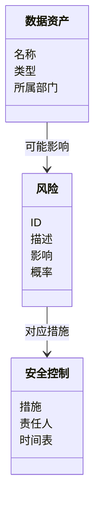
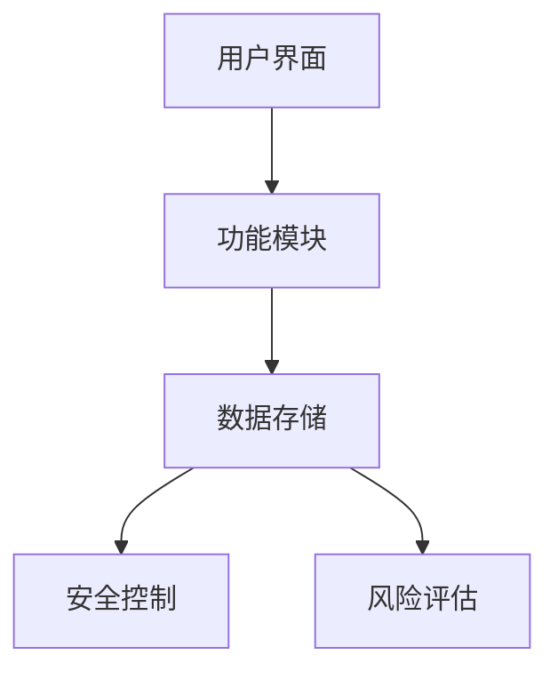
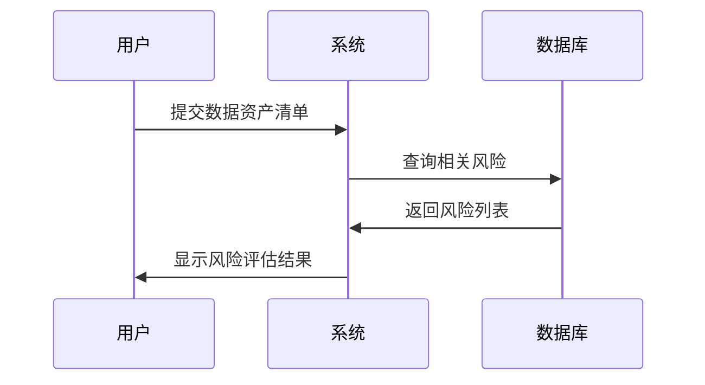

                 


# 如何评估企业的数据安全能力

---

## 关键词：数据安全能力评估、企业数据安全、风险管理、安全框架、数据保护

---

## 摘要：  
在当前数字化转型的背景下，数据安全已成为企业生存和发展的核心问题。本文将从背景、核心概念、评估方法论、系统设计、项目实战等多个维度，全面解析如何科学评估企业的数据安全能力，帮助企业识别风险、优化安全策略，并通过实际案例和最佳实践提供可操作的解决方案。

---

## 第一部分：数据安全能力评估的背景与重要性

---

### 第1章：数据安全能力评估的背景与重要性

#### 1.1 数据安全的基本概念

##### 1.1.1 数据的定义与分类
- 数据是企业的核心资产，按敏感程度可分为公开数据、内部数据、机密数据和核心数据。
- 数据分类示例：公开数据（如公司官网信息）、内部数据（如员工信息）、机密数据（如商业计划书）、核心数据（如客户数据库）。

##### 1.1.2 数据安全的核心概念
- 数据安全是指保护数据的机密性、完整性、可用性（CIA三原则）。
- 数据安全的目标是防止数据泄露、篡改、丢失或未经授权的访问。

##### 1.1.3 数据安全的重要性
- 数据泄露可能导致企业经济损失、声誉损害和法律责任。
- 数据安全是合规性要求的重要组成部分（如GDPR、ISO 27001）。

#### 1.2 当前数据安全的威胁环境

##### 1.2.1 常见的数据安全威胁
- 网络攻击：如DDoS、钓鱼攻击、勒索软件。
- 内部威胁：员工误操作或恶意行为。
- 数据泄露：未经授权的第三方访问。

##### 1.2.2 数据泄露的案例分析
- Facebook数据泄露事件：超过5亿用户信息被泄露。
- Equifax数据泄露事件：影响1.47亿人。

##### 1.2.3 数据安全的法律与合规要求
- GDPR（欧盟通用数据保护条例）：要求企业保护个人数据。
- CCPA（加州消费者隐私法案）：赋予消费者更多数据控制权。

#### 1.3 企业数据安全能力评估的必要性

##### 1.3.1 评估的目的与意义
- 识别数据安全风险，制定改进计划。
- 确保数据在全生命周期中的安全。
- 符合监管要求，避免法律风险。

##### 1.3.2 评估对企业的影响
- 提高数据安全性，保护企业资产。
- 增强客户信任，提升品牌价值。
- 降低合规成本，避免罚款。

##### 1.3.3 如何通过评估提升数据安全能力
- 制定数据安全策略。
- 建立安全基线。
- 定期进行安全演练。

---

## 第二部分：数据安全能力评估的核心概念与框架

---

### 第2章：数据安全能力评估的核心概念

#### 2.1 数据安全能力评估的维度

##### 2.1.1 技术能力
- 网络安全：防火墙、入侵检测系统。
- 数据加密：传输加密、存储加密。
- 访问控制：基于角色的访问控制（RBAC）。

##### 2.1.2 管理能力
- 安全策略：制定和执行数据安全策略。
- 风险管理：识别、评估和应对风险。
- 安全意识：员工培训和教育。

##### 2.1.3 人员能力
- 安全团队：专业人员配置。
- 培训计划：提升员工安全意识。
- 第三方管理：供应商和合作伙伴的安全评估。

#### 2.2 数据安全能力评估的模型与框架

##### 2.2.1 ISO 27001框架
- **范围**：信息安全管理。
- **核心内容**：11个控制领域，包括信息安全管理、人力资源安全、物理安全等。
- **优势**：全面、系统，适合企业级应用。

##### 2.2.2 NIST网络安全框架
- **范围**：网络安全架构。
- **核心内容**：分为五个功能类别：识别、保护、检测、响应、恢复。
- **优势**：灵活性高，适用于不同规模的企业。

##### 2.2.3 其他相关模型对比
| 模型 | 适用范围 | 核心内容 | 优缺点 |
|------|----------|----------|--------|
| ISO 27001 | 信息安全管理 | 11个控制领域 | 全面但复杂 |
| NIST框架 | 网络安全 | 五项功能类别 | 灵活但需定制 |
| GDPR | 数据保护 | 数据处理合规 | 法律导向 |

#### 2.3 数据安全能力评估的核心要素

##### 2.3.1 资产识别与分类
- 资产识别：列出所有数据资产。
- 资产分类：根据敏感性分类。
- 资产清点工具：资产管理系统、CMDB。

##### 2.3.2 风险评估方法
- 风险识别：识别潜在威胁。
- 风险分析：评估风险的可能性和影响。
- 风险处理：制定应对措施。

##### 2.3.3 安全控制措施
- 技术措施：防火墙、入侵检测系统。
- 管理措施：安全策略、培训计划。
- 组织措施：建立安全团队、第三方管理。

---

## 第三部分：数据安全能力评估的方法论

---

### 第3章：数据安全能力评估的方法论

#### 3.1 数据安全能力评估的目标设定

##### 3.1.1 明确评估的目的
- 确定评估是为了合规、风险管理还是优化安全策略。
- 示例：目标是“通过评估识别数据安全风险，制定改进计划”。

##### 3.1.2 设定评估的范围
- 确定评估的边界：如特定业务部门或整个企业。
- 示例：评估范围包括IT系统、数据存储和传输过程。

##### 3.1.3 确定评估的指标
- 技术指标：安全设备的部署率。
- 管理指标：安全策略的覆盖率。
- 人员指标：员工培训的覆盖率。

#### 3.2 数据安全能力评估的模型选择

##### 3.2.1 模型的选择标准
- 选择适合企业规模和行业的模型。
- 考虑模型的可操作性和可扩展性。

##### 3.2.2 常用模型的优缺点对比
| 模型 | 优缺点 | 适用场景 |
|------|--------|----------|
| ISO 27001 | 全面但复杂 | 大型企业 |
| NIST框架 | 灵活但需定制 | 中小企业 |
| GDPR | 法律导向 | 需要合规的企业 |

##### 3.2.3 模型选择的注意事项
- 结合企业实际情况选择模型。
- 组合使用多个模型以覆盖不同方面。

#### 3.3 数据安全能力评估的实施步骤

##### 3.3.1 准备阶段
- 明确目标、范围和指标。
- 组建评估团队，包括内部IT人员和第三方专家。
- 制定评估计划，包括时间表和资源分配。

##### 3.3.2 实施阶段
- 数据收集：通过问卷、访谈等方式收集数据。
- 风险评估：识别和分析潜在风险。
- 安全检查：检查现有安全措施的有效性。

##### 3.3.3 分析阶段
- 数据分析：使用统计方法分析风险分布。
- 问题诊断：找出主要风险和薄弱环节。
- 评估结果：生成评估报告，提出改进建议。

##### 3.3.4 改进阶段
- 制定改进计划：包括短期和长期措施。
- 实施改进：部署新技术、优化流程、培训员工。
- 监测与评估：定期检查改进效果。

---

## 第四部分：数据安全能力评估的系统分析与架构设计

---

### 第4章：数据安全能力评估的系统分析与架构设计

#### 4.1 问题场景介绍

##### 4.1.1 问题描述
- 某企业需要评估其数据安全能力，但缺乏系统化的评估方法。
- 数据分散在多个系统中，难以统一管理。

##### 4.1.2 项目介绍
- 项目目标：建立数据安全能力评估系统，帮助企业管理数据安全风险。
- 项目范围：覆盖企业的所有数据资产和IT系统。

#### 4.2 系统功能设计

##### 4.2.1 功能模块划分
- 资产管理模块：资产识别、分类、清点。
- 风险评估模块：风险识别、分析、应对。
- 安全检查模块：检查现有安全措施，生成报告。
- 改进建议模块：根据评估结果，提出优化方案。

##### 4.2.2 领域模型类图


#### 4.3 系统架构设计

##### 4.3.1 系统架构图


##### 4.3.2 系统接口设计
- 输入接口：数据资产清单、安全策略文档。
- 输出接口：评估报告、改进建议。

##### 4.3.3 系统交互序列图


#### 4.4 系统实现细节

##### 4.4.1 数据资产识别
- 使用资产管理系统进行资产识别。
- 通过数据分类标准对资产进行分类。

##### 4.4.2 风险评估实现
- 使用风险评估工具（如RiskManager）进行风险分析。
- 根据威胁情报库更新风险评估结果。

##### 4.4.3 安全检查工具
- 使用漏洞扫描工具（如Nessus）检查系统漏洞。
- 使用渗透测试工具（如Metasploit）模拟攻击。

---

## 第五部分：数据安全能力评估的项目实战

---

### 第5章：数据安全能力评估的项目实战

#### 5.1 环境安装

##### 5.1.1 系统环境
- 操作系统：Linux CentOS 7.6
- 数据库：MySQL 5.7
- 应用服务器：Apache Tomcat 8.5
- 开发工具：IntelliJ IDEA 2020.3

#### 5.2 核心实现源代码

##### 5.2.1 数据资产识别模块
```python
def identify_assets():
    assets = []
    # 从数据库查询资产信息
    cursor.execute("SELECT * FROM assets")
    for row in cursor.fetchall():
        assets.append(row)
    return assets
```

##### 5.2.2 风险评估模块
```python
def assess_risk(assets):
    risks = []
    for asset in assets:
        # 评估每个资产的风险
        risk = {
            'asset_id': asset[0],
            'description': asset[1],
            'impact': asset[2],
            'probability': asset[3]
        }
        risks.append(risk)
    return risks
```

##### 5.2.3 安全检查模块
```python
def perform_audit():
    # 执行安全检查
    audit_results = []
    # 示例：检查防火墙状态
    result = subprocess.run(['iptables', '-L'], capture_output=True, text=True)
    audit_results.append(result.stdout)
    return audit_results
```

#### 5.3 代码应用解读与分析

##### 5.3.1 数据资产识别模块
- 该模块从数据库中查询所有资产信息，返回资产列表。
- 输入：无
- 输出：资产列表

##### 5.3.2 风险评估模块
- 根据每个资产的风险信息，生成风险列表。
- 输入：资产列表
- 输出：风险列表

##### 5.3.3 安全检查模块
- 使用命令行工具检查系统安全状态。
- 输入：无
- 输出：检查结果

#### 5.4 实际案例分析

##### 5.4.1 案例背景
- 某企业发现客户数据存在泄露风险。
- 需要评估数据安全能力，制定改进计划。

##### 5.4.2 评估过程
- 识别数据资产：客户数据库。
- 评估风险：数据泄露可能性高。
- 制定改进措施：加强访问控制、加密数据传输。

##### 5.4.3 改进结果
- 数据传输加密：SSL证书部署。
- 访问控制优化：基于角色的访问控制。
- 定期安全演练：模拟攻击测试。

#### 5.5 项目小结

##### 5.5.1 成功经验
- 通过系统化的方法识别和评估风险。
- 制定切实可行的改进措施。

##### 5.5.2 改进措施
- 定期进行数据安全演练。
- 建立持续监控机制。
- 加强员工安全意识培训。

---

## 第六部分：数据安全能力评估的最佳实践与小结

---

### 第6章：最佳实践与小结

#### 6.1 最佳实践

##### 6.1.1 定期评估
- 每季度进行一次数据安全评估。
- 根据监管要求和业务变化调整评估频率。

##### 6.1.2 建立团队
- 设立数据安全团队，负责日常安全监控和应急响应。
- 定期组织安全培训，提升团队能力。

##### 6.1.3 使用工具
- 采用自动化工具提高评估效率。
- 工具示例：SIEM（安全信息和事件管理）、漏洞扫描工具。

#### 6.2 小结

##### 6.2.1 核心要点
- 数据安全能力评估是企业风险管理的重要组成部分。
- 通过系统化的方法识别风险，制定改进计划。
- 定期评估和优化是确保数据安全的关键。

##### 6.2.2 注意事项
- 确保评估的全面性，覆盖技术、管理和人员方面。
- 结合企业实际情况选择合适的评估模型。
- 建立持续改进机制，适应不断变化的威胁环境。

#### 6.3 拓展阅读

##### 6.3.1 推荐书籍
- 《 cybersecurity: A Comprehensive Overview 》
- 《Data Security: Principles and Practices》

##### 6.3.2 在线资源
- NIST网络安全框架指南
- ISO 27001实施指南

##### 6.3.3 专业培训
- 数据安全工程师认证
- 信息安全管理体系（ISM）培训

---

## 作者

作者：AI天才研究院/AI Genius Institute & 禅与计算机程序设计艺术/Zen And The Art of Computer Programming

---

### END

