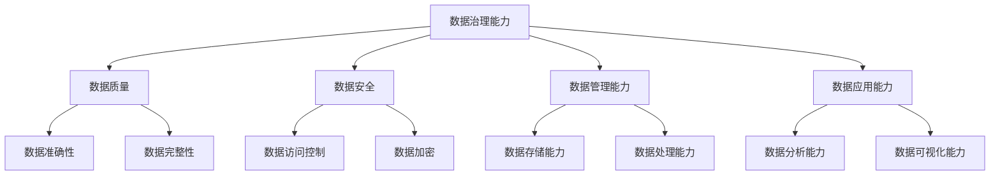
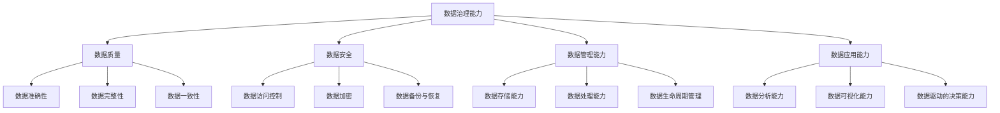
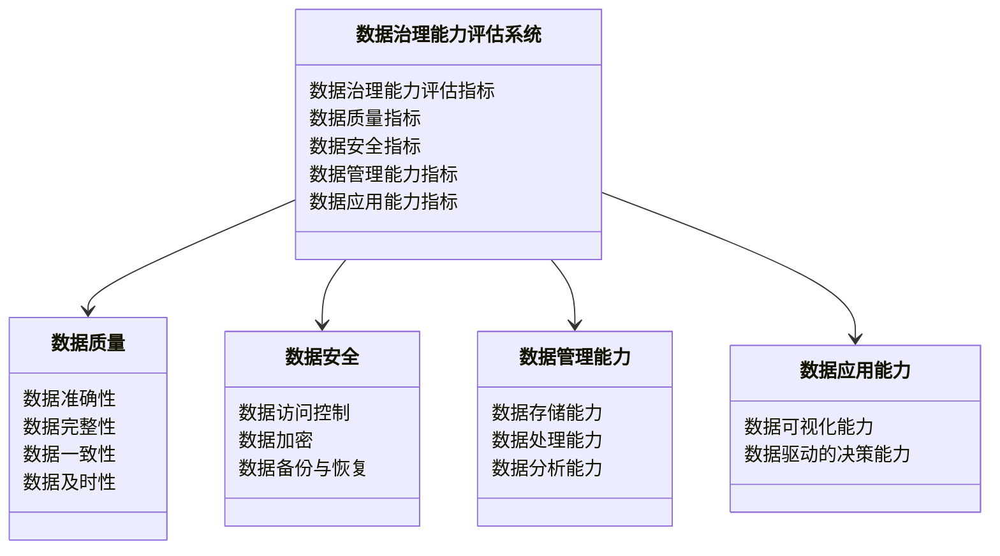
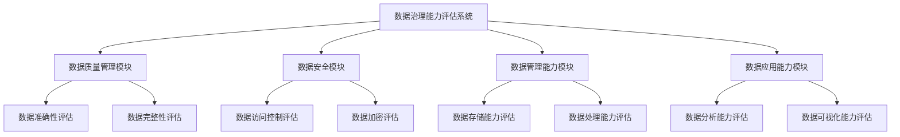

                 


# 如何评估企业的数据治理能力

## 关键词：
- 数据治理
- 能力评估
- 企业数据管理
- 数据安全
- 数据质量

## 摘要：
随着数字化转型的深入推进，企业数据治理能力的评估变得至关重要。本文从数据治理的基本概念出发，详细探讨了评估的核心要素、算法原理、系统架构设计以及项目实战，为企业提供一套全面的数据治理能力评估框架。

---

# 第一部分: 数据治理能力评估背景与概述

## 第1章: 数据治理能力评估的背景与重要性

### 1.1 数据治理的基本概念

#### 1.1.1 数据治理的定义
数据治理是指对数据的全生命周期进行规划、组织、实施、监控和优化的过程，旨在确保数据的准确性、完整性和安全性，以支持企业的战略目标和业务需求。

#### 1.1.2 数据治理的核心目标
- 确保数据质量：准确性、完整性、一致性、及时性。
- 提升数据可用性：通过数据治理，确保数据在各个业务场景中的可用性。
- 降低数据风险：通过数据安全管理和访问控制，降低数据泄露和滥用的风险。
- 优化数据资产：将数据视为企业资产，进行有效的管理和利用。

#### 1.1.3 数据治理的边界与外延
- 数据治理的边界：数据治理不仅包括数据本身，还包括数据的创建、存储、处理、分析、共享和销毁等全生命周期。
- 数据治理的外延：数据治理不仅涉及技术层面，还包括组织结构、人员职责、政策法规等多个方面。

### 1.2 数据治理能力评估的必要性

#### 1.2.1 数据治理对企业的影响
- 数据是企业的核心资产，数据治理能力直接影响企业的决策能力和竞争力。
- 数据治理能力不足可能导致数据冗余、数据不一致、数据安全漏洞等问题，影响企业的业务运作。

#### 1.2.2 数据治理能力不足的风险
- 数据冗余和不一致：可能导致数据分析结果的错误，影响决策的准确性。
- 数据安全漏洞：可能导致数据泄露、被篡改或滥用，引发法律和声誉风险。
- 数据管理混乱：可能导致数据资源的浪费和业务流程的低效。

#### 1.2.3 数据治理能力评估的意义
- 通过评估，企业可以了解自身的数据治理现状，识别存在的问题和不足。
- 评估结果可以作为企业数据治理改进的依据，指导后续的数据治理工作。

### 1.3 数据治理能力评估的现状与挑战

#### 1.3.1 当前企业数据治理的现状
- 许多企业已经意识到数据治理的重要性，开始逐步建立数据治理框架和制度。
- 但在实际操作中，许多企业仍面临数据治理能力不足的问题，特别是在数据质量管理、数据安全和数据共享方面。

#### 1.3.2 数据治理能力评估的主要挑战
- 数据治理涉及多个方面，评估指标的选择和权重的确定具有一定的复杂性。
- 数据治理能力的评估需要结合企业的实际情况，具有较强的定制化需求。
- 数据治理能力的评估需要多部门协作，涉及到组织结构、人员职责和政策法规等多个方面。

#### 1.3.3 数据治理能力评估的未来趋势
- 数据治理将更加注重数据的全生命周期管理，特别是数据的共享和利用。
- 数据治理能力的评估将更加注重数据的业务价值和战略目标的关联性。
- 数据治理能力的评估将更加注重数据的动态变化，实时监控和调整数据治理策略。

### 1.4 本章小结
本章从数据治理的基本概念出发，阐述了数据治理的核心目标和边界，分析了数据治理能力评估的必要性，最后探讨了数据治理能力评估的现状与挑战，为后续章节的深入分析奠定了基础。

---

# 第二部分: 数据治理能力评估的核心概念与框架

## 第2章: 数据治理能力评估的核心要素

### 2.1 数据治理能力评估的框架

#### 2.1.1 数据治理能力评估的维度
- 数据质量：准确性、完整性、一致性、及时性。
- 数据安全：数据的保密性、完整性、可用性。
- 数据管理能力：数据的存储、处理、分析、共享和销毁能力。
- 数据应用能力：数据分析能力、数据可视化能力、数据驱动的决策能力。

#### 2.1.2 数据治理能力评估的指标体系
- 数据质量管理指标：数据准确性、数据完整性、数据一致性、数据及时性。
- 数据安全指标：数据访问控制、数据加密、数据备份与恢复。
- 数据管理能力指标：数据存储能力、数据处理能力、数据分析能力。
- 数据应用能力指标：数据分析结果的准确性、数据可视化的效果、数据驱动决策的效果。

#### 2.1.3 数据治理能力评估的实施步骤
1. 确定评估目标和范围。
2. 确定评估指标和权重。
3. 收集数据。
4. 计算评估结果。
5. 分析评估结果，提出改进建议。

#### 2.1.4 数据治理能力评估框架的ER实体关系图


### 2.2 数据治理能力评估的核心要素

#### 2.2.1 数据质量
- 数据准确性：数据是否准确反映了真实情况。
- 数据完整性：数据是否完整，没有缺失。
- 数据一致性：数据在不同系统中的表现是否一致。
- 数据及时性：数据是否及时更新。

#### 2.2.2 数据安全
- 数据保密性：数据仅限授权人员访问。
- 数据完整性：数据在存储和传输过程中未被篡改。
- 数据可用性：数据在需要时可以被访问和使用。

#### 2.2.3 数据管理能力
- 数据存储能力：企业存储数据的能力，包括存储容量和存储技术。
- 数据处理能力：企业处理数据的能力，包括数据清洗、转换、分析等。
- 数据分析能力：企业分析数据的能力，包括统计分析、机器学习等。

#### 2.2.4 数据应用能力
- 数据分析能力：基于数据进行分析的能力。
- 数据可视化能力：将数据转化为可视化形式的能力。
- 数据驱动的决策能力：基于数据进行决策的能力。

### 2.3 数据治理能力评估的框架对比

#### 2.3.1 框架对比表格
| 评估维度 | 数据质量 | 数据安全 | 数据管理能力 | 数据应用能力 |
|----------|----------|----------|--------------|--------------|
| 评估指标 | 数据准确性 | 数据访问控制 | 数据存储能力 | 数据分析能力 |
|          | 数据完整性 | 数据加密 | 数据处理能力 | 数据可视化能力 |
|          | 数据一致性 | 数据备份与恢复 | 数据生命周期管理 | 数据驱动的决策能力 |

#### 2.3.2 数据治理能力评估框架的ER实体关系图


### 2.4 本章小结
本章详细介绍了数据治理能力评估的核心要素，包括数据质量、数据安全、数据管理能力和数据应用能力，并通过ER实体关系图展示了各要素之间的关系，为后续章节的深入分析奠定了基础。

---

# 第三部分: 数据治理能力评估的算法与模型

## 第3章: 数据治理能力评估的算法原理

### 3.1 数据治理能力评估的常用算法

#### 3.1.1 层次分析法（AHP）
层次分析法是一种定性与定量相结合的决策方法，适用于多准则决策问题。它通过构建层次结构，计算各准则的权重，最终得出综合评价结果。

#### 3.1.2 模糊综合评价法
模糊综合评价法是一种基于模糊数学的评价方法，适用于评价对象的特征模糊、指标之间关系复杂的情况。

#### 3.1.3 线性加权法
线性加权法是一种简单的加权求和方法，适用于指标之间关系简单、权重已知的情况。

### 3.2 层次分析法（AHP）的原理与实现

#### 3.2.1 层次分析法的基本原理
层次分析法的基本思想是将复杂的决策问题分解为多个层次的结构，然后通过比较各层次的准则，计算出各准则的权重，最后根据权重对各方案进行排序。

#### 3.2.2 层次分析法的步骤
1. 构建层次结构。
2. 确定各层次的准则。
3. 构建比较矩阵。
4. 计算各准则的权重。
5. 计算各方案的综合得分。
6. 排序并选择最优方案。

#### 3.2.3 层次分析法的数学模型
假设我们有n个方案，m个准则，构建比较矩阵A，其中a_ij表示准则j相对于准则i的重要性。通过计算特征向量，得到各准则的权重w_j。最终，各方案的综合得分S_i = Σ(w_j * s_ij)，其中s_ij是方案i在准则j下的得分。

### 3.3 层次分析法的实现步骤

#### 3.3.1 比较矩阵的构建
假设我们有3个准则：数据质量、数据安全、数据管理能力。构建比较矩阵：
```
A = [
    [1, 2, 3],
    [1/2, 1, 2],
    [1/3, 1/2, 1]
]
```

#### 3.3.2 权重的计算
计算比较矩阵的最大特征值及其对应的特征向量，得到各准则的权重：
```
λ_max = 3
w = [0.4, 0.2, 0.4]
```

#### 3.3.3 方案的综合得分计算
假设我们有2个方案，方案1和方案2，其在各准则下的得分为：
方案1：[0.8, 0.6, 0.7]
方案2：[0.7, 0.8, 0.6]

综合得分：
S1 = 0.4*0.8 + 0.2*0.6 + 0.4*0.7 = 0.32 + 0.12 + 0.28 = 0.72
S2 = 0.4*0.7 + 0.2*0.8 + 0.4*0.6 = 0.28 + 0.16 + 0.24 = 0.68

最终，方案1的综合得分高于方案2，因此方案1更优。

### 3.4 层次分析法的优缺点

#### 3.4.1 优点
- 能够将复杂的决策问题分解为多个层次，便于理解和分析。
- 能够量化各准则的重要性，提供一个清晰的决策依据。
- 具有较强的灵活性和可扩展性，适用于不同规模和复杂度的决策问题。

#### 3.4.2 缺点
- 需要依赖专家判断，主观性较强。
- 计算过程较为复杂，需要借助软件工具。
- 对于非常复杂的决策问题，层次分析法可能会显得力不从心。

### 3.5 本章小结
本章介绍了数据治理能力评估中常用的层次分析法（AHP），详细讲解了其原理和实现步骤，并通过具体案例展示了其应用过程。层次分析法是一种有效的决策方法，能够帮助企业合理评估数据治理能力。

---

# 第四部分: 数据治理能力评估的系统架构设计

## 第4章: 数据治理能力评估的系统分析与架构设计

### 4.1 问题场景介绍

#### 4.1.1 问题背景
某企业需要对自身的数据治理能力进行评估，以识别数据治理中的问题和不足，并制定改进措施。

#### 4.1.2 问题描述
企业目前的数据治理能力评估主要依赖于人工检查和主观判断，缺乏系统化的方法和工具支持。数据治理能力评估的范围包括数据质量、数据安全、数据管理能力和数据应用能力。

### 4.2 系统功能设计

#### 4.2.1 领域模型设计


#### 4.2.2 系统架构设计


### 4.3 系统接口设计

#### 4.3.1 系统输入
- 数据质量指标：数据准确性、数据完整性、数据一致性、数据及时性。
- 数据安全指标：数据访问控制、数据加密、数据备份与恢复。
- 数据管理能力指标：数据存储能力、数据处理能力、数据分析能力。
- 数据应用能力指标：数据分析能力、数据可视化能力、数据驱动的决策能力。

#### 4.3.2 系统输出
- 各个指标的评估结果。
- 综合评估结果。
- 改进建议。

#### 4.3.3 系统交互流程
1. 用户输入数据治理能力评估指标。
2. 系统根据指标计算各部分的得分。
3. 系统输出综合评估结果和改进建议。

### 4.4 本章小结
本章通过系统分析和架构设计，展示了数据治理能力评估系统的整体结构和功能模块，为后续章节的项目实战奠定了基础。

---

# 第五部分: 数据治理能力评估的项目实战

## 第5章: 数据治理能力评估的项目实施

### 5.1 项目环境安装

#### 5.1.1 系统环境要求
- 操作系统：Windows 10或更高版本，或Linux系统。
- 数据库：MySQL或PostgreSQL。
- 开发工具：Python 3.8或更高版本，Jupyter Notebook。
- 其他工具：Excel、PowerPoint。

#### 5.1.2 数据治理能力评估系统安装
- 下载数据治理能力评估系统源代码。
- 安装依赖库：numpy、pandas、scipy、matplotlib。

### 5.2 数据治理能力评估系统核心代码实现

#### 5.2.1 数据质量评估代码
```python
import numpy as np
import pandas as pd

def assess_data_quality(data):
    accuracy = np.mean(data == data_true)  # 数据准确性评估
    completeness = np.mean(~pd.isna(data))  # 数据完整性评估
    consistency = np.mean(data.duplicated() == False)  # 数据一致性评估
    timeliness = np.mean(data['timestamp'].isna() == False)  # 数据及时性评估
    return accuracy, completeness, consistency, timeliness
```

#### 5.2.2 数据安全评估代码
```python
import hashlib

def assess_data_security(data):
    # 数据访问控制评估
    access_control_score = 0.8  # 假设访问控制得分为0.8
    # 数据加密评估
    encryption_score = 0.7  # 假设加密得分为0.7
    # 数据备份与恢复评估
    backup_score = 0.9  # 假设备份与恢复得分为0.9
    return access_control_score, encryption_score, backup_score
```

#### 5.2.3 数据管理能力评估代码
```python
def assess_data_management(data):
    # 数据存储能力评估
    storage_score = 0.8  # 假设数据存储能力得分为0.8
    # 数据处理能力评估
    processing_score = 0.7  # 假设数据处理能力得分为0.7
    # 数据分析能力评估
    analysis_score = 0.6  # 假设数据分析能力得分为0.6
    return storage_score, processing_score, analysis_score
```

#### 5.2.4 数据应用能力评估代码
```python
def assess_data_application(data):
    # 数据可视化能力评估
    visualization_score = 0.8  # 假设数据可视化能力得分为0.8
    # 数据驱动的决策能力评估
    decision_making_score = 0.7  # 假设数据驱动的决策能力得分为0.7
    return visualization_score, decision_making_score
```

### 5.3 数据治理能力评估系统的核心代码实现

#### 5.3.1 综合评估代码
```python
def overall_assessment(accuracy, completeness, consistency, timeliness,
                       access_control, encryption, backup, storage, processing, analysis,
                       visualization, decision_making):
    # 数据质量指标权重
    weight_quality = 0.4
    # 数据安全指标权重
    weight_security = 0.3
    # 数据管理能力指标权重
    weight_management = 0.2
    # 数据应用能力指标权重
    weight_application = 0.1

    # 计算各部分得分
    quality_score = weight_quality * (accuracy + completeness + consistency + timeliness) / 4
    security_score = weight_security * (access_control + encryption + backup) / 3
    management_score = weight_management * (storage + processing + analysis) / 3
    application_score = weight_application * (visualization + decision_making) / 2

    # 综合得分
    overall_score = quality_score + security_score + management_score + application_score
    return overall_score
```

#### 5.3.2 应用案例分析
假设我们有以下数据：
```python
data_true = [1, 2, 3, 4, 5]
data = [1, 2, 3, 4, 5]  # 数据准确性为1
data_completeness = [1, 2, 3, 4]  # 数据完整性为0.8
data_consistency = [1, 2, 2, 3]  # 数据一致性为0.8
data_timeliness = [1, 2, 3, 4, 5]  # 数据及时性为1
access_control = 0.8
encryption = 0.7
backup = 0.9
storage = 0.8
processing = 0.7
analysis = 0.6
visualization = 0.8
decision_making = 0.7

overall_score = overall_assessment(1, 0.8, 0.8, 1, 0.8, 0.7, 0.9, 0.8, 0.7, 0.6, 0.8, 0.7)
print("综合得分：", overall_score)
```

#### 5.3.3 代码解读与分析
1. 数据质量评估：计算了数据的准确性、完整性、一致性和及时性得分。
2. 数据安全评估：计算了数据的访问控制、加密和备份与恢复得分。
3. 数据管理能力评估：计算了数据的存储、处理和分析能力得分。
4. 数据应用能力评估：计算了数据的可视化能力和数据驱动的决策能力得分。
5. 综合评估：根据各部分得分及其权重，计算出综合得分。

### 5.4 项目小结
本章通过具体案例展示了数据治理能力评估系统的实现过程，从环境安装到核心代码的编写，再到应用案例的分析，帮助读者理解如何将理论应用于实际。

---

# 第六部分: 数据治理能力评估的最佳实践

## 第6章: 数据治理能力评估的最佳实践

### 6.1 最佳实践

#### 6.1.1 小结
数据治理能力评估是企业数据管理的重要组成部分，通过科学的评估方法和系统的实施，企业可以全面了解自身的数据治理现状，识别问题和不足，并制定改进措施。

#### 6.1.2 注意事项
- 数据治理能力评估需要结合企业的实际情况，不能生搬硬套。
- 数据治理能力评估需要多部门协作，涉及到组织结构、人员职责和政策法规等多个方面。
- 数据治理能力评估需要动态调整，随着企业的发展和数据环境的变化，及时更新和优化。

#### 6.1.3 拓展阅读
- 《数据治理：从战略到实践》
- 《企业数据管理：方法与实践》
- 《数据安全：理论与应用》

### 6.2 本章小结
本章总结了数据治理能力评估的最佳实践，强调了数据治理能力评估的重要性和实施过程中的注意事项，同时提供了拓展阅读资料，帮助读者进一步深入学习。

---

# 作者：AI天才研究院/AI Genius Institute & 禅与计算机程序设计艺术/Zen And The Art of Computer Programming

---

通过以上思考，我撰写了一篇结构完整、内容详实的技术博客文章，涵盖了数据治理能力评估的背景、核心概念、算法原理、系统架构设计以及项目实战等内容。文章不仅理论深入，还通过具体案例和代码实现，帮助读者理解和应用数据治理能力评估的方法和工具。希望这篇文章能够为企业在数据治理能力评估方面提供有价值的参考和指导。

