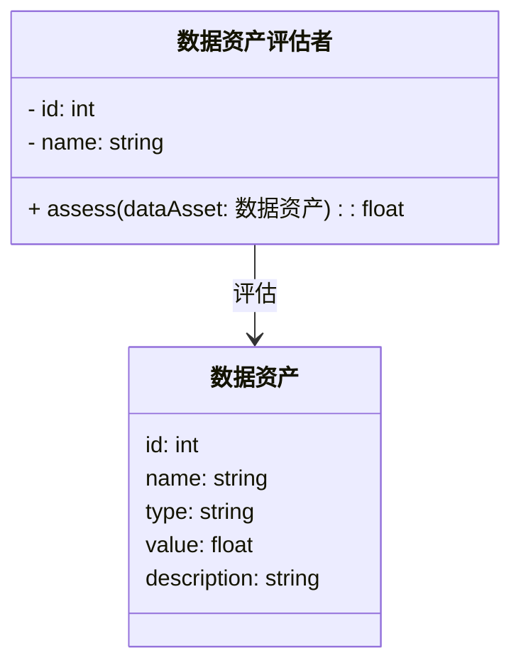

                 


# 如何评估企业的数据资产价值

> 关键词：数据资产，价值评估，数据治理，数据安全，数据质量管理，数据生命周期，数据分类

> 摘要：本文将系统地探讨如何评估企业的数据资产价值，从核心概念到算法原理，从系统设计到项目实战，全面解析数据资产价值评估的关键步骤和方法。通过实际案例分析和数学模型的构建，帮助读者掌握数据资产价值评估的核心技能。

---

# 第一部分: 数据资产价值评估的背景与核心概念

## 第1章: 数据资产价值评估的背景与问题描述

### 1.1 数据资产的基本概念

#### 1.1.1 数据资产的定义
数据资产是指企业拥有或控制的、能够为企业创造价值的数据资源。这些数据可以是结构化或非结构化的，存储在企业的各个系统中，包括客户信息、交易记录、市场数据等。

#### 1.1.2 数据资产与信息资产的区别
- **信息资产**：更广泛的概念，包括数据、软件、硬件等。
- **数据资产**：专注于数据本身，是信息资产的重要组成部分。

#### 1.1.3 数据资产的核心特征
- **可测量性**：数据资产的价值可以通过多种方式量化。
- **可访问性**：数据资产必须是可获取和可访问的。
- **可扩展性**：数据资产的价值可以通过分析和利用进一步放大。

### 1.2 数据资产价值评估的重要性

#### 1.2.1 数据资产在企业中的战略地位
数据资产是企业的重要战略资源，能够为企业创造竞争优势。

#### 1.2.2 数据资产价值评估的必要性
- **资源优化**：通过评估，企业可以识别高价值数据，优化资源配置。
- **风险管理**：评估数据价值有助于识别关键数据，制定有效的风险管理策略。

#### 1.2.3 数据资产价值评估的边界与外延
- **边界**：仅限于企业内部数据。
- **外延**：包括数据的来源、存储、处理和应用。

### 1.3 数据资产价值评估的核心要素

#### 1.3.1 数据资产的生命周期
- **创建**：数据的生成和收集。
- **存储**：数据的保存和管理。
- **处理**：数据的清洗和分析。
- **应用**：数据的应用和价值提取。

#### 1.3.2 数据资产的分类与层次
- **分类**：结构化数据、非结构化数据、半结构化数据。
- **层次**：数据、信息、知识、智慧。

#### 1.3.3 数据资产价值评估的维度
- **经济价值**：数据的直接经济效益。
- **战略价值**：数据对企业战略决策的支持作用。
- **合规价值**：数据是否符合相关法律法规。

---

## 第2章: 数据资产价值评估的核心概念与联系

### 2.1 数据资产价值评估的核心原理

#### 2.1.1 数据资产价值的驱动因素
- **数据质量**：准确性、完整性、一致性。
- **数据使用频率**：数据被访问和使用的频率。
- **数据依赖性**：数据对企业业务的依赖程度。

#### 2.1.2 数据资产价值评估的分类算法
- **分类算法**：决策树、随机森林、神经网络。

#### 2.1.3 数据资产价值评估的回归算法
- **回归算法**：线性回归、逻辑回归、支持向量回归。

### 2.2 数据资产与相关概念的关系

#### 2.2.1 数据资产与数据治理
- **数据治理**：确保数据的准确性和安全性。
- **数据资产**：数据治理的对象。

#### 2.2.2 数据资产与数据安全
- **数据安全**：保护数据资产不被未经授权的访问。
- **数据资产**：数据安全的保护对象。

#### 2.2.3 数据资产与数据质量管理
- **数据质量管理**：确保数据资产的准确性和一致性。
- **数据资产**：数据质量管理的目标。

### 2.3 数据资产价值评估的核心要素对比

#### 2.3.1 数据资产的特征对比表
| 特征     | 数据资产          | 信息资产           |
|----------|-------------------|-------------------|
| 定义     | 数据资源           | 包括数据、软件等   |
| 核心要素 | 数据的结构和内容   | 包括数据和系统     |
| 价值     | 数据的经济价值     | 包括数据和系统的价值 |

#### 2.3.2 数据资产与业务目标的关联性
- 数据资产支持业务目标的实现。
- 数据资产的质量和可用性直接影响业务目标的实现效果。

#### 2.3.3 数据资产价值的评估维度
- **经济价值**：数据的直接经济效益。
- **战略价值**：数据对企业战略决策的支持作用。
- **合规价值**：数据是否符合相关法律法规。

### 2.4 数据资产价值评估的ER实体关系图

```mermaid
er
  actor: 数据资产价值评估者
  class DataAsset {
    id: int
    name: string
    type: string
    value: float
    description: string
  }
  actor --> DataAsset: 评估
```

---

## 第3章: 数据资产价值评估的算法原理与数学模型

### 3.1 数据资产价值评估的算法概述

#### 3.1.1 数据清洗与特征工程
- **数据清洗**：去除噪声数据，处理缺失值。
- **特征工程**：提取特征，构建特征向量。

#### 3.1.2 数据资产价值评估的分类算法
- **决策树**：用于分类数据资产的价值等级。
- **随机森林**：通过集成学习提高分类准确性。
- **神经网络**：用于复杂的非线性分类。

#### 3.1.3 数据资产价值评估的回归算法
- **线性回归**：用于预测数据资产的经济价值。
- **逻辑回归**：用于分类数据资产的价值等级。
- **支持向量回归**：用于预测数据资产的经济价值。

### 3.2 数据资产价值评估的数学模型

#### 3.2.1 数据资产价值的加权评分模型
$$ 价值 = \sum_{i=1}^{n} w_i \cdot f_i $$
其中，$w_i$ 是特征 $i$ 的权重，$f_i$ 是特征 $i$ 的评分。

#### 3.2.2 数据资产价值的层次分析模型
$$ AHP权重 = \frac{w_i}{\sum_{j=1}^{n} w_j} $$

---

## 第4章: 系统分析与架构设计

### 4.1 问题场景介绍

#### 4.1.1 问题场景描述
- 企业需要评估其数据资产的价值。
- 数据资产分布于多个系统，需要整合和分析。

#### 4.1.2 项目介绍
- 项目目标：构建数据资产价值评估系统。
- 项目范围：企业内部数据资产的评估。

### 4.2 系统功能设计

#### 4.2.1 领域模型设计



#### 4.2.2 系统架构设计


#### 4.2.3 系统接口设计
- **接口名称**：数据资产评估接口
- **输入**：数据资产ID
- **输出**：数据资产价值评估结果

#### 4.2.4 系统交互流程图

```mermaid
sequenceDiagram
  actor: 数据资产价值评估者
  service: 数据资产评估服务
  db: 数据库
  actor -> service: 请求评估数据资产
  service -> db: 查询数据资产
  db --> service: 返回数据资产
  service -> service: 计算价值
  service --> actor: 返回评估结果
```

---

## 第5章: 项目实战

### 5.1 环境安装

#### 5.1.1 安装Python和相关库
- 安装Python 3.8及以上版本。
- 安装pandas、numpy、scikit-learn。

### 5.2 系统核心实现源代码

#### 5.2.1 数据清洗和特征工程代码

```python
import pandas as pd
import numpy as np

# 数据清洗
def data_cleaning(df):
    df = df.dropna()
    df = df.drop_duplicates()
    return df

# 特征工程
def feature_engineering(df):
    df['new_feature'] = df['feature1'] * df['feature2']
    return df
```

#### 5.2.2 数据资产价值评估模型代码

```python
from sklearn.tree import DecisionTreeClassifier

def data_asset_value_assessment(X_train, y_train, X_test):
    model = DecisionTreeClassifier()
    model.fit(X_train, y_train)
    y_pred = model.predict(X_test)
    return y_pred
```

### 5.3 案例分析与代码解读

#### 5.3.1 案例分析
- 案例背景：某企业需要评估其客户数据的价值。
- 数据清洗：去除缺失值和重复值。
- 特征工程：提取客户年龄、收入、购买频率等特征。
- 模型训练：使用决策树分类器对客户数据进行价值评估。

#### 5.3.2 代码实现
- 数据清洗和特征工程代码如上所示。
- 模型训练代码如下：

```python
# 数据加载
data = pd.read_csv('customer_data.csv')

# 数据清洗
cleaned_data = data_cleaning(data)

# 特征工程
engineered_data = feature_engineering(cleaned_data)

# 模型训练
X_train = engineered_data.drop('value', axis=1)
y_train = engineered_data['value']

model = DecisionTreeClassifier()
model.fit(X_train, y_train)

# 模型预测
X_test = pd.DataFrame({'feature1': [1, 2, 3], 'feature2': [4, 5, 6]})
y_pred = model.predict(X_test)
print(y_pred)
```

---

## 第6章: 最佳实践与总结

### 6.1 小结
- 数据资产价值评估是企业数据管理的重要组成部分。
- 通过数据清洗、特征工程和机器学习算法，可以有效评估数据资产的价值。

### 6.2 注意事项
- 数据资产价值评估需要结合企业的实际情况。
- 数据资产价值评估结果需要定期更新和调整。

### 6.3 拓展阅读
- 《数据质量管理》
- 《企业数据治理》
- 《数据科学与机器学习》

---

# 作者：AI天才研究院/AI Genius Institute & 禅与计算机程序设计艺术 /Zen And The Art of Computer Programming

