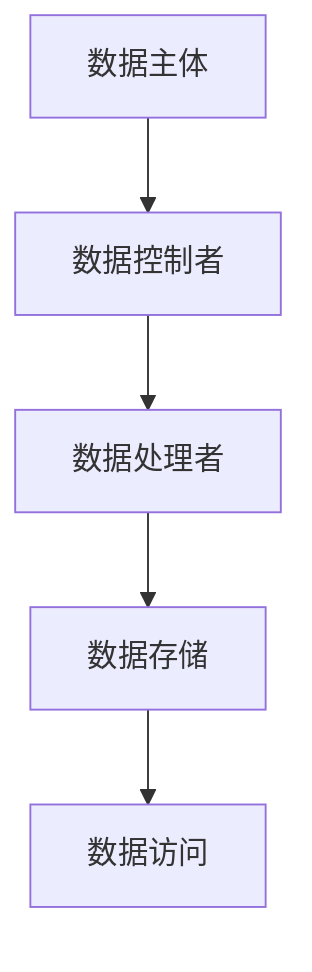
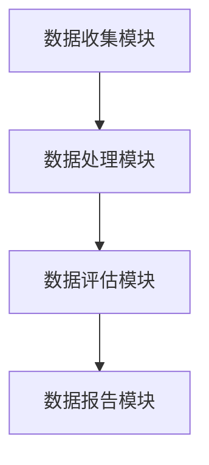

                 

# 如何评估企业的数据隐私保护能力

> 关键词：数据隐私保护，能力评估，企业安全，隐私合规，数据管理

> 摘要：本文详细探讨了如何系统性地评估企业的数据隐私保护能力。从核心概念到算法原理，从系统架构到项目实战，本文为企业提供了全面的评估方法和工具。通过详细分析数据隐私保护的必要性、核心要素、评估模型、技术实现和实际案例，本文为企业的数据隐私保护能力提升提供了实用的指导和建议。

---

# 第一部分: 企业数据隐私保护能力评估背景与核心概念

## 第1章: 数据隐私保护能力评估的背景与问题描述

### 1.1 数据隐私保护的重要性

#### 1.1.1 数字化时代的数据隐私挑战
在当前数字化时代，企业每天都会产生海量数据，这些数据涵盖了企业的核心业务信息、用户隐私信息以及各类敏感数据。数据的价值日益凸显，但也带来了数据隐私保护的巨大挑战。企业的数据可能被未经授权的人员访问、泄露或滥用，导致严重的经济损失和声誉损害。因此，数据隐私保护已成为企业的一项核心任务。

#### 1.1.2 数据隐私保护的法律与合规要求
随着数据隐私保护相关法律法规的不断完善，企业必须遵守《通用数据保护条例》（GDPR）、《加州消费者隐私法》（CCPA）等法律法规。这些法律法规对企业的数据处理活动提出了严格的要求，包括数据收集的合法性、数据处理的透明性、数据主体权利的保护等。企业如果不满足这些要求，将面临巨额罚款和法律诉讼的风险。

#### 1.1.3 企业数据隐私保护的核心价值
企业数据隐私保护不仅是法律合规的需要，也是企业自身发展的内在需求。通过有效保护数据隐私，企业可以提升客户信任度，增强品牌竞争力，降低数据泄露风险，同时也能够更好地利用数据驱动业务创新。

### 1.2 企业数据隐私保护能力评估的必要性

#### 1.2.1 数据隐私保护能力对企业的影响
数据隐私保护能力直接影响企业的业务运营和合规状态。如果企业的数据隐私保护能力不足，可能面临数据泄露、合规失败、客户流失等问题，进而影响企业的生存和发展。

#### 1.2.2 评估数据隐私保护能力的现实需求
随着数据隐私保护的重要性日益凸显，企业需要定期对其数据隐私保护能力进行评估，以发现存在的问题和不足，及时采取改进措施。同时，数据隐私保护能力的评估也是企业向利益相关方展示其合规性和责任感的重要方式。

#### 1.2.3 数据隐私保护能力评估的边界与外延
数据隐私保护能力评估需要明确其边界和外延。评估的边界包括企业的数据处理活动、数据存储和传输过程、数据访问控制等。评估的外延则涉及数据隐私保护的政策、技术、组织和人员等多个方面。

### 1.3 数据隐私保护能力评估的核心要素

#### 1.3.1 数据生命周期与隐私保护
数据生命周期包括数据的生成、收集、处理、存储、使用、共享、删除等阶段。在每个阶段，都需要采取相应的隐私保护措施，例如数据加密、访问控制、数据脱敏等。

#### 1.3.2 数据访问控制模型
数据访问控制模型是数据隐私保护的重要组成部分。常见的数据访问控制模型包括基于角色的访问控制（RBAC）和基于属性的访问控制（ABAC）。这些模型通过定义用户角色和权限，确保只有授权人员能够访问敏感数据。

#### 1.3.3 数据隐私保护的关键技术与方法
数据隐私保护的关键技术包括数据加密、数据脱敏、同态加密、联邦学习等。这些技术可以在保护数据隐私的前提下，支持数据的处理和分析。

---

## 第2章: 数据隐私保护能力评估的核心概念与联系

### 2.1 数据隐私保护的核心概念

#### 2.1.1 数据隐私的基本定义
数据隐私是指个人或组织对其数据的控制权和使用权。数据隐私保护的目标是确保数据在收集、存储、处理和共享过程中不被未经授权的人员访问或滥用。

#### 2.1.2 数据隐私保护的关键属性
数据隐私保护的关键属性包括数据机密性、数据完整性、数据可用性、数据主体权利等。这些属性共同构成了数据隐私保护的核心内容。

#### 2.1.3 数据隐私保护的实现机制
数据隐私保护的实现机制包括技术手段（如加密、脱敏）、管理手段（如访问控制、权限管理）和法律手段（如合规要求、合同约束）。

### 2.2 数据隐私保护能力评估的模型与框架

#### 2.2.1 数据隐私保护能力评估的维度
数据隐私保护能力评估可以从技术能力、管理能力、合规能力等多个维度进行。技术能力包括数据加密、访问控制等技术实现的能力；管理能力包括数据隐私政策、组织架构、人员培训等管理能力；合规能力包括对相关法律法规的遵守情况。

#### 2.2.2 数据隐私保护能力评估的指标体系
数据隐私保护能力评估的指标体系可以从以下方面进行设计：
- 数据生命周期中的隐私保护措施是否完善
- 数据访问控制的颗粒度是否精细
- 数据隐私保护技术的成熟度和可靠性
- 数据隐私保护的合规性是否达标

#### 2.2.3 数据隐私保护能力评估的流程与方法
数据隐私保护能力评估的流程通常包括以下步骤：
1. 明确评估目标和范围
2. 收集相关数据和信息
3. 评估数据隐私保护措施的有效性
4. 发现问题和改进空间
5. 提出改进建议和实施计划

### 2.3 数据隐私保护能力评估的核心要素对比

#### 2.3.1 数据隐私保护能力评估的属性对比表
| 核心要素 | 数据机密性 | 数据完整性 | 数据可用性 |
|----------|------------|------------|------------|
| 定义     | 数据内容不被未经授权的人员访问或泄露 | 数据在存储和传输过程中不被篡改 | 数据在需要时可以被合法访问和使用 |
| 实现方法 | 加密技术、访问控制 | 数据签名、校验码 | 数据备份、容灾系统 |

#### 2.3.2 数据隐私保护能力评估的实体关系图

### 2.4 本章小结

---

## 第3章: 数据隐私保护能力评估的算法原理

### 3.1 数据隐私保护能力评估的核心算法

#### 3.1.1 数据脱敏算法
数据脱敏是一种常见的数据隐私保护技术，通过将敏感数据进行变形处理，使其在脱敏后无法还原出真实数据。常用的脱敏算法包括：
- 替换：将敏感数据替换为虚拟数据
- 扰乱：对数据进行随机化处理
- 假名化：对数据进行不可逆的加密处理

#### 3.1.2 数据加密算法
数据加密是另一种常用的数据隐私保护技术，通过将敏感数据加密，确保只有授权人员能够解密和访问数据。常用的加密算法包括：
- 对称加密：如AES算法
- 非对称加密：如RSA算法
- 哈希加密：如MD5、SHA-256

#### 3.1.3 数据访问控制算法
数据访问控制算法通过定义用户角色和权限，确保只有授权人员能够访问敏感数据。常用的访问控制算法包括：
- 基于角色的访问控制（RBAC）
- 基于属性的访问控制（ABAC）
- 基于规则的访问控制（RBAC）

### 3.2 数据隐私保护能力评估的数学模型

#### 3.2.1 数据隐私保护能力评估的数学公式
数据隐私保护能力评估的数学公式可以表示为：
$$ C = \sum_{i=1}^{n} w_i \cdot f_i $$
其中，$C$ 表示数据隐私保护能力，$w_i$ 表示评估指标的权重，$f_i$ 表示评估指标的分数。

#### 3.2.2 数据隐私保护能力评估的数学模型
数据隐私保护能力评估的数学模型可以表示为：
$$ f(x) = \sum_{i=1}^{m} a_i \cdot x_i $$
其中，$a_i$ 表示各评估指标的权重，$x_i$ 表示各评估指标的得分。

### 3.3 数据隐私保护能力评估的算法实现

#### 3.3.1 数据脱敏算法实现
数据脱敏算法的实现可以通过以下步骤进行：
1. 确定需要脱敏的数据字段
2. 选择合适的脱敏方法（如替换、扰乱、假名化）
3. 对数据进行脱敏处理
4. 验证脱敏数据的正确性和可用性

#### 3.3.2 数据加密算法实现
数据加密算法的实现可以通过以下步骤进行：
1. 确定需要加密的数据
2. 选择合适的加密算法（如AES、RSA）
3. 对数据进行加密处理
4. 保存加密密钥并确保其安全

#### 3.3.3 数据访问控制算法实现
数据访问控制算法的实现可以通过以下步骤进行：
1. 定义用户角色和权限
2. 配置访问控制策略
3. 对数据访问进行验证和授权
4. 记录数据访问日志并进行审计

---

## 第4章: 数据隐私保护能力评估的系统分析与架构设计

### 4.1 数据隐私保护能力评估的系统功能设计

#### 4.1.1 系统功能模块
数据隐私保护能力评估系统通常包括以下功能模块：
- 数据收集模块：收集企业的数据隐私保护相关信息
- 数据处理模块：对收集的数据进行清洗和转换
- 数据评估模块：对数据隐私保护能力进行评估
- 数据报告模块：生成评估报告并提出改进建议

#### 4.1.2 系统功能流程
数据隐私保护能力评估系统的功能流程如下：
1. 数据收集：通过问卷、访谈等方式收集企业的数据隐私保护相关信息
2. 数据处理：对收集的数据进行清洗、转换和标准化
3. 数据评估：根据评估指标和模型，对企业数据隐私保护能力进行评估
4. 数据报告：生成评估报告并提出改进建议

### 4.2 数据隐私保护能力评估的系统架构设计

#### 4.2.1 系统架构图

#### 4.2.2 系统接口设计
数据隐私保护能力评估系统的接口设计需要考虑以下内容：
- 数据输入接口：支持多种数据格式的输入
- 数据输出接口：支持评估报告的生成和导出
- 用户接口：提供友好的用户界面，方便用户操作

#### 4.2.3 系统交互流程
数据隐私保护能力评估系统的交互流程如下：
1. 用户登录系统
2. 用户选择需要评估的企业
3. 系统收集企业的数据隐私保护相关信息
4. 系统对数据进行处理和评估
5. 系统生成评估报告并展示给用户

---

## 第5章: 数据隐私保护能力评估的项目实战

### 5.1 项目背景与目标

#### 5.1.1 项目背景
某大型企业由于数据隐私保护能力不足，频繁发生数据泄露事件，导致客户信任度下降和合规风险增加。为了提升数据隐私保护能力，该企业决定开展数据隐私保护能力评估项目。

#### 5.1.2 项目目标
本项目的目标是通过系统性评估该企业的数据隐私保护能力，发现存在的问题和不足，并提出改进建议。

### 5.2 项目实施步骤

#### 5.2.1 数据收集
通过问卷、访谈和文档查阅等方式，收集企业的数据隐私保护相关信息，包括数据处理流程、数据访问控制策略、数据存储方式等。

#### 5.2.2 数据处理
对收集的数据进行清洗、转换和标准化处理，确保数据的完整性和一致性。

#### 5.2.3 数据评估
根据评估指标和模型，对企业数据隐私保护能力进行评估，发现存在的问题和改进空间。

#### 5.2.4 数据报告
生成评估报告，详细描述评估结果和改进建议，并向企业高层汇报。

### 5.3 项目总结与启示

#### 5.3.1 项目总结
通过本项目，企业发现了数据隐私保护能力中存在的诸多问题，例如数据访问控制不够精细、数据脱敏技术应用不足等。同时，企业也认识到数据隐私保护是一项长期任务，需要持续关注和改进。

#### 5.3.2 项目启示
数据隐私保护能力评估是一个系统性工程，需要企业从技术、管理和法律等多个方面入手，全面提升数据隐私保护能力。同时，企业需要建立数据隐私保护的长效机制，确保数据隐私保护能力的持续提升。

---

## 第6章: 数据隐私保护能力评估的最佳实践与注意事项

### 6.1 数据隐私保护能力评估的最佳实践

#### 6.1.1 制定数据隐私保护政策
企业需要制定全面的数据隐私保护政策，明确数据处理的合规要求和责任分工。

#### 6.1.2 加强数据隐私保护技术应用
企业需要加大对数据隐私保护技术的研发和应用力度，例如数据加密、数据脱敏、同态加密等。

#### 6.1.3 建立数据隐私保护组织架构
企业需要建立专门的数据隐私保护组织架构，明确数据隐私保护的职责分工和协同机制。

### 6.2 数据隐私保护能力评估的注意事项

#### 6.2.1 确保评估的客观性和公正性
在数据隐私保护能力评估过程中，需要确保评估的客观性和公正性，避免因主观因素影响评估结果。

#### 6.2.2 保护评估数据的安全
在数据隐私保护能力评估过程中，需要保护评估数据的安全，防止评估数据的泄露和滥用。

#### 6.2.3 加强评估结果的后续跟踪
企业需要加强评估结果的后续跟踪，确保评估发现的问题能够及时整改，并持续提升数据隐私保护能力。

---

## 第7章: 结语

数据隐私保护能力评估是企业在数字化时代必须面对的一项重要任务。通过系统性评估企业的数据隐私保护能力，企业可以发现存在的问题和不足，并采取相应的改进措施。未来，随着数据隐私保护技术的不断发展和法律法规的不断完善，企业需要更加重视数据隐私保护能力的评估和提升，确保数据隐私保护能力与企业的发展需求相匹配。

---

## 作者：AI天才研究院/AI Genius Institute & 禅与计算机程序设计艺术 /Zen And The Art of Computer Programming

