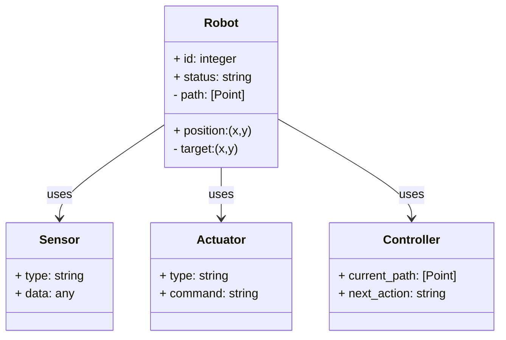
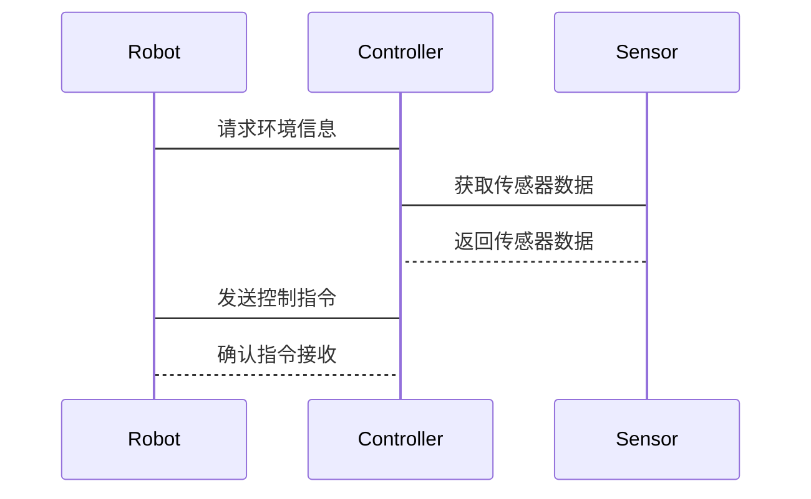

                 


# 如何评估企业的智能机器人技术

> 关键词：智能机器人技术评估，人工智能技术，机器人系统架构，算法原理，企业级应用

> 摘要：智能机器人技术是当前科技领域的重要方向，其评估对企业在人工智能领域的竞争力至关重要。本文从技术基础、算法原理、系统架构、项目实战等多个维度，详细阐述如何评估企业的智能机器人技术，并通过案例分析和代码实现，帮助读者全面掌握评估方法。

---

# 第一部分: 智能机器人技术的背景与基础

# 第1章: 智能机器人技术概述

## 1.1 智能机器人的定义与分类

智能机器人是一种结合了机械自动化和人工智能技术的智能体，能够感知环境、自主决策并执行任务。根据应用场景的不同，智能机器人可以分为工业机器人、服务机器人、医疗机器人和家庭机器人等。

### 1.1.1 智能机器人的定义
智能机器人具备以下特点：
- **自主性**：能够在没有外部干预的情况下完成任务。
- **感知能力**：通过传感器感知环境信息。
- **决策能力**：基于感知信息进行决策。
- **执行能力**：通过执行机构完成任务。

### 1.1.2 智能机器人的分类
智能机器人可以根据应用场景和技术特点分为以下几类：
1. **工业机器人**：用于制造业中的自动化生产。
2. **服务机器人**：用于商业服务和家庭服务。
3. **医疗机器人**：用于医疗手术和康复辅助。
4. **物流机器人**：用于仓储和配送。

### 1.1.3 智能机器人与传统工业机器人的区别
传统工业机器人主要依赖固定程序执行重复性任务，而智能机器人具备学习和适应能力，能够应对复杂多变的环境。

## 1.2 智能机器人技术的核心要素

智能机器人技术的核心要素包括：
1. **人工智能技术**：如机器学习、自然语言处理和计算机视觉。
2. **机器人感知与交互技术**：如视觉感知、语音识别和触觉反馈。
3. **机器人决策与执行技术**：如路径规划、决策算法和运动控制。

## 1.3 智能机器人技术的发展现状

智能机器人技术在国内外发展迅速，企业级应用案例不断增多。例如，工业机器人在制造业中的应用已经非常普及，服务机器人在零售和医疗领域的应用也在快速发展。未来，智能机器人技术将更加智能化和人性化。

## 1.4 本章小结

本章从智能机器人的定义、分类和发展现状等方面进行了概述，为后续章节的深入分析奠定了基础。

---

# 第二部分: 智能机器人技术的核心概念与联系

# 第2章: 智能机器人技术的核心概念

## 2.1 人工智能技术在机器人中的应用

人工智能技术在机器人中的应用主要体现在以下几个方面：
1. **机器学习**：用于模式识别和任务优化。
2. **自然语言处理**：用于人机交互和语义理解。
3. **计算机视觉**：用于环境感知和目标识别。

### 2.1.1 机器学习在机器人中的应用
机器学习算法可以帮助机器人从经验中学习，从而提高任务执行的效率和准确性。

### 2.1.2 自然语言处理在机器人中的应用
自然语言处理技术使得机器人能够理解和生成人类语言，从而实现人机交互。

### 2.1.3 计算机视觉在机器人中的应用
计算机视觉技术使机器人能够通过摄像头感知环境信息，从而实现物体识别和场景理解。

## 2.2 智能机器人技术的系统架构

智能机器人系统的架构通常包括以下几个模块：
1. **感知模块**：负责采集环境信息。
2. **决策模块**：负责处理感知信息并制定决策。
3. **执行模块**：负责执行决策指令。

### 2.2.1 智能机器人系统的组成
智能机器人系统由硬件和软件两部分组成。硬件包括传感器、执行机构和通信设备，软件包括算法和系统控制软件。

### 2.2.2 系统各模块的功能与交互
感知模块通过传感器采集环境信息，传递给决策模块，决策模块根据感知信息制定决策，并将决策指令传递给执行模块。

## 2.3 智能机器人技术的核心算法

智能机器人技术的核心算法包括路径规划算法、决策算法和感知算法。

### 2.3.1 机器人路径规划算法
路径规划算法用于规划机器人的运动路径，确保机器人能够高效地到达目标位置。

### 2.3.2 机器人决策算法
决策算法用于机器人在复杂环境中做出决策，例如基于强化学习的决策算法。

### 2.3.3 机器人感知算法
感知算法用于机器人通过传感器感知环境信息，例如基于视觉的目标检测算法。

## 2.4 本章小结

本章详细介绍了人工智能技术在机器人中的应用，分析了智能机器人系统的架构，并探讨了核心算法的作用和实现方式。

---

# 第三部分: 智能机器人技术的算法原理与数学模型

# 第3章: 智能机器人技术的算法原理

## 3.1 机器人路径规划算法

路径规划算法是智能机器人技术的重要组成部分，常用的路径规划算法包括A*算法和RRT算法。

### 3.1.1 A*算法原理与实现
A*算法是一种基于启发式搜索的路径规划算法，其核心思想是通过评估节点的综合成本来选择最优路径。

$$f(n) = g(n) + h(n)$$

其中，$g(n)$表示从起点到当前节点的路径成本，$h(n)$表示从当前节点到目标节点的估计成本。

### 3.1.2 RRT算法原理与实现
RRT算法是一种基于采样的路径规划算法，适用于高维或非凸的搜索空间。

### 3.1.3 算法优缺点对比
A*算法在低维空间中表现优异，而RRT算法适用于高维或复杂空间。

## 3.2 机器人决策算法

决策算法是智能机器人技术的核心，常用的决策算法包括基于规则的决策算法、基于机器学习的决策算法和基于强化学习的决策算法。

### 3.2.1 基于规则的决策算法
基于规则的决策算法通过预定义的规则进行决策，适用于任务简单且规则明确的场景。

### 3.2.2 基于机器学习的决策算法
基于机器学习的决策算法通过训练模型进行决策，适用于任务复杂且规则不明确的场景。

### 3.2.3 基于强化学习的决策算法
基于强化学习的决策算法通过与环境的交互学习决策策略，适用于动态变化的复杂环境。

## 3.3 机器人感知算法

感知算法是智能机器人技术的重要组成部分，常用的感知算法包括基于视觉的物体识别算法、基于激光雷达的环境感知算法和基于深度学习的目标检测算法。

### 3.3.1 基于视觉的物体识别算法
基于视觉的物体识别算法通过摄像头采集图像，利用深度学习模型进行物体识别。

### 3.3.2 基于激光雷达的环境感知算法
基于激光雷达的环境感知算法通过激光扫描环境，利用点云数据进行环境建模。

### 3.3.3 基于深度学习的目标检测算法
基于深度学习的目标检测算法通过卷积神经网络（CNN）进行目标检测。

## 3.4 算法实现的数学模型与公式

### 3.4.1 A*算法的数学模型
$$f(n) = g(n) + h(n)$$

### 3.4.2 强化学习算法的数学模型
$$Q(s, a) = r + \gamma \max_{a'} Q(s', a')$$

其中，$Q(s, a)$表示状态-动作对的价值，$r$表示奖励，$\gamma$表示折扣因子。

## 3.5 本章小结

本章详细介绍了机器人路径规划算法、决策算法和感知算法的原理和实现，并通过数学公式和流程图展示了算法的实现过程。

---

# 第四部分: 智能机器人技术的系统架构与设计

# 第4章: 智能机器人技术的系统架构与设计

## 4.1 问题场景介绍

在企业级智能机器人技术的评估中，我们需要考虑以下问题：
- 系统功能需求
- 系统性能要求
- 系统安全性要求
- 系统可扩展性要求

## 4.2 项目介绍

以一个智能配送机器人为例，介绍其系统架构和功能设计。

## 4.3 系统功能设计

### 4.3.1 领域模型设计
领域模型是系统功能设计的核心，通过Mermaid类图展示系统的功能模块和交互关系。



### 4.3.2 系统架构设计
通过Mermaid架构图展示系统的整体架构和模块交互。


### 4.3.3 系统接口设计
系统接口设计需要考虑机器人与外部环境的交互，包括传感器接口、执行机构接口和通信接口。

### 4.3.4 系统交互设计
通过Mermaid序列图展示系统的交互流程。



## 4.4 本章小结

本章通过一个具体的案例，详细介绍了智能机器人系统的架构设计和功能实现，为后续章节的项目实战奠定了基础。

---

# 第五部分: 智能机器人技术的项目实战

# 第5章: 智能机器人技术的项目实战

## 5.1 环境安装与配置

### 5.1.1 系统环境要求
- 操作系统：Linux/Windows/MacOS
- 开发工具：Python/ROS
- 传感器驱动：支持摄像头、激光雷达等

### 5.1.2 软件安装
- 安装Python和相关库（如OpenCV、TensorFlow）
- 安装ROS（Robot Operating System）

## 5.2 系统核心实现源代码

### 5.2.1 路径规划算法实现
以下是一个基于A*算法的路径规划代码示例：

```python
import heapq

class Node:
    def __init__(self, x, y, parent=None):
        self.x = x
        self.y = y
        self.parent = parent
        self.g = 0
        self.h = 0
        self.f = 0

def a_star(start, end, grid):
    open_heap = []
    heapq.heappush(open_heap, (0, start))
    start.g = 0
    start.f = 0
    visited = {}

    while open_heap:
        current = heapq.heappop(open_heap)
        current_node = current[1]

        if current_node == end:
            break

        if current_node in visited:
            continue

        visited[current_node] = True

        neighbors = []
        # 添加邻居节点
        # ...

        for neighbor in neighbors:
            if neighbor not in visited:
                new_g = current_node.g + distance(current_node, neighbor)
                new_h = heuristic(neighbor, end)
                new_f = new_g + new_h
                neighbor.g = new_g
                neighbor.h = new_h
                neighbor.f = new_f
                heapq.heappush(open_heap, (neighbor.f, neighbor))

    return reconstruct_path(end)

def heuristic(a, b):
    return abs(a.x - b.x) + abs(a.y - b.y)

def distance(a, b):
    return abs(a.x - b.x) + abs(a.y - b.y)

def reconstruct_path(current):
    path = []
    while current:
        path.append((current.x, current.y))
        current = current.parent
    return path[::-1]
```

### 5.2.2 目标检测算法实现
以下是一个基于YOLO的目标检测代码示例：

```python
import cv2
import numpy as np

def detect_objects(image, model):
    # 执行目标检测
    # 返回检测结果
    pass

# 加载模型
model = load_model("yolo_model.h5")

# 读取图像
image = cv2.imread("test.jpg")

# 检测目标
results = detect_objects(image, model)

# 绘制结果
for result in results:
    x, y, w, h = result["bounding_box"]
    cv2.rectangle(image, (x, y), (x + w, y + h), (255, 0, 0), 2)
    cv2.putText(image, result["label"], (x, y - 5), cv2.FONT_HERSHEY_SIMPLEX, 0.5, (0, 0, 255), 2)

cv2.imshow("Detection Results", image)
cv2.waitKey(0)
cv2.destroyAllWindows()
```

## 5.3 实际案例分析与详细解读

### 5.3.1 案例背景
以智能配送机器人为例，分析其在实际应用中的系统设计和实现。

### 5.3.2 系统功能实现
详细解读系统的各个功能模块实现，包括感知模块、决策模块和执行模块。

### 5.3.3 案例分析与总结
总结案例中的经验和教训，分析系统优化的方向。

## 5.4 本章小结

本章通过实际案例，详细展示了智能机器人技术的环境安装、代码实现和系统优化过程，帮助读者更好地理解理论知识。

---

# 第六部分: 总结与展望

# 第6章: 总结与展望

## 6.1 核心知识点回顾

智能机器人技术评估的关键点包括：
- 技术基础：人工智能、机器人感知与交互、机器人决策与执行。
- 算法原理：路径规划算法、决策算法、感知算法。
- 系统架构：系统功能设计、系统架构设计、系统接口设计。

## 6.2 评估过程中的注意事项

- 系统安全性：确保机器人在运行中的安全性。
- 系统可扩展性：确保系统能够适应未来的需求。
- 系统可靠性：确保系统在复杂环境中的可靠性。

## 6.3 未来发展趋势

智能机器人技术未来的发展趋势包括：
- 更加智能化：基于深度学习的决策算法。
- 更加高效化：基于强化学习的路径规划算法。
- 更加人性化：自然语言处理和人机交互技术的进一步发展。

## 6.4 最佳实践 Tips

- 在评估智能机器人技术时，需要综合考虑技术基础、算法原理和系统架构。
- 在实现智能机器人系统时，需要注重系统的安全性、可靠性和可扩展性。
- 在优化智能机器人系统时，可以结合实际应用场景，选择合适的算法和技术方案。

## 6.5 本章小结

本章总结了智能机器人技术评估的核心知识点，并展望了未来的发展趋势，为读者提供了宝贵的参考。

---

# 作者：AI天才研究院/AI Genius Institute & 禅与计算机程序设计艺术 /Zen And The Art of Computer Programming

