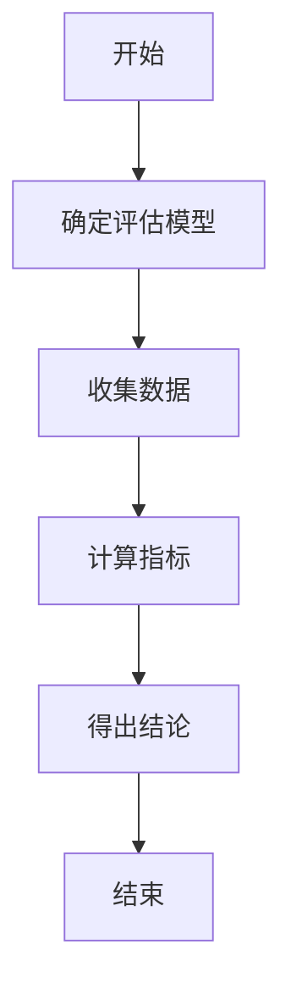
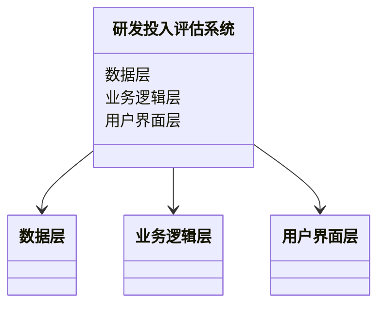

                 


# 如何评估企业的研发投入价值

> 关键词：研发投入，价值评估，财务分析，战略规划，风险管理，企业创新

> 摘要：本文深入探讨了如何评估企业的研发投入价值，从定义、模型、财务分析到战略规划和风险管理，结合实际案例，为企业提供全面的评估方法和策略。

---

# 第1章: 企业研发投入价值评估的背景与定义

## 1.1 企业研发投入的定义与核心要素

### 1.1.1 研发投入的基本概念
研发投入是指企业在研发活动中投入的资源，包括资金、时间和人力资源等。它是企业创新的核心驱动力。

### 1.1.2 研发投入的核心要素
- **资金投入**：包括研发部门的 salaries、设备购置和试验费用。
- **时间投入**：研发团队的工作时间分配。
- **人力资源**：研发团队的规模和能力。
- **技术资源**：包括专利、技术标准和研发成果等。

### 1.1.3 研发投入与其他相关概念的区别
- **研发投入与运营成本**：研发投入主要用于创新，而运营成本用于日常运作。
- **研发投入与资本支出**：研发投入属于费用，资本支出属于资产。

## 1.2 研发投入的价值评估的重要性

### 1.2.1 研发投入对企业发展的战略意义
研发投入是企业长期发展的基石，决定了企业的技术优势和市场竞争力。

### 1.2.2 研发投入对财务表现的影响
合理的研发投入能够提升企业的利润能力和市场价值。

### 1.2.3 研发投入与企业创新的关系
研发投入是创新的源泉，推动企业的产品和服务更新。

## 1.3 研发投入价值评估的边界与外延

### 1.3.1 研发投入的边界
- 时间范围：通常为未来3-5年。
- 范围：仅限于研发活动，不包括其他业务。

### 1.3.2 研发投入的外延
- 包括间接影响，如员工培训和外部合作。

### 1.3.3 研发投入与其他企业活动的关系
研发投入与生产、销售等环节相互影响，共同推动企业价值增长。

## 1.4 本章小结
本章阐述了研发投入的定义、核心要素及其重要性，为后续评估奠定了基础。

---

# 第2章: 研发投入价值评估的核心概念与联系

## 2.1 研发投入价值评估的原理

### 2.1.1 研发投入的投入与产出关系
投入与产出之间存在非线性关系，高投入不一定带来高回报。

### 2.1.2 研发投入的周期性与不确定性
研发活动周期较长，结果具有不确定性。

### 2.1.3 研发投入的经济价值评估模型
通过净现值（NPV）等方法评估研发投入的经济价值。

## 2.2 研发投入价值评估的核心要素对比

### 2.2.1 投入要素对比
- 资金、时间、人力资源等。

### 2.2.2 产出要素对比
- 新产品数量、技术专利数等。

### 2.2.3 价值评估指标对比
- 内部收益率（IRR）、回收期等。

## 2.3 研发投入价值评估的ER实体关系图

```mermaid
erDiagram
    R &--- D
    D --- E
    E --- R
```

## 2.4 本章小结
本章通过概念对比和ER图，展示了研发投入评估的核心要素。

---

# 第3章: 研发投入价值评估的算法原理与数学模型

## 3.1 研发投入价值评估的算法原理

### 3.1.1 净现值法（NPV）
$$ NPV = \sum_{t=1}^{n} \frac{C_t}{(1 + r)^t} $$
其中，\(C_t\)为现金流，\(r\)为贴现率。

### 3.1.2 内部收益率法（IRR）
IRR是使净现值为零的贴现率。

## 3.2 研发投入价值评估的数学模型

### 3.2.1 投资回收期（Payback Period）
$$ PP = \frac{Initial Investment}{Annual Cash Inflows} $$

## 3.3 算法流程图



## 3.4 本章小结
本章通过数学模型和算法流程图，展示了研发投入评估的方法。

---

# 第4章: 研发投入价值评估的系统分析与架构设计

## 4.1 系统分析与问题场景介绍

### 4.1.1 问题场景
- 数据分散，难以整合。
- 模型选择困难。

### 4.1.2 项目介绍
- 开发一个评估系统，整合数据和模型。

## 4.2 系统架构设计



## 4.3 本章小结
本章通过系统架构设计，展示了如何构建研发投入评估系统。

---

# 第5章: 研发投入价值评估的项目实战

## 5.1 环境安装
- 数据库：MySQL
- 编程语言：Python
- 开发工具：PyCharm

## 5.2 系统核心实现源代码

```python
def calculate_npv(cash_flows, discount_rate):
    return sum(c / (1 + discount_rate)**t for t, c in enumerate(cash_flows))
```

## 5.3 代码应用解读与分析
- 函数计算净现值，用于评估项目可行性。

## 5.4 实际案例分析
- 某公司研发投入案例分析，计算其NPV。

## 5.5 本章小结
本章通过实战项目，展示了如何应用理论进行评估。

---

# 第6章: 研发投入价值评估的最佳实践与总结

## 6.1 最佳实践 tips
- 定期评估，动态调整。
- 结合定量和定性分析。

## 6.2 小结
总结了本文的主要内容和关键点。

## 6.3 注意事项
- 数据准确性，模型适用性。

## 6.4 拓展阅读
建议阅读相关书籍和文献。

## 6.5 本章小结
本章提供了最佳实践和未来研究方向。

---

# 作者：AI天才研究院 & 禅与计算机程序设计艺术

---

通过以上结构，文章系统地介绍了如何评估企业的研发投入价值，从理论到实践，结合案例分析，提供了全面的指导。

