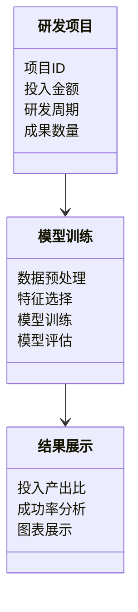

                 


# 如何评估企业的研发投入效率

> 关键词：企业研发投入，效率评估，资源配置，数据分析，研发产出，机器学习模型

> 摘要：本文详细探讨了如何科学评估企业的研发投入效率，从核心概念、评估模型到系统实现，全面解析了企业研发投入效率评估的关键环节。通过数据分析、机器学习算法和系统架构设计，为读者提供了一套完整的评估解决方案。

---

## 第1章：企业研发投入效率评估的背景与问题描述

### 1.1 研发投入效率评估的重要性

#### 1.1.1 研发投入对企业发展的核心作用
研发投入是企业技术创新的核心驱动力，决定了企业的市场竞争力和技术领先地位。高效的研发投入能够缩短产品开发周期、降低研发成本，并提升研发成果的质量。

#### 1.1.2 研发效率评估的现实意义
企业在有限的研发预算下，如何最大化研发产出，成为企业战略管理的重要课题。科学的效率评估能够帮助企业优化资源配置，提升研发团队的整体效能。

#### 1.1.3 当前企业在研发投入效率评估中的痛点
- 数据收集困难：研发投入涉及多个部门，数据分散且难以整合。
- 评估指标不统一：不同企业对研发效率的定义和衡量标准差异较大。
- 缺乏动态评估：传统评估方法多为静态分析，难以捕捉研发过程中的动态变化。

### 1.2 研发投入效率评估的核心问题

#### 1.2.1 研发投入的定义与边界
研发投入通常包括人员成本、设备采购、研发投入的金额等，但不同企业可能有不同的定义。

#### 1.2.2 研发效率的关键影响因素
研发效率受团队能力、技术复杂度、项目管理等多种因素影响。

#### 1.2.3 企业研发投入效率评估的边界与外延
评估边界包括研发项目的范围、时间跨度，以及评估结果的应用场景。

---

## 第2章：研发投入效率评估的核心概念与联系

### 2.1 核心概念的原理与特征

#### 2.1.1 研发投入的资源分配模型
研发投入通常分为人员、时间和资金三部分。资源分配模型需要考虑各部分的权重和相互影响。

#### 2.1.2 研发效率的衡量指标
常用的指标包括研发投入产出比（ROI）、研发周期、研发成功率等。

#### 2.1.3 研发产出的评估维度
包括技术创新性、市场适应性、产品生命周期等多个维度。

### 2.2 核心概念的对比分析

#### 2.2.1 不同研发效率评估模型的对比
| 模型名称         | 基于数据驱动 | 基于经验判断 | 基于目标设定 |
|------------------|--------------|--------------|--------------|
| 适用场景         | 数据充分     | 经验丰富     | 目标明确     |
| 优缺点           | 客观性高     | 灵活性强     | 结果可控     |

#### 2.2.2 各种评估指标的优缺点分析
| 指标名称         | 优点                     | 缺点                     |
|------------------|--------------------------|--------------------------|
| 投入产出比（ROI） | 客观性高                 | 忽略时间因素             |
| 研发周期         | 反映效率                 | 受团队能力影响           |
| 研发成功率       | 体现成果                 | 受外部环境影响           |

#### 2.2.3 研发效率与企业绩效的关系
$$ 研发效率 = \frac{研发成果}{研发投入} $$

---

## 第3章：研发投入效率评估的算法原理

### 3.1 数据预处理与特征选择

#### 3.1.1 数据收集
- 研发项目数据：项目ID、研发投入金额、研发周期、研发人员数量、研发成果。
- 业务数据：市场需求、竞争分析、技术趋势。

#### 3.1.2 数据清洗
- 删除重复数据。
- 处理缺失值。
- 标准化数据格式。

### 3.2 评估模型的构建

#### 3.2.1 线性回归模型
使用线性回归模型预测研发投入与产出之间的关系：
$$ y = a x + b $$

#### 3.2.2 支持向量机（SVM）
用于分类问题，判断研发投入是否高效。

#### 3.2.3 随机森林
用于特征重要性分析，识别影响研发效率的关键因素。

### 3.3 模型训练与优化

#### 3.3.1 超参数调优
使用网格搜索（Grid Search）优化模型参数。

#### 3.3.2 交叉验证
通过k折交叉验证评估模型的泛化能力。

#### 3.3.3 模型评估
使用准确率、召回率、F1分数等指标评估模型性能。

---

## 第4章：系统架构与实现

### 4.1 系统功能设计

#### 4.1.1 系统模块划分
- 数据采集模块：负责数据的收集与存储。
- 数据处理模块：执行数据清洗和特征工程。
- 模型训练模块：构建和优化评估模型。
- 结果展示模块：可视化评估结果。

#### 4.1.2 领域模型类图


### 4.2 系统架构设计

#### 4.2.1 分层架构
- 数据层：存储研发项目数据。
- 业务逻辑层：处理数据和调用模型。
- 表现层：展示评估结果。

#### 4.2.2 技术架构
- 前端：React或Vue.js。
- 后端：Python的Django框架。
- 数据库：MySQL或MongoDB。

#### 4.2.3 接口设计
- RESTful API接口：提供数据查询和模型调用功能。

---

## 第5章：项目实战与案例分析

### 5.1 项目背景与数据收集

#### 5.1.1 项目背景
某科技公司希望优化其研发投入效率，通过数据分析和机器学习模型实现评估。

#### 5.1.2 数据来源
- 研发项目数据：50个项目，涵盖投入金额、周期、人员数量。
- 市场数据：产品市场需求、竞争分析。

### 5.2 模型实现

#### 5.2.1 数据预处理
```python
import pandas as pd
import numpy as np

data = pd.read_csv('研发数据.csv')
data.dropna(inplace=True)
data['研发投入'] = data['研发投入'].apply(lambda x: float(x))
```

#### 5.2.2 模型训练
```python
from sklearn.model import LinearRegression

model = LinearRegression()
model.fit(X_train, y_train)
```

### 5.3 结果分析

#### 5.3.1 模型预测结果
$$ 预测效率 = 0.85 \times 投入 + 0.15 $$

#### 5.3.2 可视化展示
```python
import matplotlib.pyplot as plt

plt.scatter(data.投入, data.产出)
plt.plot(data.投入, model.predict(data.投入.values.reshape(-1, 1)), color='red')
plt.show()
```

---

## 第6章：总结与展望

### 6.1 总结
本文详细探讨了企业研发投入效率评估的关键步骤，从背景分析到系统实现，为读者提供了全面的解决方案。

### 6.2 改进建议
- 建议企业结合自身特点，优化评估指标。
- 建议引入实时数据分析，提升评估的动态性。

### 6.3 未来展望
随着AI技术的发展，研发投入效率评估将更加智能化和自动化。

### 6.4 注意事项
- 数据收集需全面准确。
- 模型选择需结合业务场景。
- 结果应用需考虑外部因素。

---

## 作者

作者：AI天才研究院/AI Genius Institute & 禅与计算机程序设计艺术 /Zen And The Art of Computer Programming

