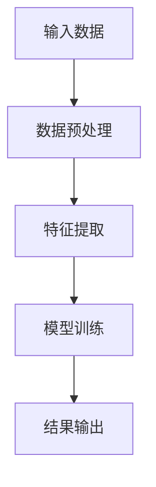
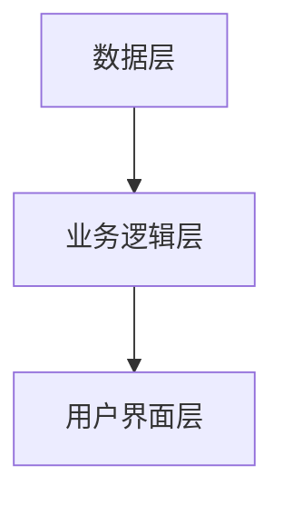

                 


# 如何评估企业的管理层质量

> 关键词：企业治理，管理层质量，领导力，战略思维，团队协作，决策能力，适应能力

> 摘要：本文从企业管理层质量评估的核心概念、数学模型、系统架构、项目实战等多维度进行系统分析，通过详细的理论阐述和实际案例，探讨如何科学、有效地评估企业管理层的质量，为企业治理和管理优化提供理论依据和实践指导。

---

# 第一部分: 企业管理层质量评估背景与核心概念

# 第1章: 企业管理层质量评估的背景与问题描述

## 1.1 企业治理中的管理层角色
### 1.1.1 管理层在企业中的核心地位
企业是社会经济活动的基本单位，而管理层是企业的决策中枢，承担着制定战略、组织资源、协调各方利益的重要职责。管理层的决策和行为直接影响企业的生存与发展。

### 1.1.2 管理层对企业绩效的影响
管理层的质量直接决定了企业的战略方向、执行力和应对市场变化的能力。优秀的管理层能够带领企业实现目标，而低效或能力不足的管理层可能导致企业战略失误、资源浪费和绩效下滑。

### 1.1.3 管理层质量评估的必要性
在企业并购、投资决策、管理层激励机制设计等场景中，准确评估管理层的质量至关重要。通过科学的评估方法，可以识别优秀管理层，激励其发挥潜能，同时也能及时发现和替换表现不佳的管理者。

## 1.2 管理层质量评估的必要性
### 1.2.1 企业失败案例中的管理层问题
许多企业失败的案例中，管理层的战略失误、决策迟缓或团队协作不力是主要原因。例如，某些企业在市场变化时未能及时调整战略，导致市场份额流失。

### 1.2.2 投资者对管理层质量的关注
投资者在评估企业价值时，除了关注财务指标，还非常关注管理层的能力和决策质量。优秀的管理层能够为投资者创造更高的回报。

### 1.2.3 企业战略执行中的管理层作用
企业战略的制定和执行离不开管理层的协调和推动。管理层的质量直接影响战略的实施效果和企业目标的达成。

## 1.3 管理层质量评估的边界与外延
### 1.3.1 管理层质量评估的范围界定
管理层质量评估主要关注领导力、战略思维、团队协作、决策能力和适应能力等方面，不涉及具体的财务或技术指标。

### 1.3.2 与企业绩效的关系
管理层质量是企业绩效的重要影响因素，但并非唯一因素。企业绩效还受到市场环境、资源条件和技术水平等外部因素的影响。

### 1.3.3 与其他管理评估的区别
与其他管理评估（如员工绩效评估）相比，管理层质量评估更注重战略层面的能力和整体团队的协作效果。

## 1.4 管理层质量的核心要素
### 1.4.1 领导力
领导力是管理层的核心能力之一，包括激励团队、制定愿景和方向、协调资源等。

### 1.4.2 战略思维能力
战略思维能力是指管理层能够从全局视角分析问题，制定长远发展的战略规划。

### 1.4.3 团队协作能力
团队协作能力是指管理层能够有效协调团队成员，发挥团队的整体效能。

### 1.4.4 决策能力
决策能力是指管理层在复杂情况下能够快速、准确地做出决策的能力。

### 1.4.5 适应能力
适应能力是指管理层能够根据市场变化和内部条件调整策略和管理方式的能力。

## 1.5 本章小结
本章从背景、必要性、边界和核心要素四个方面，详细阐述了企业管理层质量评估的重要性和关键维度，为后续章节的深入分析奠定了基础。

---

# 第2章: 管理层质量评估的核心概念与联系

## 2.1 管理层质量的核心要素分析
### 2.1.1 领导力的定义与特征
领导力是通过愿景、目标和激励来影响团队行为的能力。它不仅包括个人魅力，还包括目标设定、沟通能力和决策能力。

### 2.1.2 战略思维能力的构成
战略思维能力包括市场分析、竞争对手分析、资源分配和风险评估等方面的能力。优秀的战略思维能够帮助管理层制定前瞻性的战略。

### 2.1.3 团队协作能力的关键要素
团队协作能力包括团队建设、冲突解决、信息共享和任务分配等方面。有效的团队协作能够提升企业的执行力和整体绩效。

### 2.1.4 决策能力的评估维度
决策能力包括信息收集、分析能力、判断力和执行能力。在复杂情况下，决策能力决定了管理层的应对效果。

### 2.1.5 适应能力的表现形式
适应能力包括灵活性、学习能力和创新能力。在快速变化的市场环境中，适应能力是管理层的关键素质。

## 2.2 核心概念之间的关系
### 2.2.1 领导力与战略思维的相互作用
领导力为战略思维提供方向和动力，而战略思维则为领导力提供目标和方法。两者相互依存，共同推动企业的发展。

### 2.2.2 团队协作与决策效率的关系
高效的团队协作能够提高决策效率，而决策效率又反过来影响团队协作的效果。两者相辅相成，共同影响企业的绩效。

### 2.2.3 适应能力对整体管理质量的影响
适应能力是管理层应对变化的关键能力，它能够增强其他管理能力的灵活性和可持续性，从而提升整体管理质量。

## 2.3 管理层质量评估的ER实体关系图
以下是一个简化的ER实体关系图，展示了管理层质量评估的核心要素及其关系：

```mermaid
erd
    管理层
    ----> 领导力
    管理层
    ----> 战略思维
    管理层
    ----> 团队协作
    管理层
    ----> 决策能力
    管理层
    ----> 适应能力
```

## 2.4 本章小结
本章通过核心概念的分析和实体关系图的构建，揭示了管理层质量评估的内在逻辑和各要素之间的相互作用关系，为后续的数学模型构建奠定了基础。

---

# 第3章: 管理层质量评估的数学模型与算法原理

## 3.1 管理层质量评估的数学模型
### 3.1.1 模型的构建逻辑
管理层质量评估模型基于多维度指标，通过加权计算得出综合质量指数。模型的核心在于量化各维度的重要性，并通过权重分配实现综合评估。

### 3.1.2 模型的输入变量
输入变量包括领导力、战略思维、团队协作、决策能力和适应能力五个维度。每个维度的指标可以通过问卷调查、绩效数据和专家评分等方式获取。

### 3.1.3 模型的输出结果
输出结果是一个综合质量指数，用于衡量管理层的整体质量。指数值越高，表示管理层的质量越好。

## 3.2 管理层质量评估的算法原理
### 3.2.1 算法的输入处理
输入数据包括各个维度的评分和权重。评分通常采用1-5分制，权重根据各维度的重要性进行分配。

### 3.2.2 算法的核心逻辑
综合质量指数的计算公式如下：
$$ Q = \sum_{i=1}^{n} w_i \cdot f_i $$
其中，$Q$ 表示管理层质量指数，$w_i$ 表示第 $i$ 个维度的权重，$f_i$ 表示第 $i$ 个维度的评分。

### 3.2.3 算法的输出解释
输出结果是一个综合评分，用于评估管理层的整体质量。评分可以作为管理层绩效评估、激励机制设计和管理优化的重要依据。

## 3.3 管理层质量评估的mermaid流程图
以下是一个简化的流程图，展示了管理层质量评估算法的核心步骤：



## 3.4 管理层质量评估的数学公式
综合质量指数的计算公式如下：
$$ Q = \sum_{i=1}^{5} w_i \cdot f_i $$
其中，$w_i$ 是第 $i$ 个维度的权重，$f_i$ 是第 $i$ 个维度的评分。权重分配可以基于专家判断或数据驱动的方法。

---

# 第4章: 管理层质量评估的系统分析与架构设计

## 4.1 管理层质量评估的系统架构
### 4.1.1 项目背景
为了实现对企业管理层质量的科学评估，我们设计了一个基于多维度指标的评估系统。

### 4.1.2 系统功能设计
系统功能包括数据输入、模型计算、结果输出和报告生成。系统架构采用模块化设计，确保各功能模块的独立性和可扩展性。

### 4.1.3 系统架构设计
系统架构采用分层设计，包括数据层、业务逻辑层和用户界面层。各层之间通过接口进行交互，确保系统的高效运行。

## 4.2 管理层质量评估的系统架构图
以下是一个简化的系统架构图：



## 4.3 系统接口设计
系统接口采用RESTful API设计，包括数据输入接口、模型计算接口和结果查询接口。接口设计遵循标准协议，确保系统的兼容性和可扩展性。

## 4.4 系统交互设计
系统交互采用用户友好的界面设计，包括数据输入、评估结果查看和报告下载等功能。用户可以通过简单的操作完成整个评估过程。

---

# 第5章: 管理层质量评估的项目实战

## 5.1 项目环境与工具安装
### 5.1.1 开发环境
项目开发使用Python 3.8及以上版本，推荐使用虚拟环境进行依赖管理。

### 5.1.2 依赖安装
安装必要的库，包括numpy、pandas、scikit-learn和matplotlib。

## 5.2 核心代码实现
### 5.2.1 数据预处理
```python
import pandas as pd
import numpy as np

# 读取数据
data = pd.read_csv('manager_quality.csv')

# 删除缺失值
data = data.dropna()

# 标准化处理
from sklearn.preprocessing import StandardScaler
scaler = StandardScaler()
scaled_data = scaler.fit_transform(data)
```

### 5.2.2 模型训练
```python
from sklearn.linear_model import LinearRegression
from sklearn.metrics import r2_score

# 训练模型
model = LinearRegression()
model.fit(scaled_data, target)

# 评估模型
print(r2_score(target, model.predict(scaled_data)))
```

### 5.2.3 结果输出
```python
# 预测结果
predictions = model.predict(new_data)
print("预测结果:", predictions)
```

## 5.3 项目实战案例分析
通过实际案例分析，验证模型的有效性和准确性。案例分析包括数据收集、模型训练、结果解读和优化建议。

## 5.4 项目小结
本章通过实际项目的环境搭建、代码实现和案例分析，展示了管理层质量评估的实践应用，为读者提供了理论与实践结合的参考。

---

# 第6章: 总结与最佳实践

## 6.1 核心内容回顾
### 6.1.1 管理层质量评估的核心要素
领导力、战略思维、团队协作、决策能力和适应能力是评估管理层质量的关键维度。

### 6.1.2 数学模型与算法
通过综合质量指数模型和机器学习算法，可以实现对企业管理层质量的科学评估。

## 6.2 最佳实践 tips
### 6.2.1 数据驱动的决策
在管理层质量评估中，应注重数据的收集和分析，避免主观判断的偏差。

### 6.2.2 持续优化
管理层的质量是一个动态变化的过程，企业应定期评估和优化管理层的结构和能力。

## 6.3 本章小结
本章通过核心内容的回顾和最佳实践的总结，为读者提供了全面的理论框架和实践指导。

---

# 第7章: 拓展阅读与学习资源

## 7.1 拓展阅读
### 7.1.1 企业管理相关的经典书籍
推荐《赢在管理》、《领导力21法则》等书籍，帮助读者深入理解企业管理的核心内容。

### 7.1.2 管理学相关的学术论文
推荐阅读《管理学季刊》、《战略管理期刊》等学术期刊，获取最新的研究成果和理论进展。

## 7.2 学习资源
### 7.2.1 在线课程
推荐Coursera、edX等平台上的管理学相关课程，帮助读者系统学习管理学知识。

### 7.2.2 专业社群
加入管理学相关的专业社群，与同行交流经验，获取最新的行业动态。

## 7.3 本章小结
本章为读者提供了丰富的拓展阅读和学习资源，帮助读者进一步深入学习和实践。

---

# 作者：AI天才研究院/AI Genius Institute & 禅与计算机程序设计艺术 /Zen And The Art of Computer Programming

