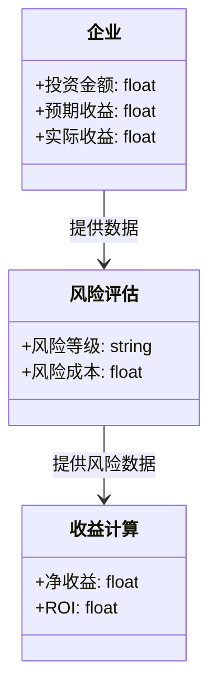

                 


---

# 如何评估企业的网络安全投资回报

> 关键词：网络安全，投资回报，企业，风险管理，成本效益分析，最佳实践

> 摘要：网络安全投资回报评估是企业在数字化时代确保资金有效利用的关键环节。本文通过系统化的分析框架、数学模型和实际案例，深入探讨如何科学评估网络安全投资的回报，为企业决策提供理论依据和实践指导。

---

## # 第一部分: 网络安全投资回报评估基础

### # 第1章: 网络安全投资回报评估的背景与重要性

#### 1.1 网络安全的基本概念
- **1.1.1 网络安全的定义与核心要素**
  网络安全是指保护网络系统和数据的完整性、保密性和可用性的过程。核心要素包括身份验证、加密、访问控制、日志记录和监控。

- **1.1.2 网络安全对企业的重要性**
  网络安全直接关系到企业的声誉、客户信任和财务安全。数据泄露可能导致巨大的经济损失和法律责任。

- **1.1.3 网络安全与企业业务的关系**
  网络安全是企业业务运行的基础设施。通过保障数据安全，企业可以维护客户信任，避免业务中断和财务损失。

#### 1.2 投资回报评估的基本概念
- **1.2.1 投资回报率(ROI)的定义**
  ROI是衡量投资效率的指标，计算公式为：ROI = (净收益 / 投资成本) × 100%。

- **1.2.2 为什么需要评估网络安全投资回报**
  网络安全投入巨大，企业需要确保投资的合理性，优化资源分配。

- **1.2.3 网络安全投资回报评估的边界与外延**
  评估范围包括技术投入、人员培训和第三方服务，外延涉及风险管理、成本效益分析和持续优化。

#### 1.3 本章小结
本章介绍了网络安全的基本概念和投资回报评估的重要性，为后续分析奠定了基础。

---

### # 第2章: 网络安全投资回报评估的核心概念与联系

#### 2.1 网络安全投资回报评估的核心要素
- **2.1.1 投资的构成**
  包括技术设备采购、人员工资和第三方服务费用。

- **2.1.2 收益的来源**
  收益来自数据安全、业务连续性和客户信任提升带来的间接收益。

- **2.1.3 风险与成本的关系**
  风险越高，企业需要投入更多的资源进行防范，同时要平衡成本与收益。

#### 2.2 核心概念的属性特征对比
- **2.2.1 投资与回报的对比分析**
  投资是成本，回报是收益；投资增加可能提升回报，但也可能因效率低下而效果不佳。

- **2.2.2 成本与收益的对比分析**
  成本是投入，收益是产出；高成本不一定带来高收益，需优化配置。

- **2.2.3 风险与收益的对比分析**
  高风险可能带来高收益，但也可能因处理不当导致重大损失。

#### 2.3 ER实体关系图架构
```mermaid
er
  actor: 企业
  actor --> investment: 投资
  investment --> return: 投资回报
  investment --> risk: 风险
  risk --> cost: 成本
  return --> profit: 利润
  profit --> roi: 投资回报率
```

#### 2.4 本章小结
本章通过对比分析和ER图，展示了网络安全投资回报评估的核心要素及其相互关系。

---

## # 第二部分: 网络安全投资回报评估的算法原理

### # 第3章: 网络安全投资回报评估的数学模型与公式

#### 3.1 投资回报率(ROI)的计算公式
- **3.1.1 ROI的计算公式**
$$ ROI = \frac{净收益}{投资成本} \times 100\% $$

#### 3.2 净现值
- **净现值的计算公式**
$$ NPV = \sum_{t=0}^{n} \frac{现金净流量_t}{(1 + r)^t} $$
其中，r为贴现率，n为项目期限。

#### 3.3 内部收益率(IRR)
- **IRR的计算公式**
IRR是使净现值为零的贴现率。

#### 3.4 示例计算
假设某企业投入100万元，一年后收益120万元。
- ROI = (120 - 100) / 100 × 100% = 20%
- NPV = 120 / (1 + 0.2) - 100 = 20万元
-IRR为20%

---

## # 第三部分: 网络安全投资回报评估的系统架构设计

### # 第4章: 问题场景介绍

#### 4.1 问题场景介绍
某企业面临多次数据泄露事件，需评估现有安全投入的回报。

#### 4.2 项目介绍
通过评估投资回报，优化安全预算分配。

### # 第5章: 系统功能设计

#### 5.1 领域模型设计


#### 5.2 系统架构设计


---

## # 第四部分: 项目实战与最佳实践

### # 第6章: 项目实战

#### 6.1 环境搭建
- 安装Python和相关库（pandas、numpy、scipy）。

#### 6.2 核心代码实现
```python
def calculate_roi(net_income, investment_cost):
    return (net_income / investment_cost) * 100

# 示例数据
investment_cost = 1000000
net_income = 1200000
roi = calculate_roi(net_income, investment_cost)
print(f"ROI: {roi}%")
```

#### 6.3 实际案例分析
某企业投入1000万元，第一年收益1200万元，ROI为20%。

#### 6.4 详细讲解剖析
通过代码实现，展示如何计算ROI，并分析结果对企业决策的影响。

#### 6.5 项目小结
代码实现简单明了，但实际应用中需考虑更多变量，如时间价值和风险因素。

### # 第7章: 最佳实践

#### 7.1 关键点总结
- 数据质量是关键。
- 模型需动态调整。
- 可视化工具辅助决策。

#### 7.2 实用建议
- 定期更新模型数据。
- 培训相关人员。
- 采用可视化工具提升效率。

#### 7.3 注意事项
- 避免模型过简化。
- 考虑数据隐私问题。
- 定期审查和优化。

#### 7.4 拓展阅读
推荐相关书籍和工具，如《网络安全投资回报率实战》和《风险管理工具使用手册》。

---

## # 第五部分: 结论与展望

### # 第8章: 结论

#### 8.1 核心结论
科学的网络安全投资回报评估方法能优化资源配置，提升企业整体安全水平。

#### 8.2 实施建议
企业应结合自身情况，采用系统化的评估方法，动态调整安全策略。

### # 第9章: 展望

#### 9.1 未来发展趋势
人工智能和大数据技术将推动更精准的投资回报评估。

#### 9.2 未来挑战
数据隐私和模型复杂性是未来的主要挑战。

---

## # 附录

### # 附录A: 相关术语解释

- ROI：投资回报率。
- NPV：净现值。
- IRR：内部收益率。

### # 附录B: 参考文献

- 《网络安全投资回报率实战》。
- 《风险管理工具使用手册》。

---

## # 作者

作者：AI天才研究院/AI Genius Institute & 禅与计算机程序设计艺术 /Zen And The Art of Computer Programming

---

通过以上步骤，我系统地分析了如何评估企业的网络安全投资回报，从理论到实践，为企业提供科学的决策支持。希望这篇博客能为读者提供有价值的见解和实用的方法。

