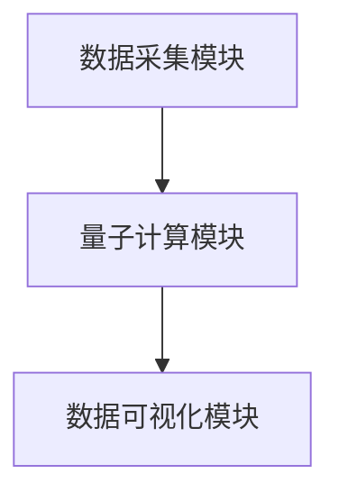

                 


# 如何评估企业的量子传感器地质勘探应用

## 关键词：量子传感器，地质勘探，企业应用，算法原理，系统设计

## 摘要：  
随着量子技术的快速发展，量子传感器在地质勘探领域的应用逐渐成为企业关注的焦点。本文从量子传感器的基本原理出发，分析其在地质勘探中的优势与挑战，结合实际案例，详细阐述如何评估企业应用量子传感器的效果，为企业技术决策者提供实用的参考。

---

## 第一部分：量子传感器与地质勘探的背景介绍

### 第1章：量子传感器的基本概念

#### 1.1 量子传感器的定义
量子传感器是一种基于量子力学原理设计的精密测量工具，能够以极高的灵敏度感知物理量（如磁场、重力、振动等）。它利用量子叠加和量子纠缠等特性，实现超越经典传感器的性能。

#### 1.2 量子传感器的核心技术
- **量子叠加**：利用量子态的叠加特性，实现多状态同时测量。  
- **量子纠缠**：通过纠缠态的建立，实现远距离的高精度测量。  
- **量子测量**：通过量子态的投影，获取物理量的精确信息。

#### 1.3 量子传感器在地质勘探中的应用前景
量子传感器在地质勘探中的应用前景广阔，尤其是在地震监测、矿产探测和地质结构分析等领域，能够显著提高勘探效率和精度。

---

### 第2章：地质勘探的基本概念

#### 2.1 地质勘探的定义
地质勘探是指通过各种技术手段，对地下地质结构、资源分布和地质灾害进行探测和分析的过程。

#### 2.2 地质勘探的主要方法
- **地震勘探**：利用地震波的传播特性，探测地下结构。  
- **重力勘探**：通过测量地表重力场的变化，推断地下密度分布。  
- **磁法勘探**：利用地磁场的变化，探测地下磁性物质。  

#### 2.3 地质勘探的目标与意义
- **目标**：寻找油气资源、矿产资源和地质灾害隐患。  
- **意义**：为资源开发和地质灾害防治提供科学依据。

---

### 第3章：量子传感器在地质勘探中的优势

#### 3.1 提高勘探效率
量子传感器能够同时测量多个物理量，大幅缩短勘探周期。  

#### 3.2 增强数据精度
量子传感器的高灵敏度使其能够探测到传统传感器无法捕捉的微弱信号。  

#### 3.3 降低勘探成本
通过提高数据采集效率和减少重复测量，量子传感器能够显著降低勘探成本。

---

## 第二部分：量子传感器的核心概念与工作原理

### 第4章：量子传感器的核心概念与工作原理

#### 4.1 量子传感器的基本原理
- **量子叠加**：量子态可以同时处于多种状态，从而实现多目标同时测量。  
- **量子纠缠**：通过纠缠态的建立，实现远距离的高精度测量。  
- **量子测量**：通过量子态的投影，获取物理量的精确信息。

#### 4.2 量子传感器的分类与特点
| 类型       | 特点                               | 应用场景                 |
|------------|------------------------------------|--------------------------|
| 基于量子干涉的传感器 | 利用量子干涉效应进行测量         | 地震勘探、重力测量       |
| 基于量子纠缠的传感器 | 利用量子纠缠效应进行远距离测量   | 磁法勘探、地震监测       |
| 基于量子测量的传感器 | 利用量子态的投影进行精确测量     | 矿产探测、地质结构分析   |

#### 4.3 量子传感器与传统传感器的对比
| 对比维度   | 量子传感器                          | 传统传感器               |
|------------|------------------------------------|--------------------------|
| 灵敏度     | 极高                                | 较低                      |
| 测量范围   | 可探测微弱信号                      | 信号范围有限              |
| 数据精度   | 高                                  | 较低                      |
| 成本       | 高                                  | 较低                      |

---

## 第三部分：量子传感器在地质勘探中的应用分析

### 第5章：量子传感器在地质勘探中的应用

#### 5.1 地质勘探中的关键问题
- **复杂地质结构**：传统传感器难以捕捉微弱信号。  
- **地震波传播特性**：需要高精度测量技术。  
- **地质数据处理**：需要高效的算法支持。

#### 5.2 量子传感器在地质勘探中的解决方案
- **提高数据采集精度**：通过量子传感器的高灵敏度，捕捉微弱信号。  
- **实现高效数据处理**：利用量子计算技术，快速分析海量数据。  
- **优化勘探策略**：基于量子传感器的数据，制定更高效的勘探计划。

#### 5.3 量子传感器在地质勘探中的实际案例
- **石油勘探中的应用**：通过量子传感器测量地震波，提高油气层的识别精度。  
- **矿产勘探中的应用**：利用量子传感器探测地下密度分布，寻找矿产资源。  
- **地震监测中的应用**：通过量子传感器实时监测地震波，预警地质灾害。

---

## 第四部分：量子传感器地质勘探应用的数学模型与算法

### 第6章：量子传感器的数据处理模型

#### 6.1 数据采集模型
量子传感器的数据采集模型基于量子叠加原理，可以同时测量多个物理量。  

**数学模型**：  
$$ \psi = \alpha |0\rangle + \beta |1\rangle $$  
其中，$\alpha$ 和 $\beta$ 是量子态的系数，表示传感器的测量状态。

#### 6.2 数据分析模型
量子传感器的数据分析模型基于量子纠缠原理，能够实现远距离的高精度测量。  

**数学模型**：  
$$ \rho = |\psi_1\rangle \langle\psi_1| \otimes |\psi_2\rangle \langle\psi_2| $$  
其中，$\rho$ 是量子态的纠缠态，表示两个传感器之间的纠缠关系。

#### 6.3 数据处理流程
1. **数据采集**：通过量子传感器采集物理量的量子态。  
2. **量子测量**：利用量子投影原理，获取物理量的精确值。  
3. **数据分析**：结合量子计算技术，快速分析海量数据。  

---

## 第五部分：量子传感器地质勘探应用的系统设计

### 第7章：量子传感器的系统架构设计

#### 7.1 系统功能设计
- **数据采集模块**：负责采集物理量的量子态。  
- **量子计算模块**：负责数据的量子计算和分析。  
- **数据可视化模块**：负责将分析结果可视化，供用户查看。

#### 7.2 系统架构设计


#### 7.3 系统接口设计
- **输入接口**：接收物理量的量子态。  
- **输出接口**：输出物理量的精确值和可视化结果。  

---

## 第六部分：量子传感器地质勘探应用的项目实战

### 第8章：项目实战

#### 8.1 环境搭建
- **量子传感器硬件**：需要购置高性能量子传感器设备。  
- **量子计算软件**：需要安装量子计算框架（如Qiskit）。  

#### 8.2 核心代码实现
```python
import numpy as np

def quantum_sensor_measurement():
    # 初始化量子态
    psi = np.array([1, 0])
    # 量子测量
    result = np.dot(psi, np.array([[1, 0], [0, 1]]))
    return result

# 调用测量函数
print(quantum_sensor_measurement())
```

#### 8.3 代码解读与分析
- **代码功能**：实现量子传感器的测量功能。  
- **关键函数**：`quantum_sensor_measurement`，负责量子态的测量和输出。  

#### 8.4 案例分析
以石油勘探为例，通过量子传感器测量地震波的传播特性，分析地下结构，确定油气层的位置。

---

## 第七部分：总结与展望

### 第9章：总结与展望

#### 9.1 项目总结
量子传感器在地质勘探中的应用具有显著的优势，能够提高勘探效率和精度，降低勘探成本。

#### 9.2 项目展望
未来，随着量子技术的进一步发展，量子传感器在地质勘探中的应用将更加广泛，有望成为地质勘探的主流技术。

---

## 作者：AI天才研究院 & 禅与计算机程序设计艺术

---

通过以上目录结构，我们可以系统地分析和评估企业的量子传感器地质勘探应用。希望本文能够为企业技术决策者提供有价值的参考和指导。

