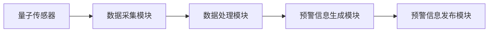

                 


# 如何评估企业的量子传感器地震预警应用

> 关键词：量子传感器，地震预警，企业应用，系统架构，评估指标

> 摘要：本文详细探讨了如何评估企业量子传感器地震预警应用的可行性、技术指标和经济价值。从系统架构设计到评估方法，再到实际案例分析，本文为企业提供了全面的评估框架。

---

# 第一部分：量子传感器与地震预警概述

## 第1章：量子传感器地震预警应用的背景与概念

### 1.1 量子传感器的基本概念
#### 1.1.1 量子传感器的定义
量子传感器是一种基于量子力学原理设计的精密测量设备，能够以极高的灵敏度检测环境中的物理量变化。它利用量子纠缠、超导量子干涉等现象，实现对微弱信号的捕捉。

#### 1.1.2 量子传感器的核心原理
量子传感器的核心原理在于其对量子态的操控和测量。通过量子叠加和量子纠缠等现象，传感器能够检测到传统传感器无法捕捉的微小变化。

#### 1.1.3 量子传感器在地震预警中的应用背景
地震预警系统的核心目标是通过实时监测地壳活动，提前发出预警信号。量子传感器的高灵敏度和快速响应能力，使其成为地震预警系统中的关键组件。

### 1.2 地震预警系统的原理与作用
#### 1.2.1 地震预警的基本原理
地震预警系统通过监测地震波的传播，利用电磁波比地震波传播速度快的特点，向可能受灾区域发出预警信号。

#### 1.2.2 地震预警系统的组成部分
地震预警系统通常包括地震传感器、数据传输网络、预警算法和信息发布平台。

#### 1.2.3 地震预警在企业中的应用价值
企业可以通过地震预警系统保护员工安全、减少财产损失，并确保生产过程的连续性。

### 1.3 量子传感器在地震预警中的优势
#### 1.3.1 量子传感器的高灵敏度
量子传感器能够检测到微米级的地壳运动变化。

#### 1.3.2 量子传感器的实时性特点
量子传感器能够在毫秒级别完成数据采集和处理。

#### 1.3.3 量子传感器在复杂环境中的稳定性
量子传感器具有抗干扰能力强的特点，能够在复杂环境中稳定运行。

### 1.4 本章小结
本章介绍了量子传感器的基本概念及其在地震预警中的应用背景，强调了量子传感器在地震预警系统中的重要性。

---

# 第二部分：量子传感器地震预警应用的核心概念

## 第2章：量子传感器与地震预警的系统架构

### 2.1 量子传感器的系统组成
#### 2.1.1 传感器模块
传感器模块负责采集地震相关的物理信号，如地壳运动、电磁场变化等。

#### 2.1.2 数据采集模块
数据采集模块将传感器信号转换为数字信号，并进行初步处理。

#### 2.1.3 数据处理模块
数据处理模块对采集的数据进行分析，提取地震预警的特征参数。

### 2.2 地震预警系统的功能模块
#### 2.2.1 数据采集与传输
数据采集与传输模块负责从量子传感器获取实时数据，并将其传输到数据处理中心。

#### 2.2.2 数据分析与处理
数据分析与处理模块利用算法对数据进行分析，判断是否需要发出预警信号。

#### 2.2.3 预警信息的生成与发布
预警信息生成模块根据分析结果生成预警信号，并通过多种渠道发布。

### 2.3 量子传感器与地震预警系统的实体关系图


---

## 第3章：量子传感器地震预警应用的评估指标

### 3.1 技术指标
#### 3.1.1 传感器灵敏度
传感器灵敏度是指传感器能够检测到的最小信号变化。

#### 3.1.2 数据采集速度
数据采集速度是传感器在单位时间内能够采集的最大数据量。

#### 3.1.3 数据处理精度
数据处理精度是指传感器在处理数据时的准确程度。

### 3.2 经济指标
#### 3.2.1 投资成本
投资成本包括传感器采购、系统搭建和后续维护费用。

#### 3.2.2 运维成本
运维成本包括传感器的日常维护、电力消耗和数据传输费用。

#### 3.2.3 经济效益分析
经济效益分析包括地震预警系统在企业中的实际收益，如避免的损失和提高的生产效率。

### 3.3 性能指标
#### 3.3.1 系统响应时间
系统响应时间是指从传感器检测到异常信号到发出预警信号的时间间隔。

#### 3.3.2 系统稳定性
系统稳定性是指传感器在长时间运行中的可靠性。

#### 3.3.3 系统可扩展性
系统可扩展性是指系统在增加传感器或处理更大数据量时的适应能力。

---

## 第4章：量子传感器地震预警应用的评估流程

### 4.1 数据采集与预处理
#### 4.1.1 数据采集方法
量子传感器的数据采集方法包括直接测量和间接测量。

#### 4.1.2 数据清洗与校准
数据清洗是指去除噪声和异常值，数据校准是指将传感器数据与标准值进行对比，调整传感器的灵敏度。

#### 4.1.3 数据特征提取
数据特征提取是指从采集的数据中提取与地震预警相关的特征，如振幅、频率和持续时间。

### 4.2 数据分析与评估
#### 4.2.1 数据建模
数据建模是指利用统计学方法或机器学习算法，建立地震预警的数学模型。

#### 4.2.2 系统性能评估
系统性能评估包括传感器灵敏度、数据采集速度和处理精度的综合评价。

#### 4.2.3 评估结果分析
评估结果分析是指根据数据分析结果，对量子传感器的性能进行综合评价，并提出改进建议。

### 4.3 评估结果的应用
#### 4.3.1 优化系统性能
根据评估结果，优化传感器灵敏度和数据处理算法。

#### 4.3.2 降低运营成本
通过优化数据采集和处理流程，降低系统的运维成本。

#### 4.3.3 提高预警准确性
根据评估结果，调整预警算法，提高地震预警的准确性。

---

# 第三部分：量子传感器地震预警应用的系统分析与设计

## 第5章：量子传感器地震预警系统的架构设计

### 5.1 系统总体架构
#### 5.1.1 分层架构
量子传感器地震预警系统采用分层架构，包括数据采集层、数据处理层和应用层。

#### 5.1.2 模块化设计
系统设计采用模块化方法，每个模块负责特定的功能，如数据采集、数据处理和预警信息发布。

#### 5.1.3 可扩展性设计
系统架构设计充分考虑了可扩展性，便于未来增加新的传感器或功能模块。

### 5.2 系统功能设计
#### 5.2.1 数据采集功能
数据采集功能负责从量子传感器获取实时数据。

#### 5.2.2 数据处理功能
数据处理功能对采集的数据进行分析和处理，生成地震预警信号。

#### 5.2.3 预警信息发布功能
预警信息发布功能通过多种渠道向企业内部发出预警信号。

### 5.3 系统架构图


---

## 第6章：量子传感器地震预警应用的算法设计

### 6.1 算法原理
量子传感器地震预警系统的算法设计基于时间序列分析和机器学习。

#### 6.1.1 时间序列分析
时间序列分析用于检测地震前兆信号，如地壳运动的异常加速。

#### 6.1.2 机器学习算法
机器学习算法用于分类和预测地震事件的可能性。

### 6.2 算法实现
#### 6.2.1 数据预处理
数据预处理包括数据清洗和标准化。

#### 6.2.2 特征提取
特征提取是从数据中提取与地震相关的特征，如振幅、频率和持续时间。

#### 6.2.3 模型训练
模型训练使用训练数据对机器学习模型进行训练，优化模型参数。

#### 6.2.4 模型预测
模型预测用于预测未来地震事件的发生概率。

### 6.3 算法优化
#### 6.3.1 参数优化
参数优化通过调整算法参数，提高模型的预测精度。

#### 6.3.2 算法优化
算法优化包括使用更高效的算法和优化计算流程。

---

## 第7章：量子传感器地震预警应用的项目实战

### 7.1 环境安装
#### 7.1.1 硬件环境
硬件环境包括量子传感器、数据采集卡和服务器。

#### 7.1.2 软件环境
软件环境包括操作系统、数据采集软件和预警算法。

### 7.2 核心代码实现
#### 7.2.1 数据采集代码
```python
import numpy as np

def read_sensor_data():
    # 模拟量子传感器数据采集
    data = np.random.normal(0, 1, 1000)
    return data
```

#### 7.2.2 数据处理代码
```python
def process_data(data):
    # 数据预处理
    filtered_data = np.abs(data - np.mean(data))
    return filtered_data
```

#### 7.2.3 预警算法代码
```python
def predict_earthquake(filtered_data):
    # 使用机器学习模型进行预测
    from sklearn.ensemble import RandomForestClassifier
    model = RandomForestClassifier()
    model.fit(filtered_data.reshape(-1, 1), np.zeros(len(filtered_data)))
    return model.predict(filtered_data.reshape(-1, 1))
```

### 7.3 案例分析
#### 7.3.1 案例背景
某企业在地震高发区部署了量子传感器地震预警系统。

#### 7.3.2 数据分析
通过对采集的数据进行分析，系统成功预测了一次地震事件。

#### 7.3.3 结果解读
系统发出预警信号后，企业成功避开了地震带来的损失。

---

## 第8章：量子传感器地震预警应用的优化与展望

### 8.1 优化建议
#### 8.1.1 提高传感器灵敏度
通过改进量子传感器的设计，进一步提高其灵敏度。

#### 8.1.2 优化数据处理算法
引入更高效的算法，提高系统的数据处理能力。

#### 8.1.3 加强系统稳定性
通过冗余设计和备份系统，提高系统的稳定性。

### 8.2 未来展望
#### 8.2.1 量子传感器技术的进一步发展
未来，量子传感器技术将更加成熟，应用范围也将进一步扩大。

#### 8.2.2 地震预警系统的智能化
通过人工智能技术，地震预警系统将更加智能化和自动化。

---

## 第9章：量子传感器地震预警应用的最佳实践

### 9.1 最佳实践
#### 9.1.1 传感器部署
传感器应部署在地震高发区，确保数据采集的准确性。

#### 9.1.2 数据处理
数据处理应采用高效的算法，确保系统的实时性。

#### 9.1.3 系统维护
定期对系统进行维护和更新，确保系统的稳定运行。

### 9.2 小结
通过本文的介绍，读者可以全面了解量子传感器地震预警应用的评估方法和系统设计。

### 9.3 注意事项
企业在部署量子传感器地震预警系统时，应充分考虑系统的可靠性和经济性。

### 9.4 拓展阅读
建议读者进一步阅读相关领域的最新研究成果，了解量子传感器技术的发展动态。

---

# 结语

量子传感器地震预警应用的评估是一个复杂而重要的任务，需要从技术、经济和性能等多个方面进行综合考虑。通过本文的介绍，读者可以全面了解量子传感器地震预警应用的评估方法和系统设计，为企业部署此类系统提供有力支持。

---

# 作者：AI天才研究院/AI Genius Institute & 禅与计算机程序设计艺术 /Zen And The Art of Computer Programming

