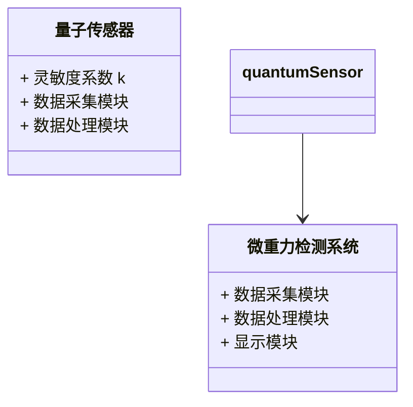
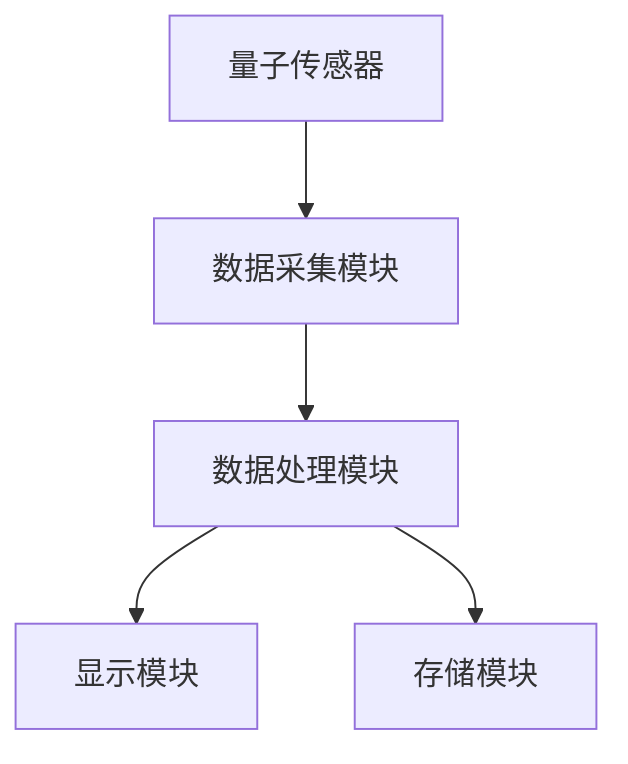
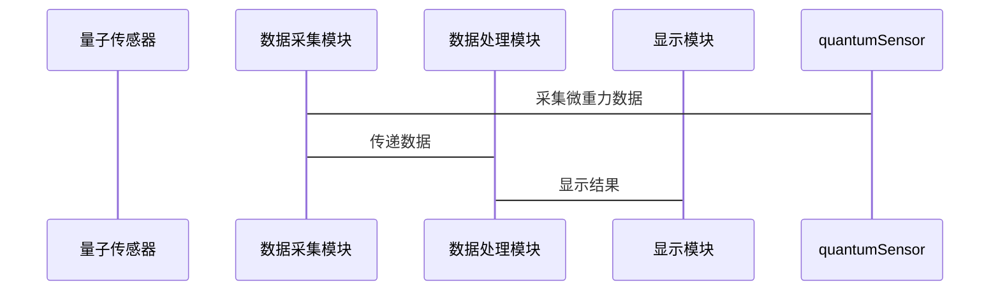

                 


# 如何评估企业的量子传感器微重力检测应用

> 关键词：量子传感器，微重力检测，企业评估，算法原理，系统架构

> 摘要：量子传感器微重力检测技术是一项结合了量子力学与传感器技术的新兴技术，本文从背景、原理、算法、系统架构、项目实战等多个维度，详细阐述了如何评估企业的量子传感器微重力检测应用。文章通过理论分析与实践案例相结合的方式，深入探讨了量子传感器微重力检测的核心概念、算法原理、系统架构设计以及项目实战的具体步骤，为企业在实际应用中提供了系统的评估方法和实践指导。

---

# 第一部分: 量子传感器微重力检测应用概述

## 第1章: 量子传感器与微重力检测概述

### 1.1 量子传感器的基本概念

#### 1.1.1 量子传感器的定义
量子传感器是一种基于量子效应的测量装置，利用量子系统（如原子、光子等）的量子态变化来感知外界物理量（如重力、磁场、位置等）。与传统传感器相比，量子传感器具有更高的灵敏度和精度。

#### 1.1.2 微重力检测的背景与意义
微重力是指地球表面重力加速度的微小变化，通常用于地球科学研究、地质勘探、地震预测等领域。量子传感器的微重力检测技术能够以极高的精度捕捉这些变化，为企业提供更精准的地球物理数据。

#### 1.1.3 量子传感器在微重力检测中的作用
量子传感器通过测量微重力的变化，能够帮助企业实现地质勘探、矿产资源探测、地震预警等应用。其高灵敏度和高精度使其在这些领域具有显著优势。

---

### 1.2 微重力检测的应用场景

#### 1.2.1 微重力检测的典型应用场景
- 地质勘探：用于探测地下资源分布。
- 地震预警：通过监测微重力变化预测地震。
- 矿产资源探测：用于寻找地下矿产资源。

#### 1.2.2 企业级应用中的微重力检测需求
- 企业需要高精度的微重力数据支持地质勘探和资源探测。
- 微重力检测技术能够提高资源探测的效率和准确性。

#### 1.2.3 量子传感器的优势与局限性
- **优势**：高灵敏度、高精度、抗干扰能力强。
- **局限性**：技术复杂性高、成本较高、对环境敏感。

---

### 1.3 量子传感器微重力检测的背景与现状

#### 1.3.1 微重力检测技术的发展历程
微重力检测技术从传统的机械传感器发展到基于量子效应的传感器，经历了多年的技术积累和创新。

#### 1.3.2 量子传感器技术的最新进展
近年来，量子传感器技术取得了显著进展，尤其是在微重力检测领域，量子传感器的灵敏度和精度不断提高。

#### 1.3.3 当前企业应用中的挑战与机遇
- **挑战**：技术复杂性高、成本高、需要专业技术人员。
- **机遇**：能够提升企业的资源探测能力和技术竞争力。

---

## 第2章: 量子传感器微重力检测的核心概念

### 2.1 量子传感器的工作原理

#### 2.1.1 量子力学基础与传感器原理
量子传感器基于量子系统的状态变化来感知外界物理量。例如，利用原子的量子态变化来测量微重力变化。

#### 2.1.2 微重力检测的物理机制
微重力检测通过测量重力加速度的微小变化，利用量子传感器的高灵敏度来捕捉这些变化。

#### 2.1.3 量子传感器与传统传感器的对比
- **量子传感器**：高灵敏度、高精度、抗干扰能力强。
- **传统传感器**：灵敏度和精度较低，容易受到环境干扰。

---

### 2.2 微重力检测的数学模型

#### 2.2.1 微重力信号的数学表达
微重力信号可以用数学公式表示为：
$$ g(t) = g_0 + \delta g(t) $$
其中，$g_0$ 是地球的基本重力加速度，$\delta g(t)$ 是微重力变化量。

#### 2.2.2 量子传感器的响应模型
量子传感器对微重力变化的响应可以用以下公式表示：
$$ \Delta g = k \cdot \delta g $$
其中，$k$ 是传感器的灵敏度系数。

#### 2.2.3 检测精度与测量误差分析
传感器的测量精度可以通过以下公式评估：
$$ \text{精度} = \frac{\Delta g}{g_0} $$
测量误差主要来源于环境干扰、传感器噪声等因素。

---

### 2.3 量子传感器微重力检测的核心要素

#### 2.3.1 传感器灵敏度与分辨率
- 灵敏度：传感器对微重力变化的响应能力。
- 分辨率：传感器能够区分的最小微重力变化量。

#### 2.3.2 测量范围与适用场景
量子传感器的测量范围决定了其适用场景。例如，高灵敏度的量子传感器适用于微重力变化较小的场景，而低灵敏度的传感器适用于微重力变化较大的场景。

#### 2.3.3 数据采集与处理流程
- 数据采集：通过量子传感器获取微重力变化数据。
- 数据处理：对采集的数据进行滤波、放大、分析等处理。

---

## 第3章: 量子传感器微重力检测的算法原理

### 3.1 微重力检测的基本算法

#### 3.1.1 傅里叶变换在微重力检测中的应用
傅里叶变换用于分析微重力信号的频域特性：
$$ X(f) = \int_{-\infty}^{\infty} x(t) e^{-j2\pi f t} dt $$

#### 3.1.2 信号处理与噪声消除算法
- 噪声消除：通过滤波器消除传感器噪声。
- 信号增强：通过放大器提高微重力信号的幅度。

#### 3.1.3 数据拟合与参数估计方法
利用最小二乘法拟合微重力变化曲线：
$$ \min \sum_{i=1}^{n} (g_i - g(t_i))^2 $$

---

### 3.2 量子传感器数据处理的数学模型

#### 3.2.1 数据采集与预处理流程
- 数据采集：通过量子传感器获取微重力变化数据。
- 数据预处理：去除噪声、校准传感器。

#### 3.2.2 基于量子效应的信号增强算法
利用量子效应提升信号的信噪比：
$$ S/N = \frac{\text{信号幅度}}{\text{噪声幅度}} $$

#### 3.2.3 精度优化的数学推导
通过优化传感器灵敏度系数 $k$ 提高测量精度：
$$ \text{精度} = \frac{\Delta g}{k} $$

---

### 3.3 算法实现的流程

#### 3.3.1 数据采集与预处理
1. 通过量子传感器采集微重力变化数据。
2. 对采集的数据进行滤波和放大处理。

#### 3.3.2 信号处理与分析
1. 使用傅里叶变换分析信号的频域特性。
2. 通过最小二乘法拟合微重力变化曲线。

#### 3.3.3 精度优化
1. 调整传感器灵敏度系数 $k$。
2. 计算测量精度并验证。

---

## 第4章: 量子传感器微重力检测的系统架构设计

### 4.1 问题场景介绍

#### 4.1.1 系统目标
设计一个基于量子传感器的微重力检测系统，实现高精度的微重力测量。

#### 4.1.2 系统需求
- 实时监测微重力变化。
- 高精度数据采集与处理。
- 可扩展的系统架构。

---

### 4.2 系统功能设计

#### 4.2.1 领域模型类图


#### 4.2.2 系统架构设计


#### 4.2.3 接口设计
- 数据采集模块接口：提供微重力数据的采集功能。
- 数据处理模块接口：提供数据处理和分析功能。

#### 4.2.4 交互流程


---

## 第5章: 项目实战

### 5.1 环境安装与配置

#### 5.1.1 系统需求
- 操作系统：Linux或Windows。
- 开发工具：Python、NumPy、Matplotlib。

#### 5.1.2 安装依赖
```bash
pip install numpy matplotlib
```

---

### 5.2 核心代码实现

#### 5.2.1 数据采集模块
```python
import numpy as np

def采集微重力数据():
    # 模拟量子传感器数据采集
    data = np.random.normal(loc=9.8, scale=0.01, size=100)
    return data
```

#### 5.2.2 数据处理模块
```python
import matplotlib.pyplot as plt

def处理数据(data):
    # 使用傅里叶变换分析数据
    fft_data = np.fft.fft(data)
    plt.plot(np.fft.fftfreq(100, 0.1), np.abs(fft_data))
    plt.show()
```

#### 5.2.3 系统实现
```python
def主程序():
    data = 采集微重力数据()
    处理数据(data)

主程序()
```

---

## 第6章: 最佳实践与小结

### 6.1 最佳实践

#### 6.1.1 系统设计
- 确保系统的高精度和实时性。
- 选择合适的量子传感器和数据处理算法。

#### 6.1.2 代码实现
- 使用高效的编程语言（如Python）实现数据处理模块。
- 确保代码的可扩展性和可维护性。

#### 6.1.3 注意事项
- 定期校准传感器，确保测量精度。
- 避免环境干扰，确保传感器的稳定性。

---

## 作者

作者：AI天才研究院/AI Genius Institute & 禅与计算机程序设计艺术 /Zen And The Art of Computer Programming

