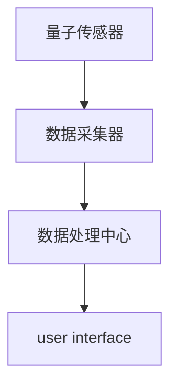
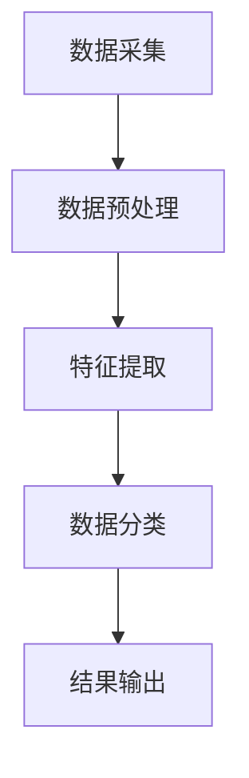
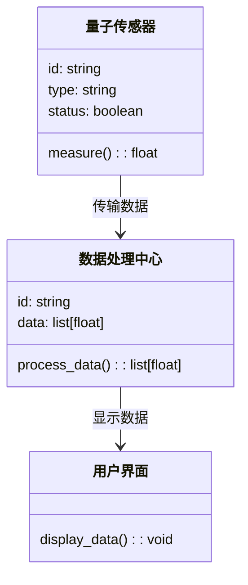
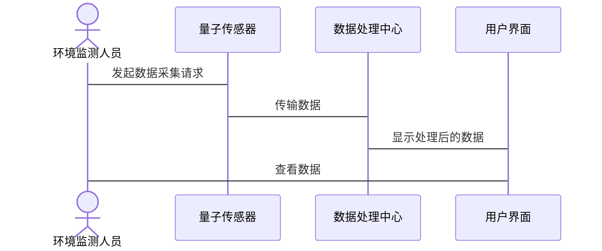

                 


# 如何评估企业的量子传感器环境监测应用

> 关键词：量子传感器，环境监测，企业应用，算法原理，系统架构

> 摘要：随着量子技术的快速发展，量子传感器在环境监测中的应用逐渐成为企业技术升级的重要方向。本文从量子传感器的基本原理、环境监测的核心需求出发，详细分析了企业在评估量子传感器环境监测应用时的关键步骤和注意事项。通过结合实际案例，本文深入探讨了量子传感器在环境监测中的优势、挑战及解决方案，为企业技术决策者提供了实用的评估框架和实践指南。

---

# 第1章: 量子传感器环境监测应用的背景与核心概念

## 1.1 量子传感器的背景与问题背景

### 1.1.1 传统传感器的局限性
传统传感器在环境监测中面临以下挑战：
- **灵敏度不足**：在极端环境或微弱信号下，传统传感器的检测精度有限。
- **响应速度慢**：在动态环境中，传统传感器难以实时捕捉快速变化的参数。
- **易受干扰**：电磁干扰、温度波动等因素会影响传感器的准确性。

### 1.1.2 量子传感器的出现及其优势
量子传感器的出现为环境监测带来了革命性的变化：
- **高灵敏度**：量子传感器利用量子效应，能够检测到传统传感器无法捕捉的微弱信号。
- **高速响应**：基于量子纠缠和超冷原子的技术，量子传感器能够实现超快速的数据采集。
- **抗干扰能力**：量子传感器的原理使其在复杂环境中具有更强的抗干扰能力。

### 1.1.3 企业环境监测的需求与挑战
企业环境监测的核心需求包括：
- 实时监控生产环境中的关键参数（如温度、压力、磁场等）。
- 提高环境监测的精度和灵敏度，以优化生产流程。
- 在复杂环境中确保监测数据的准确性和稳定性。

## 1.2 量子传感器环境监测的核心概念

### 1.2.1 量子传感器的定义与基本原理
量子传感器是一种基于量子力学原理的测量装置，利用量子系统的特性（如量子干涉、量子纠缠）来实现高精度的测量。

### 1.2.2 环境监测的核心要素
环境监测的核心要素包括：
- **监测目标**：如温度、湿度、压力、磁场等。
- **监测范围**：从局部区域到整个厂区的覆盖范围。
- **监测频率**：实时监测或周期性监测。

### 1.2.3 量子传感器在环境监测中的应用边界与外延
量子传感器的应用边界包括：
- **适用场景**：如高精度、低噪声的环境。
- **不适用场景**：如高温、高压等极端环境（目前技术限制）。

## 1.3 量子传感器环境监测的核心要素组成

### 1.3.1 量子传感器的物理特性
- **量子干涉效应**：利用光波干涉原理进行测量。
- **超冷原子技术**：通过冷却原子到微Kelvin温度来实现高精度测量。

### 1.3.2 环境监测的指标体系
- **监测指标**：如温度、湿度、压力、磁场、振动等。
- **监测标准**：根据企业需求制定的阈值和报警机制。

### 1.3.3 量子传感器与环境监测的关联关系
- **传感器与环境的耦合关系**：传感器的性能直接影响监测数据的准确性。
- **环境变化对传感器的影响**：环境中的物理量变化会直接作用于传感器。

---

# 第2章: 量子传感器环境监测的核心概念与联系

## 2.1 量子传感器的基本原理

### 2.1.1 量子传感器的工作原理
量子传感器通过测量量子系统的状态变化来实现对环境参数的感知。例如，基于原子干涉仪的量子传感器通过测量原子在外部环境干扰下的干涉图样来推导环境参数（如重力加速度）。

### 2.1.2 量子传感器的核心技术
- **量子纠缠**：通过纠缠态的量子系统实现高精度测量。
- **量子干涉**：利用干涉效应检测微小的变化。

### 2.1.3 量子传感器与经典传感器的对比
| 对比维度 | 量子传感器 | 经典传感器 |
|----------|-------------|------------|
| 灵敏度   | 极高         | 中等       |
| 响应时间 | 极快         | 较慢       |
| 抗干扰性 | 强           | 较弱       |
| 适用场景 | 高精度需求  | 广泛适用    |

## 2.2 量子传感器环境监测的系统架构

### 2.2.1 系统组成与功能模块
- **传感器节点**：量子传感器负责采集环境数据。
- **数据处理中心**：对传感器数据进行处理、分析和存储。
- **用户界面**：供环境监测人员查看和操作数据。

### 2.2.2 量子传感器与环境监测系统的交互关系


### 2.2.3 系统的层次结构与功能分配
- **数据采集层**：量子传感器负责数据采集。
- **数据处理层**：对数据进行预处理、特征提取和分析。
- **应用层**：提供用户界面和报警功能。

## 2.3 核心概念的ER实体关系图
```mermaid
erDiagram
    actor 企业环境监测系统 : "企业环境监测系统"
    actor 量子传感器网络 : "量子传感器网络"
    actor 数据处理中心 : "数据处理中心"
    actor 环境监测人员 : "环境监测人员"
    actor 应用系统 : "应用系统"
    boundary 环境监测数据 : "环境监测数据"
    boundary 传感器数据 : "传感器数据"
    boundary 处理后的数据 : "处理后的数据"
    boundary 用户界面 : "用户界面"
    boundary 系统接口 : "系统接口"
    boundary 数据存储 : "数据存储"
    boundary 数据传输 : "数据传输"
```

---

# 第3章: 量子传感器环境监测的算法原理

## 3.1 算法原理概述

### 3.1.1 量子传感器数据处理的基本流程
量子传感器数据处理的基本流程包括：
1. 数据采集：通过量子传感器获取原始数据。
2. 数据预处理：去除噪声，提取特征。
3. 数据分析：利用算法对数据进行分类、回归或聚类。

### 3.1.2 量子传感器信号的特征提取
- **特征提取方法**：如主成分分析（PCA）。
- **特征提取的目的**：降低数据维度，提高算法效率。

### 3.1.3 算法的核心思想与实现步骤
- **核心思想**：通过量子叠加和量子测量原理，实现对环境参数的高精度估计。
- **实现步骤**：
  1. 初始化量子系统。
  2. 对量子系统施加环境干扰。
  3. 测量量子系统的状态。
  4. 解码测量结果，得到环境参数。

## 3.2 量子传感器数据处理的算法流程

### 3.2.1 算法流程图


### 3.2.2 Python代码示例
```python
import numpy as np
from sklearn.decomposition import PCA

def quantum_sensor_data_process(data):
    # 数据预处理
    data_processed = data.dropna().astype(float)
    # 特征提取
    pca = PCA(n_components=2)
    features = pca.fit_transform(data_processed)
    return features

# 示例数据
data = {
    'temperature': [25.0, 25.5, 24.8, 26.1],
    'pressure': [1013.0, 1015.0, 1012.0, 1014.0]
}
features = quantum_sensor_data_process(data)
print("提取的特征：", features)
```

### 3.2.3 算法的数学模型和公式
- **量子测量模型**：通过量子测量的期望值来估计环境参数。
  $$ E[x] = \langle \psi | x | \psi \rangle $$
- **数据处理模型**：利用主成分分析（PCA）提取特征。
  $$ y = PCA(X) $$

---

## 3.3 数学模型与公式

### 3.3.1 量子传感器的数据处理公式
- **量子叠加原理**：
  $$ |\psi\rangle = \alpha|0\rangle + \beta|1\rangle $$
- **量子测量的期望值**：
  $$ E[x] = \langle \psi | x | \psi \rangle $$

### 3.3.2 特征提取的数学表达
- **主成分分析（PCA）**：
  $$ Y = X \cdot P $$
  其中，$P$ 是主成分矩阵。

---

# 第4章: 量子传感器环境监测的系统分析与架构设计

## 4.1 问题场景介绍
企业环境监测系统需要实时监控生产环境中的关键参数，确保生产过程的稳定性和安全性。

## 4.2 系统功能设计

### 4.2.1 领域模型设计


### 4.2.2 系统架构设计


### 4.2.3 系统接口设计
- **传感器接口**：与量子传感器连接，接收数据。
- **数据接口**：与数据处理中心交互，提供数据处理服务。
- **用户接口**：与用户界面交互，提供可视化数据。

### 4.2.4 系统交互流程


---

## 4.3 本章小结

---

# 第5章: 量子传感器环境监测的项目实战

## 5.1 环境安装与配置

### 5.1.1 安装量子传感器
- **硬件安装**：部署量子传感器节点。
- **软件安装**：安装数据采集和处理软件。

### 5.1.2 安装数据处理中心
- **服务器配置**：安装高性能服务器。
- **软件部署**：部署数据处理中心软件。

## 5.2 系统核心实现

### 5.2.1 量子传感器数据采集代码
```python
import serial

def read_quantum_sensor(port, baud_rate):
    ser = serial.Serial(port, baud_rate)
    data = ser.readline().decode()
    ser.close()
    return float(data)

# 示例运行
data = read_quantum_sensor('COM3', 9600)
print("采集到的数据：", data)
```

### 5.2.2 数据处理中心代码
```python
import pandas as pd
from sklearn.decomposition import PCA

def process_data(data_frame):
    # 数据预处理
    data_processed = data_frame.dropna()
    # 特征提取
    pca = PCA(n_components=2)
    features = pca.fit_transform(data_processed)
    return features

# 示例数据
data_frame = pd.DataFrame({
    'temperature': [25.0, 25.5, 24.8, 26.1],
    'pressure': [1013.0, 1015.0, 1012.0, 1014.0]
})
features = process_data(data_frame)
print("提取的特征：", features)
```

## 5.3 项目应用与案例分析

### 5.3.1 案例分析
- **案例背景**：某企业需要实时监测生产车间的温度和压力。
- **解决方案**：部署量子传感器网络，结合数据处理中心和用户界面，实现高精度的环境监测。
- **结果分析**：通过量子传感器的高灵敏度，企业成功降低了生产过程中的误差，提高了产品质量。

## 5.4 项目小结

---

# 第6章: 量子传感器环境监测应用的最佳实践与总结

## 6.1 小结与回顾
- 量子传感器在环境监测中的优势：高灵敏度、高速响应、抗干扰能力强。
- 系统架构设计的关键点：传感器部署、数据处理中心、用户界面。

## 6.2 注意事项与实践建议
- **传感器部署**：选择合适的传感器位置，避免干扰。
- **数据处理**：确保数据的准确性和实时性。
- **系统维护**：定期校准传感器，确保系统的稳定性。

## 6.3 拓展阅读与深入学习
- 量子传感器的前沿技术：如量子纠缠态传感器。
- 环境监测的其他技术：如物联网、边缘计算。

---

# 作者：AI天才研究院/AI Genius Institute & 禅与计算机程序设计艺术 /Zen And The Art of Computer Programming

