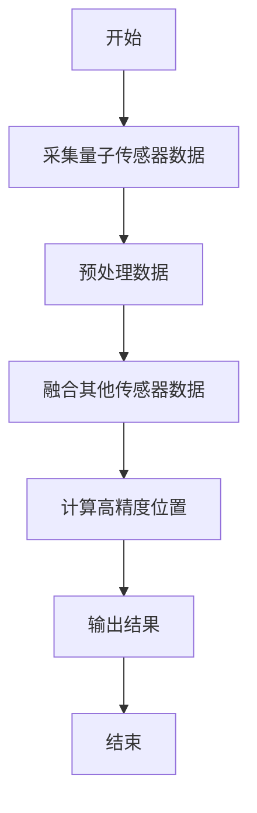

                 


# 如何评估企业的量子传感器精密导航技术潜力

## 关键词：
- 量子传感器
- 精密导航技术
- 企业潜力
- 技术评估
- 市场应用

## 摘要：
量子传感器精密导航技术是一种新兴技术，能够提供高精度的导航解决方案，尤其在复杂环境中表现优异。本文将从技术原理、市场需求、企业研发能力、成本效益、商业模式以及政策环境等多个维度，系统性地分析如何评估企业的量子传感器精密导航技术潜力，为企业决策提供参考。

---

# 第一部分：量子传感器精密导航技术背景介绍

## 第1章：量子传感器精密导航技术概述

### 1.1 量子传感器的基本概念
#### 1.1.1 量子传感器的定义与基本原理
量子传感器是一种基于量子力学原理设计的传感器，利用量子系统的特性（如量子叠加和量子纠缠）来测量物理量，如加速度、磁场或重力。其核心优势在于高灵敏度和高精度。

#### 1.1.2 量子传感器的优势与局限性
- **优势**：高精度、抗干扰能力强、适用于极端环境。
- **局限性**：技术复杂、成本高、商业化难度大。

#### 1.1.3 量子传感器在导航技术中的应用前景
量子传感器可以用于高精度定位，特别是在GPS信号受限的环境中，如室内、地下设施或高层建筑。

---

## 第2章：量子传感器精密导航技术的核心概念与联系

### 2.1 量子传感器精密导航技术的核心原理
#### 2.1.1 量子传感器的工作原理
量子传感器通过测量量子系统的动态变化来感知物理环境的变化，例如利用冷原子干涉技术测量重力加速度。

#### 2.1.2 精密导航技术的基本原理
精密导航技术结合了多种传感器数据（如惯性导航系统、卫星定位、量子传感器）进行融合计算，以实现高精度定位。

#### 2.1.3 量子传感器与精密导航技术的结合
通过将量子传感器与传统导航技术结合，可以显著提高定位精度，特别是在复杂环境中。

### 2.2 核心概念的ER实体关系图
```mermaid
er
  actor(用户)
  system(量子传感器导航系统)
  technology(量子传感器技术)
  application(应用场景)
  actor --> system: 使用
  system --> technology: 集成
  technology --> application: 适用于
```

---

## 第3章：量子传感器精密导航技术的算法原理

### 3.1 量子传感器数据处理算法
#### 3.1.1 数据采集与预处理
量子传感器的数据需要经过降噪和校准，以确保数据的准确性。

#### 3.1.2 数据融合算法
使用卡尔曼滤波算法将量子传感器数据与惯性导航数据融合，实现高精度定位。

#### 3.1.3 算法流程图


### 3.2 精密导航定位算法
#### 3.2.1 定位算法
使用改进的卡尔曼滤波算法，结合量子传感器数据进行实时定位。

#### 3.2.2 定位算法实现
```python
def kalman_filter(quantum_data, inertial_data):
    # 实现卡尔曼滤波算法
    pass
```

---

## 第4章：量子传感器精密导航技术的系统分析

### 4.1 系统架构设计
#### 4.1.1 系统功能设计
- 数据采集模块
- 数据处理模块
- 定位算法模块

#### 4.1.2 系统架构图


---

## 第5章：量子传感器精密导航技术的项目实战

### 5.1 项目案例分析
#### 5.1.1 案例背景
某企业开发了一款基于量子传感器的室内导航系统。

#### 5.1.2 核心代码实现
```python
def main():
    quantum_sensor = QuantumSensor()
    inertial_sensor = InertialSensor()
    fusion = SensorFusion(quantum_sensor, inertial_sensor)
    result = fusion.calculate_position()
    print(result)
```

---

## 第6章：量子传感器精密导航技术的最佳实践

### 6.1 评估关键点
- 技术成熟度
- 市场需求
- 成本效益

### 6.2 小结
量子传感器精密导航技术潜力巨大，但需要企业在技术、市场和成本方面进行综合评估。

### 6.3 注意事项
- 关注政策法规
- 加强研发投入
- 注重用户体验

### 6.4 拓展阅读
- 量子传感器相关学术论文
- 精密导航技术的应用案例

---

# 作者：AI天才研究院 & 禅与计算机程序设计艺术

