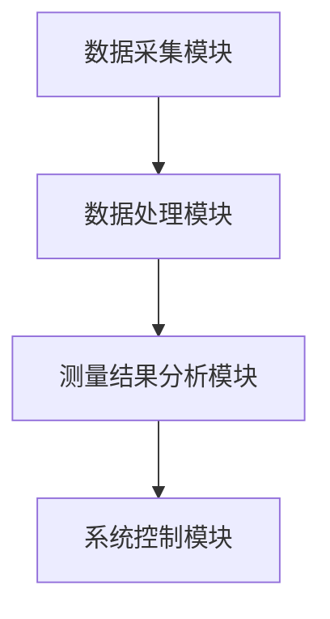

                 


# 如何评估企业的量子传感器精密测量应用

> 关键词：量子传感器，精密测量，企业应用，传感器评估，技术实现

> 摘要：本文详细探讨了如何评估企业在精密测量中应用量子传感器的有效性和可行性。文章从量子传感器的核心原理、精密测量的关键指标、企业应用的场景分析、评估方法的选择与实施，以及系统架构设计等多个维度进行了全面分析，为企业的量子传感器精密测量应用提供了系统的评估框架和实践指南。

---

## 第一部分：量子传感器精密测量应用的背景与基础

### 第1章：量子传感器精密测量应用的背景介绍

#### 1.1 量子传感器的基本概念

- **1.1.1 量子传感器的定义**
  量子传感器是一种基于量子效应和量子技术的测量设备，能够以极高的精度感知和测量物理量（如磁场、重力、位置、振动等）。

- **1.1.2 精密测量的基本概念**
  精密测量是指在高精度、高灵敏度和高稳定性条件下进行的测量，通常用于科学研究、工业制造和工程应用等领域。

- **1.1.3 量子传感器在企业中的应用背景**
  随着量子技术的快速发展，量子传感器在企业中的应用逐渐普及，特别是在精密制造、医疗健康、航空航天等领域，量子传感器能够提供更高的测量精度和更低的测量误差。

#### 1.2 量子传感器精密测量的背景与问题背景

- **1.2.1 精密测量的定义与特点**
  精密测量要求测量设备具有高灵敏度、高分辨率和高稳定性，能够在复杂环境下稳定工作。

- **1.2.2 量子传感器在精密测量中的优势**
  量子传感器具有极高的灵敏度和分辨率，能够在极端环境下提供精确的测量结果。此外，量子传感器的测量速度和响应时间也优于传统传感器。

- **1.2.3 企业应用量子传感器精密测量的必要性**
  在现代企业中，精密测量是许多关键生产过程和质量控制的基础。量子传感器的应用能够显著提高测量精度和效率，从而提升企业的竞争力。

#### 1.3 量子传感器精密测量的核心要素

- **1.3.1 量子传感器的核心技术**
  量子传感器的核心技术包括量子干涉、量子纠缠、量子叠加等量子效应的利用。

- **1.3.2 精密测量的关键指标**
  精密测量的关键指标包括测量精度、测量灵敏度、测量稳定性、测量速度和测量成本。

- **1.3.3 量子传感器与传统传感器的对比**
  与传统传感器相比，量子传感器具有更高的测量精度和灵敏度，能够在更复杂和极端的环境中工作。然而，量子传感器的成本较高，且技术实现相对复杂。

#### 1.4 量子传感器精密测量的应用场景

- **1.4.1 工业制造中的精密测量**
  量子传感器在工业制造中的应用包括高精度零件的测量、生产线质量控制、机器人定位与导航等。

- **1.4.2 医疗健康中的精密测量**
  量子传感器在医疗健康中的应用包括高精度医疗设备的校准、患者生理参数的实时监测等。

- **1.4.3 其他领域的精密测量应用**
  量子传感器还广泛应用于航空航天、能源监测、环境监测等领域。

---

## 第二部分：量子传感器精密测量的核心概念与联系

### 第2章：量子传感器精密测量的核心概念与联系

#### 2.1 量子传感器精密测量的核心原理

- **2.1.1 量子传感器的基本工作原理**
  量子传感器通过测量量子系统的状态变化来感知外界物理量的变化。例如，基于量子干涉的传感器通过测量光波的干涉图样来感知微小的位移变化。

- **2.1.2 精密测量的数学模型**
  精密测量的数学模型通常包括测量信号的采集、噪声的处理、测量结果的校准和优化等步骤。例如，量子传感器的测量结果可以通过以下公式表示：
  $$ S = s_0 + n $$
  其中，$S$ 是测量信号，$s_0$ 是理想信号，$n$ 是噪声。

- **2.1.3 量子传感器与精密测量的结合**
  量子传感器通过其独特的量子效应和高灵敏度，能够在精密测量中实现更高的测量精度和更低的测量误差。

#### 2.2 量子传感器精密测量的核心要素对比

- **2.2.1 不同传感器的性能对比**
  以下是几种常见传感器在精密测量中的性能对比：
  | 传感器类型 | 测量精度 | 响应时间 | 成本 | 适用场景 |
  |------------|----------|----------|-----|----------|
  | 量子传感器 | 极高     | 极快     | 高  | 科研、高端制造 |
  | 传统传感器 | 中等     | 中等     | 低  | 普通制造、日常监测 |

- **2.2.2 精密测量指标的对比分析**
  精密测量的指标包括测量精度、测量灵敏度、测量稳定性等。量子传感器在这些指标上通常表现优于传统传感器。

- **2.2.3 量子传感器与传统传感器的性能对比**
  量子传感器在测量精度、灵敏度和稳定性方面具有显著优势，但在成本和复杂性方面存在劣势。

#### 2.3 量子传感器精密测量的ER实体关系图

```mermaid
erDiagram
    actor 企业用户 {
        <<用户>>
    }
    actor 测量数据 {
        <<数据>>
    }
    actor 传感器设备 {
        <<设备>>
    }
    actor 评估系统 {
        <<系统>>
    }
    enterprise 评估过程 {
        <<过程>>
    }
    enterprise 评估结果 {
        <<结果>>
    }
    企业用户 --> 传感器设备 : 使用
    传感器设备 --> 测量数据 : 采集
    测量数据 --> 评估系统 : 传输
    评估系统 --> 评估结果 : 输出
    评估过程 --> 评估结果 : 归纳
```

---

## 第三部分：量子传感器精密测量的算法原理与实现

### 第3章：量子传感器精密测量的算法原理与实现

#### 3.1 量子传感器精密测量的算法原理

- **3.1.1 量子传感器的信号处理算法**
  量子传感器的信号处理算法通常包括信号采集、噪声消除、信号放大和信号分析等步骤。例如，基于量子干涉的传感器可以通过以下公式进行信号分析：
  $$ I = I_0 + \Delta I $$
  其中，$I$ 是测量信号，$I_0$ 是背景信号，$\Delta I$ 是测量信号的变化量。

- **3.1.2 精密测量的数学模型**
  精密测量的数学模型通常基于概率论和统计学原理，用于分析测量数据的分布和误差来源。例如，测量结果的误差可以通过以下公式表示：
  $$ \epsilon = y - y_{\text{true}} $$
  其中，$\epsilon$ 是测量误差，$y$ 是测量值，$y_{\text{true}}$ 是真实值。

- **3.1.3 量子传感器与精密测量的结合算法**
  量子传感器的算法实现通常需要结合精密测量的数学模型，以提高测量精度和稳定性。

#### 3.2 量子传感器精密测量的实现步骤

- **3.2.1 确定测量目标**
  确定测量目标是量子传感器精密测量的第一步。例如，企业可能需要测量某个零件的微小位移或某个物理量的变化。

- **3.2.2 传感器校准**
  在实际测量之前，需要对量子传感器进行校准，以确保其测量精度和稳定性。校准过程通常包括对传感器的零点校准和灵敏度校准。

- **3.2.3 数据采集与处理**
  数据采集是指通过量子传感器获取测量数据，数据处理是指对采集到的数据进行噪声消除、信号放大和数据分析等处理。

- **3.2.4 测量结果的分析与优化**
  测量结果的分析包括对测量数据的统计分析和误差分析，优化步骤包括对测量算法的改进和传感器参数的调整。

#### 3.3 量子传感器精密测量的数学公式与实现

- **3.3.1 基于量子干涉的传感器模型**
  基于量子干涉的传感器模型可以通过以下公式表示：
  $$ I = I_0 + I_{\text{interference}} $$
  其中，$I$ 是测量信号，$I_0$ 是背景信号，$I_{\text{interference}}$ 是干涉信号。

- **3.3.2 噪声处理与信号增强算法**
  噪声处理算法通常包括均值滤波、中值滤波和高斯滤波等方法。信号增强算法可以通过以下公式表示：
  $$ S_{\text{enhanced}} = \alpha S + (1 - \alpha) S_{\text{original}} $$
  其中，$S$ 是原始信号，$S_{\text{enhanced}}$ 是增强后的信号，$\alpha$ 是增强系数。

---

## 第四部分：量子传感器精密测量的系统架构与实现

### 第4章：量子传感器精密测量的系统架构与实现

#### 4.1 量子传感器精密测量的系统架构设计

- **4.1.1 系统功能模块**
  量子传感器精密测量系统通常包括数据采集模块、数据处理模块、测量结果分析模块和系统控制模块。

- **4.1.2 系统架构图**
  以下是量子传感器精密测量系统的架构图：



- **4.1.3 系统接口设计**
  系统接口设计通常包括传感器接口、数据接口和用户接口。传感器接口用于与量子传感器连接，数据接口用于与数据处理模块通信，用户接口用于与用户交互。

#### 4.2 量子传感器精密测量的系统实现

- **4.2.1 数据采集与处理**
  数据采集模块负责通过量子传感器获取测量数据，数据处理模块负责对采集到的数据进行预处理和分析。

- **4.2.2 测量结果分析**
  测量结果分析模块负责对测量数据进行统计分析和误差分析，以提高测量精度和稳定性。

- **4.2.3 系统控制与优化**
  系统控制模块负责对整个系统的运行进行监控和优化，以确保系统的稳定性和高效性。

#### 4.3 量子传感器精密测量的系统优化

- **4.3.1 系统性能优化**
  系统性能优化包括对数据处理模块的优化和系统控制模块的优化，以提高系统的测量速度和测量精度。

- **4.3.2 系统稳定性优化**
  系统稳定性优化包括对传感器接口的优化和系统控制模块的优化，以确保系统的稳定运行。

---

## 第五部分：量子传感器精密测量的项目实战与应用

### 第5章：量子传感器精密测量的项目实战与应用

#### 5.1 量子传感器精密测量的项目介绍

- **5.1.1 项目背景**
  本项目旨在通过量子传感器实现某企业的精密测量需求，例如高精度零件的测量或生产线质量控制。

- **5.1.2 项目目标**
  项目目标包括提高测量精度、降低测量误差、提高测量效率等。

#### 5.2 量子传感器精密测量的系统实现

- **5.2.1 系统环境配置**
  系统环境配置包括硬件环境和软件环境的配置。硬件环境包括量子传感器、数据采集卡和计算机等设备，软件环境包括操作系统、数据处理软件和测量分析软件等。

- **5.2.2 核心代码实现**
  以下是量子传感器精密测量系统的核心代码实现：

```python
def measure_quantum_sensor():
    # 初始化传感器
    sensor = QuantumSensor()
    # 采集数据
    data = sensor采集数据()
    # 数据处理
    processed_data = 处理数据(data)
    # 分析结果
    result = 分析数据(processed_data)
    return result
```

- **5.2.3 代码功能解读与分析**
  该代码实现了量子传感器的数据采集、数据处理和结果分析功能。通过调用QuantumSensor类的采集数据方法，可以获取量子传感器的测量数据，然后通过处理数据方法对数据进行预处理和分析，最后通过分析数据方法得到测量结果。

#### 5.3 量子传感器精密测量的项目小结

- **5.3.1 项目成果**
  通过本项目，我们成功实现了量子传感器的精密测量功能，提高了测量精度和效率。

- **5.3.2 项目经验总结**
  在项目实施过程中，我们总结出以下几点经验：
  - 系统设计需要充分考虑传感器的性能和测量需求。
  - 数据处理算法的优化能够显著提高系统的测量精度。
  - 系统控制模块的优化能够提高系统的稳定性和可靠性。

---

## 第六部分：量子传感器精密测量的总结与展望

### 第6章：量子传感器精密测量的总结与展望

#### 6.1 量子传感器精密测量的总结

- **6.1.1 核心内容回顾**
  本文详细探讨了量子传感器精密测量的应用背景、核心概念、算法原理、系统架构和项目实现等多个方面。

- **6.1.2 本文的主要结论**
  通过本文的分析，我们得出以下结论：
  - 量子传感器在精密测量中的应用具有显著优势，能够提高测量精度和效率。
  - 系统设计和算法优化是实现量子传感器精密测量的关键。

#### 6.2 量子传感器精密测量的未来展望

- **6.2.1 当前的挑战与问题**
  当前，量子传感器精密测量面临的主要挑战包括技术实现的复杂性、系统成本的高昂性和应用推广的局限性。

- **6.2.2 未来的发展方向**
  未来，随着量子技术的不断发展，量子传感器精密测量的应用前景将更加广阔。例如，量子传感器在医疗健康、航空航天和能源监测等领域的应用将进一步深化。

#### 6.3 量子传感器精密测量的最佳实践 Tips

- **6.3.1 实践建议**
  - 在选择量子传感器时，需要充分考虑其测量精度、灵敏度和稳定性。
  - 在系统设计时，需要充分考虑传感器的接口、数据处理和系统控制等模块。
  - 在实际应用中，需要定期对传感器进行校准和维护，以确保其测量精度和稳定性。

- **6.3.2 注意事项**
  - 量子传感器的测量精度和灵敏度通常较高，但在实际应用中需要注意环境干扰和测量误差的影响。
  - 系统设计时需要充分考虑传感器的性能和测量需求，以确保系统的高效性和稳定性。

---

## 作者：AI天才研究院/AI Genius Institute & 禅与计算机程序设计艺术/Zen And The Art of Computer Programming

---

以上是《如何评估企业的量子传感器精密测量应用》的技术博客文章的完整目录和内容框架。

