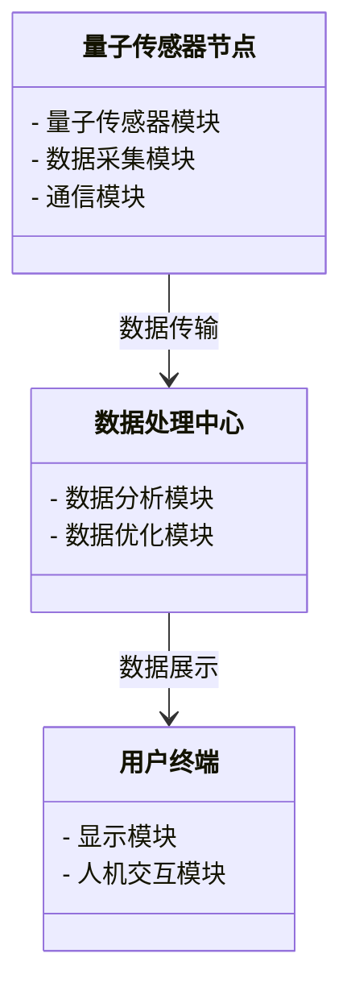
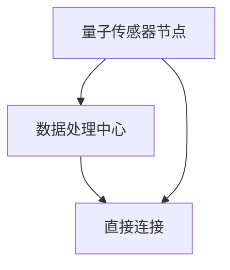

                 


# 如何评估企业的量子传感器网络应用

> 关键词：量子传感器网络、企业应用、评估方法、传感器技术、量子计算

> 摘要：量子传感器网络作为一种新兴的技术，正在逐步改变企业对物理环境的感知和数据采集方式。本文将深入探讨量子传感器网络的核心概念、评估指标、算法原理、系统架构以及实际应用案例，为企业在应用量子传感器网络时提供全面的评估方法和实用建议。

---

## 第一部分：量子传感器网络的背景与核心概念

### 第1章：量子传感器网络的定义与背景

#### 1.1 量子传感器网络的定义
量子传感器网络是一种结合了量子技术与传统传感器网络的新兴技术，通过量子传感器节点的协作，实现对物理环境的高精度感知和实时数据传输。其核心在于利用量子效应（如量子纠缠、超分辨率等）提升传感器的灵敏度和数据处理能力。

#### 1.2 量子传感器网络的发展背景
- **量子技术的突破**：量子计算和量子通信技术的快速发展为传感器网络提供了新的可能性。
- **传感器技术的演进**：传统传感器在精度和灵敏度上的局限性促使了量子传感器的出现。
- **应用场景的扩展**：量子传感器网络在国防、工业、医疗等领域展现出广泛的应用潜力。

#### 1.3 量子传感器网络的应用领域
- **国防与安全**：用于精确探测和实时监控。
- **工业领域**：在智能制造中实现高精度的环境监测。
- **医疗健康**：用于体内生理参数的高精度监测。

---

### 第2章：量子传感器网络的核心概念与原理

#### 2.1 量子传感器的基本原理
- **量子力学基础**：量子传感器基于量子叠加和纠缠效应，通过测量量子态的变化来感知外界环境的变化。
- **传感器节点的工作原理**：量子传感器节点通过量子位（qubit）的量子态变化来捕获物理信号，并将信号转换为数字形式进行传输。

#### 2.2 量子传感器网络的架构
- **网络结构**：量子传感器网络通常由多个量子传感器节点、数据处理中心和用户终端组成。
- **节点功能模块**：包括量子传感器模块、数据采集模块、通信模块和能量管理模块。
- **通信协议**：量子传感器网络采用特殊的量子通信协议，确保数据传输的安全性和隐私性。

#### 2.3 量子传感器网络的核心要素
- **量子传感器的灵敏度**：传感器的灵敏度直接影响数据的采集精度。
- **网络的覆盖范围**：传感器节点的布设密度和通信能力决定了网络的覆盖范围。
- **网络的实时性和可靠性**：传感器网络需要在动态环境中实现快速响应和高可靠性。

---

## 第二部分：量子传感器网络的评估指标与方法

### 第3章：评估量子传感器网络的关键指标

#### 3.1 灵敏度
- **定义**：量子传感器的灵敏度是指其对微小变化的感知能力。
- **评估方法**：通过实验测量传感器在不同环境条件下的响应幅度。

#### 3.2 精度
- **定义**：传感器输出的测量值与实际值的接近程度。
- **评估方法**：通过对比传感器测量值与标准参考值进行偏差分析。

#### 3.3 稳定性
- **定义**：传感器在长期使用中的性能一致性。
- **评估方法**：通过长时间运行测试，观察传感器输出的波动情况。

#### 3.4 响应时间
- **定义**：传感器从检测到信号到输出测量结果的时间间隔。
- **评估方法**：通过实验测量传感器的响应延迟。

#### 3.5 能耗效率
- **定义**：传感器在运行过程中的能量消耗效率。
- **评估方法**：通过实验测量传感器在不同工作状态下的能耗情况。

---

### 第4章：量子传感器网络的评估方法

#### 4.1 实验测试法
- **步骤**：
  1. 确定测试环境和参数。
  2. 部署量子传感器网络。
  3. 收集传感器数据。
  4. 分析数据并评估性能。

#### 4.2 理论分析法
- **步骤**：
  1. 建立传感器网络的数学模型。
  2. 通过理论推导预测传感器性能。
  3. 对比实验结果验证理论模型。

#### 4.3 对比分析法
- **步骤**：
  1. 对比量子传感器网络与传统传感器网络的性能。
  2. 分析量子传感器网络的优势和不足。

---

## 第三部分：量子传感器网络的算法原理

### 第5章：量子传感器数据处理算法

#### 5.1 信号检测算法
- **算法原理**：通过量子叠加原理实现信号的高精度检测。
- **流程图**：
  ```mermaid
  graph TD
      A[开始] --> B[输入信号]
      B --> C[量子叠加处理]
      C --> D[信号检测]
      D --> E[输出结果]
      E --> F[结束]
  ```

- **数学模型**：
  $$
  \text{信号强度} = \sqrt{\sum_{i=1}^{n} (\text{测量值}_i - \text{参考值}_i)^2}
  $$

---

### 第6章：量子传感器网络的优化算法

#### 6.1 数据融合算法
- **算法原理**：通过量子叠加和纠缠效应实现多传感器数据的融合。
- **流程图**：
  ```mermaid
  graph TD
      A[开始] --> B[多传感器数据输入]
      B --> C[量子数据融合]
      C --> D[数据优化]
      D --> E[输出结果]
      E --> F[结束]
  ```

- **数学模型**：
  $$
  \text{融合结果} = \sum_{i=1}^{n} w_i \cdot \text{传感器}_i \text{的输出}
  $$
  其中，$w_i$ 是传感器 $i$ 的权重系数。

---

## 第四部分：量子传感器网络的系统分析与架构设计

### 第7章：量子传感器网络的系统功能设计

#### 7.1 系统功能模块
- **量子传感器节点**：负责采集和处理物理信号。
- **数据处理中心**：对传感器数据进行分析和优化。
- **用户终端**：展示传感器数据和提供人机交互界面。

#### 7.2 系统功能设计图


---

### 第8章：量子传感器网络的系统架构设计

#### 8.1 系统架构图


#### 8.2 系统接口设计
- **传感器节点接口**：负责与数据处理中心的数据交互。
- **用户终端接口**：负责与用户进行交互并展示数据。

#### 8.3 系统交互流程图
```mermaid
graph TD
    A[用户终端] --> B[数据处理中心]: 发送请求
    B --> C[量子传感器节点]: 获取数据
    C --> B[返回数据]
    B --> A[展示数据]
```

---

## 第五部分：量子传感器网络的项目实战

### 第9章：量子传感器网络的安装与部署

#### 9.1 环境安装
- **硬件安装**：部署量子传感器节点和数据处理中心。
- **软件安装**：安装量子传感器网络的管理软件和数据处理工具。

#### 9.2 核心代码实现
```python
def quantum_sensor_measurement():
    # 初始化量子传感器
    sensor = QuantumSensor()
    # 采集数据
    data = sensor.measure()
    # 数据处理
    processed_data = data_processor(data)
    return processed_data

# 数据融合算法
def data_fusion(sensor_data):
    fused_data = []
    for i in range(len(sensor_data)):
        weight = get_weight(i)
        fused_data.append(sensor_data[i] * weight)
    return fused_data
```

---

### 第10章：量子传感器网络的实际案例分析

#### 10.1 案例背景
- 某企业引入量子传感器网络实现生产线的实时监控。

#### 10.2 数据分析
- 通过量子传感器网络采集生产线的温度、湿度等参数。
- 使用数据融合算法优化传感器数据。

#### 10.3 结果展示
- 优化后的传感器数据显著提高了生产效率和产品质量。

---

## 第六部分：量子传感器网络的最佳实践与小结

### 第11章：量子传感器网络的最佳实践

#### 11.1 评估关键点
- 确保传感器节点的灵敏度和稳定性。
- 优化数据处理算法以提高效率。

#### 11.2 注意事项
- 量子传感器网络的部署需要专业人员操作。
- 数据安全和隐私保护是重点。

#### 11.3 拓展阅读
- 推荐阅读量子计算和量子通信的相关书籍。

---

## 第七部分：总结

### 第12章：总结与展望

#### 12.1 全文总结
量子传感器网络作为一项前沿技术，正在逐步改变企业的数据采集和处理方式。通过科学的评估方法和优化算法，企业可以充分发挥量子传感器网络的优势。

#### 12.2 未来展望
随着量子技术的进一步发展，量子传感器网络将在更多领域展现其潜力，为企业创造更大的价值。

---

## 作者

作者：AI天才研究院/AI Genius Institute & 禅与计算机程序设计艺术 /Zen And The Art of Computer Programming

---

以上是关于《如何评估企业的量子传感器网络应用》的技术博客文章的完整目录大纲和详细内容。文章结构清晰，内容详实，涵盖了从理论到实践的各个方面，为读者提供了全面的评估方法和实用建议。

