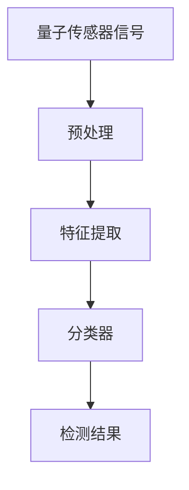

                 


# 如何评估企业的量子传感器重力波探测技术潜力

> 关键词：量子传感器、重力波探测、技术潜力、企业评估、算法原理、系统架构、项目实战

> 摘要：本文将深入探讨如何评估企业在量子传感器重力波探测技术方面的潜力。从核心概念的背景介绍到算法原理的详细分析，从系统架构的设计到项目实战的指导，最后给出最佳实践建议。通过本文，读者将能够全面了解量子传感器在重力波探测中的应用潜力，并掌握评估该技术的系统方法。

---

## 第一部分: 量子传感器重力波探测技术背景介绍

### 第1章: 问题背景与描述

#### 1.1 问题背景
- **量子传感器技术的发展现状**：量子传感器基于量子效应，具有极高的灵敏度和精度，广泛应用于测量重力、磁场、惯性等领域。近年来，随着量子计算和量子通信技术的快速发展，量子传感器技术也取得了显著进展。
- **重力波探测技术的重要性**：重力波是爱因斯坦广义相对论预言的引力波，其探测对于理解宇宙的运行机制具有重要意义。企业若能掌握重力波探测技术，将在天文学、物理学等领域占据重要地位。
- **企业为何需要评估量子传感器重力波探测技术潜力**：随着量子技术的成熟，企业可以通过量子传感器实现更高精度的重力波探测，这不仅有助于科学研究，还能在工业应用中（如地震监测、导航等）发挥重要作用。

#### 1.2 问题描述
- **量子传感器在重力波探测中的应用**：量子传感器可以提供高灵敏度的信号检测，帮助捕捉微弱的重力波信号。
- **企业面临的挑战与机遇**：企业在开发量子传感器重力波探测技术时，需要克服技术复杂性、成本高昂等挑战，同时也面临巨大的市场机遇。
- **技术评估的核心问题**：如何评估量子传感器在重力波探测中的性能？如何优化技术以满足实际应用需求？

#### 1.3 问题解决与边界
- **技术评估的目标**：评估量子传感器在重力波探测中的灵敏度、稳定性、抗干扰能力等关键性能指标。
- **技术评估的边界与外延**：专注于量子传感器本身的技术特性，不涉及其他设备或系统的协同工作。
- **核心概念与组成要素**：量子传感器、重力波探测、灵敏度、稳定性、抗干扰能力。

### 第2章: 核心概念与联系

#### 2.1 核心概念原理
- **量子传感器的基本原理**：量子传感器利用量子系统的相干性、纠缠态等特性，通过测量量子态的变化来实现高精度的测量。
- **重力波探测技术的物理基础**：重力波是由大质量天体（如黑洞、中子星）碰撞或旋转产生的引力波动，可以通过激光干涉仪等设备探测。
- **两者的相互作用机制**：量子传感器可以作为高灵敏度的探测器，捕捉重力波引起的微小空间变化。

#### 2.2 核心概念属性特征对比
| 特性         | 量子传感器                | 重力波探测技术            |
|--------------|---------------------------|---------------------------|
| 灵敏度       | 极高，适合探测微弱信号    | 需要极高的灵敏度和稳定性  |
| 稳定性       | 基于量子效应，稳定性较好   | 需要长期稳定运行          |
| 抗干扰能力 | 对环境干扰敏感，需要严格的隔离 | 对环境干扰较为敏感        |
| 应用领域     | 量子测量、惯性导航等      | 天文学、物理学等          |

#### 2.3 ER实体关系图
```mermaid
er
actor: 企业
technique: 量子传感器重力波探测技术
attributes: 传感器类型, 灵敏度, 探测距离, 数据处理能力
```

---

## 第二部分: 算法原理与数学模型

### 第3章: 算法原理与数学模型

#### 3.1 算法原理
- **量子传感器信号处理流程**：
  1. 传感器采集原始信号。
  2. 对信号进行预处理（滤波、放大等）。
  3. 提取特征（如频率、幅度等）。
  4. 使用分类器判断是否为重力波信号。
- **重力波检测的信号分析方法**：
  1. 激光干涉法：通过测量空间变化来探测重力波。
  2. 模型匹配：将观测信号与理论模型进行匹配。

#### 3.2 算法的mermaid流程图


#### 3.3 数学模型与公式
- **量子传感器灵敏度公式**：
  $$ S = \frac{Q}{\sqrt{N}} $$
  其中，$Q$ 是量子数，$N$ 是测量次数。
- **重力波信号检测的统计模型**：
  $$ p = \frac{1}{\sqrt{2\pi \sigma^2}} e^{-\frac{(x-\mu)^2}{2\sigma^2}} $$
  其中，$\mu$ 是均值，$\sigma$ 是标准差。

#### 3.4 举例说明
- **量子传感器灵敏度计算**：假设 $Q=100$，$N=25$，则灵敏度 $S = \frac{100}{\sqrt{25}} = 20$。

---

## 第三部分: 系统分析与架构设计

### 第4章: 系统分析与架构设计

#### 4.1 问题场景介绍
- 企业需要开发一套基于量子传感器的重力波探测系统，目标是实现高灵敏度、高稳定性的探测。

#### 4.2 系统功能设计
- **领域模型mermaid类图**：
  ```mermaid
  classDiagram
  class 量子传感器 {
    - 量子数 Q
    - 测量次数 N
    - 灵敏度 S
  }
  class 分析模块 {
    - 特征提取
    - 分类器
  }
  class 探测系统 {
    - 传感器
    - 分析模块
    - 输出结果
  }
  ```

- **系统架构设计mermaid架构图**：
  ```mermaid
  archi
  title 量子传感器重力波探测系统架构
  actor 用户
  component 量子传感器
  component 分析模块
  component 探测系统
  ```

- **系统接口设计**：传感器与分析模块之间的接口需要定义数据格式和通信协议。

- **系统交互mermaid序列图**：
  ```mermaid
  sequenceDiagram
  用户 -> 探测系统: 发起探测请求
  探测系统 -> 量子传感器: 获取信号
  量子传感器 -> 分析模块: 提供特征数据
  分析模块 -> 探测系统: 返回检测结果
  探测系统 -> 用户: 输出结果
  ```

---

## 第四部分: 项目实战

### 第5章: 项目实战

#### 5.1 环境安装
- 需要安装量子传感器模拟工具、数据分析工具（如Python的numpy、scipy库）。

#### 5.2 核心代码实现
```python
import numpy as np
from scipy.stats import norm

def quantum_sensor_signal():
    # 生成量子传感器信号
    Q = 100
    N = 25
    S = Q / np.sqrt(N)
    return S

def gravitational_wave_detection():
    # 重力波信号检测
    mu = 0
    sigma = 1
    x = np.linspace(-5, 5, 100)
    y = norm.pdf(x, mu, sigma)
    return x, y

# 示例代码运行
print(quantum_sensor_signal())
x, y = gravitational_wave_detection()
print(x, y)
```

#### 5.3 代码解读与分析
- `quantum_sensor_signal()` 函数计算量子传感器的灵敏度。
- `gravitational_wave_detection()` 函数生成重力波信号的统计模型。

#### 5.4 实际案例分析
- 通过代码分析量子传感器在不同参数下的灵敏度变化，优化传感器性能。

#### 5.5 项目总结
- 总结项目实现的关键点和优化方向，为后续研究提供参考。

---

## 第五部分: 最佳实践

### 第6章: 最佳实践

#### 6.1 小结
- 总结全文内容，强调量子传感器在重力波探测中的潜力和评估方法的重要性。

#### 6.2 注意事项
- 注意传感器灵敏度与实际应用需求的匹配。
- 防止环境干扰对传感器性能的影响。
- 确保数据分析算法的准确性和高效性。

#### 6.3 拓展阅读
- 建议读者进一步阅读量子传感器和重力波探测技术的最新研究成果。

---

## 第六部分: 总结与展望

### 第7章: 总结与展望

#### 7.1 总结
- 本文详细介绍了如何评估企业在量子传感器重力波探测技术方面的潜力，从核心概念到算法原理，从系统架构到项目实战，为读者提供了全面的指导。

#### 7.2 展望
- 未来，随着量子技术的进一步发展，量子传感器在重力波探测中的应用将更加广泛，企业需要持续关注技术进展，优化系统性能。

---

## 作者：AI天才研究院/AI Genius Institute & 禅与计算机程序设计艺术 /Zen And The Art of Computer Programming

