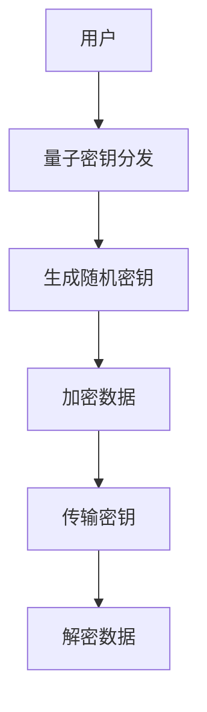
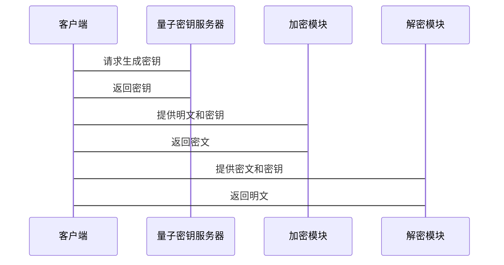

                 


# 如何评估企业的量子加密技术应用

> 关键词：量子加密技术，企业应用，安全性评估，技术实现，加密协议

> 摘要：本文将详细探讨如何评估企业在量子加密技术上的应用，从核心概念、算法原理、系统设计到实际案例分析，为企业提供全面的评估方法和实施建议。

---

## 第一部分：量子加密技术基础

### 第1章：量子加密技术概述

#### 1.1 量子加密技术的背景与概念

- **1.1.1 传统加密技术的局限性**
  - 传统加密技术（如RSA、AES）基于数学难题，但随着计算能力的提升，安全性逐渐降低。
  - 非对称加密算法依赖大数分解和离散对数问题，但量子计算机可以快速破解。

- **1.1.2 量子加密技术的定义与特点**
  - 量子加密技术利用量子力学原理进行加密，如量子密钥分发（QKD）和量子隐形传态。
  - 其核心优势在于安全性，理论上无法被窃听或破解。

- **1.1.3 企业采用量子加密技术的动机**
  - 应对未来量子计算机的威胁。
  - 提升数据传输的安全性，保护敏感信息。
  - 满足行业合规性要求。

#### 1.2 量子加密技术的核心原理

- **1.2.1 量子叠加与量子纠缠**
  - 量子叠加：量子比特可以同时处于0和1的状态。
  - 量子纠缠：两个或多个量子比特之间存在关联，一个的状态会立即影响另一个的状态。

- **1.2.2 量子密钥分发（QKD）原理**
  - 通过量子态传输密钥，确保密钥的安全分发。
  - 如果在传输过程中被窃听，量子态会发生变化，系统会检测到异常。

- **1.2.3 量子隐形传态与加密通信**
  - 量子隐形传态：利用量子纠缠将信息从一个地点传送到另一个地点，无需物理传输媒介。

#### 1.3 量子加密技术与经典加密技术的对比

- **1.3.1 加密算法的数学模型对比**
  - 传统加密：基于经典数学模型，如大数分解和离散对数问题。
  - 量子加密：基于量子力学原理，如量子态和纠缠。

- **1.3.2 加密强度的对比分析**
  - 传统加密：安全性依赖于计算复杂度，可能被量子计算机破解。
  - 量子加密：安全性基于物理原理，理论上不可破解。

- **1.3.3 适用场景的对比**
  - 传统加密：适用于一般数据加密。
  - 量子加密：适用于高安全需求的场景，如金融、军事等。

### 第2章：量子加密技术的核心概念与联系

#### 2.1 核心概念原理

- **2.1.1 量子密钥分发（QKD）的数学模型**
  - QKD基于量子态的测量和纠缠原理，确保密钥的安全性。
  - 公式：$$ QKD = \text{纠缠态} \oplus \text{随机基} $$

- **2.1.2 量子加密协议的实现步骤**
  - 生成量子密钥。
  - 传输密钥并验证完整性。
  - 使用密钥进行数据加密和解密。

- **2.1.3 量子加密技术的数学公式**
  - 量子态叠加：$$ | \psi \rangle = \alpha |0\rangle + \beta |1\rangle $$
  - 量子纠缠态：$$ | \psi \rangle = \frac{1}{\sqrt{2}}(|0\rangle|1\rangle + |1\rangle|0\rangle) $$

#### 2.2 核心概念属性特征对比表格

| 特性         | 传统加密技术 | 量子加密技术 |
|--------------|--------------|--------------|
| 安全性       | 易被量子计算机破解 | 高安全性，理论不可破解 |
| 加密速度     | 较慢          | 高速度，基于量子计算 |
| 实现复杂度   | 较低          | 较高，需要量子设备 |
| 适用场景     | 一般数据加密 | 高安全需求场景 |

#### 2.3 ER实体关系图

```mermaid
er
actor: 企业
encryption_technology: 量子加密技术
protocol: 加密协议
```

### 第3章：量子加密技术的算法原理讲解

#### 3.1 量子加密算法的mermaid流程图



#### 3.2 算法原理的Python源代码实现

```python
import random
import math

def generate_quantum_key(length):
    key = []
    for _ in range(length):
        bit = random.choice([0, 1])
        key.append(bit)
    return key

def encrypt_data(data, key):
    encrypted = []
    for d, k in zip(data, key):
        encrypted.append(d ^ k)
    return encrypted

def decrypt_data(ciphertext, key):
    decrypted = []
    for c, k in zip(ciphertext, key):
        decrypted.append(c ^ k)
    return decrypted

# 示例
data = [1, 0, 1, 1]
key = generate_quantum_key(4)
print("生成的密钥:", key)
print("加密后的数据:", encrypt_data(data, key))
print("解密后的数据:", decrypt_data(encrypt_data(data, key), key))
```

#### 3.3 算法原理的数学模型和公式

- **加密过程**：$$ \text{加密} = \text{明文} \oplus \text{密钥} $$
- **解密过程**：$$ \text{解密} = \text{密文} \oplus \text{密钥} $$
- **量子密钥分发的数学表达**：$$ \text{QKD} = \text{量子态} \oplus \text{随机基} $$

---

## 第二部分：量子加密技术的系统分析与架构设计

### 第4章：量子加密技术的系统分析

#### 4.1 问题场景介绍

- 企业需要在现有系统中集成量子加密技术，提升数据安全性。
- 现有系统可能基于传统加密技术，需要逐步迁移。

#### 4.2 系统功能设计

- **功能模块**：
  - 量子密钥生成模块。
  - 数据加密模块。
  - 数据解密模块。
  - 安全性检测模块。

#### 4.3 系统架构设计


#### 4.4 系统接口设计

- **密钥生成接口**：`generate_quantum_key(length)`
- **数据加密接口**：`encrypt_data(data, key)`
- **数据解密接口**：`decrypt_data(ciphertext, key)`

#### 4.5 系统交互序列图



### 第5章：量子加密技术的项目实战

#### 5.1 环境安装

- **量子加密库安装**：
  - 使用`QKD`库或其他量子加密库。
  - 需要量子计算设备或模拟器。

- **开发环境配置**：
  - 安装Python和必要的库。
  - 配置量子密钥生成器。

#### 5.2 系统核心实现源代码

```python
import random
import math

def generate_quantum_key(length):
    key = []
    for _ in range(length):
        bit = random.choice([0, 1])
        key.append(bit)
    return key

def encrypt_data(data, key):
    encrypted = []
    for d, k in zip(data, key):
        encrypted.append(d ^ k)
    return encrypted

def decrypt_data(ciphertext, key):
    decrypted = []
    for c, k in zip(ciphertext, key):
        decrypted.append(c ^ k)
    return decrypted

# 示例
data = [1, 0, 1, 1]
key = generate_quantum_key(4)
print("生成的密钥:", key)
print("加密后的数据:", encrypt_data(data, key))
print("解密后的数据:", decrypt_data(encrypt_data(data, key), key))
```

#### 5.3 代码应用解读与分析

- **密钥生成**：通过随机选择生成量子密钥，确保密钥的安全性。
- **数据加密**：使用生成的密钥对数据进行加密，确保数据在传输过程中不被窃取。
- **数据解密**：使用相同的密钥对加密数据进行解密，恢复原始数据。

#### 5.4 实际案例分析

- **案例背景**：一家金融机构需要保护客户交易数据的安全。
- **实施步骤**：
  - 集成量子密钥分发系统。
  - 在数据传输中使用量子加密技术。
  - 定期检测系统安全性。

#### 5.5 项目小结

- 量子加密技术的应用需要企业具备一定的技术实力和资源。
- 通过逐步实施和测试，可以确保系统的稳定性和安全性。

---

## 第三部分：量子加密技术的最佳实践

### 第6章：量子加密技术的最佳实践

#### 6.1 小结

- 量子加密技术的核心在于密钥的安全分发和数据加密。
- 企业应根据实际需求选择合适的量子加密技术。

#### 6.2 注意事项

- 确保量子加密系统的安全性，防止密钥泄露。
- 定期更新密钥，避免被攻击者利用。
- 结合传统加密技术，形成多层次的安全防护体系。

#### 6.3 拓展阅读

- 推荐阅读《量子计算与量子加密技术》（书籍）。
- 关注量子加密技术的最新研究和应用。

---

## 作者：AI天才研究院/AI Genius Institute & 禅与计算机程序设计艺术 /Zen And The Art of Computer Programming

---

通过以上内容，我们系统地介绍了如何评估企业的量子加密技术应用，从理论到实践，为企业提供了全面的指导和建议。

