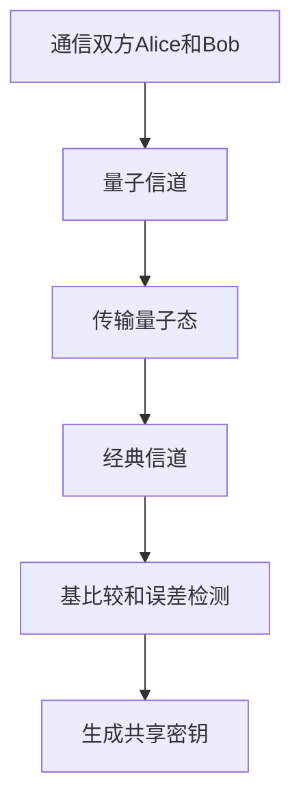
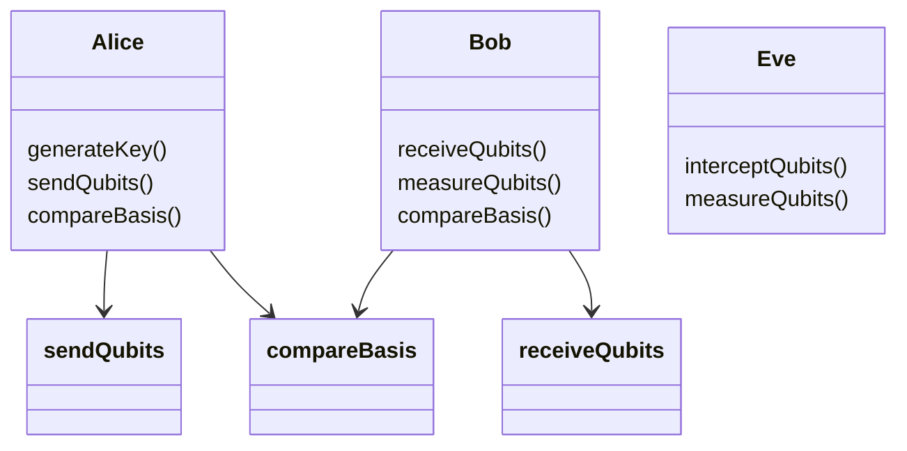

                 

# 如何评估企业的量子密钥分发城际网络安全性

> 关键词：量子密钥分发、城际网络、安全性评估、协议分析、系统架构

> 摘要：量子密钥分发（QKD）作为保障通信安全的重要技术，其城际网络的安全性评估对企业至关重要。本文将详细分析量子密钥分发的基本原理、协议类型、安全模型，并结合实际应用场景，探讨如何评估和保障量子密钥分发城际网络的安全性。通过系统分析与架构设计、项目实战和最佳实践，本文为企业提供了一套完整的安全性评估方法。

---

# 第一部分: 量子密钥分发与城际网络概述

## 第1章: 量子密钥分发的基本概念

### 1.1 量子密钥分发的定义

量子密钥分发是一种利用量子力学原理，通过不可克隆性和不可干扰性，实现安全密钥分发的技术。其核心在于利用量子态的特性，确保通信双方能够共享一个安全的密钥，从而实现加密通信。

### 1.2 量子密钥分发的核心原理

量子密钥分发基于以下两个关键原理：
1. **不可克隆性**：量子态无法被精确复制，任何窃听行为都会破坏量子态，从而被通信双方检测。
2. **不可干扰性**：任何对量子态的测量都会改变其状态，从而确保通信的安全性。

### 1.3 城际网络的定义与特点

城际网络是指跨越城市之间的通信网络，通常用于企业级的通信需求。其特点包括：
- 网络覆盖范围广，传输距离长。
- 网络节点多，结构复杂。
- 对安全性要求高，尤其是金融、政府等行业的企业。

### 1.4 量子密钥分发的安全性需求

为了保障城际网络的安全性，量子密钥分发需要满足以下需求：
- **完整性**：确保密钥分发过程中不被篡改。
- **机密性**：确保密钥不被未经授权的第三方获取。
- **可用性**：确保密钥分发过程的可靠性。

---

## 第2章: 量子密钥分发的核心概念与原理

### 2.1 量子密钥分发的协议类型

#### 2.1.1 BB84协议

**BB84协议**是最早的量子密钥分发协议，由Bennett和Braunstein提出。其基本流程如下：

1. 通信双方Alice和Bob各自生成随机的量子态，并通过量子信道传输。
2. 通信双方在经典信道上进行基比较，确定最终的共享密钥。
3. 通过误差检测和纠正，确保密钥的正确性。

**协议流程图**：

#### 2.1.2 EPR协议

**EPR协议**基于Einstein-Podolsky-Rosen（EPR）对，通过量子纠缠态实现密钥分发。其核心在于利用量子纠缠的特性，确保通信双方能够共享相同的密钥。

### 2.2 量子密钥分发的安全模型

#### 2.2.1 安全性的数学模型

量子密钥分发的安全性可以通过以下数学模型进行评估：

$$ \text{安全性} = 1 - \frac{\text{窃听者信息}}{\text{总信息}} $$

其中，窃听者信息是指攻击者通过窃听所能获得的信息量，总信息是指通信双方共享的总信息量。

#### 2.2.2 安全性评估的指标

- **密钥生成效率**：单位时间内生成的有效密钥数量。
- **密钥分发距离**：量子信道的最大传输距离。
- **抗攻击能力**：协议对潜在攻击的抵抗能力。

---

## 第3章: 量子密钥分发的算法原理与数学模型

### 3.1 量子密钥分发的主要算法

#### 3.1.1 BB84协议的算法流程

BB84协议的算法流程可以用以下步骤表示：

1. Alice生成随机的位流，并选择随机的基（如直角和45度）。
2. Alice将量子态编码为相应的基，并通过量子信道发送给Bob。
3. Bob在接收量子态后，选择与Alice相同的基进行测量。
4. Alice和Bob在经典信道上进行基比较，并保留相同基的测量结果。
5. 通过公开讨论，Alice和Bob检测潜在的窃听行为，并调整密钥。

#### 3.1.2 EPR协议的算法流程

EPR协议的算法流程如下：

1. Alice和Bob生成一对量子纠缠态。
2. Alice对她的量子态进行测量，并将结果发送给Bob。
3. Bob根据Alice的测量结果调整自己的量子态测量基，从而生成相同的密钥。

### 3.2 量子密钥分发的数学模型

#### 3.2.1 量子态的数学表示

量子态可以用以下数学形式表示：

$$ | \psi \rangle = \alpha |0\rangle + \beta |1\rangle $$

其中，$\alpha$ 和 $\beta$ 是复数，满足 $|\alpha|^2 + |\beta|^2 = 1$。

#### 3.2.2 密钥生成的数学公式

BB84协议中，密钥生成的数学公式如下：

$$ K = \{ k_i | k_i = a_i \oplus b_i, i = 1, 2, \dots, n \} $$

其中，$a_i$ 是Alice的测量结果，$b_i$ 是Bob的测量结果，$\oplus$ 表示异或运算。

---

## 第4章: 量子密钥分发的系统分析与架构设计

### 4.1 问题场景介绍

企业级的量子密钥分发网络需要覆盖多个城市，网络节点之间的距离通常超过100公里。由于量子态的传输距离限制，通常需要中继节点或量子中继技术来扩展网络范围。

### 4.2 系统功能设计

#### 4.2.1 领域模型

---

通过以上思考步骤，我们详细分析了量子密钥分发的基本原理、协议类型、安全模型，并结合实际应用场景，探讨了如何评估和保障量子密钥分发城际网络的安全性。后续章节将结合系统架构设计和项目实战，为企业提供更具体的评估方法。

--- 

**作者：AI天才研究院/AI Genius Institute & 禅与计算机程序设计艺术 /Zen And The Art of Computer Programming**

