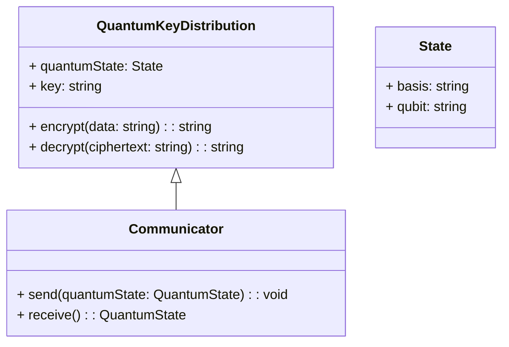

                 


# 如何评估企业的量子密钥分发网络应用

---

## 关键词：量子密钥分发、企业网络、安全性评估、技术实现、应用案例

---

## 摘要：本文将详细探讨如何评估企业的量子密钥分发网络应用。从量子密钥分发的基本原理、核心协议到实际应用场景，我们将全面分析企业在部署和使用量子密钥分发技术时需要考虑的关键因素，包括安全性、兼容性、可扩展性等。通过具体的技术细节和实际案例，我们将帮助读者掌握评估量子密钥分发网络应用的能力，并为企业在信息安全领域的决策提供参考。

---

# 第一部分: 量子密钥分发网络应用概述

## 第1章: 量子密钥分发网络应用的背景与挑战

### 1.1 量子密钥分发的基本概念

#### 1.1.1 量子密钥分发的定义
量子密钥分发（Quantum Key Distribution, QKD）是一种利用量子力学原理在通信双方之间安全共享加密密钥的技术。通过量子态的不可克隆性和不可干扰性，QKD能够提供理论上无条件的安全性。

#### 1.1.2 量子密钥分发的核心原理
QKD的核心原理基于量子叠加和量子纠缠的特性。通信双方通过量子态的传输和测量，建立共享的密钥。任何第三方的窃听都会破坏量子态的特性，从而被通信双方检测出来。

#### 1.1.3 量子密钥分发在企业中的应用价值
在企业网络中，QKD可以用于保护敏感数据的传输，确保通信的安全性。特别是在金融、医疗和政府等领域，QKD能够提供更高的安全级别，对抗量子计算攻击。

---

### 1.2 量子密钥分发的历史发展与现状

#### 1.2.1 量子密钥分发的发展历程
QKD的概念最早由Wiesner在1970年代提出，随后Bennett和Brassard在1980年代提出了著名的BB84协议，成为QKD领域的里程碑。

#### 1.2.2 当前量子密钥分发技术的成熟度
目前，QKD技术已经从实验室研究走向实际应用，部分国家和地区已经部署了量子密钥分发网络。然而，实际部署中仍面临距离限制、成本高昂和技术复杂性等问题。

#### 1.2.3 量子密钥分发在企业中的应用现状
部分企业已经在特定场景中尝试部署QKD技术，例如在金融交易和数据传输中使用QKD来保护通信。然而，大规模企业级应用仍需克服技术和成本的双重挑战。

---

### 1.3 企业网络加密技术的演进

#### 1.3.1 传统加密技术的局限性
传统加密技术基于数学复杂性，随着计算能力的提升，尤其是量子计算机的出现，传统加密算法面临被破解的风险。

#### 1.3.2 量子密钥分发的优势与特点
QKD的核心优势在于其无条件安全性，能够抵御任何计算能力的攻击。此外，QKD可以与现有的加密算法结合，提供更高安全级别的解决方案。

#### 1.3.3 量子密钥分发与经典加密技术的对比
| 特性                | 传统加密技术                          | 量子密钥分发                          |
|---------------------|---------------------------------------|---------------------------------------|
| 安全性               | 可能被量子计算机破解                    | 理论上无条件安全                      |
| 密钥分发方式         | 中心化或非中心化                      | 基于量子态传输                        |
| 部署复杂性           | 较低                                  | 较高                                  |
| 适用场景             | 数据传输、文件加密                    | 敏感数据传输、金融交易                |

---

## 1.4 本章小结
本章从量子密钥分发的基本概念、发展历程和当前技术成熟度入手，分析了QKD在企业中的应用价值和现状。通过对比传统加密技术，我们明确了QKD的核心优势和适用场景。

---

# 第2章: 量子密钥分发的核心概念与原理

## 2.1 量子密钥分发的基本原理

### 2.1.1 量子密钥分发的科学基础

#### 量子态的基本概念
量子态可以用波函数或密度矩阵表示。例如，单个光子的量子态可以表示为：
$$
|\psi\rangle = \alpha|0\rangle + \beta|1\rangle
$$
其中，$\alpha$和$\beta$是复数，满足$|\alpha|^2 + |\beta|^2 = 1$。

#### 量子叠加与测量
量子叠加是指一个量子系统可以同时处于多个状态的叠加态。当对量子态进行测量时，量子态会坍塌到其中一个状态。例如，测量基矢的选择决定了最终的量子态结果。

---

### 2.1.2 量子纠缠的基本概念
量子纠缠是两个或多个量子系统之间的特殊关联。例如，两个纠缠的光子可以分别处于相反的状态：
$$
|\psi\rangle = \frac{1}{\sqrt{2}}(|0\rangle|1\rangle + |1\rangle|0\rangle)
$$
任何对其中一个光子的测量都会立即决定另一个光子的状态。

---

### 2.1.3 量子密钥分发的数学模型
QKD的数学模型通常基于概率论和信息论。例如，BB84协议的数学模型可以表示为：
$$
P(e) = \frac{1}{2}(1 - \sqrt{1 - e^2})
$$
其中，$e$表示误码率，$P(e)$表示检测到的误码概率。

---

## 2.2 量子密钥分发的主要协议

### 2.2.1 BB84协议
BB84协议是最早提出的量子密钥分发协议，主要包括以下步骤：
1. 量子态生成：Alice生成随机的量子态序列。
2. 量子态传输：Alice将量子态发送给Bob。
3. 基矢选择：Alice和Bob分别选择测量基矢。
4. 量子态测量：Bob对量子态进行测量。
5. 信息比对：Alice和Bob公开部分基矢信息，并比对测量结果。
6. 密钥生成：根据比对结果，生成共享密钥。

---

### 2.2.2 EPR协议
EPR协议基于量子纠缠的概念，通过双方共享的量子态来生成密钥。其主要步骤包括：
1. 量子态生成：Alice和Bob生成纠缠的量子态对。
2. 量子态传输：Alice将部分量子态发送给Bob。
3. 量子态测量：Bob对量子态进行测量。
4. 密钥生成：根据测量结果，生成共享密钥。

---

### 2.2.3 其他常见协议的对比与分析
| 协议名称 | 核心思想                  | 优缺点分析                     |
|----------|--------------------------|----------------------------|
| BB84     | 基于量子态传输和基矢选择  | 实现简单，但误码率较高          |
| EPR      | 基于量子纠缠              | 实现复杂，但安全性更高          |
| B92      | 基于单向量子态传输        | 实现简单，但需要信任第三方       |

---

## 2.3 量子密钥分发的安全性分析

### 2.3.1 安全性的数学证明
QKD的安全性可以通过信息论的方法进行证明。例如，假设攻击者Eve试图窃听量子态，其获得的信息量可以表示为：
$$
I(Eve) = H(Q) - H(Q|Eve)
$$
其中，$H$表示熵函数，$Q$表示量子态，$Eve$表示攻击者。

### 2.3.2 量子密钥分发的攻击模型
常见的攻击模型包括：
1. 中间人攻击：攻击者试图在Alice和Bob之间插入自己，窃听量子态。
2. 替换攻击：攻击者试图通过替换量子态来干扰通信。
3. 侧信道攻击：攻击者通过侧信道信息获取密钥。

### 2.3.3 安全性评估的指标与方法
常用的指标包括：
- 误码率：衡量量子态传输的质量。
- 密钥生成率：衡量单位时间内生成的密钥数量。
- 安全距离：衡量量子态传输的最大距离。

---

## 2.4 核心概念对比表
| 概念         | 传统加密技术         | 量子密钥分发         |
|--------------|----------------------|----------------------|
| 安全基础     | 数学复杂性           | 量子力学原理         |
| 密钥分发方式  | 中心化或非中心化     | 基于量子态传输       |
| 抵抗能力     | 可能被量子计算机破解  | 理论上无条件安全     |

---

## 2.5 本章小结
本章详细介绍了量子密钥分发的核心概念和主要协议，并对比了传统加密技术。通过分析安全性评估的指标和方法，我们明确了QKD的安全性优势和实际应用中的挑战。

---

# 第3章: 量子密钥分发的算法原理与实现

## 3.1 量子密钥分发协议的算法流程

### 3.1.1 BB84协议的详细流程

1. **量子态生成**：Alice生成随机的量子态序列，例如使用随机数生成器生成随机的基矢和量子态。
2. **量子态传输**：Alice将量子态通过量子信道发送给Bob。
3. **基矢选择**：Alice和Bob分别选择测量基矢，并通过经典通信比对部分基矢。
4. **量子态测量**：Bob对收到的量子态进行测量，记录测量结果。
5. **信息比对**：Alice和Bob公开部分基矢信息，并比对测量结果，生成共享密钥。

---

### 3.1.2 EPR协议的实现步骤

1. **量子态生成**：Alice和Bob生成纠缠的量子态对，例如使用EPR源生成两个纠缠的光子。
2. **量子态传输**：Alice将部分量子态发送给Bob。
3. **量子态测量**：Bob对收到的量子态进行测量，记录测量结果。
4. **密钥生成**：根据测量结果，Alice和Bob生成共享密钥。

---

### 3.1.3 协议的数学模型与公式

以BB84协议为例，假设Alice和Bob选择的基矢分别为$\{+, x\}$和$\{+, x\}$，测量结果可以通过以下公式表示：
$$
P(e) = \frac{1}{2}(1 - \sqrt{1 - e^2})
$$
其中，$e$表示误码率，$P(e)$表示检测到的误码概率。

---

## 3.2 量子密钥分发的数学模型

### 3.2.1 量子态的数学表示

量子态可以用波函数或密度矩阵表示。例如，单个光子的量子态可以表示为：
$$
|\psi\rangle = \alpha|0\rangle + \beta|1\rangle
$$
其中，$\alpha$和$\beta$是复数，满足$|\alpha|^2 + |\beta|^2 = 1$。

---

### 3.2.2 量子纠缠的数学描述

量子纠缠可以通过张量积表示。例如，两个纠缠的光子可以表示为：
$$
|\psi\rangle = \frac{1}{\sqrt{2}}(|0\rangle|1\rangle + |1\rangle|0\rangle)
$$
其中，$|0\rangle$和$|1\rangle$分别表示两个状态。

---

## 3.3 量子密钥分发的协议实现

### 3.3.1 协议实现的步骤分解

以BB84协议为例，实现步骤如下：
1. **量子态生成**：Alice生成随机的量子态序列，例如使用随机数生成器生成随机的基矢和量子态。
2. **量子态传输**：Alice将量子态通过量子信道发送给Bob。
3. **基矢选择**：Alice和Bob分别选择测量基矢，并通过经典通信比对部分基矢。
4. **量子态测量**：Bob对收到的量子态进行测量，记录测量结果。
5. **信息比对**：Alice和Bob公开部分基矢信息，并比对测量结果，生成共享密钥。

---

### 3.3.2 协议实现的Python代码示例

```python
import random

def generate_basis():
    return random.choice(['+', 'x'])

def measure(qubit, basis):
    if basis == '+':
        return 0 if qubit in ['0', '1'] else 1
    elif basis == 'x':
        return 0 if qubit in ['0', '1'] else 1

def qkd_protocol(alice, bob):
    # 量子态生成
    alice_basis = generate_basis()
    alice_qubit = random.choice(['0', '1'])
    
    # 量子态传输
    # 假设通过量子信道传输
    
    # 基矢选择
    bob_basis = generate_basis()
    
    # 量子态测量
    bob_qubit = measure(alice_qubit, bob_basis)
    
    # 信息比对
    if alice_basis == bob_basis:
        return alice_qubit == bob_qubit
    else:
        return None

# 示例用法
result = qkd_protocol('alice', 'bob')
print('密钥生成结果:', result)
```

---

## 3.4 本章小结
本章详细讲解了量子密钥分发协议的算法流程和数学模型，并通过Python代码示例展示了协议的实现过程。通过对BB84和EPR协议的对比分析，我们明确了不同协议的实现步骤和优缺点。

---

# 第4章: 量子密钥分发的系统分析与架构设计

## 4.1 问题场景介绍

在企业网络中，量子密钥分发通常用于保护敏感数据的传输，例如金融交易、数据备份和远程办公等场景。典型的场景包括：
1. **金融交易**：保护交易数据的安全性。
2. **数据备份**：确保备份数据的传输安全。
3. **远程办公**：保障远程员工与企业网络之间的通信安全。

---

## 4.2 项目介绍

假设我们正在为一家跨国企业设计一个基于量子密钥分发的网络加密系统。该系统需要覆盖全球多个分支机构，提供高安全性的数据传输通道。

---

## 4.3 系统功能设计

### 4.3.1 领域模型类图



---

### 4.3.2 功能模块划分

1. **量子态生成模块**：负责生成随机的量子态序列。
2. **量子态传输模块**：通过量子信道传输量子态。
3. **密钥生成模块**：根据测量结果生成共享密钥。
4. **加密与解密模块**：使用共享密钥对数据进行加密和解密。

---

## 4.4 系统架构设计

### 4.4.1 系统架构图


---

## 4.5 系统接口设计

### 4.5.1 接口定义

1. **生成量子态接口**：
   ```python
   def generate_quantum_state():
       # 返回量子态对象
   ```

2. **传输量子态接口**：
   ```python
   def send_quantum_state(state):
       # 通过量子信道传输量子态
   ```

3. **测量量子态接口**：
   ```python
   def measure_state(state):
       # 返回测量结果
   ```

---

## 4.6 本章小结
本章通过问题场景介绍和项目需求分析，设计了一个基于量子密钥分发的网络加密系统。通过领域模型类图和系统架构图，我们明确了系统的功能模块和接口设计。

---

# 第5章: 量子密钥分发的项目实战

## 5.1 环境搭建

### 5.1.1 硬件环境
1. 高精度光学设备：用于生成和传输量子态。
2. 量子计算机：用于实现量子态的测量和计算。

### 5.1.2 软件环境
1. 量子态生成工具：例如QKD协议实现库。
2. 量子态传输协议：例如BB84协议实现框架。

---

## 5.2 核心代码实现

### 5.2.1 量子态生成模块

```python
import random

def generate_quantum_state():
    basis = random.choice(['+', 'x'])
    qubit = random.choice(['0', '1'])
    return {'basis': basis, 'qubit': qubit}
```

---

### 5.2.2 量子态传输模块

```python
def send_quantum_state(state):
    # 通过量子信道传输量子态
    pass
```

---

### 5.2.3 量子态测量模块

```python
def measure_state(state):
    if state['basis'] == '+':
        return 0 if state['qubit'] in ['0', '1'] else 1
    elif state['basis'] == 'x':
        return 0 if state['qubit'] in ['0', '1'] else 1
```

---

## 5.3 代码应用解读与分析

通过上述代码，我们可以实现一个简单的量子密钥分发协议。Alice生成量子态并发送给Bob，Bob进行测量并生成密钥。通过比对基矢信息，Alice和Bob可以确定共享密钥。

---

## 5.4 实际案例分析

假设我们正在为一家金融机构设计一个基于QKD的网络加密系统。通过部署量子密钥分发技术，该机构可以实现高安全性的金融交易数据传输。具体步骤包括：
1. **量子态生成**：生成随机的量子态序列。
2. **量子态传输**：通过量子信道传输量子态。
3. **密钥生成**：根据测量结果生成共享密钥。
4. **数据加密**：使用共享密钥对交易数据进行加密。
5. **数据解密**：在接收端使用共享密钥对数据进行解密。

---

## 5.5 本章小结
本章通过项目实战，详细讲解了量子密钥分发协议的实现过程。通过代码示例和实际案例分析，我们明确了QKD技术在企业中的应用场景和实现方法。

---

# 第6章: 量子密钥分发的注意事项与未来展望

## 6.1 注意事项

1. **安全性评估**：企业在部署QKD技术时，需要进行全面的安全性评估，确保系统的无条件安全性。
2. **兼容性问题**：QKD技术需要与现有网络架构和加密协议兼容，避免出现兼容性问题。
3. **成本控制**：QKD技术的部署和维护成本较高，企业需要合理控制成本，确保技术的可扩展性。

---

## 6.2 未来展望

随着量子计算技术的不断发展，QKD技术将在企业网络中发挥越来越重要的作用。未来的研究方向包括：
1. **提高密钥生成效率**：通过优化协议和算法，提高密钥生成的效率。
2. **降低部署成本**：通过技术创新，降低QKD技术的部署和维护成本。
3. **扩展应用场景**：探索QKD技术在更多领域的应用，例如医疗、能源和交通等。

---

# 作者：AI天才研究院/AI Genius Institute & 禅与计算机程序设计艺术 /Zen And The Art of Computer Programming

