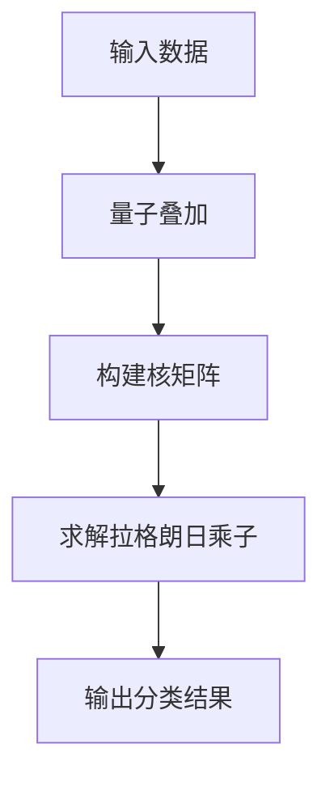
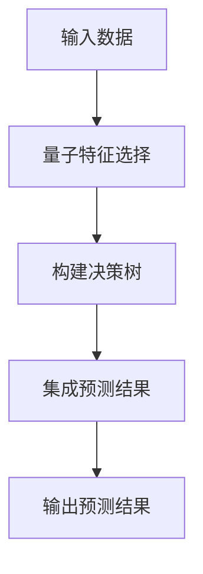
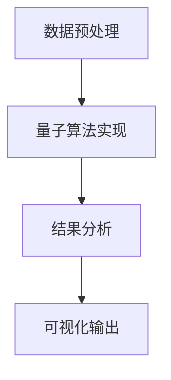

                 


# 如何评估企业的量子机器学习应用

---

## 关键词：量子机器学习、企业应用、评估方法、算法原理、系统架构

---

## 摘要：  
本文详细探讨了如何评估企业的量子机器学习应用，从量子机器学习的基本概念到其在企业中的实际应用，结合算法原理、系统架构、项目实战和评估方法，为企业提供全面的评估框架和实践指导。通过分析量子机器学习的核心概念、算法实现、系统设计和实际案例，本文为技术决策者和企业提供了实用的评估策略。

---

## 第一部分：量子机器学习与企业应用背景

### 第1章：量子机器学习概述

#### 1.1 量子计算与机器学习的结合  
量子计算和经典计算的核心区别在于量子位（qubit）的特性，如量子叠加和量子纠缠。机器学习则依赖于数据的处理和模式识别。两者的结合为机器学习提供了更高效的计算能力，特别是在处理复杂问题时。

#### 1.2 企业应用量子机器学习的背景  
随着量子计算技术的快速发展，企业开始探索量子机器学习在优化、分类和预测等任务中的应用。量子机器学习能够处理传统方法难以应对的高维问题，为企业带来了新的竞争优势。

#### 1.3 量子机器学习与传统机器学习的对比  
| 对比维度       | 量子机器学习       | 传统机器学习       |
|----------------|--------------------|--------------------|
| 计算能力       | 更高效的并行计算    | 单线性计算          |
| 数据处理       | 处理高维数据更优    | 数据维度有限        |
| 应用场景       | 优化、量子化学      | 分类、回归          |

---

## 第二部分：量子机器学习的核心概念与原理

### 第2章：量子机器学习的核心概念

#### 2.1 量子位与量子叠加  
量子位的状态可以用数学表达式表示：  
$$ q = \alpha|0\rangle + \beta|1\rangle $$  
其中，$\alpha$ 和 $\beta$ 是概率振幅，满足归一化条件：  
$$ |\alpha|^2 + |\beta|^2 = 1 $$  

#### 2.2 量子纠缠与信息处理  
量子纠缠是量子系统中粒子之间强关联的状态，可以用贝尔态（Bell state）表示：  
$$ |\psi\rangle = \frac{1}{\sqrt{2}}(|0\rangle|1\rangle - |1\rangle|0\rangle) $$  

#### 2.3 量子测量与概率分布  
量子测量会将量子态坍缩为经典状态，概率分布可以通过测量结果计算得出。例如，测量一个量子态的$|0\rangle$概率为：  
$$ P(0) = |\alpha|^2 $$  

---

## 第三部分：量子机器学习的算法原理

### 第3章：量子机器学习算法概述

#### 3.1 量子支持向量机  
量子支持向量机（Q-SVM）利用量子叠加特性加速特征空间的构建。其算法流程如下：



#### 3.2 量子随机森林  
量子随机森林通过量子叠加加速特征选择过程，其流程如下：



---

## 第四部分：量子机器学习的系统架构与实现

### 第4章：量子机器学习系统的架构设计

#### 4.1 系统功能模块划分  
- 数据预处理模块：负责量子数据的准备和归一化。  
- 量子算法实现模块：实现量子支持向量机或量子神经网络。  
- 结果分析与可视化模块：对量子算法输出结果进行分析和可视化。  

#### 4.2 系统架构图  



---

## 第五部分：量子机器学习的项目实战与评估

### 第5章：量子机器学习的项目实战

#### 5.1 项目背景与目标  
以金融领域的信用评估为例，通过量子机器学习算法优化客户信用评分模型。

#### 5.2 项目实现  
```python
import numpy as np
from qiskit import QuantumCircuit, Aer, execute

# 定义量子电路
qc = QuantumCircuit(2)
qc.h(0)
qc.cx(0, 1)
qc.measure(0, 0)
qc.measure(1, 1)

# 执行量子模拟
backend = Aer.get_backend('qasm_simulator')
job = execute(qc, backend)
result = job.result()
counts = result.get_counts()
```

#### 5.3 项目分析  
通过对比量子算法和经典算法的计算时间、准确率等指标，评估量子算法的优势。

---

## 第六部分：量子机器学习的评估方法与工具

### 第6章：量子机器学习的评估方法

#### 6.1 评估指标  
- 计算效率：量子算法的运行时间与经典算法的对比。  
- 分类准确率：量子算法的分类准确率与传统算法的对比。  
- 可扩展性：量子算法在高维数据中的表现。  

#### 6.2 评估工具  
- Qiskit：IBM提供的量子计算工具包。  
- QML：Google的量子机器学习库。  

---

## 第七部分：量子机器学习的案例分析与总结

### 第7章：案例分析

#### 7.1 金融领域的应用  
通过量子机器学习优化投资组合，提高收益预测的准确性。

#### 7.2 药物发现中的应用  
利用量子机器学习加速药物分子的筛选过程。

---

## 第八部分：总结与展望

### 8.1 本章总结  
量子机器学习在企业中的应用前景广阔，但目前仍面临硬件限制和技术成熟度的问题。

### 8.2 未来展望  
随着量子计算技术的进步，量子机器学习将在更多领域展现其潜力。

---

## 作者：AI天才研究院 & 禅与计算机程序设计艺术

---

通过以上目录和内容框架，您可以逐步撰写完整的博客文章，确保每个部分都详细展开，并结合实际案例和数学公式进行深入分析。

