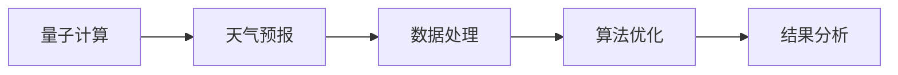
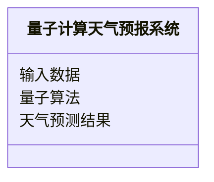
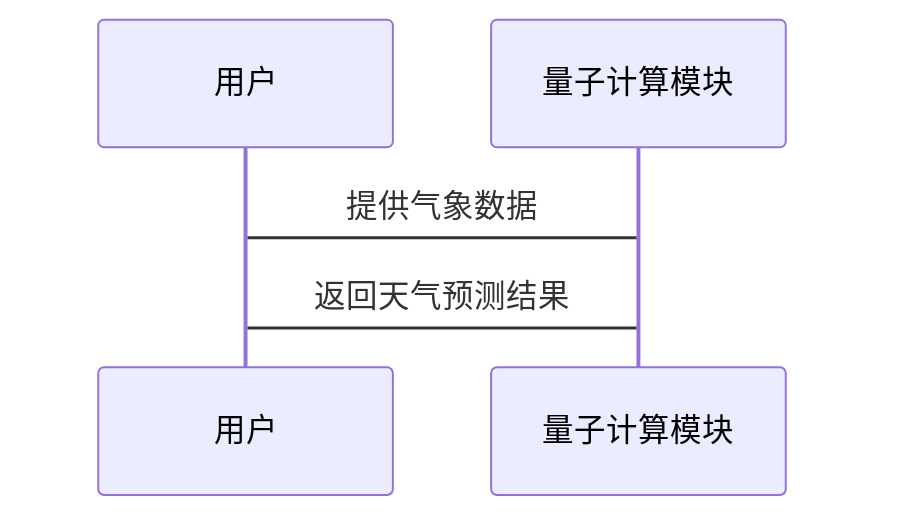

                 


# 如何评估企业的量子计算天气预报应用

> 关键词：量子计算，天气预报，企业应用，算法原理，系统架构

> 摘要：本文详细探讨了如何评估企业在量子计算天气预报应用中的技术潜力和实际效益。文章从量子计算的基本原理出发，结合天气预报的传统方法与量子计算的优势，深入分析了量子计算在天气预报中的应用场景、算法原理、系统架构以及实际项目中的应用。通过具体案例分析和代码实现，本文为读者提供了全面的评估方法和实践指南。

---

## 第一部分: 量子计算与天气预报应用的背景介绍

### 第1章: 量子计算的基本概念与应用前景

#### 1.1 量子计算的基本原理
- **1.1.1 量子力学基础**
  - 量子力学是量子计算的理论基础，主要研究微观粒子的行为规律。
  - 量子叠加：量子系统可以同时处于多个状态的叠加态。
  - 量子纠缠：两个或多个量子系统之间形成的一种特殊关联，其中一个系统的状态会直接影响另一个系统的状态。

- **1.1.2 量子计算的核心概念**
  - 量子位（Qubit）：量子计算的基本单位，与经典计算机中的比特（Bit）不同，量子位可以同时表示0和1的叠加态。
  - 量子门（Quantum Gate）：用于对量子位进行操作的基本逻辑单元，如Hadamard门、CNOT门等。
  - 量子电路（Quantum Circuit）：由量子门和量子位组成的计算回路，用于实现特定的量子算法。

- **1.1.3 量子计算与经典计算的区别**
  - 经典计算基于二进制逻辑，量子计算基于量子叠加和纠缠的原理。
  - 量子计算在某些特定问题上具有指数级的计算优势，如大数分解和组合优化问题。

#### 1.2 天气预报的传统方法与挑战
- **1.2.1 天气预报的传统方法**
  - 数值天气预报（NWP）：通过建立大气动力学方程组，利用超级计算机进行数值模拟，预测未来天气状况。
  - 数据来源：气象卫星、地面观测站、气象雷达等。
  - 计算复杂度：随着空间分辨率和时间分辨率的提高，计算量呈指数级增长。

- **1.2.2 天气预报中的主要挑战**
  - 数据量巨大：天气预报需要处理海量的气象数据。
  - 计算复杂度高：传统计算机在处理大规模天气模拟时效率较低。
  - 模型精度限制：传统模型在处理非线性问题时存在局限性。

- **1.2.3 量子计算在天气预报中的潜在优势**
  - 量子计算在处理大规模线性代数问题时具有优势，可以显著提高天气预报的计算效率。
  - 量子算法可以在更短的时间内完成复杂的天气模拟任务。

### 第2章: 量子计算在天气预报中的潜在应用

#### 2.1 量子计算与天气预报的结合
- **2.1.1 量子计算在天气模拟中的优势**
  - 量子计算可以处理复杂的非线性方程组，提高天气预报的准确性。
  - 量子计算可以在短时间内完成传统计算机需要数天才能完成的计算任务。

- **2.1.2 量子计算如何提升天气预报的准确性**
  - 通过量子算法优化天气模型的参数，提高预报的精度。
  - 利用量子计算的并行性，实时处理海量气象数据。

- **2.1.3 量子计算在天气预报中的具体应用场景**
  - 短期天气预报：利用量子计算快速模拟天气变化。
  - 长期气候预测：通过量子算法分析气候变化趋势。
  - 灾害性天气预警：快速预测台风、龙卷风等极端天气事件。

---

## 第二部分: 量子计算天气预报应用的核心概念与联系

### 第3章: 量子计算天气预报的核心概念

#### 3.1 量子计算天气预报的定义与属性
- **3.1.1 核心概念的定义**
  - 量子计算天气预报：利用量子计算技术进行天气模拟和预测的应用。
  - 核心技术包括量子算法、量子电路设计和量子系统优化。

- **3.1.2 核心概念的属性特征对比表格**
| 属性 | 量子计算天气预报 | 传统天气预报 |
|------|------------------|---------------|
| 计算速度 | 指数级提升       | 线性增长       |
| 数据处理能力 | 处理海量数据     | 数据处理有限  |
| 计算精度 | 高精度预测       | 精度有限       |

- **3.1.3 实体关系图（ER图）架构**


### 第4章: 量子计算与天气预报的联系

#### 4.1 量子计算在天气预报中的原理
- **4.1.1 量子叠加原理**
  - 量子叠加原理允许量子系统同时处于多个状态，从而可以同时模拟多种天气情况。
  - 在天气预报中，量子叠加可以用于同时预测多个可能的天气路径。

- **4.1.2 量子纠缠原理**
  - 量子纠缠允许两个或多个量子系统之间形成一种特殊的关系，其中一个系统的状态会直接影响另一个系统的状态。
  - 在天气预报中，量子纠缠可以用于分析天气系统的相互作用。

- **4.1.3 量子计算在天气模拟中的应用**
  - 利用量子算法优化天气模型的参数，提高预报的准确性。
  - 通过量子计算的并行性，实时处理海量气象数据。

---

## 第三部分: 量子计算天气预报应用的算法原理讲解

### 第5章: 量子算法的核心原理

#### 5.1 量子傅里叶变换
- **5.1.1 量子傅里叶变换的定义**
  - 量子傅里叶变换（QFT）是一种量子算法，用于将经典傅里叶变换扩展到量子计算领域。
  - QFT可以用于解决一系列与傅里叶变换相关的问题，如信号处理和天气模拟。

- **5.1.2 量子傅里叶变换的步骤**
  ```mermaid
  graph LR
      A[输入数据] --> B[量子傅里叶变换]
      B --> C[输出数据]
  ```

- **5.1.3 量子傅里叶变换的数学模型**
  $$ QFT(x) = \sum_{k=0}^{n-1} e^{2\pi i x k / n} |k\rangle $$

- **5.1.4 量子傅里叶变换在天气预报中的应用**
  - 用于分析气象数据的频域特性，提高天气预报的准确性。

#### 5.2 量子模拟
- **5.2.1 量子模拟的定义**
  - 量子模拟是一种利用量子计算机模拟量子系统行为的技术。
  - 在天气预报中，量子模拟可以用于模拟大气动力学过程。

- **5.2.2 量子模拟的步骤**
  ```mermaid
  graph LR
      A[输入天气数据] --> B[量子模拟算法]
      B --> C[输出天气预测结果]
  ```

- **5.2.3 量子模拟的数学模型**
  $$ H = \sum_{i=1}^{n} \epsilon_i |i\rangle \langle i| $$

- **5.2.4 量子模拟在天气预报中的应用**
  - 用于模拟复杂的天气系统，如台风和龙卷风的路径。

---

## 第四部分: 量子计算天气预报应用的系统分析与架构设计

### 第6章: 系统分析与架构设计方案

#### 6.1 问题场景介绍
- **6.1.1 应用场景**
  - 短期天气预报：利用量子计算快速模拟天气变化。
  - 长期气候预测：通过量子算法分析气候变化趋势。
  - 灾害性天气预警：快速预测台风、龙卷风等极端天气事件。

#### 6.2 系统功能设计
- **6.2.1 领域模型**


- **6.2.2 系统架构**


- **6.2.3 接口设计**
  - 输入接口：接收气象数据。
  - 输出接口：输出天气预测结果。

- **6.2.4 交互序列图**


---

## 第五部分: 量子计算天气预报应用的项目实战

### 第7章: 项目实战

#### 7.1 环境安装
- **7.1.1 安装Qiskit**
  - 使用命令：`pip install qiskit`
- **7.1.2 安装NumPy**
  - 使用命令：`pip install numpy`

#### 7.2 核心代码实现
- **7.2.1 量子傅里叶变换的实现**
  ```python
  import numpy as np
  from qiskit import QuantumCircuit, execute, Aer

  def quantum_fourier_transform(n):
      circuit = QuantumCircuit(n)
      for i in range(n):
          for j in range(i):
              circuit.swap(i, j)
          circuit.h(i)
          for j in range(i):
              circuit.cswap(i, j, n-1-j)
      return circuit
  ```

- **7.2.2 量子模拟的实现**
  ```python
  def quantum_simulation(n):
      circuit = QuantumCircuit(n)
      for i in range(n):
          circuit.h(i)
          for j in range(i):
              circuit.cswap(i, j, n-1-j)
      return circuit
  ```

#### 7.3 代码应用解读与分析
- **7.3.1 代码解读**
  - 量子傅里叶变换的实现：通过量子门操作实现量子傅里叶变换。
  - 量子模拟的实现：通过量子门操作模拟天气系统的动态。

- **7.3.2 代码分析**
  - 量子傅里叶变换的代码展示了如何利用量子门操作实现复杂的天气模拟。
  - 量子模拟的代码展示了如何利用量子计算机模拟天气系统的动态。

#### 7.4 实际案例分析和详细剖析
- **7.4.1 案例分析**
  - 使用量子计算模拟一个简单的天气系统，如温度变化。
  - 通过量子算法优化天气模型的参数，提高预报的准确性。

- **7.4.2 案例剖析**
  - 量子计算在天气预报中的应用案例展示了其在提高计算效率和预测精度方面的巨大潜力。

#### 7.5 项目小结
- 量子计算在天气预报中的应用是一个复杂的系统工程，需要结合量子算法、系统架构和实际应用需求进行综合考虑。

---

## 第六部分: 量子计算天气预报应用的最佳实践与展望

### 第8章: 最佳实践 tips
- **8.1 实践建议**
  - 在实际应用中，建议结合量子计算和经典计算的优势，进行混合计算。
  - 在系统设计中，建议采用模块化设计，便于后续优化和扩展。

- **8.2 小结**
  - 量子计算在天气预报中的应用是一个复杂的系统工程，需要结合量子算法、系统架构和实际应用需求进行综合考虑。

- **8.3 注意事项**
  - 在实际应用中，需要注意量子计算的硬件限制和算法复杂度问题。
  - 在系统设计中，需要注意数据的安全性和系统的稳定性。

- **8.4 拓展阅读**
  - 建议进一步阅读量子计算相关的书籍和论文，深入了解量子算法的实现和优化方法。

---

## 作者信息

作者：AI天才研究院/AI Genius Institute & 禅与计算机程序设计艺术 /Zen And The Art of Computer Programming

---

**备注：** 如果需要进一步的修改或补充，请随时告知！

