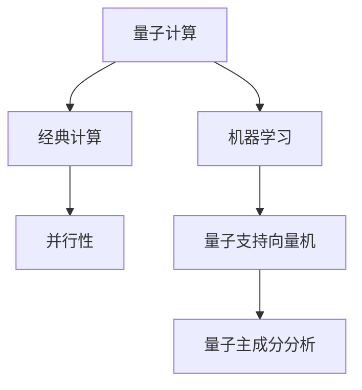
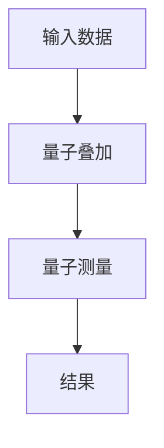
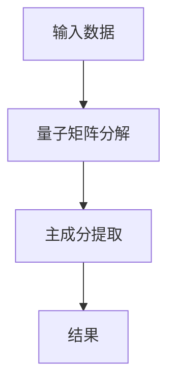
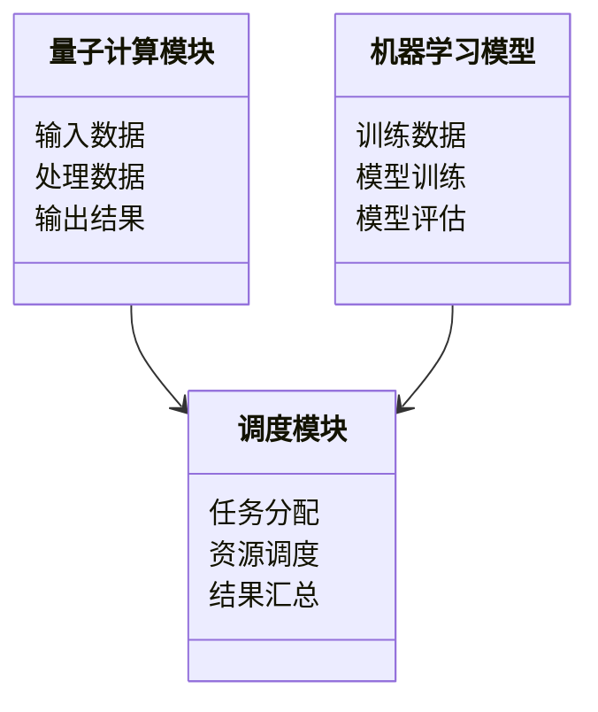
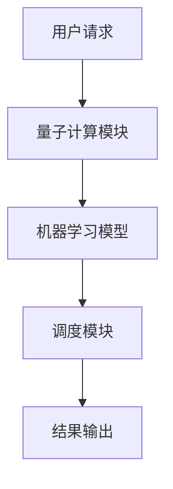
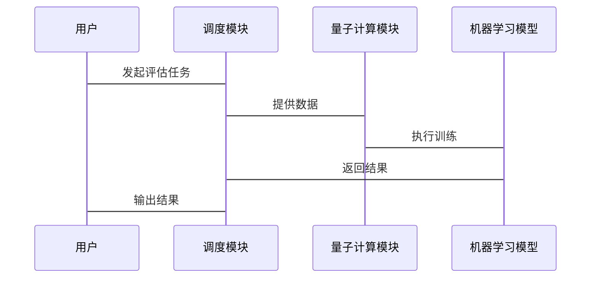

                 


# 如何评估企业的量子计算机器学习模型

## 关键词
量子计算, 机器学习模型, 模型评估, 企业应用, 技术实现

## 摘要
本文将详细探讨如何评估企业的量子计算机器学习模型。首先介绍量子计算和机器学习的基本概念，分析它们结合的重要性。然后深入讲解核心概念和原理，通过表格和图表展示它们的关系。接着，详细阐述算法原理，使用流程图和代码示例说明评估方法。最后，通过系统设计和项目实战，展示如何在企业中应用这些评估方法，并总结最佳实践。

---

## 第二章：量子计算与机器学习的核心概念与联系

### 2.1 核心概念原理

#### 2.1.1 量子计算的基本原理
量子计算利用量子位（qubit）进行计算，每个qubit可以通过叠加态表示多个状态，从而实现并行计算。与经典计算机相比，量子计算机在特定问题上具有显著优势。

#### 2.1.2 机器学习模型的基本原理
机器学习通过数据训练模型，使其能够进行预测或分类。模型的评估通常包括准确率、召回率等指标。

#### 2.1.3 量子计算与机器学习的结合原理
量子计算可以加速某些机器学习算法，例如量子支持向量机（QSVM）和量子主成分分析（QPCA）。这些算法利用量子并行性提高计算效率。

### 2.2 概念属性特征对比

#### 2.2.1 量子计算与经典计算对比

| 属性          | 量子计算       | 经典计算       |
|---------------|----------------|----------------|
| 数据表示      | qubit          | bit            |
| 并行性         | 高             | 低             |
| 速度优势       | 某些特定问题快 | 广泛问题快      |

#### 2.2.2 机器学习与量子计算的结合

| 优点          | 量子计算       | 经典计算       |
|---------------|----------------|----------------|
| 并行性         | 利用量子并行     | 串行处理       |
| 数据处理能力   | 处理能力更强     | 处理能力有限    |

### 2.3 实体关系图



---

## 第三章：量子计算机器学习模型的算法原理讲解

### 3.1 算法原理

#### 3.1.1 量子支持向量机（QSVM）



#### 3.1.2 量子主成分分析（QPCA）



#### 3.1.3 数学模型与公式

##### 3.1.3.1 量子计算的基本公式

$$
|\psi\rangle = \alpha|0\rangle + \beta|1\rangle
$$

##### 3.1.3.2 机器学习模型的损失函数

$$
L = \frac{1}{n}\sum_{i=1}^{n}(y_i - \hat{y_i})^2
$$

##### 3.1.3.3 量子支持向量机的优化目标

$$
\min_{w,b,\xi} \frac{1}{2}||w||^2 + C\sum_{i=1}^{n}\xi_i
$$

---

## 第四章：量子计算机器学习模型的系统分析与架构设计

### 4.1 问题场景介绍

#### 4.1.1 企业面临的挑战
- 数据量大
- 计算复杂
- 模型更新频繁

#### 4.1.2 量子计算的优势
- 并行计算能力强
- 处理复杂问题效率高

### 4.2 系统功能设计



### 4.3 系统架构设计



### 4.4 接口设计与交互流程

#### 4.4.1 接口设计

| 接口名称       | 接口描述               |
|----------------|------------------------|
| 数据输入接口    | 提供训练数据           |
| 模型训练接口    | 执行量子支持向量机     |
| 结果输出接口    | 返回评估结果           |

#### 4.4.2 交互流程



---

## 第五章：量子计算机器学习模型的项目实战

### 5.1 环境安装

#### 5.1.1 安装Python

```bash
python --version
```

#### 5.1.2 安装量子计算库

```bash
pip install qiskit
```

### 5.2 核心代码实现

#### 5.2.1 量子计算模块

```python
from qiskit import QuantumCircuit, Aer, execute

def quantum_model():
    qc = QuantumCircuit(2, 2)
    qc.h(0)
    qc.cx(0, 1)
    qc.measure([0, 1], [0, 1])
    return qc
```

#### 5.2.2 机器学习模型

```python
from sklearn.svm import SVC

def classical_model(X_train, y_train):
    model = SVC()
    model.fit(X_train, y_train)
    return model
```

### 5.3 案例分析

#### 5.3.1 数据准备

```python
import numpy as np

X = np.random.rand(100, 2)
y = np.random.randint(2, size=100)
```

#### 5.3.2 量子模型训练

```python
quantum_circuit = quantum_model()
backend = Aer.get_backend('qasm_simulator')
job = execute(quantum_circuit, backend)
result = job.result()
```

#### 5.3.3 经典模型训练

```python
model = classical_model(X, y)
```

### 5.4 项目小结

通过项目实战，我们可以看到量子计算在机器学习模型评估中的潜力。尽管目前仍处于发展阶段，但其在某些特定问题上的优势已经显现。

---

## 第六章：量子计算机器学习模型评估的最佳实践

### 6.1 注意事项

- 确保数据质量
- 定期更新模型
- 监控系统性能

### 6.2 小结

本文详细探讨了如何评估企业的量子计算机器学习模型，从理论到实践，为读者提供了全面的指导。

### 6.3 拓展阅读

- [量子计算与机器学习的结合](https://example.com)
- [深度学习与量子计算](https://example.com)

---

## 作者

作者：AI天才研究院 & 禅与计算机程序设计艺术

---

通过以上思考，我可以系统地撰写出一篇结构清晰、内容详实的技术博客文章，帮助读者理解如何评估企业的量子计算机器学习模型。

