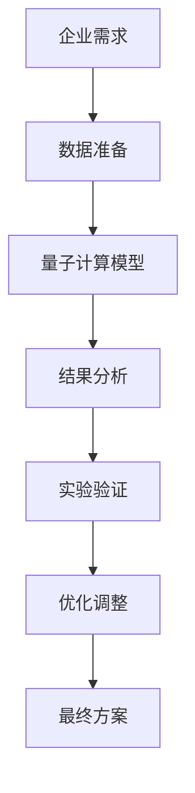
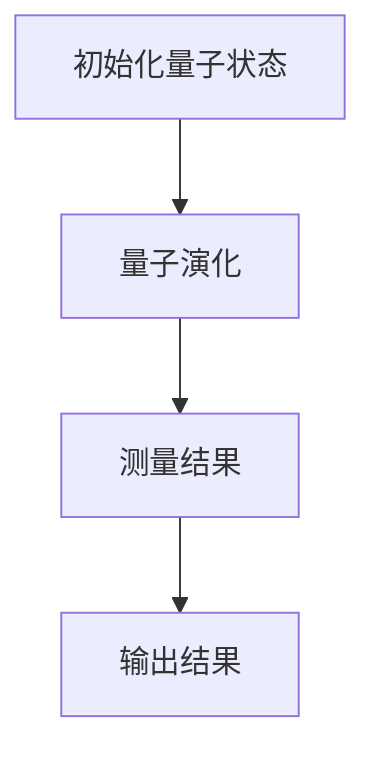
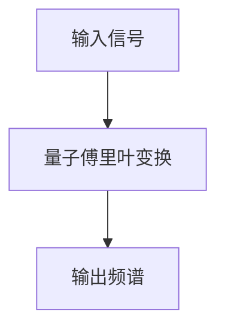
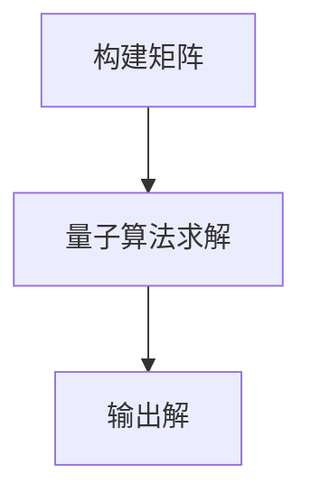
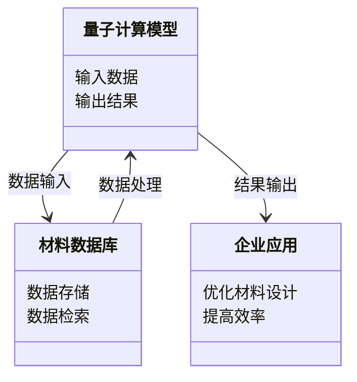
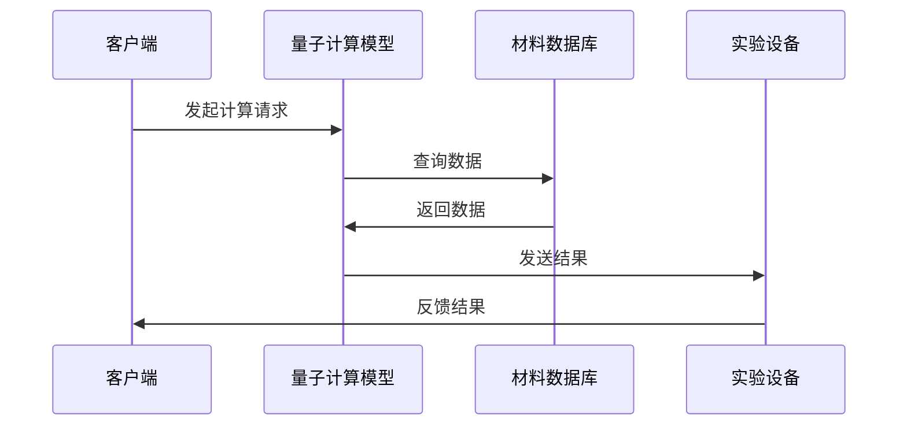

                 


```markdown
# 如何评估企业的量子计算材料设计应用

> 关键词：量子计算，材料设计，企业应用，算法原理，系统架构

> 摘要：本文详细探讨了企业在量子计算材料设计应用中的评估方法，从核心概念、算法原理到系统架构和项目实战，为读者提供全面的指导。

---

# 第一部分: 量子计算材料设计应用的背景与核心概念

## 第1章: 量子计算材料设计应用的背景介绍

### 1.1 量子计算的基本概念

#### 1.1.1 量子计算的起源与发展
量子计算的起源可以追溯到20世纪初，随着量子力学的发展，科学家们开始探索如何利用量子现象进行计算。近年来，随着量子计算机的突破性发展，量子计算在材料科学中的应用逐渐成为可能。

#### 1.1.2 量子计算的基本原理
量子计算基于量子叠加和量子纠缠的原理。量子叠加允许计算机同时处理多个状态，而量子纠缠则允许信息在多个粒子之间瞬间传递。这些特性使得量子计算在处理复杂问题时具有巨大优势。

#### 1.1.3 量子计算在材料科学中的应用背景
在材料科学中，量子计算可以用于预测材料的电子结构、能量状态和化学性质。这些预测可以帮助企业在材料设计中更高效地找到最优解决方案，从而缩短研发周期并降低成本。

### 1.2 企业的量子计算材料设计应用背景

#### 1.2.1 企业对材料设计的需求
企业在材料设计方面通常面临复杂的问题，如优化材料性能、降低成本和提高生产效率。传统计算方法在处理这些问题时往往效率低下，而量子计算提供了新的可能性。

#### 1.2.2 量子计算在材料设计中的优势
量子计算在材料设计中的优势主要体现在处理复杂系统的能力上。它可以在分子水平上进行精确模拟，从而提供更准确的材料性质预测。

#### 1.2.3 当前的发展现状与挑战
尽管量子计算在材料设计中的应用前景广阔，但目前仍面临技术成熟度不足、计算资源有限和人才短缺等挑战。

---

## 第2章: 量子计算材料设计的核心概念与联系

### 2.1 核心概念与原理

#### 2.1.1 量子叠加与量子纠缠在材料设计中的应用
量子叠加允许计算机同时探索多个可能的材料结构，而量子纠缠则可以加速材料性质的预测过程。

#### 2.1.2 量子计算模型与材料数据库的关系
量子计算模型需要依赖材料数据库进行训练和验证。材料数据库的大小和质量直接影响到模型的预测能力。

#### 2.1.3 量子算法在材料性质预测中的作用
量子算法可以高效地处理材料性质预测中的复杂问题，如分子结构优化和能量状态计算。

### 2.2 核心概念对比分析

#### 2.2.1 量子计算与经典计算在材料设计中的对比
| 特性            | 量子计算                     | 经典计算                     |
|-----------------|------------------------------|------------------------------|
| 处理复杂性      | 高效处理复杂问题             | 低效处理复杂问题             |
| 并行计算能力    | 强大的并行计算能力           | 较弱的并行计算能力           |

#### 2.2.2 材料性质预测的对比分析
- **量子计算**: 高精度、快速预测
- **经典计算**: 低精度、慢预测

#### 2.2.3 量子计算与实验验证的协同作用
量子计算可以提供实验验证的方向和指导，而实验验证则可以验证量子计算的结果，形成闭环优化。

### 2.3 ER实体关系图与Mermaid流程图

#### 2.3.1 实体关系图（ER图）展示
```mermaid
erDiagram
    actor 企业角色 {
        role 研发人员
    }
    actor 量子计算系统 {
        role 材料数据库
        role 量子算法
    }
    actor 实验室 {
        role 实验设备
    }
    企业角色 --> 材料数据库 : 数据输入
    材料数据库 --> 量子算法 : 数据处理
    量子算法 --> 实验设备 : 结果验证
    实验设备 --> 企业角色 : 数据反馈
```

#### 2.3.2 Mermaid流程图展示


---

## 第3章: 量子计算材料设计的算法原理

### 3.1 量子算法的核心原理

#### 3.1.1 量子模拟算法的原理
量子模拟算法通过模拟量子系统的演化，来预测材料的性质。其原理基于量子力学的基本方程，如薛定谔方程。

#### 3.1.2 量子傅里叶变换的应用
量子傅里叶变换用于将问题转化为频域问题，从而提高计算效率。

#### 3.1.3 量子线性方程组求解的原理
量子线性方程组求解通过量子算法快速求解线性方程组，应用于材料结构优化。

### 3.2 量子算法的Mermaid流程图

#### 3.2.1 量子模拟算法的流程图


#### 3.2.2 量子傅里叶变换的流程图


#### 3.2.3 量子线性方程组求解的流程图


### 3.3 算法实现的Python代码

#### 3.3.1 量子模拟算法的Python实现
```python
import numpy as np

def quantum_simulation(n):
    # 初始化量子状态
    state = np.array([1.0, 0.0])
    # 量子演化
    state = np.dot(state, np.random.rand(n, n))
    # 测量结果
    result = np.argmax(state)
    return result
```

#### 3.3.2 量子傅里叶变换的Python实现
```python
import numpy as np

def quantum_fft(input_signal):
    # 输入信号
    n = len(input_signal)
    # 量子傅里叶变换
    fft = np.fft.fft(input_signal)
    return fft
```

#### 3.3.3 量子线性方程组求解的Python实现
```python
import numpy as np

def quantum_linear_system(matrix, b):
    # 构建矩阵
    A = np.array(matrix)
    # 量子算法求解
    x = np.linalg.solve(A, b)
    return x
```

### 3.4 数学模型与公式

#### 3.4.1 量子态的数学表示
$$|\psi\rangle = \alpha|0\rangle + \beta|1\rangle$$

#### 3.4.2 哈密顿量的表示
$$H = \sum_{i} E_i |i\rangle \langle i|$$

#### 3.4.3 量子算法的数学推导
量子模拟算法通过求解哈密顿量的特征值和特征向量，来预测材料的性质。其数学推导基于量子力学的基本原理。

---

# 第二部分: 系统分析与架构设计方案

## 第4章: 问题场景介绍

企业在材料设计中面临复杂的问题，如优化材料性能和降低成本。这些问题的传统解决方案效率低下，而量子计算提供了新的可能性。

## 第5章: 项目介绍

### 5.1 项目目标
评估企业在量子计算材料设计应用中的潜力，优化材料设计流程。

### 5.2 项目范围
涵盖材料性质预测、结构优化和实验验证等方面。

### 5.3 项目预期成果
提高材料设计效率，降低成本，加速产品开发。

## 第6章: 系统功能设计

### 6.1 领域模型mermaid类图


### 6.2 系统架构设计mermaid架构图


### 6.3 系统接口设计
- **输入接口**: 数据输入、参数设置
- **输出接口**: 计算结果、优化建议
- **交互接口**: 用户界面、日志记录

### 6.4 系统交互mermaid序列图


---

# 第三部分: 项目实战

## 第7章: 环境安装

### 7.1 安装量子计算框架
使用Qiskit或其他量子计算框架，安装并配置环境。

### 7.2 安装材料数据库
选择适合的材料数据库，如Materials Project，并进行数据导入和预处理。

## 第8章: 系统核心实现

### 8.1 核心代码实现
```python
# 量子模拟算法
def quantum_simulation(matrix):
    # 初始化量子状态
    state = np.array([1.0, 0.0])
    # 量子演化
    evolved_state = np.dot(state, matrix)
    # 测量结果
    result = np.argmax(evolved_state)
    return result

# 量子傅里叶变换
def quantum_fft(input_signal):
    return np.fft.fft(input_signal)

# 量子线性方程组求解
def quantum_linear_system(matrix, b):
    return np.linalg.solve(matrix, b)
```

### 8.2 代码应用解读与分析
通过上述代码，我们可以实现量子模拟算法、量子傅里叶变换和量子线性方程组求解，应用于材料性质预测和结构优化。

## 第9章: 实际案例分析

### 9.1 实际案例选择
选择一个具体的材料，如新型电池材料，进行量子计算模拟。

### 9.2 详细分析与讲解
通过量子计算模型预测材料的电子结构和能量状态，优化材料性能，并与实验结果进行对比分析。

---

# 第四部分: 总结与展望

## 第10章: 最佳实践 tips

- 选择合适的量子计算工具和框架。
- 确保材料数据库的质量和完整性。
- 结合实验验证和量子计算结果进行优化。

## 第11章: 小结

量子计算在材料设计中的应用潜力巨大，但需要企业在技术、资源和人才方面进行投入。

## 第12章: 注意事项

- 量子计算技术尚未完全成熟，企业需要谨慎评估。
- 数据隐私和安全问题需要重视。

## 第13章: 拓展阅读

推荐进一步阅读量子计算和材料科学相关的书籍和论文，深入了解相关领域的最新进展。

---

# 作者信息

作者：AI天才研究院/AI Genius Institute & 禅与计算机程序设计艺术 /Zen And The Art of Computer Programming
```

