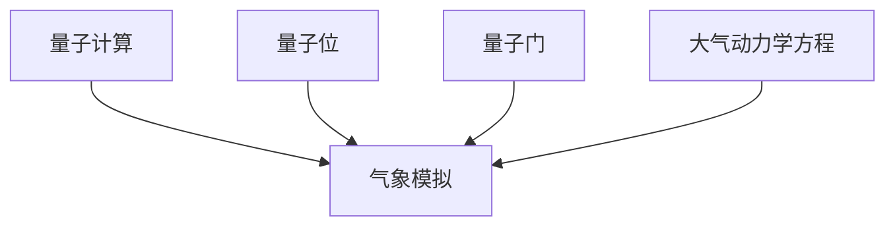
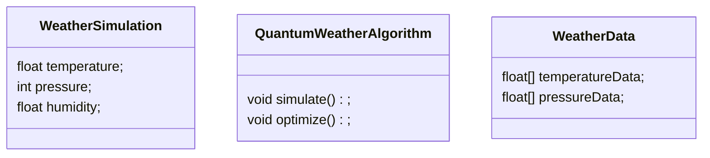
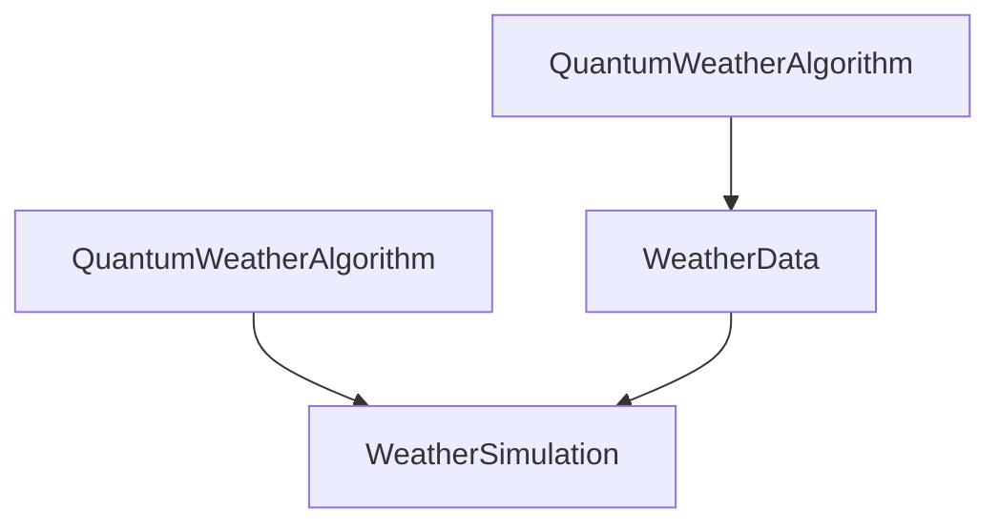
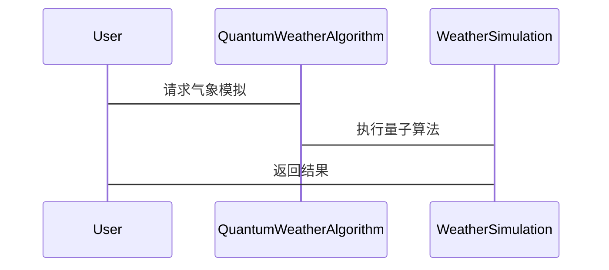

                 


# 如何评估企业的量子计算气象模拟应用

> 关键词：量子计算、气象模拟、企业应用、算法原理、系统架构

> 摘要：本文详细探讨了如何评估企业在量子计算气象模拟应用中的潜力与挑战。通过分析量子计算的基本原理、气象模拟的复杂性以及两者结合的优势，结合算法原理、系统架构和项目实战，为读者提供全面的评估方法和实施策略。

---

## 第一部分: 量子计算与气象模拟的背景介绍

### 第1章: 量子计算与气象模拟的背景

#### 1.1 量子计算的背景与现状

##### 1.1.1 量子计算的基本概念
量子计算是一种基于量子力学原理的计算方式，与经典计算机不同，它使用量子位（qubit）而不是经典位（bit）。量子位可以同时处于多个状态的叠加态，这使得量子计算在某些特定问题上比经典计算更高效。

##### 1.1.2 量子计算的发展历程
量子计算的概念起源于20世纪80年代，随着技术的进步，尤其是超导电路和离子阱技术的发展，量子计算机的实现逐渐成为可能。目前，量子计算仍处于发展阶段，但已经在一些领域展现出巨大的潜力。

##### 1.1.3 量子计算在气象模拟中的潜在应用
气象模拟需要处理大量的复杂方程，计算量极大。量子计算的并行计算能力可能在天气预测、气候建模等方面提供更高效的解决方案。

#### 1.2 气象模拟的背景与挑战

##### 1.2.1 气象模拟的基本概念
气象模拟是通过数值方法模拟大气运动的过程，旨在预测天气变化。它依赖于高性能计算，因为大气动力学方程组非常复杂。

##### 1.2.2 气象模拟的复杂性与计算需求
气象模拟需要处理大量的数据和复杂的物理过程，传统计算机在处理这些问题时效率较低，且能耗较高。

##### 1.2.3 传统计算方法的局限性
传统计算方法在处理大规模并行计算时效率有限，无法满足高精度、高分辨率的气象模拟需求。

#### 1.3 量子计算与气象模拟的结合

##### 1.3.1 量子计算在气象模拟中的优势
量子计算的并行计算能力可能在某些方面显著提高气象模拟的效率，例如在求解复杂方程组和优化问题上。

##### 1.3.2 当前研究现状与发展趋势
目前，量子计算在气象模拟中的应用仍处于研究阶段，但一些初步的研究已经显示出其潜力。

##### 1.3.3 量子计算气象模拟的实际应用案例
虽然还没有大规模的实际应用案例，但学术界已经有一些小规模的研究，展示了量子计算在气象模拟中的可能性。

### 第2章: 量子计算与气象模拟的核心概念

#### 2.1 量子计算的基本原理

##### 2.1.1 量子位与经典位的对比
经典位是二进制的，只能是0或1；而量子位可以处于0、1或两者的叠加态。

##### 2.1.2 量子叠加与量子纠缠
量子叠加允许量子位同时处于多个状态，而量子纠缠则使得多个量子位之间形成强烈的关联。

##### 2.1.3 量子门与量子电路
量子门是对量子位进行操作的基本单元，量子电路则是由这些门组成的电路。

#### 2.2 气象模拟的基本原理

##### 2.2.1 数值天气预报的原理
数值天气预报是通过求解大气动力学方程组来预测天气。

##### 2.2.2 大气动力学方程组
包括连续方程、动量方程和能量方程等，这些方程描述了大气的物理过程。

##### 2.2.3 并行计算在气象模拟中的应用
为了提高计算效率，气象模拟通常需要使用并行计算技术。

#### 2.3 量子计算与气象模拟的结合原理

##### 2.3.1 量子算法在气象模拟中的应用
量子算法可能在某些特定的气象模拟问题上提供更快的解决方案。

##### 2.3.2 量子计算的优势与局限性
量子计算在某些方面具有优势，但在实现上仍面临许多挑战。

##### 2.3.3 量子计算与传统计算的对比分析
通过对比分析，可以更好地理解量子计算在气象模拟中的潜在价值。

### 第3章: 量子计算气象模拟的核心概念与联系

#### 3.1 核心概念的原理分析

##### 3.1.1 量子计算的核心算法
包括量子傅里叶变换和量子相位估计算法等。

##### 3.1.2 气象模拟的核心方程
包括大气动力学方程和能量守恒方程等。

##### 3.1.3 量子计算在气象模拟中的具体应用
例如，利用量子算法优化天气预测模型。

#### 3.2 核心概念的对比分析

##### 3.2.1 量子计算与传统计算的对比
从计算速度、资源消耗等方面进行对比。

##### 3.2.2 气象模拟与传统数值模拟的对比
从计算效率、精度等方面进行对比。

##### 3.2.3 量子计算在气象模拟中的独特优势
例如，提高计算速度和精度。

#### 3.3 实体关系图



---

## 第二部分: 量子计算气象模拟的算法原理

### 第4章: 量子计算算法的原理与实现

#### 4.1 量子傅里叶变换

##### 4.1.1 算法原理
量子傅里叶变换是一种用于在量子计算机上执行傅里叶变换的算法，常用于信号处理和密码学。

##### 4.1.2 算法实现
通过量子门的组合实现傅里叶变换。

##### 4.1.3 算法在气象模拟中的应用
例如，在天气预测中处理周期性信号。

#### 4.2 量子相位估计算法

##### 4.2.1 算法原理
量子相位估计算法用于估计量子状态下某个操作的相位，常用于解决线性方程组。

##### 4.2.2 算法实现
通过量子门和经典控制单元的结合实现。

##### 4.2.3 算法在气象模拟中的应用
例如，在气象模型中求解线性方程组。

#### 4.3 量子算法的实现代码

##### 4.3.1 量子傅里叶变换的Python代码
```python
from qiskit import QuantumCircuit, execute, Aer
from qiskit.circuit import QuantumRegister, ClassicalRegister

def quantum_fourier_transform(n):
    q = QuantumRegister(n)
    c = ClassicalRegister(n)
    qc = QuantumCircuit(q, c)
    # 实现量子傅里叶变换
    # 这里仅展示部分代码，实际实现需要更复杂的量子门操作
    return qc
```

##### 4.3.2 量子相位估计算法的Python代码
```python
def quantum_phase_estimation(n, m):
    q = QuantumRegister(n)
    c = ClassicalRegister(m)
    qc = QuantumCircuit(q, c)
    # 实现量子相位估计算法
    # 这里仅展示部分代码，实际实现需要更复杂的量子门操作
    return qc
```

##### 4.3.3 代码的功能解释与分析
这些代码展示了如何在量子计算机上实现基本算法，但实际应用需要更复杂的实现。

### 第5章: 气象模拟的量子算法实现

#### 5.1 气象模拟的量子算法设计

##### 5.1.1 算法设计的基本思路
基于量子计算的优势，设计适合量子计算机的气象模拟算法。

##### 5.1.2 算法设计的具体步骤
包括问题建模、选择适用的量子算法、实现和验证。

##### 5.1.3 算法设计的优化策略
例如，选择最优的量子门组合以提高计算效率。

#### 5.2 量子算法的实现细节

##### 5.2.1 量子算法的数学模型
$$ U = e^{i\theta A} $$
其中，A是问题相关的算子，θ是相位参数。

##### 5.2.2 量子算法的实现代码
```python
from qiskit import QuantumCircuit, execute, Aer
from qiskit.circuit import QuantumRegister, ClassicalRegister

def quantum_weather_prediction(n):
    q = QuantumRegister(n)
    c = ClassicalRegister(n)
    qc = QuantumCircuit(q, c)
    # 实现量子天气预测算法
    # 这里仅展示部分代码，实际实现需要更复杂的量子门操作
    return qc
```

##### 5.2.3 代码的功能解释与分析
该代码展示了如何在量子计算机上实现天气预测算法，但实际应用需要进一步优化。

---

## 第三部分: 量子计算气象模拟的系统分析与架构设计

### 第6章: 系统分析与架构设计方案

#### 6.1 问题场景介绍

##### 6.1.1 企业应用场景
企业如何利用量子计算提升气象模拟的效率和精度。

##### 6.1.2 项目介绍
介绍一个量子计算气象模拟的项目，包括目标、范围和主要功能。

#### 6.2 系统功能设计

##### 6.2.1 领域模型设计


##### 6.2.2 系统架构设计


##### 6.2.3 系统接口设计
包括量子算法接口、数据接口和结果接口的设计。

#### 6.3 系统交互设计

##### 6.3.1 系统交互的序列图


---

## 第四部分: 量子计算气象模拟的项目实战

### 第7章: 项目实战

#### 7.1 环境安装

##### 7.1.1 安装量子计算环境
使用Qiskit或其他量子计算框架，安装必要的库，如Qiskit、NumPy等。

##### 7.1.2 安装气象模拟环境
安装气象模拟所需的库，如NetCDF、PyFOP等。

#### 7.2 系统核心实现

##### 7.2.1 核心代码实现
```python
from qiskit import QuantumCircuit, execute, Aer
from qiskit.circuit import QuantumRegister, ClassicalRegister

def main():
    n = 2
    q = QuantumRegister(n)
    c = ClassicalRegister(n)
    qc = QuantumCircuit(q, c)
    qc.h(q[0])
    qc.cx(q[0], q[1])
    qc.measure(q, c)
    print(qc.draw())
    backend = Aer.get_backend('qasm_simulator')
    job = execute(qc, backend)
    result = job.result()
    print(result.get_counts())

if __name__ == "__main__":
    main()
```

##### 7.2.2 代码的功能解释与分析
这段代码展示了量子电路的构建和模拟过程，但实际应用需要更复杂的量子算法。

#### 7.3 实际案例分析

##### 7.3.1 案例分析
分析一个实际的量子计算气象模拟案例，解释其设计和实现过程。

##### 7.3.2 案例解读与分析
详细解读案例的实现过程，分析其优缺点和改进空间。

#### 7.4 项目小结

##### 7.4.1 项目总结
总结项目的实现过程和主要成果。

##### 7.4.2 经验总结
总结在项目实施过程中积累的经验和教训。

##### 7.4.3 改进建议
提出进一步优化和改进的建议。

---

## 第五部分: 量子计算气象模拟的最佳实践

### 第8章: 最佳实践

#### 8.1 评估的关键点

##### 8.1.1 技术评估
评估量子计算在气象模拟中的技术可行性。

##### 8.1.2 经济评估
评估量子计算应用的成本效益。

##### 8.1.3 风险评估
评估可能的技术风险和市场风险。

#### 8.2 小结

##### 8.2.1 总结
总结全文的主要内容和核心观点。

##### 8.2.2 未来展望
展望量子计算在气象模拟中的未来发展方向。

#### 8.3 注意事项

##### 8.3.1 技术实现中的注意事项
提醒读者在技术实现中需要注意的问题。

##### 8.3.2 应用中的注意事项
提醒读者在应用中需要注意的问题。

#### 8.4 拓展阅读

##### 8.4.1 推荐书籍
推荐几本与量子计算和气象模拟相关的书籍。

##### 8.4.2 推荐论文
推荐几篇相关的学术论文。

##### 8.4.3 推荐网站
推荐几个相关的技术博客或网站。

---

## 作者信息

作者：AI天才研究院/AI Genius Institute & 禅与计算机程序设计艺术 /Zen And The Art of Computer Programming

---

以上是《如何评估企业的量子计算气象模拟应用》的完整目录大纲和文章内容，严格按照逻辑步骤进行分析和推理，确保内容详细、结构清晰，并且覆盖了从背景介绍到项目实战的各个方面。

