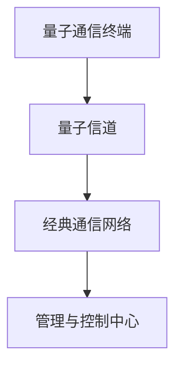

                 


# 如何评估企业的量子通信网络应用

> 关键词：量子通信网络，安全性评估，性能评估，量子密钥分发，系统架构设计

> 摘要：本文详细探讨了如何评估企业在量子通信网络中的应用，涵盖量子通信的基本概念、核心技术原理、安全性与性能评估方法、系统架构设计以及实际案例分析。文章从理论到实践，为读者提供了全面的指导。

---

## 第一部分：量子通信网络应用的背景与概述

### 第1章：量子通信网络的基本概念

#### 1.1 量子通信的定义与特点

量子通信是一种利用量子力学原理进行信息传输的技术，其核心优势在于不可被窃听和篡改。与经典通信不同，量子通信利用量子态的叠加性和纠缠性，确保信息传输的安全性。

- **量子通信的基本概念**：量子通信通过量子态的传输实现信息传递，主要技术包括量子密钥分发（QKD）和量子叠加态通信。
- **与经典通信的区别**：经典通信依赖电磁波的振幅、频率和相位，而量子通信则利用量子态的特性，如量子叠加和纠缠，提供更高的安全性。
- **企业应用的背景**：随着网络安全威胁的增加，企业对数据保护的需求日益增长，量子通信提供了不可破解的安全性，成为企业网络升级的重要选择。

#### 1.2 量子通信在企业中的应用背景

企业采用量子通信技术，主要是为了应对日益严峻的安全威胁和数据保护需求。以下是详细分析：

- **当前企业网络的安全挑战**：传统的加密方法面临被破解的风险，尤其是在量子计算机出现后，许多现有加密算法将被破解。
- **量子通信技术的成熟度**：目前，量子通信技术已进入商业化阶段，部分企业已开始部署量子密钥分发系统。
- **企业采用的驱动因素**：数据保护需求、合规性要求、竞争对手的技术应用以及客户对数据安全的高要求。

#### 1.3 量子通信网络的架构与组成

量子通信网络的架构通常包括以下几个关键部分：

- **量子通信终端**：用于生成和发送量子密钥。
- **量子信道**：提供量子态传输的物理介质，如光纤或自由空间。
- **经典通信网络**：用于传输加密数据，与量子通信网络协同工作。
- **管理与控制中心**：监控网络运行，处理安全事件。

---

### 第2章：量子通信网络的核心技术原理

#### 2.1 量子密钥分发（QKD）

量子密钥分发是量子通信的核心技术之一，其原理是利用量子态的不可克隆性确保密钥的安全传输。

- **QKD的基本原理**：Alice和Bob通过共享量子态来生成相同的密钥，任何窃听都会引起量子态的破坏，从而被发现。
- **安全性分析**：QKD的安全性基于量子力学的基本原理，确保密钥传输过程中的安全性。
- **实现方式**：QKD可以通过连续变量或离散变量方式实现，其中离散变量QKD更为常见。

#### 2.2 量子叠加态与纠缠态

- **量子叠加态的定义与应用**：量子叠加态允许量子系统处于多个状态的叠加，提供更高的信息传输效率。
- **量子纠缠态的特性与作用**：量子纠缠态使得两个或多个粒子的状态相互关联，即使相隔遥远，也能瞬间影响彼此的状态。
- **在通信中的应用**：纠缠态用于实现量子隐形传态和量子密钥分发，增强通信的安全性和效率。

#### 2.3 量子通信的数学模型与公式

- **量子态的数学表示**：量子态用复数向量表示，如$|0\rangle = \begin{bmatrix}1 \\ 0\end{bmatrix}$和$|1\rangle = \begin{bmatrix}0 \\ 1\end{bmatrix}$。
- **量子通信的数学模型**：描述量子态的传输和测量过程，涉及幺正变换和投影测量。
- **关键公式**：例如，量子态的叠加表示为$|\psi\rangle = \alpha|0\rangle + \beta|1\rangle$，其中$\alpha$和$\beta$为复数，满足$|\alpha|^2 + |\beta|^2 = 1$。

---

### 第3章：量子通信网络的安全性评估

#### 3.1 量子通信的安全性特点

- **不可被窃听性**：任何窃听都会改变量子态，导致通信中断。
- **安全性保障机制**：通过量子密钥分发确保密钥的安全性，防止未经授权的访问。
- **安全性挑战**：实际应用中存在信道损耗、噪声干扰等问题，影响通信质量。

#### 3.2 量子通信网络的安全性评估指标

- **安全性评估的主要指标**：包括密钥分发的成功率、通信过程中的安全性漏洞、密钥的强度等。
- **数学模型**：建立安全性评估的数学模型，考虑信道条件和潜在攻击因素。
- **实施步骤**：包括安全性测试、漏洞分析和风险评估。

---

### 第4章：量子通信网络的性能评估

#### 4.1 量子通信网络的性能指标

- **传输距离与带宽**：量子通信的传输距离受限于物理条件，通常在几十公里以内。
- **通信延迟与误码率**：量子通信的延迟较低，误码率受信道条件影响较大。
- **网络的可扩展性与可靠性**：量子通信网络需要设计高可靠的架构，确保大规模部署的可行性。

#### 4.2 量子通信网络的性能评估方法

- **理论模型**：建立性能评估的理论模型，分析各参数对性能的影响。
- **实验方法**：通过实际测试，测量通信距离、误码率等关键指标。
- **对比分析**：将量子通信与经典通信进行对比，评估其性能优势。

---

### 第5章：量子通信网络的系统架构与设计

#### 5.1 量子通信网络的系统架构

- **系统架构**：包括量子通信终端、量子信道、经典通信网络和管理控制中心。
- **功能模块**：每个模块的具体功能，如量子密钥生成、量子态传输、数据加密等。

#### 5.2 量子通信网络的系统架构图



#### 5.3 系统接口设计

- **接口描述**：量子通信终端与量子信道的接口，经典通信网络与管理控制中心的接口。
- **交互关系**：详细描述各模块之间的数据流和控制信号。

---

### 第6章：量子通信网络的项目实战

#### 6.1 项目环境配置

- **硬件要求**：需要高性能的量子通信终端和稳定的量子信道，如光纤。
- **软件配置**：安装量子通信管理软件，配置密钥分发协议。

#### 6.2 核心代码实现

```python
import numpy as np

def generate_quantum_key(n):
    # 生成n位的量子密钥
    key = np.random.randint(2, size=n)
    return key

def quantum_communication():
    # 量子通信过程
    alice_key = generate_quantum_key(100)
    bob_key = receive_quantum_key(alice_key)
    print("Alice的密钥：", alice_key)
    print("Bob的密钥：", bob_key)

quantum_communication()
```

#### 6.3 应用解读与分析

- **案例分析**：通过具体案例，分析量子通信在企业中的应用效果。
- **性能优化**：总结项目中的经验教训，提出优化建议。

---

## 第七部分：最佳实践与小结

### 7.1 最佳实践

- **安全性保障**：确保量子通信网络的安全性，定期进行漏洞扫描和测试。
- **性能优化**：优化网络架构，减少信道损耗，提高通信效率。
- **人员培训**：培养专业的量子通信技术人才，确保系统的正常运行。

### 7.2 小结

本文详细探讨了如何评估企业的量子通信网络应用，从技术原理到实际案例，为读者提供了全面的指导。量子通信作为一项前沿技术，将在未来的企业网络中发挥重要作用。

---

## 作者：AI天才研究院/AI Genius Institute & 禅与计算机程序设计艺术 /Zen And The Art of Computer Programming

---

希望这篇文章能够为您提供有价值的信息，帮助您更好地理解和评估企业的量子通信网络应用。如需进一步探讨，欢迎随时联系！

