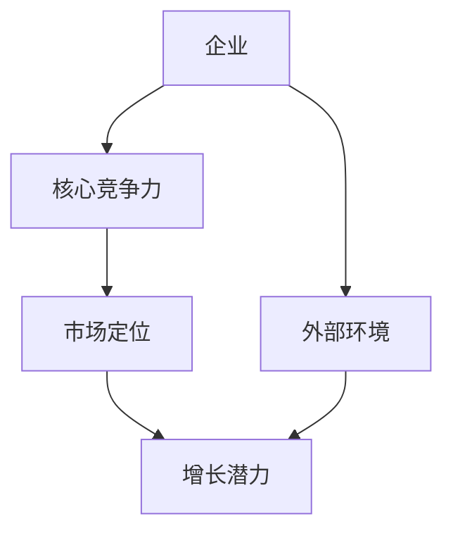
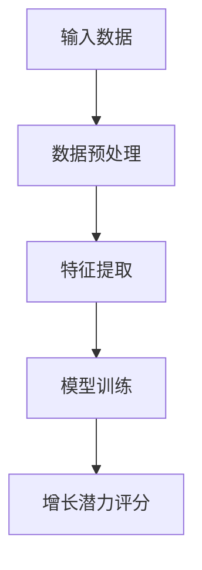

                 


# 如何评估企业的长期增长潜力

---

## 关键词：
企业增长潜力、长期增长、财务指标、市场分析、管理能力、技术驱动、模型设计

---

## 摘要：
企业长期增长潜力是企业在未来一段时间内持续发展和扩张的可能性。本文将从定义、核心概念、数学模型、系统分析与架构设计、项目实战等多方面详细阐述如何科学评估企业的长期增长潜力。通过财务指标分析、市场定位、核心竞争力评估等方法，结合数学模型和系统架构设计，为读者提供一套完整的企业增长潜力评估体系。

---

## 第一部分：企业长期增长潜力的背景与核心概念

### 第1章：企业长期增长潜力的定义与重要性

#### 1.1 企业长期增长潜力的定义
- **定义**：企业长期增长潜力是指企业在未来较长一段时间内，通过内部资源优化、技术创新、市场拓展等手段，实现收入、利润、市场份额等关键指标持续增长的可能性。
- **重要性**：在竞争激烈的市场环境中，评估企业的长期增长潜力是投资者、管理层和战略规划者的重要决策依据。
- **影响因素**：
  - **财务健康状况**：包括盈利能力、现金流、资产负债情况等。
  - **市场定位**：包括市场份额、品牌影响力、客户黏性等。
  - **管理能力**：包括领导力、组织架构、执行力等。
  - **创新能力**：包括产品开发、技术创新、商业模式创新等。
  - **外部环境**：包括宏观经济、政策法规、行业趋势等。

---

### 第2章：企业长期增长潜力的核心概念与联系

#### 2.1 核心概念原理
- **核心竞争力**：企业通过独特的资源、技术或能力，在市场竞争中获得优势。
- **市场定位**：企业在目标市场中的位置和战略选择，直接影响其增长潜力。
- **核心竞争力与市场定位的关系**：核心竞争力是实现市场定位的基础，而市场定位则决定了核心竞争力的变现能力。

#### 2.2 核心概念对比分析
| 对比维度 | 核心竞争力 | 市场定位 |
|----------|------------|----------|
| 定义     | 企业独特的竞争优势 | 企业在市场中的位置和战略 |
| 作用     | 支撑市场定位 | 决定企业增长方向 |
| 评估方法 | 技术分析、资源评估 | 市场份额分析、品牌价值分析 |

#### 2.3 实体关系图


---

## 第二部分：企业增长潜力评估的数学模型与公式

### 第3章：企业增长潜力评估的数学模型与公式

#### 3.1 增长潜力评估的数学模型
- **增长潜力指数模型**：
  $$
  GPI = \frac{1}{n} \sum_{i=1}^{n} w_i x_i
  $$
  - 其中，$GPI$ 是增长潜力指数，$w_i$ 是指标权重，$x_i$ 是指标评分。
- **增长潜力预测模型**：
  $$
  G(t) = a \cdot e^{bt}
  $$
  - 其中，$G(t)$ 是 t 时间点的增长潜力，$a$ 和 $b$ 是模型参数。

#### 3.2 算法原理


#### 3.3 举例说明
- **财务指标分析**：
  $$
  ROE = \frac{\text{净利润}}{\text{股东权益}}
  $$
  - ROE（净资产收益率）是衡量企业盈利能力的重要指标。
- **市场定位分析**：
  $$
  Market Share = \frac{\text{销售额}}{\text{行业销售额}}
  $$

---

## 第三部分：系统分析与架构设计方案

### 第4章：系统分析与架构设计方案

#### 4.1 问题场景介绍
- **企业增长潜力评估的复杂性**：涉及多维度数据，需要综合分析。
- **系统化评估的需求**：通过系统工具提高评估效率和准确性。

#### 4.2 项目介绍
- **项目目标**：开发一个企业增长潜力评估系统，提供自动化评估和预测功能。
- **项目范围**：包括数据采集、模型训练、结果输出等模块。
- **项目团队**：由数据科学家、软件开发人员和业务分析师组成。

#### 4.3 系统功能设计
- **领域模型**：
  ```mermaid
  classDiagram
      class 企业 {
          核心竞争力
          市场定位
          外部环境
      }
      class 增长潜力 {
          GPI
          G(t)
      }
  ```

- **系统架构设计**：
  ```mermaid
  graph TD
      A[企业数据] --> B[数据预处理]
      B --> C[特征提取]
      C --> D[模型训练]
      D --> E[结果输出]
  ```

---

## 第四部分：项目实战

### 第5章：项目实战

#### 5.1 环境安装
- **工具安装**：安装Python、Jupyter Notebook、Scikit-learn等工具。
- **数据获取**：收集企业的财务数据、市场数据等。

#### 5.2 核心代码实现
```python
import numpy as np
from sklearn.linear_model import LinearRegression

# 示例数据
X = np.array([[1, 2], [3, 4], [5, 6]]).T
y = np.array([2, 4, 6])

# 模型训练
model = LinearRegression()
model.fit(X, y)

# 预测
print(model.predict([[2, 3]]))
```

#### 5.3 案例分析
- **案例背景**：某科技公司希望评估其未来5年的增长潜力。
- **数据分析**：通过财务指标和市场定位分析，计算增长潜力指数。
- **结果解读**：根据模型预测，企业未来5年的增长潜力指数为0.85，属于较高潜力。

---

## 第五部分：总结与展望

### 6.1 最佳实践 Tips
- **数据质量**：确保数据的准确性和完整性。
- **模型优化**：根据实际效果不断调整模型参数和权重。
- **持续监测**：定期更新数据和模型，保持评估的准确性。

### 6.2 小结
本文从理论到实践，详细介绍了如何评估企业的长期增长潜力。通过数学模型和系统架构设计，为读者提供了一套完整的评估方法。

### 6.3 注意事项
- 评估企业增长潜力时，需结合实际情况，避免过于依赖单一指标。
- 数据分析结果仅供参考，需结合行业特点和企业实际情况进行调整。

### 6.4 拓展阅读
- 建议阅读《企业战略管理》和《数据分析实战》等相关书籍，进一步深入学习。

---

## 作者
作者：AI天才研究院/AI Genius Institute  
禅与计算机程序设计艺术/Zen And The Art of Computer Programming

