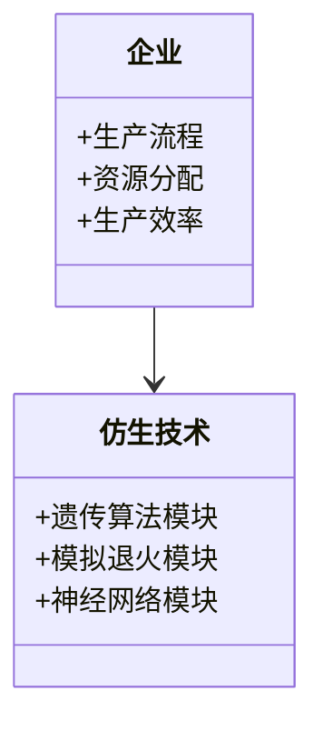
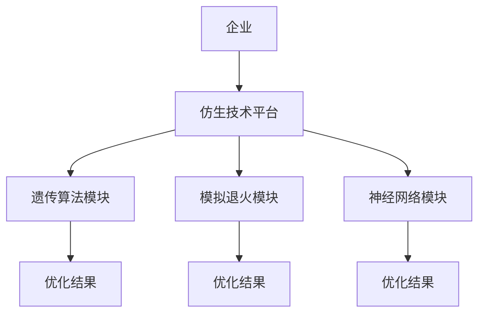
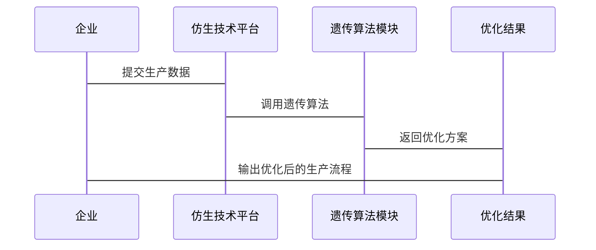

                 


# 如何识别企业的仿生技术优势

## 关键词：仿生技术、企业优势、算法原理、系统架构、项目实战

## 摘要：  
仿生技术是一种通过模拟生物特征和行为来优化企业技术和管理流程的创新方法。本文从仿生技术的核心概念出发，详细分析其在企业中的应用场景，结合具体算法和系统架构设计，为企业识别和应用仿生技术优势提供系统性指导。

---

# 第一部分：仿生技术与企业优势识别基础

## 第1章：仿生技术的基本概念与背景

### 1.1 仿生技术的定义与起源

仿生技术（Biomimetic Technology）是一种通过模拟生物的结构、功能和行为特征，将其转化为技术应用的科学方法。它起源于20世纪50年代的生物工程学研究，逐渐扩展到计算机科学、人工智能和企业管理等领域。

#### 1.1.1 仿生技术的核心特征
- **生物启发性**：仿生技术的核心是“向自然学习”，从生物系统中汲取灵感。
- **适应性**：仿生技术能够根据环境变化进行自我调整和优化。
- **高效性**：生物系统往往具有高效的资源利用能力，仿生技术通过模拟这一特性，提升企业的运营效率。

#### 1.1.2 仿生技术在企业中的应用背景
- **企业创新的挑战**：传统技术的边际效益递减，企业需要新的技术突破。
- **仿生技术的潜在价值**：通过模拟生物系统的优化能力，帮助企业解决复杂问题。
- **竞争优势的构建**：仿生技术能够为企业提供差异化的产品和服务，提升市场竞争力。

### 1.2 企业中的仿生技术应用背景

仿生技术在企业中的应用背景主要体现在以下几个方面：

#### 1.2.1 企业创新的挑战与需求
- **复杂问题的解决**：企业面临复杂的优化问题，如供应链优化、生产效率提升等。
- **技术瓶颈的突破**：传统技术难以解决的问题，可以通过仿生技术找到新的解决方案。
- **创新动力的驱动**：企业需要通过技术创新来保持竞争优势。

#### 1.2.2 仿生技术在企业中的潜在价值
- **提高效率**：通过模拟生物系统的高效性，优化企业的生产流程。
- **降低成本**：仿生技术能够通过优化资源配置，降低企业的运营成本。
- **提升创新能力**：仿生技术为企业提供了新的创新思路和方法。

#### 1.2.3 仿生技术与企业竞争优势的关系
- **竞争优势的核心**：仿生技术能够帮助企业实现差异化竞争。
- **技术创新的驱动力**：通过仿生技术的应用，企业可以开发出更具创新性的产品和服务。
- **长期竞争力的构建**：仿生技术的应用能够提升企业的长期竞争力。

## 第2章：仿生技术的核心概念与联系

### 2.1 仿生技术的核心原理

仿生技术的核心原理是通过模拟生物系统的特征和行为，将其转化为技术应用。具体包括以下几个方面：

#### 2.1.1 生物特征的提取与分析
- **生物特征的提取**：从生物系统中提取关键特征，如神经网络的结构、进化过程中的适应性等。
- **生物特征的分析**：对提取的生物特征进行深入分析，理解其背后的机制和原理。

#### 2.1.2 技术模拟与优化过程
- **技术模拟**：将生物特征转化为技术模型，模拟生物系统的运作方式。
- **优化过程**：通过技术模拟，优化企业中的具体问题，如生产流程优化、资源分配优化等。

#### 2.1.3 仿生技术的性能评估
- **性能评估指标**：包括效率提升、成本降低、资源利用率等。
- **评估方法**：通过实验和数据分析，评估仿生技术在企业中的实际效果。

### 2.2 仿生技术与其他技术的对比分析

#### 2.2.1 仿生技术与传统技术的对比
| 技术类型 | 传统技术 | 仿生技术 |
|----------|-----------|-----------|
| 基础 | 硬件和软件 | 生物系统特征 |
| 特点 | 稳定但缺乏灵活性 | 高效且适应性强 |
| 应用 | 简单重复性任务 | 复杂优化问题 |

#### 2.2.2 仿生技术与人工智能的联系
- **共同点**：两者都致力于通过技术手段解决复杂问题。
- **区别**：人工智能侧重于数据处理和模式识别，而仿生技术侧重于模拟生物系统的行为和特征。

#### 2.2.3 仿生技术与生物工程的区别
- **仿生技术**：侧重于技术应用，通过模拟生物系统优化企业问题。
- **生物工程**：侧重于生物本身的改造和应用，如基因工程、生物制药等。

### 2.3 仿生技术的ER实体关系图

```mermaid
er
actor: 企业
technique: 仿生技术
feature: 核心特征
application: 应用场景
```

---

## 第3章：仿生技术的算法原理

### 3.1 仿生技术的核心算法

仿生技术的核心算法主要包括遗传算法（GA）、模拟退火算法（SA）和神经网络模拟（NN）。

#### 3.1.1 遗传算法（GA）
- **定义**：模拟生物进化过程的优化算法，通过选择、交叉和变异操作生成新的个体。
- **流程图**：
  ```mermaid
  graph TD
  A[开始] --> B[初始化种群]
  B --> C[计算适应度]
  C --> D[选择]
  D --> E[交叉]
  E --> F[变异]
  F --> G[代数增加]
  G --> H[是否满足终止条件？]
  H -->|否|C
  H -->|是|结束
  ```

#### 3.1.2 模拟退火算法（SA）
- **定义**：模拟金属退火过程的全局优化算法，通过逐步降低“温度”来找到最优解。
- **流程图**：
  ```mermaid
  graph TD
  A[开始] --> B[初始化当前状态]
  B --> C[计算能量]
  C --> D[是否满足终止条件？]
  D -->|否|E[随机扰动]
  E --> F[计算新能量]
  F --> G[是否接受新状态？]
  G -->|否|B
  G -->|是|H[更新当前状态]
  H --> D
  ```

#### 3.1.3 神经网络模拟（NN）
- **定义**：通过模拟生物神经网络的结构和功能，构建人工神经网络进行学习和推理。
- **流程图**：
  ```mermaid
  graph TD
  A[输入] --> B[神经元激活]
  B --> C[权重调整]
  C --> D[输出]
  ```

### 3.2 遗传算法的Python实现

#### 3.2.1 适应度函数
```python
def fitness(individual):
    # 计算个体的适应度值
    return sum(individual)
```

#### 3.2.2 选择操作
```python
import random

def selection(population, fitness_func):
    # 计算适应度值
    fitness_scores = [fitness_func(individual) for individual in population]
    # 根据适应度值进行选择
    selected = []
    for _ in range(len(population)):
        # 轮盘赌选择
        min_score = min(fitness_scores)
        max_score = max(fitness_scores)
        # 随机选择一个个体
        selected_index = random.randint(0, len(population)-1)
        selected.append(population[selected_index])
    return selected
```

---

## 第4章：仿生技术的系统分析与架构设计

### 4.1 问题场景介绍

以企业的生产流程优化为例，假设某企业面临生产效率低下、资源浪费等问题，希望通过仿生技术优化生产流程。

### 4.2 系统功能设计

#### 4.2.1 领域模型设计


#### 4.2.2 系统架构设计


### 4.3 接口设计与交互流程

#### 4.3.1 系统接口设计
- **输入接口**：接收企业生产数据和目标函数。
- **输出接口**：输出优化后的生产流程和资源分配方案。

#### 4.3.2 交互流程


---

## 第5章：项目实战

### 5.1 项目背景与目标

假设某制造企业希望优化其生产流程，减少生产成本和提高效率。

### 5.2 核心代码实现

#### 5.2.1 环境安装
- **Python版本**：3.8及以上
- **依赖库**：`numpy`, `scipy`

#### 5.2.2 核心代码
```python
import numpy as np
from scipy.optimize import minimize

# 定义目标函数
def objective(x):
    return x[0]**2 + x[1]**2

# 定义约束条件
def constraint1(x):
    return x[0] + x[1] - 2

# 使用模拟退火算法求解
result = minimize(objective, [1, 1], method='SOLVOY', constraints=[{'type': 'eq', 'fun': constraint1}])

print(result)
```

### 5.3 代码解读与分析

#### 5.3.1 代码解读
- **目标函数**：定义了需要最小化的函数。
- **约束条件**：定义了优化问题的约束条件。
- **模拟退火算法**：通过`scipy.optimize.minimize`函数实现优化。

#### 5.3.2 案例分析
通过上述代码，企业可以优化生产流程中的变量，如生产时间、资源分配等，从而提高生产效率和降低成本。

### 5.4 项目小结

通过仿生技术的应用，企业可以有效优化生产流程，减少资源浪费，提高生产效率。

---

## 第6章：最佳实践与注意事项

### 6.1 最佳实践

- **明确目标**：在应用仿生技术之前，明确优化目标和问题。
- **数据准备**：确保数据的准确性和完整性。
- **算法选择**：根据具体问题选择合适的算法。
- **模型验证**：通过实验和数据分析验证模型的有效性。

### 6.2 小结

仿生技术的应用可以帮助企业解决复杂优化问题，提升竞争力。

### 6.3 注意事项

- **数据隐私**：注意保护企业的数据隐私和安全。
- **算法选择**：根据问题特点选择合适的算法，避免盲目应用。
- **实施风险**：在实施过程中注意风险控制，确保系统稳定性。

### 6.4 拓展阅读

- **书籍推荐**：《仿生计算与优化》、《生物启发式算法》
- **在线资源**：推荐访问相关技术博客和学术论文。

---

## 作者：AI天才研究院/AI Genius Institute & 禅与计算机程序设计艺术 /Zen And The Art of Computer Programming

