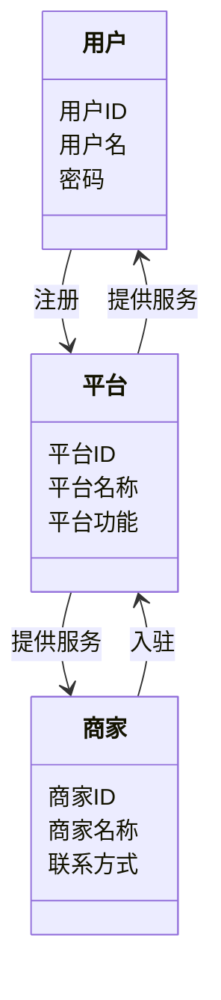

                 


# 如何识别企业的平台化转型优势

---

## 关键词：平台化转型、企业数字化、系统架构、平台优势、战略规划

---

## 摘要：  
在数字化转型的浪潮中，企业平台化转型成为推动业务创新和竞争力提升的重要策略。本文将从背景、核心概念、系统分析到项目实战，全面解读企业平台化转型的优势，并结合实际案例，为企业提供清晰的转型路径和实践指导。

---

## 第一部分: 平台化转型的背景与核心概念

### 第1章: 平台化转型的背景与问题背景

#### 1.1 企业平台化转型的背景  
随着数字化转型的深入推进，企业面临着前所未有的竞争压力。平台化转型不仅是企业适应市场变化的必然选择，更是提升企业核心竞争力的关键策略。通过平台化转型，企业可以实现资源的高效整合、业务的快速扩展和创新，从而在激烈的市场竞争中占据优势。

#### 1.2 平台化转型的核心问题与挑战  
在传统业务模式下，企业往往以产品或服务为核心，难以快速响应市场需求和技术创新。平台化转型需要企业在组织架构、技术架构、商业模式等多个方面进行调整，这过程中会面临诸多挑战，如技术选型、资源整合、用户隐私等问题。  
**关键点：**  
- 平台化转型不仅仅是技术问题，更是管理与文化的变革。  
- 平台化转型需要企业在战略规划、组织架构、技术架构等多个方面进行全面考量。

#### 1.3 本章小结  
平台化转型是企业应对数字化挑战的重要策略，通过整合资源、优化流程和创新模式，企业可以实现业务的高效扩展和持续创新。然而，转型过程中需要解决技术、管理和组织文化等多方面的挑战。

---

### 第2章: 平台化转型的核心概念  

#### 2.1 平台化转型的定义与特点  
平台化转型是指企业通过构建平台化的业务模式，将核心资源（如技术、数据、服务等）以平台形式对外提供，从而实现资源共享、服务复用和价值创造。  
**特点：**  
- **开放性：** 平台支持多角色用户（如供应商、客户、开发者）的接入与互动。  
- **灵活性：** 平台可以根据市场需求快速调整功能模块和业务流程。  
- **扩展性：** 平台可以支持多种业务模式和应用场景的扩展。  

#### 2.2 平台化转型的核心要素对比分析  

| **核心要素**       | **传统业务模式**             | **平台化转型模式**           |  
|----------------------|-------------------------------|-----------------------------|  
| 业务模式             | 以产品或服务为核心           | 以平台为核心，提供多维度服务 |  
| 资源配置             | 垂直化、部门化                | 平台化、资源共享              |  
| 创新速度             | 较慢，依赖内部研发            | 较快，通过平台快速迭代        |  

#### 2.3 平台化转型的ER实体关系图  

```mermaid
erDiagram
    actor 用户 {
        string 用户ID
        string 用户名
        string 密码
    }
    actor 供应商 {
        string 供应商ID
        string 供应商名称
        string 联系方式
    }
    actor 平台 {
        string 平台ID
        string 平台名称
        string 平台功能
    }
    用户 o-|{注册}| 平台
    供应商 o-|{入驻}| 平台
    平台 o-|{提供服务}| 用户
    平台 o-|{提供服务}| 供应商
```

---

## 第二部分: 平台化转型的系统分析与架构设计  

### 第3章: 平台化转型的系统分析  

#### 3.1 系统分析  
平台化转型的核心是构建一个高效的平台系统，该系统需要支持多种业务模式和用户角色的交互。系统分析阶段需要明确平台的功能需求、技术架构和实现方案。  

**3.1.1 问题场景介绍**  
以某电商平台为例，平台需要支持商家入驻、商品上架、订单管理、用户支付等核心功能。同时，平台还需要支持API接口，方便第三方开发者接入。  

**3.1.2 系统功能设计**  
- **用户模块：** 用户注册、登录、个人信息管理。  
- **商家模块：** 商家入驻、商品管理、订单管理。  
- **平台模块：** 平台功能配置、数据分析、安全监控。  

**3.1.3 领域模型设计**  



---

## 第三部分: 平台化转型的实施与案例分析  

### 第4章: 平台化转型的实施策略  

#### 4.1 平台化转型的实施步骤  
1. **战略规划：** 明确平台化转型的目标和路径。  
2. **技术选型：** 选择适合的平台技术架构和开发工具。  
3. **系统设计：** 根据需求设计系统的功能模块和交互流程。  
4. **开发实现：** 按照设计进行系统开发和测试。  
5. **上线运营：** 平台上线后进行监控和优化。  

#### 4.2 项目实战  
**环境安装：**  
- 操作系统：Linux  
- 开发工具：IntelliJ IDEA  
- 语言：Java  
- 框架：Spring Boot  

**核心实现代码示例：**  

```java
@SpringBootApplication
public class PlatformApplication {
    public static void main(String[] args) {
        SpringApplication.run(PlatformApplication.class, args);
    }
}
```

**代码解读：**  
- 该代码是一个Spring Boot应用，用于构建平台化的服务。  
- 通过@SpringBootApplication注解，程序被配置为一个Spring Boot应用。  

---

### 第5章: 最佳实践与未来展望  

#### 5.1 最佳实践  
- **模块化设计：** 系统功能模块化设计，便于后期扩展和维护。  
- **安全设计：** 强化平台的安全性，防止数据泄露和网络攻击。  
- **用户体验优化：** 注重用户交互设计，提升用户体验。  

#### 5.2 小结  
平台化转型是企业在数字化时代的核心竞争力之一。通过系统化的规划和实施，企业可以实现资源的高效利用和业务的快速扩展。  

#### 5.3 未来展望  
随着人工智能和大数据技术的进一步发展，平台化转型将更加智能化和个性化。企业需要持续关注技术趋势，优化平台功能，以应对未来的市场竞争。

---

## 附录  

### 附录A: 术语表  
- **平台化转型：** 通过构建平台化的业务模式，实现资源共享和价值创造。  
- **系统架构：** 平台系统的整体结构和功能模块的设计。  

### 附录B: 工具推荐  
- **开发工具：** IntelliJ IDEA、Eclipse  
- **版本控制：** Git  
- **部署工具：** Docker  

### 附录C: 参考文献  
1. 《企业架构与平台化转型》  
2. 《Spring Boot实战开发》  

### 附录D: 索引  
（根据文章内容生成）

---

## 作者：AI天才研究院 & 禅与计算机程序设计艺术

